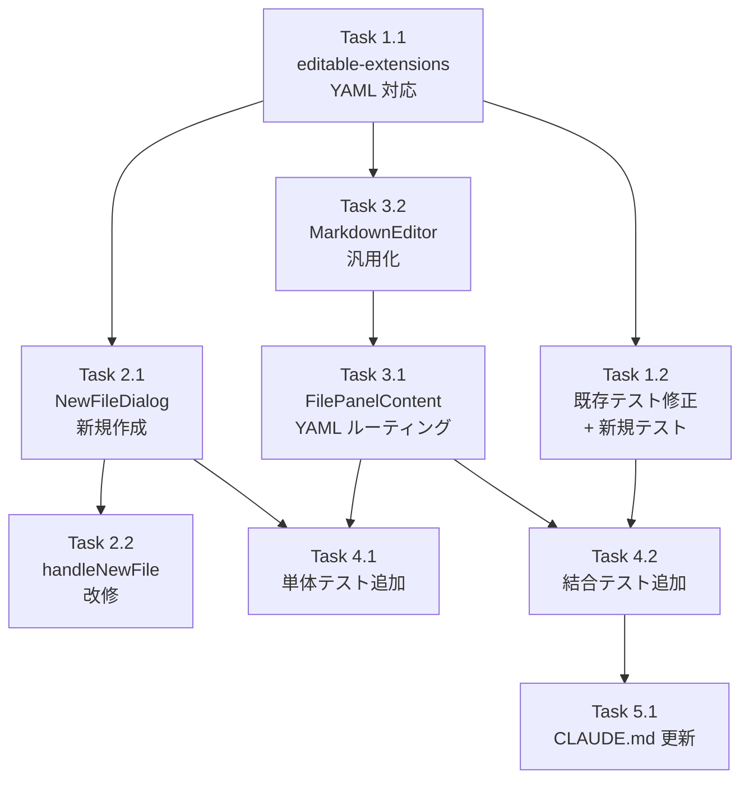

# Issue #646 作業計画書

## Issue: ファイル編集強化（YAML ファイル編集・拡張子選択対応）

**Issue 番号**: #646
**サイズ**: M
**優先度**: Medium
**依存 Issue**: なし

---

## 概要

CommandMate のファイルエディタで YAML ファイル（`.yaml` / `.yml`）の新規作成・編集を可能にし、新規ファイル作成時に拡張子を選択できる UI に変更する。

---

## 詳細タスク分解

### Phase 1: 設定・バリデーション層（基盤）

#### Task 1.1: editable-extensions.ts の YAML 対応
- **成果物**: `src/config/editable-extensions.ts`
- **依存**: なし
- **作業内容**:
  1. `EDITABLE_EXTENSIONS` に `.yaml` / `.yml` を追加（配列長: 3 → 5）
  2. `EXTENSION_VALIDATORS` に `.yaml` / `.yml` バリデータを追加
     - `maxFileSize: 1024 * 1024` (1MB)
     - `additionalValidation: isYamlSafe`（`uploadable-extensions.ts` からインポート）
  3. `ExtensionValidator.additionalValidation` の戻り値型を `boolean` から `string | boolean` に拡張
  4. `validateContent()` のロジックを 3 分岐対応に修正:
     - `result === true` → 通過
     - `result === false` → 汎用エラーメッセージ `'Content validation failed'`
     - `typeof result === 'string'` → その文字列をエラーメッセージとして使用

#### Task 1.2: 既存テスト修正 + 新規テスト追加
- **成果物**: `tests/unit/config/editable-extensions.test.ts`
- **依存**: Task 1.1
- **作業内容**:
  1. `toHaveLength(3)` → `toHaveLength(5)` に修正
  2. `.yaml` / `.yml` の `toContain` チェック追加
  3. YAML バリデータの正常系・異常系テスト追加
  4. `validateContent()` の `string | boolean` 3 分岐テスト追加
  5. `isYamlSafe()` 危険タグブロックのテスト追加

---

### Phase 2: NewFileDialog コンポーネント作成

#### Task 2.1: NewFileDialog.tsx の新規作成
- **成果物**: `src/components/worktree/NewFileDialog.tsx`
- **依存**: Task 1.1
- **作業内容**:
  1. ファイル名入力テキストフィールド
  2. 拡張子選択ドロップダウン（`.md` / `.yaml` / `.yml` / `.html` / `.htm`）
  3. 拡張子決定ロジック（3 パターン）:
     - (a) ファイル名に `EDITABLE_EXTENSIONS` の拡張子含む → そのまま使用（ドロップダウン無視）
     - (b) 拡張子なし → ドロップダウン選択値を付与（デフォルト: `.md`）
     - (c) ファイル名拡張子とドロップダウンが矛盾 → ファイル名の拡張子を優先
  4. `onConfirm(finalName: string)` / `onCancel()` コールバック
  5. 既存 Toast / モーダルパターンに準拠した UI

#### Task 2.2: WorktreeDetailRefactored.tsx の handleNewFile 改修
- **成果物**: `src/components/worktree/WorktreeDetailRefactored.tsx`
- **依存**: Task 2.1
- **作業内容**:
  1. ダイアログ状態管理の追加:
     ```ts
     const [showNewFileDialog, setShowNewFileDialog] = useState(false);
     const [newFileParentPath, setNewFileParentPath] = useState('');
     ```
  2. `handleNewFile` を `window.prompt()` から state トリガーに変更
  3. `handleNewFileConfirm` コールバックでファイル作成処理を実行
  4. `NewFileDialog` コンポーネントをレンダリングに追加
  5. `onNewFile` シグネチャ `(parentPath: string) => void` は変更不要

---

### Phase 3: FilePanelContent.tsx の YAML エディタ対応

#### Task 3.1: FilePanelContent.tsx に YAML ルーティング追加
- **成果物**: `src/components/worktree/FilePanelContent.tsx`
- **依存**: Task 3.2
- **作業内容**:
  1. `isEditableExtension` を `editable-extensions.ts` からインポート
  2. `extension === 'md'` 分岐の後に YAML / 汎用編集可能ファイル用分岐を追加:
     ```ts
     if (isEditableExtension('.' + content.extension)) {
       // MarkdownEditor（汎用化版）にルーティング
     }
     ```
  3. `.html` / `.htm` は先行する `isHtml` 分岐でハンドルされるため二重判定なし

#### Task 3.2: MarkdownEditor.tsx の汎用テキストエディタ化
- **成果物**: `src/components/worktree/MarkdownEditor.tsx`、`src/types/markdown-editor.ts`
- **依存**: Task 1.1
- **作業内容**:
  1. `EditorProps` に `fileType?: 'markdown' | 'text'` を追加（省略時は `filePath` の拡張子から自動判定）
  2. `fileType` が `'text'`（YAML 等）の場合はプレビュータブを非表示にする分岐を追加
  3. 編集ロジック（保存・isDirty 管理・ファイルサイズチェック）は共通のまま流用
  4. YAML ファイルでは `ViewMode` をデフォルト `'editor'` に固定

---

### Phase 4: テスト追加

#### Task 4.1: 単体テスト追加
- **成果物**:
  - `tests/unit/components/worktree/NewFileDialog.test.tsx`
  - `tests/unit/components/worktree/FilePanelContent-yaml.test.tsx`（または既存テストに追記）
- **依存**: Task 2.1, Task 3.1
- **作業内容**:
  1. `NewFileDialog` の拡張子決定ロジック 3 パターンテスト
  2. `FilePanelContent` の YAML ルーティングテスト
  3. `MarkdownEditor` の `fileType` 分岐テスト

#### Task 4.2: 結合テスト追加
- **成果物**: `tests/integration/yaml-file-operations.test.ts`
- **依存**: Task 1.1, Task 3.1
- **作業内容**:
  1. YAML ファイルの POST（新規作成）フロー
  2. YAML ファイルの PUT（編集・保存）フロー
  3. 危険タグ含む YAML の PUT 拒否テスト
  4. `.md` / `.html` 編集の回帰テスト

---

### Phase 5: ドキュメント更新

#### Task 5.1: CLAUDE.md 更新
- **成果物**: `CLAUDE.md`
- **依存**: 全実装タスク完了後
- **作業内容**:
  1. `editable-extensions.ts` のモジュール説明に `.yaml` / `.yml` 追加を反映
  2. `NewFileDialog.tsx` をコンポーネント一覧に追加

---

## タスク依存関係



---

## 実装順序（推奨）

1. **Task 1.1** → 設定・バリデーション基盤（全タスクの依存元）
2. **Task 1.2** → 既存テスト修正（赤→緑を最初に確認）
3. **Task 3.2** → MarkdownEditor 汎用化
4. **Task 3.1** → FilePanelContent ルーティング
5. **Task 2.1** → NewFileDialog 新規作成
6. **Task 2.2** → handleNewFile 改修
7. **Task 4.1** → 単体テスト追加
8. **Task 4.2** → 結合テスト追加
9. **Task 5.1** → CLAUDE.md 更新

---

## 品質チェック項目

| チェック項目 | コマンド | 基準 |
|-------------|----------|------|
| ESLint | `npm run lint` | エラー 0 件 |
| TypeScript | `npx tsc --noEmit` | 型エラー 0 件 |
| Unit Test | `npm run test:unit` | 全テストパス |
| Build | `npm run build` | 成功 |

---

## 受入条件（Definition of Done）

- [ ] 新規ファイル作成時に拡張子を選択できる（`.md` / `.yaml` / `.yml` / `.html` / `.htm`）
- [ ] 拡張子選択動作が 3 パターン仕様通り（ファイル名優先・ドロップダウン付与・矛盾時はファイル名優先）
- [ ] `.yaml` / `.yml` の新規作成・編集・保存が UI 上で可能
- [ ] 危険な YAML タグ保存がブロックされ、具体的エラーメッセージが表示される
- [ ] 既存の `.md` / `.html` / `.htm` 編集機能に回帰なし
- [ ] `npm run lint` / `npx tsc --noEmit` / `npm run test:unit` パス
- [ ] 新規単体テスト・結合テスト追加済み

---

## 成果物チェックリスト

### 変更ファイル
- [ ] `src/config/editable-extensions.ts`
- [ ] `src/types/markdown-editor.ts` (`EditorProps.fileType` 追加)
- [ ] `src/components/worktree/MarkdownEditor.tsx`
- [ ] `src/components/worktree/FilePanelContent.tsx`
- [ ] `src/components/worktree/WorktreeDetailRefactored.tsx`
- [ ] `CLAUDE.md`

### 新規ファイル
- [ ] `src/components/worktree/NewFileDialog.tsx`

### テスト
- [ ] `tests/unit/config/editable-extensions.test.ts` (修正)
- [ ] `tests/unit/components/worktree/NewFileDialog.test.tsx` (新規)
- [ ] `tests/integration/yaml-file-operations.test.ts` (新規)
