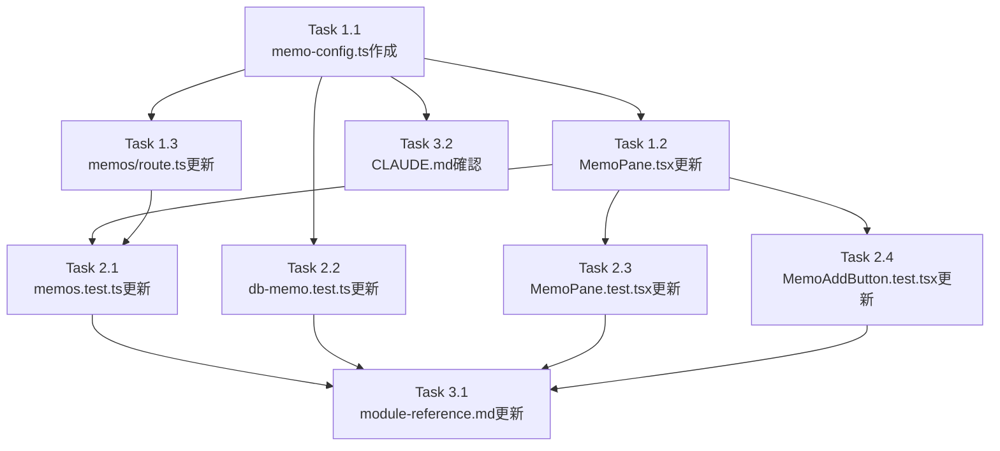

# 作業計画書 - Issue #652

## Issue: feat(memo): CMATE Notes の上限を 5 → 10 に引き上げ

**Issue番号**: #652
**サイズ**: S（小規模）
**優先度**: Medium
**依存Issue**: なし

---

## 1. 実装概要

CMATE タブの Notes（メモ）の最大件数を 5 件から 10 件に引き上げる。

### 設計方針
- 共有定数ファイル `src/config/memo-config.ts` を新規作成して `MAX_MEMOS` を一元管理（DRY原則）
- 既存の2箇所の定義（MemoPane.tsx, memos/route.ts）を共有定数のimportに置き換え
- DBスキーマ変更不要（上限制御はAPI/UIレイヤーで実施）

---

## 2. 詳細タスク分解

### Phase 1: 実装（優先度: 高）

#### Task 1.1: 共有定数ファイルの新規作成
- **成果物**: `src/config/memo-config.ts`
- **内容**: `export const MAX_MEMOS = 10;` を定義
- **参考パターン**: `src/config/repository-config.ts`, `src/config/timer-constants.ts`
- **依存**: なし

```typescript
// src/config/memo-config.ts
/**
 * Memo Configuration Constants
 *
 * Issue #652: Increase memo limit from 5 to 10.
 *
 * Shared constants used across:
 * - API route: src/app/api/worktrees/[id]/memos/route.ts (POST validation)
 * - Client component: src/components/worktree/MemoPane.tsx (UI display control)
 */

/** Maximum number of memos allowed per worktree */
export const MAX_MEMOS = 10;
```

#### Task 1.2: MemoPane.tsx の更新
- **成果物**: `src/components/worktree/MemoPane.tsx`
- **変更内容**: `const MAX_MEMOS = 5;` を削除し、`import { MAX_MEMOS } from '@/config/memo-config';` を追加
- **依存**: Task 1.1

#### Task 1.3: memos/route.ts の更新
- **成果物**: `src/app/api/worktrees/[id]/memos/route.ts`
- **変更内容**: `const MAX_MEMOS = 5;` を削除し、`import { MAX_MEMOS } from '@/config/memo-config';` を追加
- **依存**: Task 1.1

---

### Phase 2: テスト更新（優先度: 高）

#### Task 2.1: 統合テスト更新（memos.test.ts）
- **成果物**: `tests/integration/api/memos.test.ts`
- **変更箇所**:
  - 行234: テスト名 `should return 400 when memo limit (5) exceeded` → `should return 400 when memo limit (10) exceeded`
  - 行236: `for (let i = 0; i < 5; i++)` → `for (let i = 0; i < 10; i++)`
- **依存**: Task 1.2, 1.3

#### Task 2.2: db-memo.test.ts の更新
- **成果物**: `src/lib/__tests__/db-memo.test.ts`
- **変更箇所** (行402-423):
  - 行402: `describe('Max 5 memos constraint')` → `describe('Max 10 memos constraint')`
  - 行403: テスト名 `should allow creating up to 5 memos at positions 0-4` → `should allow creating up to 10 memos at positions 0-9`
  - 行404: ループ `for (let i = 0; i < 5; i++)` → `for (let i = 0; i < MAX_MEMOS; i++)`
  - 行413: `toHaveLength(5)` → `toHaveLength(MAX_MEMOS)`
  - 行416: テスト名 `should fail when trying to use position >= 5` → `should fail when trying to use position >= 10`
  - 行420: `position: 5` → `position: 10`
  - 行421: `toBe(5)` → `toBe(10)`
  - 先頭に `import { MAX_MEMOS } from '@/config/memo-config';` を追加
- **依存**: Task 1.1

#### Task 2.3: MemoPane.test.tsx の更新
- **成果物**: `tests/unit/components/worktree/MemoPane.test.tsx`
- **変更箇所**:
  - 行171: テスト名 `should disable add button when at memo limit (5)` → `should disable add button when at memo limit (10)`
  - 行172: `Array.from({ length: 5 }...)` → `Array.from({ length: 10 }...)`（テスト用モックデータを10件に）
- **依存**: Task 1.2

#### Task 2.4: MemoAddButton.test.tsx の更新
- **成果物**: `tests/unit/components/worktree/MemoAddButton.test.tsx`
- **変更箇所**:
  - 行15: `defaultProps: { maxCount: 5 }` → `maxCount: 10`
  - 全テストの `maxCount={5}` を `maxCount={10}` に統一（行35, 41, 67-68, 79, 86, 93, 131, 159, 164-165等）
  - 行159: `expect(screen.getByText(/5/))` → `/10/` に変更
- **依存**: Task 1.2（実動作への影響なし、テストの意図と実装の整合性のため更新）

---

### Phase 3: ドキュメント更新（優先度: 低）

#### Task 3.1: docs/module-reference.md の更新
- **成果物**: `docs/module-reference.md`
- **変更箇所**: MemoPane記述の「最大5件」→「最大10件」
- **依存**: Task 1.1, 1.2, 1.3

#### Task 3.2: CLAUDE.md の確認・更新
- **成果物**: `CLAUDE.md`
- **変更箇所**: `src/config/memo-config.ts` モジュール一覧に追加（必要に応じて）
- **依存**: Task 1.1

---

## 3. タスク依存関係



---

## 4. 品質チェック項目

| チェック項目 | コマンド | 基準 |
|-------------|----------|------|
| ESLint | `npm run lint` | エラー0件 |
| TypeScript | `npx tsc --noEmit` | 型エラー0件 |
| Unit Test | `npm run test:unit` | 全テストパス |
| Integration Test | `npm run test:integration` | 全テストパス（memos.test.ts含む） |
| Build | `npm run build` | 成功 |

---

## 5. 実装順序（推奨）

TDD方針に従い、以下の順序で実装する：

1. **Task 1.1**: `src/config/memo-config.ts` 作成（基盤となる共有定数）
2. **Task 2.2**: `src/lib/__tests__/db-memo.test.ts` 更新（テスト名・定数参照）
3. **Task 1.2**: `src/components/worktree/MemoPane.tsx` 更新
4. **Task 1.3**: `src/app/api/worktrees/[id]/memos/route.ts` 更新
5. **Task 2.1**: `tests/integration/api/memos.test.ts` 更新（10件制限テスト）
6. **Task 2.3**: `tests/unit/components/worktree/MemoPane.test.tsx` 更新
7. **Task 2.4**: `tests/unit/components/worktree/MemoAddButton.test.tsx` 更新
8. **Task 3.1**: `docs/module-reference.md` 更新
9. **Task 3.2**: `CLAUDE.md` 確認・更新

---

## 6. 成果物チェックリスト

### 新規作成ファイル
- [ ] `src/config/memo-config.ts`（`MAX_MEMOS = 10`）

### 修正ファイル
- [ ] `src/components/worktree/MemoPane.tsx`（importに変更）
- [ ] `src/app/api/worktrees/[id]/memos/route.ts`（importに変更）
- [ ] `tests/integration/api/memos.test.ts`（上限10に更新）
- [ ] `src/lib/__tests__/db-memo.test.ts`（テスト名・定数参照更新）
- [ ] `tests/unit/components/worktree/MemoPane.test.tsx`（上限10に更新）
- [ ] `tests/unit/components/worktree/MemoAddButton.test.tsx`（maxCount 10に更新）
- [ ] `docs/module-reference.md`（最大10件に更新）
- [ ] `CLAUDE.md`（memo-config.ts追加）

---

## 7. Definition of Done

Issue完了条件：
- [ ] `src/config/memo-config.ts` が作成され `MAX_MEMOS = 10` が定義されている
- [ ] MemoPane.tsx と memos/route.ts が共有定数をimportしている（ローカル定数なし）
- [ ] 全テストファイルの上限値が10に更新されている
- [ ] `npm run lint` パス（エラー0件）
- [ ] `npx tsc --noEmit` パス（型エラー0件）
- [ ] `npm run test:unit` パス
- [ ] `npm run test:integration` パス
- [ ] ドキュメント更新完了

---

## 8. 次のアクション

作業計画確定後：
1. **TDD実装開始**: `/pm-auto-dev 652` で自動開発フロー実行
2. **進捗報告**: `/progress-report` で定期報告
3. **PR作成**: `/create-pr` で自動作成
