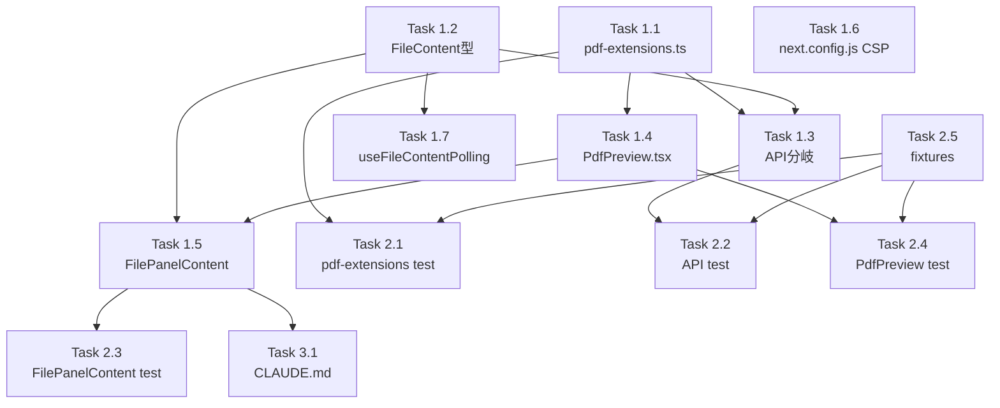

# Issue #673 作業計画書

## Issue概要

- **Issue番号**: #673
- **タイトル**: pdfビューワ
- **サイズ**: L（ラージ）
- **優先度**: Medium
- **依存Issue**: なし（参照: Issue #490 HtmlPreview, Issue #302 MP4プレビュー）
- **URL**: https://github.com/Kewton/CommandMate/issues/673

### 技術方針（暫定採用）

Issue本文で方式A（Blob URL + iframe）と方式B（ストリーミングAPI）の2方式がPoC選定待ちとなっているが、TDD実装に進むため以下を暫定採用する（PoC結果次第で見直し）:

| 項目 | 採用値 | 根拠 |
|-----|-------|------|
| 実装方式 | **方式A: Blob URL + iframe** | 既存API基盤（Base64）との親和性高、最小変更、方式Bは別タスクで追加可 |
| サイズ上限 | **20MB (`PDF_MAX_SIZE_BYTES = 20 * 1024 * 1024`)** | 画像と同水準、Base64後27MB程度で Node/V8 メモリ実用的 |
| iframe sandbox値 | **`sandbox="allow-scripts"`** | Firefox pdf.js動作に最低限必要、same-origin なしで clickjacking 防御 |
| CSP更新 | `frame-src 'self' blob:` | Issue #490 DR4-007 の撤回コメント追加 |
| ポーリング | PDFタブは無効化（`!tab.content?.isPdf` 条件追加） | Must Fix S3-003 |

PoCはスコープ外とし、Chrome/Firefox デスクトップの最新版で動作することを受入基準とする。モバイル・Safari 対応およびストリーミング方式はフォローアップIssueで対応。

## Phase 1: 実装タスク

### Task 1.1: PDF拡張子・バリデーション定数モジュール

- **成果物**: `src/config/pdf-extensions.ts`
- **依存**: なし
- **実装内容**:
  - `PDF_EXTENSIONS: readonly string[] = ['.pdf'] as const`
  - `PDF_MAX_SIZE_BYTES = 20 * 1024 * 1024`
  - `PDF_MAGIC_BYTES: readonly number[] = [0x25, 0x50, 0x44, 0x46, 0x2D]` (`%PDF-`)
  - `PDF_IFRAME_SANDBOX = 'allow-scripts'`
  - `isPdfExtension(ext: string): boolean`
  - `validatePdfMagicBytes(buffer: Uint8Array): boolean` （先頭5バイト検証）
  - `validatePdfContent(buffer: Uint8Array): { valid: boolean; error?: string }`（サイズ + magic bytes）

### Task 1.2: FileContent型にisPdfフラグ追加

- **成果物**: `src/types/models.ts` 更新
- **依存**: なし（並列可）
- **実装内容**: `FileContent` 型に `isPdf?: boolean` オプショナルフィールド追加

### Task 1.3: ファイル取得APIのPDF分岐追加

- **成果物**: `src/app/api/worktrees/[id]/files/[...path]/route.ts` 更新
- **依存**: Task 1.1, Task 1.2
- **実装内容**:
  - 拡張子判定で `isPdfExtension(ext)` を優先分岐
  - `readFile(absolutePath)` でバイナリ読み込み
  - `validatePdfContent` でサイズ・magic bytes検証
  - 成功時: `{ content: dataUri, isPdf: true, mimeType: 'application/pdf', ... }` （画像/動画と同形式）
  - 失敗時: `PDF_SIZE_EXCEEDED` / `INVALID_MAGIC_BYTES` エラーレスポンス（400）
  - `Cache-Control: no-store` は既存グローバル設定のため追加変更なし

### Task 1.4: PdfPreviewコンポーネント新規作成

- **成果物**: `src/components/worktree/PdfPreview.tsx`
- **依存**: Task 1.1
- **実装内容**:
  - Props: `{ dataUri: string; filePath: string; sizeBytes?: number }`
  - `useEffect` 内で data URI → `fetch` → `blob()` → `URL.createObjectURL` でBlob URL生成
  - `cancelled` フラグによる非同期キャンセル対応（StrictMode二重マウント耐性）
  - cleanup で `URL.revokeObjectURL(blobUrl)` 実行
  - iframe: `src={blobUrl}` / `sandbox={PDF_IFRAME_SANDBOX}` / `title={\`PDF Preview: ${filePath}\`}`
  - blobUrl=null の間はローディング表示
  - エラー時（fetch失敗 / iframe onError）はダウンロードリンクフォールバック
  - `MaximizableWrapper` + `FileToolbar` でラップ（image/video と統一UI）

### Task 1.5: FilePanelContentのPDF分岐追加

- **成果物**: `src/components/worktree/FilePanelContent.tsx` 更新
- **依存**: Task 1.2, Task 1.4
- **実装内容**:
  - L705 (VideoViewer直後)・L707 (HtmlPreview直前) の位置にPDF分岐挿入
  - `content.isPdf` で `PdfPreview` コンポーネントをレンダリング
  - `dynamic(() => import('./PdfPreview'), { ssr: false })` で動的import

### Task 1.6: CSP設定更新

- **成果物**: `next.config.js` 更新
- **依存**: なし（並列可）
- **実装内容**:
  - `frame-src 'self'` → `frame-src 'self' blob:` に変更
  - コメント: `Issue #490: HTML/MARP srcdoc (DR4-007: blob: excluded) → Issue #673: blob: added for PDF preview (Blob URL + iframe)`

### Task 1.7: useFileContentPollingのPDF無効化

- **成果物**: `src/hooks/useFileContentPolling.ts` 更新
- **依存**: Task 1.2
- **実装内容**:
  - L50 の `enabled` 条件に `&& !tab.content?.isPdf` を追加
  - PDFタブではポーリング無効化

## Phase 2: テストタスク

### Task 2.1: pdf-extensions 単体テスト

- **成果物**: `tests/unit/config/pdf-extensions.test.ts`
- **依存**: Task 1.1
- **カバレッジ目標**: 100%
- **テストケース**:
  - `isPdfExtension('.pdf')` / `isPdfExtension('.PDF')` / `isPdfExtension('.txt')`
  - `validatePdfMagicBytes` 成功/失敗
  - `validatePdfContent` サイズ超過 / magic bytes失敗 / 成功

### Task 2.2: ファイル取得API PDF分岐テスト

- **成果物**: `tests/unit/api/files-pdf.test.ts` (既存 `tests/unit/api/files/` 配下があれば統合)
- **依存**: Task 1.3
- **テストケース**:
  - PDF成功応答（data URI形式・isPdf=true）
  - サイズ超過時 `PDF_SIZE_EXCEEDED`
  - magic bytes不一致時 `INVALID_MAGIC_BYTES`
  - ENOENT 404
  - 非PDF拡張子は既存分岐で処理（PDF分岐に入らない）

### Task 2.3: FilePanelContent PDF分岐テスト

- **成果物**: `tests/unit/components/FilePanelContent.test.tsx` に追記
- **依存**: Task 1.5
- **テストケース**:
  - `content.isPdf=true` で `PdfPreview` がレンダリングされる
  - 他のViewerと排他的（image/video/html と重複しない）

### Task 2.4: PdfPreview単体テスト

- **成果物**: `tests/unit/components/PdfPreview.test.tsx`
- **依存**: Task 1.4
- **テストケース**:
  - iframe描画・sandbox属性・title属性の確認
  - `URL.createObjectURL` / `revokeObjectURL` の呼び出し検証（`vi.stubGlobal`）
  - cleanup時にrevokeObjectURLが呼ばれる
  - filePath切替時に古いURLがrevokeされる
  - fetch失敗時にエラーUIへフォールバック
  - StrictMode 二重マウント時の挙動確認

### Task 2.5: テストフィクスチャヘルパー

- **成果物**: `tests/helpers/pdf-fixtures.ts`
- **依存**: なし（並列可）
- **実装内容**:
  - `createMinimalPdfBuffer()`: 最小限の有効PDF Buffer生成（`%PDF-1.4\n...` ヘッダ + 最小構造）
  - `createPdfBufferOfSize(bytes: number)`: サイズ指定Buffer生成（サイズ超過テスト用）
  - `createBrokenPdfBuffer()`: magic bytes欠落バッファ

## Phase 3: ドキュメント・補助タスク

### Task 3.1: CLAUDE.md 更新

- **成果物**: `CLAUDE.md` 更新
- **依存**: なし（実装後）
- **実装内容**: 主要モジュール一覧テーブルに `src/config/pdf-extensions.ts` / `src/components/worktree/PdfPreview.tsx` を Issue #673 として追加

### Task 3.2: module-reference.md 更新（オプション、時間許容時）

- **成果物**: `docs/module-reference.md` 更新
- **依存**: なし

### Task 3.3: implementation-history.md 更新（オプション、時間許容時）

- **成果物**: `docs/implementation-history.md` 更新
- **依存**: なし

## スコープ除外（別Issueで対応）

以下は本Issueの完了条件から除外し、フォローアップIssueで対応する:

- **PoC（6ブラウザ×3スキーム×3sandbox値）**: 実装後のUAT段階で Chrome/Firefox 最新版のデスクトップで動作確認までとする
- **方式B（ストリーミングAPI `/files-raw/...`）**: 方式A実装後、大容量対応が必要になった段階で追加
- **i18n（locales/{en,ja}/error.json, worktree.json 追記）**: 既存 image/video のエラーメッセージがハードコードのため、本Issueでもハードコード許容。i18n化は別Issueで統一対応
- **FileViewer.tsx（モバイル単体ビュー）追従**: 初版は FilePanelContent のみ対応
- **モバイル/iOS Safari 固有対応**: 内蔵ビューワ非対応時のダウンロードフォールバックは実装するが、iOS Safari の `navigator.pdfViewerEnabled` 検知ロジック等は PoC 結果を踏まえて別Issue
- **再ロードボタン**: `FileToolbar` 連携UIは別タスク。初版はポーリング無効化のみ

## タスク依存関係

## 推奨実装順序

1. **Task 2.5（fixtures）** → テスト基盤先行
2. **Task 1.1（pdf-extensions）** + Task 2.1（テスト先行＝TDD Red→Green）
3. **Task 1.2（型定義）**
4. **Task 1.3（API）** + Task 2.2（テスト先行）
5. **Task 1.4（PdfPreview）** + Task 2.4（テスト先行）
6. **Task 1.5（FilePanelContent）** + Task 2.3
7. **Task 1.6（CSP）** + Task 1.7（polling）
8. **Task 3.1（CLAUDE.md）**

## 品質チェック項目

| チェック項目 | コマンド | 基準 |
|-------------|----------|------|
| ESLint | `npm run lint` | エラー0件 |
| TypeScript | `npx tsc --noEmit` | 型エラー0件 |
| Unit Test | `npm run test:unit` | 全テストパス |
| Build | `npm run build` | 成功 |

## Definition of Done

- [ ] Task 1.1〜1.7（実装タスク）全て完了
- [ ] Task 2.1〜2.5（テストタスク）全て完了
- [ ] Task 3.1（CLAUDE.md更新）完了
- [ ] 新規テストカバレッジ80%以上
- [ ] CIチェック全パス（lint, type-check, test, build）
- [ ] Chrome最新版で `.pdf` ファイルのプレビュー動作確認
- [ ] JavaScript埋め込みPDFでスクリプト未実行を確認
- [ ] サイズ超過・非PDF拡張子偽装時のエラーメッセージ確認

## 次のアクション

- [ ] `/pm-auto-dev 673` でTDD実装開始

## 備考

- 既存 image/video 実装パターン（`src/app/api/worktrees/[id]/files/[...path]/route.ts` L188-249）を踏襲
- HtmlPreview（`src/components/worktree/HtmlPreview.tsx` L119-137）のsandbox属性パターンを参考
- path-validator による防御は既存の `resolveAndValidateRealPath` で継続適用（変更不要）
