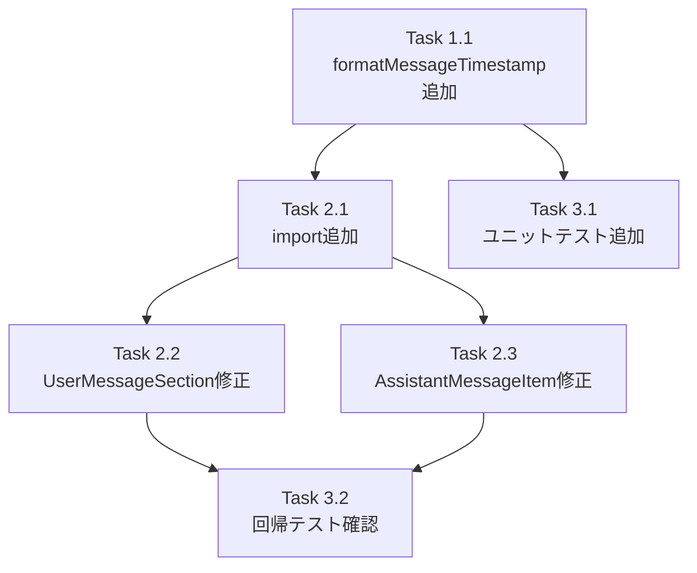

# 作業計画: Issue #687 MessageHistoryに日付も表示してほしい

## Issue概要

**Issue番号**: #687
**タイトル**: MessageHistoryに日付も表示してほしい
**サイズ**: S（変更ファイル3件、影響範囲限定的）
**優先度**: Medium
**依存Issue**: なし

### 問題
`ConversationPairCard.tsx` のタイムスタンプが `toLocaleTimeString()` で時刻のみ表示。日をまたぐと日付が不明になる。

### 解決策
`src/lib/date-utils.ts` に `formatMessageTimestamp(timestamp: Date, locale?: Locale): string` を追加し、`ConversationPairCard.tsx` の2箇所を置き換える。

---

## 詳細タスク分解

### Phase 1: ユーティリティ関数実装

- [ ] **Task 1.1**: `formatMessageTimestamp` 関数追加（date-utils.ts）
  - 成果物: `src/lib/date-utils.ts`（修正）
  - 変更内容:
    - `import { format } from 'date-fns'` を追加（`formatDistanceToNow` と併記）
    - `formatMessageTimestamp(timestamp: Date, locale?: Locale): string` を追加
    - 内部実装: `format(timestamp, 'PPp', locale ? { locale } : undefined)`
    - Invalid Date ガード: `!(timestamp instanceof Date) || isNaN(timestamp.getTime())` → 空文字フォールバック
  - 依存: なし

### Phase 2: コンポーネント修正

- [ ] **Task 2.1**: `ConversationPairCard.tsx` の import 追加
  - 成果物: `src/components/worktree/ConversationPairCard.tsx`（修正）
  - 変更内容:
    - `useLocale` (next-intl) の import 追加
    - `getDateFnsLocale` (`@/lib/date-locale`) の import 追加
    - `formatMessageTimestamp` (`@/lib/date-utils`) の import 追加
  - 依存: Task 1.1

- [ ] **Task 2.2**: `UserMessageSection` のタイムスタンプ修正（L210-213）
  - 成果物: `src/components/worktree/ConversationPairCard.tsx`（修正）
  - 変更内容:
    - `const locale = useLocale(); const dateFnsLocale = getDateFnsLocale(locale);` を追加
    - `useMemo(() => message.timestamp.toLocaleTimeString(), [message.timestamp])` を `formatMessageTimestamp(message.timestamp, dateFnsLocale)` に置換
    - useMemo を使うか直接呼び出すかは実装時にチームが決定（設計方針書 §3 参照）
  - 依存: Task 2.1

- [ ] **Task 2.3**: `AssistantMessageItem` のタイムスタンプ修正（L277-280）
  - 成果物: `src/components/worktree/ConversationPairCard.tsx`（修正）
  - 変更内容:
    - `const locale = useLocale(); const dateFnsLocale = getDateFnsLocale(locale);` を追加
    - `useMemo(() => message.timestamp.toLocaleTimeString(), [message.timestamp])` を同様に置換
  - 依存: Task 2.1

### Phase 3: テスト実装

- [ ] **Task 3.1**: `formatMessageTimestamp` ユニットテスト追加
  - 成果物: `tests/unit/lib/date-utils.test.ts`（既存ファイルへ describe ブロック追加）
  - テスト内容:
    - `describe('formatMessageTimestamp')` ブロックを新設
    - ja ロケールで PPp フォーマットの文字列が返る
    - enUS ロケールで PPp フォーマットの文字列が返る
    - locale 未指定でも文字列が返る
    - Invalid Date（`new Date('invalid')`）で空文字が返る
    - `instanceof` 非 Date 入力で空文字が返る
    - `format(date, 'PPp', { locale: ja })` と同一出力（整合性確認）
  - 依存: Task 1.1

- [ ] **Task 3.2**: 既存回帰テスト確認
  - 対象ファイル:
    - `tests/unit/components/worktree/ConversationPairCard.test.tsx`
    - `src/components/worktree/__tests__/ConversationPairCard.test.tsx`
    - `tests/integration/conversation-pair-card.test.tsx`
  - 確認内容: タイムスタンプ関連アサーション (`/12:34/` 等) が 'PPp' 出力にもマッチするか確認
  - 依存: Task 2.2, 2.3

---

## タスク依存関係

---

## 実装順序

1. **Task 1.1** → `date-utils.ts` に `formatMessageTimestamp` 追加（TDD: テストファースト）
2. **Task 3.1** → `formatMessageTimestamp` ユニットテストを先に書いてから実装（Red-Green-Refactor）
3. **Task 2.1** → `ConversationPairCard.tsx` に import 追加
4. **Task 2.2, 2.3** → UserMessageSection / AssistantMessageItem の修正
5. **Task 3.2** → 既存回帰テスト実行・確認

---

## 品質チェック項目

| チェック項目 | コマンド | 基準 |
|-------------|----------|------|
| ESLint | `npm run lint` | エラー0件 |
| TypeScript | `npx tsc --noEmit` | 型エラー0件 |
| Unit Test | `npm run test:unit` | 全テストパス |
| Build | `npm run build` | 成功 |

---

## 成果物チェックリスト

### コード
- [ ] `src/lib/date-utils.ts` に `formatMessageTimestamp` 追加
- [ ] `src/components/worktree/ConversationPairCard.tsx` の import 更新
- [ ] `ConversationPairCard.tsx` の `UserMessageSection` タイムスタンプ修正
- [ ] `ConversationPairCard.tsx` の `AssistantMessageItem` タイムスタンプ修正

### テスト
- [ ] `tests/unit/lib/date-utils.test.ts` に `formatMessageTimestamp` テスト追加
- [ ] 既存回帰テスト3ファイルが全パス

### ドキュメント
- [ ] `CLAUDE.md` の `src/lib/date-utils.ts` 説明に `formatMessageTimestamp` を追記（必要に応じて）

---

## Definition of Done

- [ ] すべての実装タスク完了
- [ ] `formatMessageTimestamp` のユニットテスト全パス（6ケース以上）
- [ ] 既存 ConversationPairCard テスト3ファイルが全パス
- [ ] ESLint エラー 0件
- [ ] TypeScript 型エラー 0件
- [ ] `npm run build` 成功
- [ ] MessageHistory に日付+時刻（PPp フォーマット）が表示される

---

## 設計方針書参照

`dev-reports/design/issue-687-message-timestamp-design-policy.md`

## 次のアクション

1. **TDD 実装**: `/pm-auto-dev 687` で実装開始
2. **PR作成**: `/create-pr` で PR 作成
