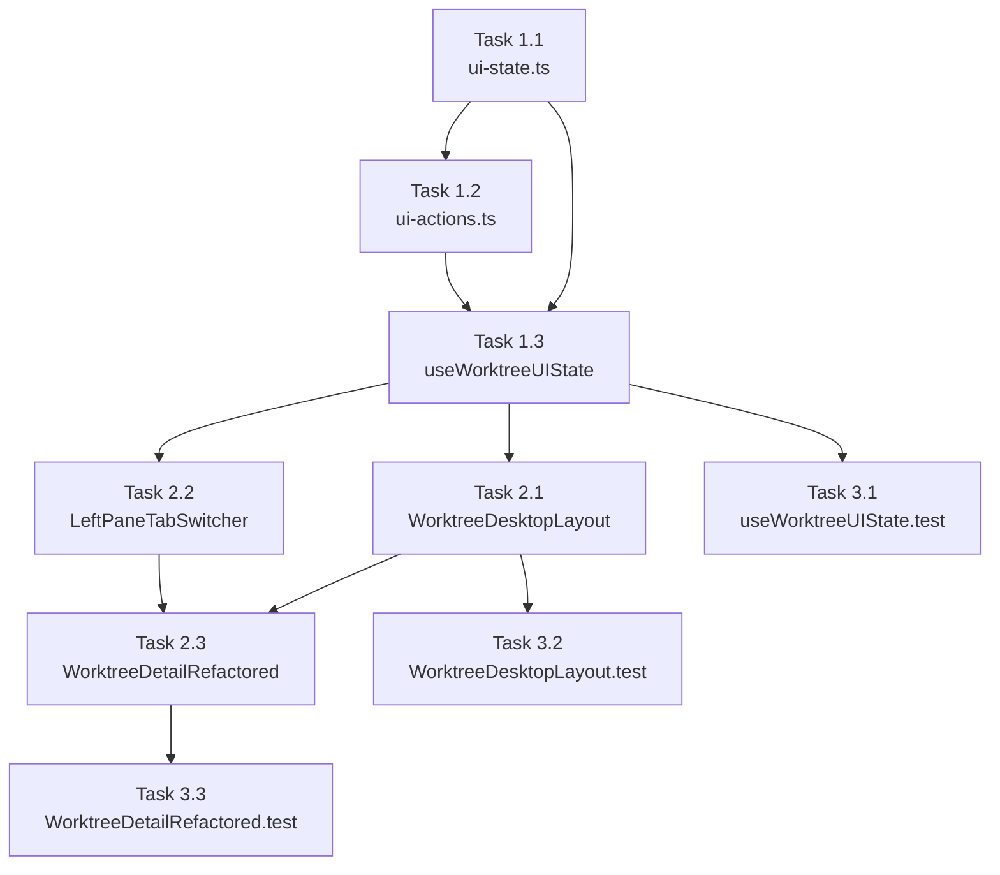

# 作業計画: Issue #688 左パネル折りたたみ機能

## Issue: PC版にて、「History/Files/CMATE」タブの表示領域の表示/非表示を切り替え可能にしてほしい

**Issue番号**: #688  
**サイズ**: M  
**優先度**: Medium  
**依存Issue**: なし

---

## 詳細タスク分解

### Phase 1: 型定義・状態管理

#### Task 1.1: LayoutState に leftPaneCollapsed を追加
- **成果物**: `src/types/ui-state.ts`
- **依存**: なし
- **変更内容**:
  - `LayoutState` に `leftPaneCollapsed: boolean` を追加
  - `initialLayoutState` に `leftPaneCollapsed: false` を追加

```typescript
// LayoutState に追加
export interface LayoutState {
  mode: 'split' | 'tabs';
  mobileActivePane: MobileActivePane;
  leftPaneTab: LeftPaneTab;
  splitRatio: number;
  leftPaneCollapsed: boolean;  // ← 追加
}

// initialLayoutState に追加
export const initialLayoutState: LayoutState = {
  mode: 'split',
  mobileActivePane: 'terminal',
  leftPaneTab: 'history',
  splitRatio: 0.5,
  leftPaneCollapsed: false,  // ← 追加
};
```

#### Task 1.2: WorktreeUIAction に折りたたみアクションを追加
- **成果物**: `src/types/ui-actions.ts`
- **依存**: Task 1.1
- **変更内容**:
  - `TOGGLE_LEFT_PANE` アクションを追加（トグル）
  - `SET_LEFT_PANE_COLLAPSED` アクションを追加（初期化用）

```typescript
// Layout actions に追加
| { type: 'TOGGLE_LEFT_PANE' }
| { type: 'SET_LEFT_PANE_COLLAPSED'; collapsed: boolean }
```

#### Task 1.3: useWorktreeUIState を拡張
- **成果物**: `src/hooks/useWorktreeUIState.ts`
- **依存**: Task 1.1, Task 1.2
- **変更内容**:
  1. `import` に `useEffect` を追加
  2. `import` に `useLocalStorageState` を追加
  3. reducer に `TOGGLE_LEFT_PANE` / `SET_LEFT_PANE_COLLAPSED` ケースを追加
  4. `WorktreeUIActions` interface に `toggleLeftPane: () => void` を追加
  5. `actions` オブジェクトに `toggleLeftPane` エントリを追加
  6. `useLocalStorageState` フックで `commandmate.worktree.leftPaneCollapsed` を管理
  7. `useEffect` で localStorage 値を `dispatch({ type: 'SET_LEFT_PANE_COLLAPSED' })` で反映

```typescript
// reducer に追加
case 'TOGGLE_LEFT_PANE':
  return {
    ...state,
    layout: { ...state.layout, leftPaneCollapsed: !state.layout.leftPaneCollapsed },
  };

case 'SET_LEFT_PANE_COLLAPSED':
  return {
    ...state,
    layout: { ...state.layout, leftPaneCollapsed: action.collapsed },
  };

// WorktreeUIActions に追加
toggleLeftPane: () => void;

// useWorktreeUIState 内で localStorage 連携
const { value: storedCollapsed, setValue: setStoredCollapsed } = useLocalStorageState({
  key: 'commandmate.worktree.leftPaneCollapsed',
  defaultValue: false,
  validate: (v): v is boolean => typeof v === 'boolean',
});

useEffect(() => {
  dispatch({ type: 'SET_LEFT_PANE_COLLAPSED', collapsed: storedCollapsed });
}, [storedCollapsed]);

// actions に追加 (toggleLeftPane 時は localStorage も更新)
toggleLeftPane: () => {
  const newValue = !state.layout.leftPaneCollapsed;
  setStoredCollapsed(newValue);
  dispatch({ type: 'TOGGLE_LEFT_PANE' });
},
```

---

### Phase 2: UIコンポーネント実装

#### Task 2.1: WorktreeDesktopLayout を controlled component 化
- **成果物**: `src/components/worktree/WorktreeDesktopLayout.tsx`
- **依存**: Task 1.1
- **変更内容**:
  1. `WorktreeDesktopLayoutProps` に `leftPaneCollapsed?: boolean` と `onToggleLeftPane?: () => void` をオプショナルで追加
  2. `DesktopLayout` の `leftPaneStyle` に折りたたみ時 `width: 0` ロジックを追加
  3. 折りたたみ中は `PaneResizer` を非表示にする
  4. 展開バー（▶ボタン、24px幅）を追加
  5. 折りたたみ前の `leftWidth` を `prevLeftWidth` として保持し、展開時に復元

```typescript
// Props に追加（後方互換: オプショナル）
interface WorktreeDesktopLayoutProps {
  leftPane: ReactNode;
  rightPane: ReactNode;
  initialLeftWidth?: number;
  minLeftWidth?: number;
  maxLeftWidth?: number;
  className?: string;
  leftPaneCollapsed?: boolean;      // ← 追加（オプショナル）
  onToggleLeftPane?: () => void;    // ← 追加（オプショナル）
}

// DesktopLayout 内の変更
// - 折りたたみ時: left pane width: 0, 展開バー表示, PaneResizer 非表示
// - CSS transition: width 200ms ease-in-out (折りたたみ/展開時のみ)
// - aria-label, aria-expanded, aria-controls を付与
```

#### Task 2.2: LeftPaneTabSwitcher に折りたたみボタンを追加
- **成果物**: `src/components/worktree/LeftPaneTabSwitcher.tsx`
- **依存**: Task 1.3
- **変更内容**:
  1. `LeftPaneTabSwitcherProps` に `onCollapse?: () => void` を追加
  2. タブバー右端に ◀ アイコンボタンを追加
  3. `aria-label="Collapse left panel"`, `aria-expanded="true"` を付与
  4. キーボード操作（Tab/Enter/Space）対応

```typescript
// Props に追加
export interface LeftPaneTabSwitcherProps {
  activeTab: LeftPaneTab;
  onTabChange: (tab: LeftPaneTab) => void;
  className?: string;
  onCollapse?: () => void;    // ← 追加（オプショナル）
}

// タブバー右端に追加
{onCollapse && (
  <button
    type="button"
    aria-label="Collapse left panel"
    aria-expanded="true"
    aria-controls="worktree-left-pane"
    onClick={onCollapse}
    className="ml-auto flex items-center px-2 py-2 text-gray-400 hover:text-gray-300"
  >
    <ChevronLeftIcon className="w-4 h-4" />
  </button>
)}
```

#### Task 2.3: WorktreeDetailRefactored に折りたたみ state を連携
- **成果物**: `src/components/worktree/WorktreeDetailRefactored.tsx`
- **依存**: Task 1.3, Task 2.1, Task 2.2
- **変更内容**:
  1. `leftPaneMemo` 内の `LeftPaneTabSwitcher` に `onCollapse={actions.toggleLeftPane}` を渡す
  2. `WorktreeDesktopLayout` に `leftPaneCollapsed={state.layout.leftPaneCollapsed}` と `onToggleLeftPane={actions.toggleLeftPane}` を渡す
  3. `leftPaneMemo` の依存配列に `actions.toggleLeftPane` を追加（参照する場合）

---

### Phase 3: テスト実装

#### Task 3.1: useWorktreeUIState のユニットテスト追加
- **成果物**: `tests/unit/hooks/useWorktreeUIState.test.ts`
- **依存**: Task 1.3
- **追加テストケース**:
  - `should handle TOGGLE_LEFT_PANE action` (false → true)
  - `should handle TOGGLE_LEFT_PANE action twice` (false → true → false)
  - `should handle SET_LEFT_PANE_COLLAPSED action`
  - `should provide action creators` に `toggleLeftPane` を追加（11 → 12チェック）
  - `describe('localStorage persistence')`: localStorage に true をセット → レンダリング → 折りたたみ状態確認

#### Task 3.2: WorktreeDesktopLayout のユニットテスト追加
- **成果物**: `tests/unit/components/WorktreeDesktopLayout.test.tsx`
- **依存**: Task 2.1
- **追加テストケース**:
  - `should hide left pane when leftPaneCollapsed=true`
  - `should show expand bar (▶ button) when collapsed`
  - `should hide PaneResizer when collapsed`
  - `should show left pane when leftPaneCollapsed=false (default)`
  - `should show MobileLayout regardless of leftPaneCollapsed when isMobile=true`

#### Task 3.3: WorktreeDetailRefactored の統合テスト追加
- **成果物**: `tests/unit/components/WorktreeDetailRefactored.test.tsx`
- **依存**: Task 2.1, Task 2.2, Task 2.3
- **追加テストケース**:
  - `should dispatch TOGGLE_LEFT_PANE when collapse button clicked`
  - `should read leftPaneCollapsed from localStorage on mount`
  - `should maintain collapsed state after isMobile toggle`

---

## タスク依存関係



---

## 品質チェック項目

| チェック項目 | コマンド | 基準 |
|-------------|----------|------|
| ESLint | `npm run lint` | エラー0件 |
| TypeScript | `npx tsc --noEmit` | 型エラー0件 |
| Unit Test | `npm run test:unit` | 全テストパス |
| Build | `npm run build` | 成功 |

---

## 成果物チェックリスト

### コード
- [ ] `src/types/ui-state.ts` — `leftPaneCollapsed` 追加
- [ ] `src/types/ui-actions.ts` — `TOGGLE_LEFT_PANE` / `SET_LEFT_PANE_COLLAPSED` 追加
- [ ] `src/hooks/useWorktreeUIState.ts` — reducer / actions / localStorage 連携
- [ ] `src/components/worktree/WorktreeDesktopLayout.tsx` — 折りたたみUI実装
- [ ] `src/components/worktree/LeftPaneTabSwitcher.tsx` — ◀ ボタン追加
- [ ] `src/components/worktree/WorktreeDetailRefactored.tsx` — props 連携

### テスト
- [ ] `tests/unit/hooks/useWorktreeUIState.test.ts` — reducer / localStorage テスト
- [ ] `tests/unit/components/WorktreeDesktopLayout.test.tsx` — レイアウトテスト
- [ ] `tests/unit/components/WorktreeDetailRefactored.test.tsx` — 統合テスト

---

## Definition of Done

- [ ] すべてのタスク（Task 1.1〜3.3）が完了
- [ ] 受入条件（Issue #688）を全て満たす
- [ ] CIチェック全パス（lint, type-check, test, build）
- [ ] 既存テストが無修正で通る（後方互換確認）
- [ ] PR作成完了

---

## 実装上の注意事項

1. **後方互換性**: `WorktreeDesktopLayoutProps` の新規 props は必ずオプショナル（`?`）にすること。必須化すると既存テスト24箇所が壊れる。

2. **localStorage 初期化**: 初期描画は `false`（展開状態）で表示し、`useEffect` 後に localStorage 値を反映すること。hydration warning を避けるため。

3. **transition 制御**: CSS transition は折りたたみ/展開時のみ適用。`PaneResizer` ドラッグ中は `transition: none` にすること（UX 劣化防止）。ただし、transition の on/off 制御が複雑になる場合は今回スコープでシンプルに常時 transition 適用でも可。

4. **モバイル版**: `useIsMobile()` が true の場合は折りたたみ UI を表示しないこと。`leftPaneCollapsed` の値は保持するが、モバイルレイアウト（`MobileLayout`）が優先される。

5. **leftPaneMemo の依存配列**: `actions` は `useMemo([])` で安定参照のため、`actions.toggleLeftPane` を依存配列に追加しても余計な再計算は発生しない。

---

## 次のアクション

1. **Task 1.1** から順に実装開始
2. 各タスク完了後に `npx tsc --noEmit` で型チェック
3. Phase 3 完了後に `npm run test:unit` で全テスト確認
4. `/create-pr` で PR 作成
