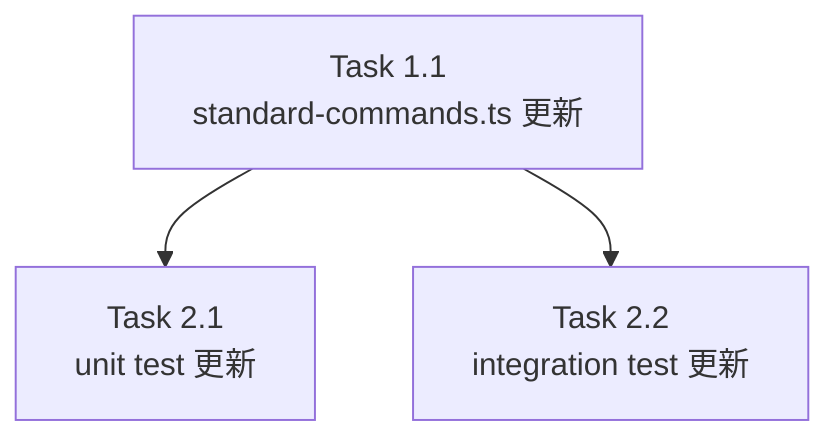

# Issue #689 作業計画書

## Issue: STANDARD_COMMANDS 最新化（Claude Code / Codex スラッシュコマンド）

**Issue番号**: #689  
**サイズ**: S  
**優先度**: Medium  
**依存Issue**: #594（shared コマンド opt-in 化）, #4（Codex cliTools 導入）

---

## 実装タスク

### Phase 1: 実装

#### Task 1.1: `src/lib/standard-commands.ts` 更新
- 成果物: `src/lib/standard-commands.ts`
- 依存: なし
- 変更内容:
  - Claude 4件追加（effort/fast/focus/lazy）— `cliTools: ['claude']` 明示
  - Codex 8件追加（plan/goal/agent/subagents/fork/memories/skills/hooks）— `cliTools: ['codex']`
  - `agent` の description は `'Switch active agent (Codex)'`（OpenCode `agents` と差別化）
  - `FREQUENTLY_USED.codex` を `['new', 'undo', 'diff', 'approvals', 'mcp']` → `['new', 'undo', 'diff', 'approvals', 'plan']` に更新

**追加コマンド一覧（Claude）**:

| name | category | cliTools |
|------|---------|---------|
| effort | standard-config | ['claude'] |
| fast | standard-config | ['claude'] |
| focus | standard-session | ['claude'] |
| lazy | standard-config | ['claude'] |

**追加コマンド一覧（Codex）**:

| name | category | cliTools |
|------|---------|---------|
| plan | standard-session | ['codex'] |
| goal | standard-session | ['codex'] |
| agent | standard-session | ['codex'] |
| subagents | standard-session | ['codex'] |
| fork | standard-session | ['codex'] |
| memories | standard-config | ['codex'] |
| skills | standard-config | ['codex'] |
| hooks | standard-config | ['codex'] |

---

### Phase 2: テスト更新

#### Task 2.1: `tests/unit/lib/standard-commands.test.ts` 更新
- 成果物: `tests/unit/lib/standard-commands.test.ts`
- 依存: Task 1.1
- 変更内容:
  - L20 `it()` 第1引数: `'should have 33 standard commands (8 Claude-only + 9 shared + 9 Codex-only + 7 OpenCode-only)'` → `'should have 45 standard commands (12 Claude-only + 9 shared + 17 Codex-only + 7 OpenCode-only)'`
  - L21 総件数: `toBe(33)` → `toBe(45)`
  - L79-100 Codex-only コマンドリスト: 9件 → 17件（plan/goal/agent/subagents/fork/memories/skills/hooks を追加）
  - L126-131 Codex 件数: `toBe(17)` → `toBe(25)`
  - L213 `Codex frequently used should include new and undo` テスト: `mcp` → `plan` に変更
  - 新規 it ブロック追加:
    - `'should have new Claude-only commands (effort/fast/focus/lazy) with explicit cliTools: ["claude"]'`
    - `effort/fast/lazy` が `standard-config`、`focus` が `standard-session` であることの検証
    - `plan/goal/agent/subagents/fork/memories/skills/hooks` が `['codex']` で存在すること
    - `FREQUENTLY_USED.codex` に `plan` が含まれること、`mcp` が含まれないこと
    - Claude 表示総数が 20 件であること
    - `agent`（Codex）と `agents`（OpenCode）の description 差別化検証
    - CLI ツール隔離マトリクステスト（全 6 ツール対応）
    - `STANDARD_COMMANDS` 全件の `name` 許可 regex 検証（セキュリティ）
    - `description` が空でなく HTML タグ等を含まないこと（XSS 回帰テスト）
    - `source === 'standard'`, `filePath === ''` の全件検証

#### Task 2.2: `tests/integration/api-worktree-slash-commands.test.ts` 更新
- 成果物: `tests/integration/api-worktree-slash-commands.test.ts`
- 依存: Task 1.1
- 変更内容:
  - Codex テスト（L99-128 周辺）に plan/goal/agent/subagents/fork/memories/skills/hooks の 8件検証を追加
  - 各コマンドの `source === 'standard'` と `cliTools === ['codex']` を検証
  - `loadCodexSkills()` / `loadCodexPrompts()` を mock して global 定義の影響を排除
  - cliTool=copilot の API route integration test 追加

---

## タスク依存関係

---

## 品質チェック項目

| チェック項目 | コマンド | 基準 |
|-------------|----------|------|
| ESLint | `npm run lint` | エラー0件 |
| TypeScript | `npx tsc --noEmit` | 型エラー0件 |
| Unit Test | `npm run test:unit` | 全テストパス |
| Integration Test | `npm run test:integration` | 全テストパス |

---

## 成果物チェックリスト

### コード
- [ ] `src/lib/standard-commands.ts` — 12件追加 + FREQUENTLY_USED.codex 更新
- [ ] `tests/unit/lib/standard-commands.test.ts` — テスト更新・追加
- [ ] `tests/integration/api-worktree-slash-commands.test.ts` — 統合テスト追加

---

## Definition of Done

- [ ] `STANDARD_COMMANDS` が 45 件になっている（33 → 45）
- [ ] Claude 4件が `cliTools: ['claude']` 明示で追加済み
- [ ] Codex 8件が `cliTools: ['codex']` で追加済み
- [ ] `FREQUENTLY_USED.codex` が `mcp` → `plan` に更新済み
- [ ] ユニットテスト全パス
- [ ] 統合テスト全パス
- [ ] lint / tsc エラー 0件

---

## 実装方針（設計方針書 §9 抜粋）

1. `src/lib/standard-commands.ts` の `STANDARD_COMMANDS` 配列に 4+8=12 件を追加
2. `FREQUENTLY_USED.codex` を更新（`mcp` → `plan`）
3. `tests/unit/lib/standard-commands.test.ts` のアサート値とテスト名を更新
4. 新規追加コマンドのテストを追加（agent/agents 命名差別化含む）
5. CLI ツール隔離マトリクステストを追加（全 6 ツール）
6. `tests/integration/api-worktree-slash-commands.test.ts` に統合テストを追加
7. `npm run lint && npx tsc --noEmit && npm run test:unit && npm run test:integration` で確認

**参照設計方針書**: `dev-reports/design/issue-689-standard-commands-update-design-policy.md`
