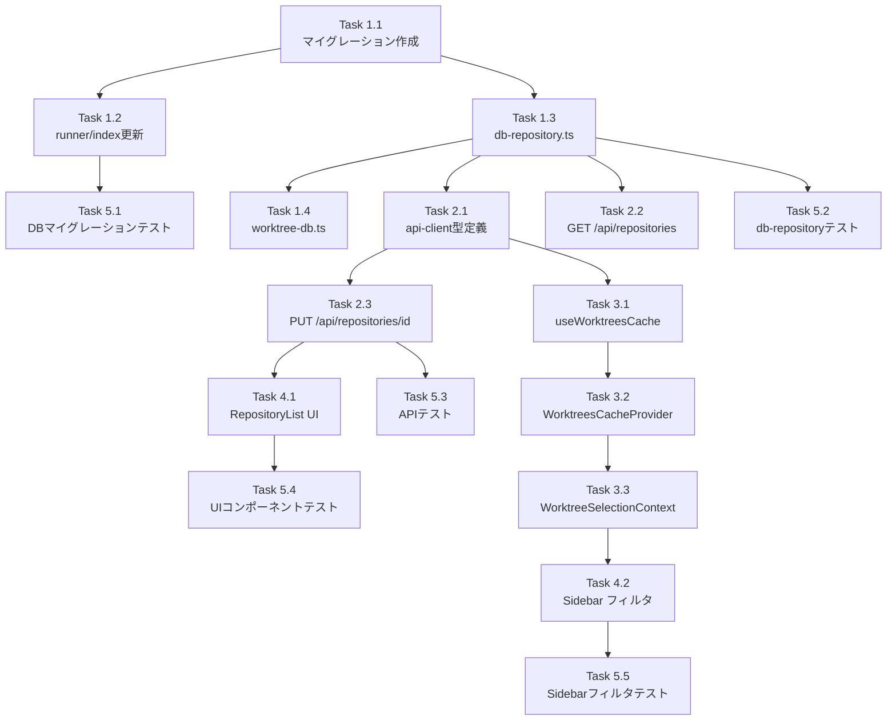

# Issue #690 作業計画書

## Issue: Repositoriesから表示/非表示を切り替えたい

**Issue番号**: #690
**サイズ**: M
**優先度**: Medium
**依存Issue**: #190（`enabled` フラグ、概念分離要）、#644（RepositoryList UIパターン）、#600（`useWorktreesCache` シングルソース）

---

## 概要

`repositories` テーブルに `visible` カラムを追加し、Repositories画面の各行にトグルボタンを追加する。`visible=false` のリポジトリのworktreeをSidebarから除外する。

**重要**: `enabled`（sync除外用）と `visible`（表示制御用）は独立した概念。混用禁止。

---

## 詳細タスク分解

### Phase 1: DBレイヤ

#### Task 1.1: マイグレーションファイル作成
- **成果物**: `src/lib/db/migrations/v31-repository-visible.ts`
- **内容**: `ALTER TABLE repositories ADD COLUMN visible INTEGER DEFAULT 1`
- **依存**: なし

#### Task 1.2: migration runner 更新
- **成果物**: `src/lib/db/migrations/runner.ts`（`CURRENT_SCHEMA_VERSION` 30→31 更新）
- **成果物**: `src/lib/db/migrations/index.ts`（export 追加）
- **依存**: Task 1.1

#### Task 1.3: db-repository.ts 更新
- **成果物**: `src/lib/db/db-repository.ts`
- **変更箇所**:
  - `Repository` インターフェース（16-28行）に `visible: boolean` 追加
  - `RepositoryRow` インターフェース（53-65行）に `visible: number` 追加
  - `mapRepositoryRow`（90-104行）で `visible: row.visible === 1` マッピング
  - `createRepository`（135行～）の INSERT と引数に `visible`（デフォルト `true`）
  - `updateRepository` の updates 型に `visible?: boolean` 追加
  - `getAllRepositoriesWithWorktreeCount` 戻り値に `visible` 反映
  - `disableRepository`（531-552行）は `visible` を変更しない（独立挙動）
  - `restoreRepository`（577-583行）は `visible` を変更しない（独立挙動）
- **依存**: Task 1.1

#### Task 1.4: worktree-db.ts の getRepositories 更新
- **成果物**: `src/lib/db/worktree-db.ts`（171行～）
- **変更内容**: SELECT 文に `r.visible as visible, r.enabled as enabled` 追加、戻り値型に `visible: boolean; enabled: boolean` 追加
- **依存**: Task 1.3

---

### Phase 2: APIレイヤ

#### Task 2.1: api-client.ts 型定義更新
- **成果物**: `src/lib/api-client.ts`
- **変更内容**:
  - `RepositoryListItem`（`/api/repositories` 用）に `visible: boolean` 追加
  - `RepositorySummary`（`/api/worktrees` 用、13-18行）に `visible: boolean`、`enabled: boolean` 追加
  - `UpdateRepositoryDisplayNameResponse` に `visible: boolean` 追加（または `UpdateRepositoryResponse` に改名）
- **依存**: Task 1.3

#### Task 2.2: GET /api/repositories 更新
- **成果物**: `src/app/api/repositories/route.ts`
- **変更内容**: GET レスポンスの repositories に `visible` を含める
- **依存**: Task 1.3

#### Task 2.3: PUT /api/repositories/[id] 更新
- **成果物**: `src/app/api/repositories/[id]/route.ts`
- **変更内容**:
  - リクエストボディに `visible?: boolean` を受け付ける（partial update）
  - `displayName` と `visible` の両方が undefined の場合は 400 を返す
  - boolean 型チェック（非 boolean は 400）
  - レスポンスの `repository` に `visible` を含める
- **依存**: Task 2.1

---

### Phase 3: Cache/Context 層

#### Task 3.1: useWorktreesCache.ts 更新
- **成果物**: `src/hooks/useWorktreesCache.ts`
- **変更内容**:
  - `repositories: RepositorySummary[]` を state に追加
  - `refresh()` で `data.repositories` を state に格納
  - `UseWorktreesCacheReturn` に `repositories` を追加
- **依存**: Task 2.1

#### Task 3.2: WorktreesCacheProvider.tsx 更新
- **成果物**: `src/components/providers/WorktreesCacheProvider.tsx`
- **変更内容**: `useWorktreesCache()` の `repositories` を `WorktreeSelectionProvider` に渡す
- **依存**: Task 3.1

#### Task 3.3: WorktreeSelectionContext.tsx 更新
- **成果物**: `src/contexts/WorktreeSelectionContext.tsx`
- **変更内容**:
  - `WorktreeSelectionState` に `repositories: RepositorySummary[]` 追加
  - `WorktreeSelectionContextValue` に `repositories: RepositorySummary[]` 追加
  - `WorktreeSelectionProvider` の `externalRepositories` prop を追加
  - reducer/`fetchWorktrees` で `repositories` を dispatch
- **依存**: Task 3.2

---

### Phase 4: UIレイヤ

#### Task 4.1: RepositoryList.tsx トグルUI追加
- **成果物**: `src/components/repository/RepositoryList.tsx`
- **変更内容**:
  - 「Visibility」列を新規追加（「Status」列から独立）
  - トグルボタン: クリック即時 PUT 送信（保存ボタンなし）
  - 楽観的更新: 失敗時ロールバック + feedback バナー
  - `role="switch"` / `aria-pressed={visible}` でアクセシビリティ対応
- **依存**: Task 2.3

#### Task 4.2: Sidebar.tsx フィルタリング追加
- **成果物**: `src/components/layout/Sidebar.tsx`（145-155行付近）
- **変更内容**:
  - `useWorktreeSelection()` Context から `repositories` を取得
  - `branchItems` 構築前に `visible=false` のリポジトリに紐づく worktree を除外
  - 実装例: `worktrees.filter(wt => repositories.find(r => r.id === wt.repositoryId)?.visible !== false)`
  - `useWorktreeList` フックには手を加えない（ローカルフィルタ）
- **依存**: Task 3.3

---

### Phase 5: テストレイヤ

#### Task 5.1: DBマイグレーションテスト
- **成果物**: `tests/unit/db-migrations.test.ts`（既存ファイルへの追記）
- **内容**: `CURRENT_SCHEMA_VERSION === 31`、`v31` 適用後の `visible` カラム存在確認
- **依存**: Task 1.2

#### Task 5.2: db-repository テスト更新・追加
- **成果物**: `tests/unit/lib/db-repository-exclusion.test.ts`（既存ファイルへの回帰対応）
- **内容**:
  - `disableRepository` 後も `visible=true` がデフォルト
  - `restoreRepository` 後も既存の `visible` 値が維持される
  - `enabled × visible` 4組合せマトリクス
- **依存**: Task 1.3

#### Task 5.3: API テスト追加
- **成果物**: `tests/unit/api/repository-visibility.test.ts`（新規）
- **内容**:
  - `PUT /api/repositories/[id]` の `visible` 更新（success, 400 非boolean, 404 未存在, 400 両undefined）
  - `GET /api/repositories` レスポンスに `visible` 含有
- **依存**: Task 2.3

#### Task 5.4: UIコンポーネントテスト追加
- **成果物**: `tests/unit/components/repository/RepositoryList.test.tsx`（既存ファイルへの追記）
- **内容**: トグル動作（楽観的更新、エラー時ロールバック、disabled 中の連続クリック防止）
- **依存**: Task 4.1

#### Task 5.5: Sidebar フィルタテスト追加
- **成果物**: `tests/unit/components/layout/Sidebar-visibility.test.ts`（新規）または既存 Sidebar テストへの追記
- **内容**:
  - `visible=false` リポジトリのworktreeが除外される
  - `enabled=false` + `visible=true` はサイドバーに表示され Disabled badge 付与
  - すべて非表示時の空状態挙動
- **依存**: Task 4.2

---

## タスク依存関係

---

## 品質チェック項目

| チェック項目 | コマンド | 基準 |
|-------------|----------|------|
| ESLint | `npm run lint` | エラー0件 |
| TypeScript | `npx tsc --noEmit` | 型エラー0件 |
| Unit Test | `npm run test:unit` | 全テストパス |
| Build | `npm run build` | 成功 |

---

## 成果物チェックリスト

### DBレイヤ
- [ ] `src/lib/db/migrations/v31-repository-visible.ts`（新規）
- [ ] `src/lib/db/migrations/runner.ts`（`CURRENT_SCHEMA_VERSION` 31に更新）
- [ ] `src/lib/db/migrations/index.ts`（export追加）
- [ ] `src/lib/db/db-repository.ts`（`visible` 対応）
- [ ] `src/lib/db/worktree-db.ts`（`getRepositories` 更新）

### APIレイヤ
- [ ] `src/lib/api-client.ts`（`RepositorySummary` / `RepositoryListItem` 更新）
- [ ] `src/app/api/repositories/route.ts`（GET `visible` 追加）
- [ ] `src/app/api/repositories/[id]/route.ts`（PUT `visible` partial update）

### Cache/Contextレイヤ
- [ ] `src/hooks/useWorktreesCache.ts`（`repositories` state 追加）
- [ ] `src/components/providers/WorktreesCacheProvider.tsx`（`repositories` 伝播）
- [ ] `src/contexts/WorktreeSelectionContext.tsx`（`repositories` 追加）

### UIレイヤ
- [ ] `src/components/repository/RepositoryList.tsx`（Visibility列 + トグルUI）
- [ ] `src/components/layout/Sidebar.tsx`（`visible=false` フィルタ）

### テスト
- [ ] `tests/unit/db-migrations.test.ts`（v31確認）
- [ ] `tests/unit/lib/db-repository-exclusion.test.ts`（`enabled × visible` 回帰）
- [ ] `tests/unit/api/repository-visibility.test.ts`（PUT APIテスト）
- [ ] `tests/unit/components/repository/RepositoryList.test.tsx`（トグル動作）
- [ ] Sidebar visibility テスト

---

## Definition of Done

- [ ] すべてのタスク（Phase 1〜5）が完了
- [ ] CIチェック全パス（`npm run lint` / `npx tsc --noEmit` / `npm run test:unit` / `npm run build`）
- [ ] `enabled × visible` の4組合せ全てが受入条件通りに動作
- [ ] 既存テスト（`db-repository-exclusion.test.ts` 等）が引き続きパス
- [ ] コードレビュー承認

---

## 次のアクション

1. **TDD実装**: `/pm-auto-dev 690` でTask 1.1から順次実装
2. **PR作成**: `/create-pr` で自動PR作成
