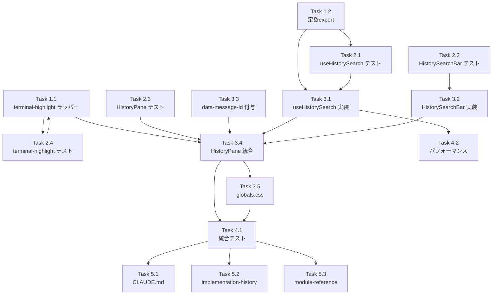

# Issue #716 作業計画書

## 1. Issue概要

| 項目 | 内容 |
|------|------|
| **Issue番号** | #716 |
| **タイトル** | feat: Worktree詳細 HistoryPaneにメッセージテキスト検索機能を追加 |
| **サイズ** | L（新規Hook + 新規UI + 既存5ファイル改修 + 新規/改修テスト） |
| **優先度** | Medium |
| **依存Issue** | #47（CSS Custom Highlight API 採用元）、#168（archived）、#485（onInsertToMessage）、#701（historyDisplayLimit） |
| **ブランチ** | feature/716-worktree（既存） |
| **設計方針書** | `dev-reports/design/issue-716-history-search-design-policy.md` (v1.2) |

## 2. 実装方針サマリー

設計方針書 v1.2 で確定した核心方針:

1. **OCP 完全準拠**: `terminal-highlight.ts` の既存 `applyTerminalHighlights` / `clearTerminalHighlights` のシグネチャ・関数名は変更しない。`applyHistoryHighlights` / `clearHistoryHighlights` を新規追加 export
2. **memo 維持**: `ConversationPairCard` への props 追加なし。ハイライト適用は `HistoryPane` の `useLayoutEffect` 副作用方式
3. **既存 hook 無改修**: `useConversationHistory` を改修せず、`HistoryPane` 内部 `autoExpandedIds: Set<string>` で対応
4. **truncate 対応**: 自動展開 → 全文レンダリング → ハイライト適用の effect 順序（`autoExpandedIds` を依存配列に含める）
5. **名前空間分離**: `HISTORY_SEARCH_NAMESPACE` で TerminalPane と同時起動可能
6. **テスト**: `globalThis.CSS` モック戦略を既存 `terminal-highlight.test.ts` パターンで統一

## 3. 詳細タスク分解

### Phase 1: 基盤実装

#### Task 1.1: terminal-highlight.ts のラッパー関数追加（OCP 準拠）

- **成果物**:
  - `src/lib/terminal-highlight.ts` - 内部実装の共通化、`applyHistoryHighlights` / `clearHistoryHighlights` / `HISTORY_SEARCH_NAMESPACE` を追加 export
- **依存**: なし
- **詳細**:
  - 既存 `applyTerminalHighlights` / `clearTerminalHighlights` のシグネチャ・関数名・I/Fを完全維持
  - 内部 private 関数 `applyHighlightsInternal(container, ranges, currentIndex, namespace)` / `clearHighlightsInternal(namespace)` を新設
  - 既存 export 関数は内部実装をラップ
  - `HighlightNamespace` 型を export
  - `TERMINAL_SEARCH_NAMESPACE` は private const、`HISTORY_SEARCH_NAMESPACE` は export
  - fallback overlay の背景色を namespace ごとに切替（terminal=オレンジ系維持、history=青系）
- **完了条件**:
  - 既存 `useTerminalSearch` の呼び出しが変更不要
  - 既存テスト `tests/unit/lib/terminal-highlight.test.ts` がそのままパス

#### Task 1.2: useTerminalSearch.ts の共通定数 export

- **成果物**:
  - `src/hooks/useTerminalSearch.ts` - `TERMINAL_SEARCH_MAX_MATCHES` は既に export 済み、`SEARCH_DEBOUNCE_MS` / `SEARCH_MIN_QUERY_LENGTH` を追加 export
- **依存**: なし
- **詳細**:
  - 現状 `DEBOUNCE_MS = 300` は private、これを `SEARCH_DEBOUNCE_MS = 300` として export
  - 検索最小文字数 `2` は SEC-TS-004 として inline 記述されているため、`SEARCH_MIN_QUERY_LENGTH = 2` を export
  - 既存 hook 内部から参照箇所を新定数に置換（後方互換）
- **完了条件**:
  - 既存テストパス
  - `useHistorySearch` から re-export または import 可能

### Phase 2: TDD Red - テスト先行作成

#### Task 2.1: useHistorySearch 単体テスト（RED）

- **成果物**: `tests/unit/hooks/useHistorySearch.test.ts`（新規）
- **依存**: Task 1.1, 1.2
- **テストケース**:
  - 部分一致・大文字小文字無視のマッチング
  - 最小2文字未満ではマッチを返さない
  - 最大件数（500件）到達時の `isAtMaxMatches=true` 挙動
  - debounce 300ms（fake timer で 300ms 未満は検索が走らない）
  - next/prev のラップアラウンド（matchCount=0 で no-op、末尾→先頭、先頭→末尾）
  - messages の入れ替わり時に `currentIndex` がクランプされる
  - IME composition 中は debounce タイマーがリセットされない
  - unmount / worktreeId 切替時に query / matchPositions が完全クリア
  - ポーリング更新時に messages 内容が同一なら matchPositions が再計算されない
  - `currentMatch: { messageId: string; localIndex: number } | null` の値が正しい
- **完了条件**: すべてのテストが「未実装」で fail すること

#### Task 2.2: HistorySearchBar 単体テスト（RED）

- **成果物**: `tests/unit/components/worktree/HistorySearchBar.test.tsx`（新規）
- **依存**: Task 1.2
- **テストケース**:
  - mount 時 input に自動フォーカス
  - Esc で `onClose` 呼出
  - 件数表示の `0/0` / `N/M` / `N/500以上` 切替
  - prev/next/close ボタンの aria-label
  - prev/next/close のクリック動作
  - role="search" / aria-live="polite" / aria-atomic="true" 属性
  - `onCompositionStart` / `onCompositionEnd` 呼出
- **完了条件**: すべてのテストが「未実装」で fail すること

#### Task 2.3: HistoryPane 検索機能テスト（RED）

- **成果物**: `tests/unit/components/HistoryPane.test.tsx`（既存改修）
- **依存**: Task 2.1, 2.2
- **テストケース追加**:
  - 初期状態で検索バーが閉じている（HistorySearchBar が DOM に存在しない）
  - 検索アイコンボタンクリックで検索バーがトグル表示
  - 検索アイコンボタンの aria-label が状態に応じて切替（Open/Close）
  - 検索クエリ入力時に `autoExpandedIds` にヒット pair が追加される
  - 検索終了時に `autoExpandedIds` がクリアされ元の展開状態に復元
  - `applyHistoryHighlights` が呼ばれる（vi.spyOn）
  - 検索アクティブ中の scrollPositionRef 復元スキップ
  - 検索 close 時に `searchStartScrollPositionRef` から scroll 復帰
  - 既存テスト（メッセージ表示、conversation pair grouping）が破壊されないこと
- **完了条件**: 新規テストが fail、既存テストは pass

#### Task 2.4: terminal-highlight ラッパー関数テスト（RED）

- **成果物**: `tests/unit/lib/terminal-highlight.test.ts`（既存改修）
- **依存**: Task 1.1
- **テストケース追加**:
  - `applyHistoryHighlights` が `HISTORY_SEARCH_NAMESPACE` の CSS Highlight を設定
  - `clearHistoryHighlights` が `HISTORY_SEARCH_NAMESPACE` の Highlight のみクリア（terminal-search は維持）
  - 両 namespace の同時起動でハイライトが共存
  - fallback overlay のスタイルが namespace ごとに異なる
- **完了条件**: 新規テストが fail、既存テストは pass

### Phase 3: TDD Green - 実装

#### Task 3.1: useHistorySearch Hook 実装

- **成果物**: `src/hooks/useHistorySearch.ts`（新規）
- **依存**: Task 2.1
- **詳細**:
  - I/F: 設計方針書 §6.1 に準拠
  - `useState`: `isOpen`, `query`, `matchPositions`, `currentIndex`, `isAtMaxMatches`
  - `useRef`: `debounceRef`, `debouncedQueryRef`, `composingRef`
  - `findMatches(messages, query)`: メッセージごとに `content.toLowerCase().indexOf(query.toLowerCase())` で全マッチ位置を計算
  - `resolveCurrentMatch(matchPositions, currentIndex)`: グローバル index → `{ messageId, localIndex }` 解決
  - debounce 300ms（`SEARCH_DEBOUNCE_MS` 参照）、最小2文字（`SEARCH_MIN_QUERY_LENGTH` 参照）、最大500件（`TERMINAL_SEARCH_MAX_MATCHES` 参照）
  - `onCompositionStart` / `onCompositionEnd` は内部で composingRef を制御
  - `messages` 依存配列の最適化: `messages.length` と `messages[N-1]?.id` / `.timestamp` でメモ化
  - cleanup: unmount 時に query / matchPositions / debounceRef を完全クリア
- **完了条件**: Task 2.1 のすべてのテストがパス

#### Task 3.2: HistorySearchBar UI 実装

- **成果物**: `src/components/worktree/HistorySearchBar.tsx`（新規）
- **依存**: Task 2.2
- **詳細**:
  - `TerminalSearchBar` のスタイル・操作系を踏襲
  - Props: `query`, `onQueryChange`, `matchCount`, `currentIndex`, `onNext`, `onPrev`, `onClose`, `isAtMaxMatches`, `onCompositionStart`, `onCompositionEnd`
  - mount 時 `input.focus()`
  - Esc キーで `onClose`
  - `role="search"`, `aria-live="polite"`, `aria-atomic="true"`, aria-label 設定
  - 件数表示: `0/0` / `N/M` / `N/500以上`
  - prev/next/close のクリックハンドラ
  - `onCompositionStart` / `onCompositionEnd` イベントハンドラを input に bind
- **完了条件**: Task 2.2 のすべてのテストがパス

#### Task 3.3: ConversationPairCard に data-message-id 付与

- **成果物**: `src/components/worktree/ConversationPairCard.tsx`（改修）
- **依存**: なし（他タスクとは独立）
- **詳細**:
  - `UserMessageSection` 内の MessageContent 親 `
`（class: `text-sm text-gray-200 whitespace-pre-wrap break-words`）に `data-message-id={message.id}` を付与
  - `AssistantMessageItem` 内の MessageContent 親 `
`（class: `text-sm text-gray-200 whitespace-pre-wrap break-words [word-break:break-word] max-w-full overflow-x-hidden`）に `data-message-id={message.id}` を付与
  - 付与のみで他は変更なし（破壊的変更なし、memo 維持）
- **完了条件**: 既存テストすべてパス

#### Task 3.4: HistoryPane に検索機能統合

- **成果物**: `src/components/worktree/HistoryPane.tsx`（改修）
- **依存**: Task 3.1, 3.2, 3.3, 1.1
- **詳細**:
  - `useHistorySearch({ messages: searchableMessages })` を組み込み
  - `searchableMessages` の事前フィルタ: `messages.filter(m => !m.archived && m.content?.length > 0)`
  - 検索アイコンボタン追加（ヘッダー末尾）、`aria-label` を状態切替（Open search / Close search）
  - `HistorySearchBar` を `isOpen=true` 時にトグル表示
  - `autoExpandedIds: Set<string>` の管理:
    - `useMemo` で `matchPositions` から hit pair の id を計算
    - `pair.id` ベースで Set 構築
  - `useLayoutEffect` 副作用順序（設計方針書 §4.2 末尾参照）:
    1. scroll 保存（既存）
    2. scroll 復元（既存、検索アクティブ時はスキップ）
    3. autoExpandedIds 計算 → state 更新
    4. ハイライト適用: `container.querySelectorAll('[data-message-id]')` を走査、`applyHistoryHighlights(el, match.ranges, localIdx)`
    5. `currentMatch` の messageId 要素へ `scrollIntoView({ block: 'center', behavior: 'smooth' })`
  - `searchStartScrollPositionRef` への退避・close 時の復帰
  - `ConversationPairCard` の `isExpanded` props を `isExpanded(pair.id) || autoExpandedIds.has(pair.id)` で OR 計算
  - worktreeId / activeCliTab / kill-session の変化で検索state リセット（HistoryPane 内部 `useEffect`）
- **完了条件**: Task 2.3 のすべてのテストがパス、既存 HistoryPane テストパス

#### Task 3.5: globals.css に history-search ハイライトスタイル追加

- **成果物**: `src/app/globals.css`（改修）
- **依存**: なし
- **詳細**:
  - `::highlight(history-search)`: 青系背景色（例: `rgba(59, 130, 246, 0.4)`）
  - `::highlight(history-search-current)`: より濃い青（例: `rgba(59, 130, 246, 0.8)`）
  - `#history-search-fallback-overlay`: background-color 青系（CSS Custom Highlight API 未対応ブラウザ向け）
  - WCAG AA レベルコントラスト確保
- **完了条件**: ビルドが通り、UI で視覚確認可能

### Phase 4: TDD Refactor / 統合テスト

#### Task 4.1: 統合テスト追加

- **成果物**: `tests/integration/history-search.test.tsx`（新規）
- **依存**: Task 3.1 ～ 3.5
- **テストケース**:
  - 検索バー入力 → ハイライト適用 → next/prev ジャンプ → scrollIntoView 呼出
  - 折りたたまれた会話ペアにヒットがある場合に自動展開、検索終了で元に戻る
  - worktreeId 切替で検索state クリア
  - CLIタブ切替（activeCliTab 変化）で検索state クリア
  - kill-session 相当で検索state クリア
  - ファイルパスを含むメッセージで検索後も `<button>` クリックハンドラ動作
  - 検索アクティブ中に scrollPositionRef 復元がスキップされる
  - 検索 close 時に検索開始前の scrollPosition に復帰
  - TerminalPane 検索とのハイライト独立性

#### Task 4.2: パフォーマンス検証

- **成果物**: `tests/unit/hooks/useHistorySearch.test.ts` 内の performance section
- **依存**: Task 3.1
- **詳細**:
  - `performance.now()` で `findMatches` 実行時間を計測
  - 250件 messages（平均 1KB content）+ クエリ 5文字で 50ms 以内
- **完了条件**: パフォーマンス基準達成

### Phase 5: ドキュメント更新

#### Task 5.1: CLAUDE.md 主要モジュール一覧追加

- **成果物**: `CLAUDE.md`（改修）
- **依存**: Phase 3 完了
- **詳細**:
  - `src/hooks/useHistorySearch.ts` 追加（Issue #716）
  - `src/components/worktree/HistorySearchBar.tsx` 追加（Issue #716）
  - `src/lib/terminal-highlight.ts` の説明に「namespace 引数化（Issue #716）」追記
  - `src/components/worktree/HistoryPane.tsx` の説明に「テキスト検索機能対応（Issue #716）」追記
  - `src/components/worktree/ConversationPairCard.tsx` の説明に「data-message-id 付与（Issue #716）」追記

#### Task 5.2: implementation-history.md 追加

- **成果物**:
  - `docs/implementation-history.md`（日本語版）
  - `docs/en/implementation-history.md`（英語版、存在する場合）
- **依存**: Phase 3 完了
- **詳細**:
  - Issue #716 のエントリ追加: 概要、主要変更ファイル、設計書リンク

#### Task 5.3: module-reference.md 更新（必要に応じて）

- **成果物**: `docs/module-reference.md`
- **依存**: Phase 3 完了
- **詳細**:
  - Issue #716 セクション追加（HistoryPane / ConversationPairCard / useHistorySearch / HistorySearchBar / terminal-highlight 改修）

## 4. タスク依存関係

## 5. 品質チェック項目

| チェック項目 | コマンド | 基準 |
|-------------|----------|------|
| ESLint | `npm run lint` | エラー0件 |
| TypeScript | `npx tsc --noEmit` | 型エラー0件 |
| Unit Test | `npm run test:unit` | 全テストパス、追加テスト含む |
| Integration Test | `npm run test:integration` | 全テストパス |
| Build | `npm run build` | 成功 |
| 単体テストカバレッジ | `npm run test:unit -- --coverage` | 新規/改修コード 85% 以上 |
| パフォーマンス | `findMatches` 実行時間 | 250件 × 5文字で 50ms 以内 |

## 6. 成果物チェックリスト

### コード（新規）
- [ ] `src/hooks/useHistorySearch.ts`
- [ ] `src/components/worktree/HistorySearchBar.tsx`

### コード（改修）
- [ ] `src/lib/terminal-highlight.ts`（ラッパー追加）
- [ ] `src/hooks/useTerminalSearch.ts`（定数 export）
- [ ] `src/components/worktree/HistoryPane.tsx`（検索機能統合）
- [ ] `src/components/worktree/ConversationPairCard.tsx`（data-message-id 付与）
- [ ] `src/app/globals.css`（ハイライトスタイル）

### テスト
- [ ] `tests/unit/hooks/useHistorySearch.test.ts`（新規）
- [ ] `tests/unit/components/worktree/HistorySearchBar.test.tsx`（新規）
- [ ] `tests/unit/components/HistoryPane.test.tsx`（改修）
- [ ] `tests/unit/lib/terminal-highlight.test.ts`（改修）
- [ ] `tests/integration/history-search.test.tsx`（新規）

### ドキュメント
- [ ] `CLAUDE.md` 主要モジュール一覧
- [ ] `docs/implementation-history.md`
- [ ] `docs/en/implementation-history.md`（存在時）
- [ ] `docs/module-reference.md`

## 7. Definition of Done

- [ ] すべての Task 1.x ～ 5.x が完了
- [ ] CIチェック全パス（lint, type-check, test, build）
- [ ] 単体テストカバレッジ 85% 以上（新規/改修コード）
- [ ] 統合テストパス
- [ ] パフォーマンス基準達成（50ms 以内）
- [ ] 既存テスト破壊なし
- [ ] TerminalPane 検索との同時起動で名前空間分離動作
- [ ] ドキュメント更新完了
- [ ] PR作成・コードレビュー承認

## 8. リスクと対策

| リスク | 対策 |
|-------|------|
| truncate 時の textContent オフセット不整合 | 自動展開→ハイライトの effect 順序を厳守（§4.2） |
| ConversationPairCard memo 破壊 | props 追加なし、副作用方式 |
| useConversationHistory 改修による破壊的変更 | 既存 hook 無改修、autoExpandedIds で完結 |
| TerminalPane との名前空間衝突 | HISTORY_SEARCH_NAMESPACE 分離、統合テスト |
| jsdom での CSS Custom Highlight API 非対応 | globalThis.CSS モック戦略（既存パターン踏襲） |
| パフォーマンス劣化 | messages 依存配列の length + last.id/timestamp で再計算抑制 |

## 9. 推定工数（参考）

| Phase | 想定時間 | 内容 |
|-------|---------|------|
| Phase 1: 基盤 | 1-2h | terminal-highlight ラッパー、定数 export |
| Phase 2: テスト RED | 3-4h | 4ファイル × 多数のテストケース |
| Phase 3: 実装 GREEN | 4-6h | Hook、UI、HistoryPane 統合 |
| Phase 4: 統合・パフォーマンス | 2-3h | 統合テスト、計測 |
| Phase 5: ドキュメント | 1h | CLAUDE.md / implementation-history |
| **合計** | **11-16h** | TDD でステップ実行 |

## 10. 次のアクション

1. ✅ Phase 1-3 完了（Issueレビュー、設計方針書、設計レビュー）
2. ✅ Phase 4 完了（作業計画）
3. ➡️ Phase 5: `/pm-auto-dev 716` で TDD 自動開発開始
4. ➡️ Phase 6: 最終検証 → PR 作成
