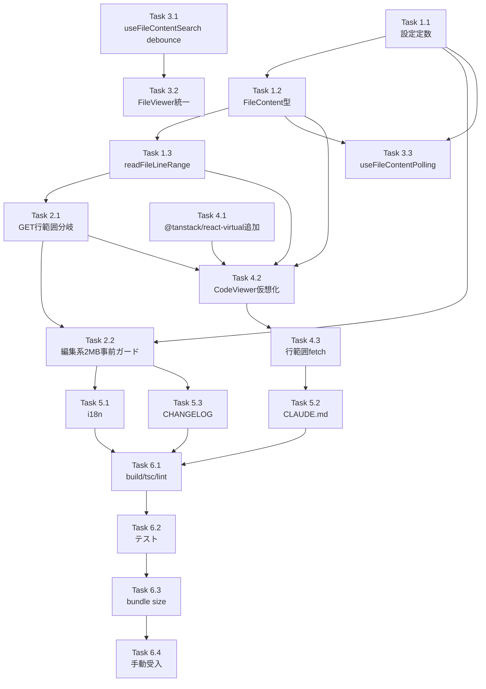

# Issue #723 作業計画

## Issue: perf(file-panel): 大規模ファイルでPC版がハングする問題への対応（行ベースAPI + 仮想化 + サイズ上限のハイブリッド）

- **Issue番号**: #723
- **ラベル**: bug, enhancement
- **サイズ**: **L**（複数ファイル横断、新規依存追加、破壊的変更、新規テスト多数）
- **優先度**: High（UIハングは致命的UX問題）
- **依存Issue**: なし（並列実装可。Issue #469 / #490 / #673 / #302 / #646 / #47 / #716 とは整合性のみ）
- **ブランチ**: `feature/723-worktree`（既存）

## 全体方針

1. **小さく独立にコミット可能なタスク粒度で進める**。サーバAPIから先に固め、クライアント側を後追いするボトムアップ構成。
2. **TDD（Red→Green→Refactor）を厳格適用**。新規ヘルパ・新規定数・新規分岐ロジックは先にテストを書く。
3. **破壊的変更を含むタスク（Task 1.1 / 1.2）は CHANGELOG への追記とセット**。
4. **新規依存追加（`@tanstack/react-virtual`）はバンドルサイズ実測を PR に記載**。

---

## Phase 1: 基盤整備（設定定数・型・ヘルパ）

### Task 1.1: 設定定数の追加・引き上げ
- **成果物**:
  - `src/config/editable-extensions.ts`: `TEXT_MAX_SIZE_BYTES` を 1MB → 2MB
  - `src/config/file-viewer-config.ts`（新規）: `VIEWER_CHUNK_LINE_SIZE = 500`, `VIEWER_OVERSCAN_LINES = 100`, `POLLING_DISABLED_THRESHOLD_BYTES = 1MB`
- **テスト先行**: `tests/unit/config/editable-extensions.test.ts` の既存アサーションを 2MB に更新（L46/64/71/158-167）
- **依存**: なし
- **チェック**: `npx vitest run tests/unit/config/`

### Task 1.2: `FileContent` 型拡張
- **成果物**: `src/types/models.ts` に optional フィールド追加
  - `totalLines?: number`
  - `totalBytes?: number`
  - `encoding?: string`
  - `range?: { start: number; end: number }`
- **追従**: `FileContentResponse` も同形拡張
- **コメント同期**: `src/types/markdown-editor.ts:227` のコメント値（1MB → 2MB）も同コミットで修正
- **テスト**: 型互換テストとして `tests/unit/types/file-content.test.ts`（新規・必要に応じて）または既存利用箇所のビルド通過
- **依存**: Task 1.1
- **チェック**: `npx tsc --noEmit`

### Task 1.3: `readFileLineRange` ヘルパ追加
- **成果物**: `src/lib/file-operations.ts` に `readFileLineRange(root, path, startLine, endLine)`
  - 実装: `createReadStream` + `readline` でストリーム読み
  - バリデーション: `startLine >= 1`, `endLine >= startLine`, `endLine - startLine <= VIEWER_CHUNK_LINE_SIZE * 4`
  - 違反時: 例外（呼び出し側で 400 に変換）
  - 行数超過時: ファイル末尾までクランプ（200 で返す既存挙動と互換）
  - 戻り値: `{ content, totalLines, totalBytes, encoding, range }`
- **テスト先行**: `tests/unit/lib/file-operations.test.ts`
  - 正常系: 1〜100行、100〜200行、全行範囲
  - バリデーション違反: startLine=0、endLine<startLine、上限超え
  - クランプ: ファイル末尾超え
  - 空ファイル / 最終行 EOF なし
  - 100MB ファイル読み取り時の RSS 増分 < 50MB（`process.memoryUsage()` ベース、`tmpdir` で動的生成）
- **依存**: Task 1.1, 1.2
- **チェック**: `npx vitest run tests/unit/lib/file-operations.test.ts`

---

## Phase 2: サーバAPI拡張

### Task 2.1: GET ハンドラの行範囲モード分岐
- **成果物**: `src/app/api/worktrees/[id]/files/[...path]/route.ts`
  - `startLine` / `endLine` クエリの解析
  - 行範囲モード時: `If-Modified-Since` 検証スキップ → 常に 200
  - 範囲指定なし: 従来挙動（304 機構維持）
  - バリデーション違反: `INVALID_REQUEST` (HTTP 400) を返却
- **テスト先行**: `tests/integration/api-file-operations.test.ts`
  - `GET /api/.../files/...path?startLine=1&endLine=100` → 200 + メタフィールド
  - `?startLine=0` → 400
  - `?startLine=10&endLine=5` → 400
  - 範囲指定なし → 従来挙動
  - 行範囲モードで `If-Modified-Since` を送信 → 304 ではなく 200 が返る
- **依存**: Task 1.3
- **チェック**: `npx vitest run tests/integration/api-file-operations.test.ts`

### Task 2.2: 編集系 GET 事前ガード（2MB）
- **成果物**: `src/app/api/worktrees/[id]/files/[...path]/route.ts`
  - 評価順: HTML 5MB 事前ガード → 編集系（HTML 除く）2MB 事前ガード → 通常テキスト（行範囲モード or 全文）
  - 超過時: `FILE_TOO_LARGE` (HTTP 413)
  - HTML は対象外（既存 5MB ガード維持）
- **テスト**:
  - `.md` / `.yaml` / `.yml` ＞ 2MB → 413
  - `.md` / `.yaml` / `.yml` ≤ 2MB → 200
  - `.html` / `.htm` 4MB → 200（既存 5MB 上限を維持）
  - `.html` / `.htm` 6MB → 413（既存 5MB 上限）
- **依存**: Task 1.1, 2.1
- **チェック**: `npx vitest run tests/integration/api-file-operations.test.ts`

---

## Phase 3: クライアント検索・ポーリング統一

### Task 3.1: `useFileContentSearch` の debounce 化
- **成果物**: `src/hooks/useFileContentSearch.ts`
  - `SEARCH_DEBOUNCE_MS = 300` / `SEARCH_MIN_QUERY_LENGTH = 2` を `useTerminalSearch` から流用
  - 最小2文字未満は検索しない
  - useEffect 内で debounce 実装
- **テスト**: `tests/unit/hooks/useFileContentSearch.test.ts`
  - 入力直後は実行されない（300ms 待機）
  - 1文字入力は検索されない（最小2文字）
  - 連続入力で前回がキャンセルされる
- **依存**: なし
- **チェック**: `npx vitest run tests/unit/hooks/useFileContentSearch.test.ts`

### Task 3.2: `FileViewer.tsx` の独立検索ロジックを `useFileContentSearch` に統一
- **成果物**: `src/components/worktree/FileViewer.tsx:302-318` の独立検索ロジックを撤去し、`useFileContentSearch` 呼び出しに置き換え
  - 大規模になる場合は同等の debounce 300ms + 最小2文字を入れる暫定対応も可（PR で記載）
- **テスト**: `tests/unit/components/FileViewer.test.tsx` の検索系テスト更新
- **依存**: Task 3.1
- **チェック**: `npx vitest run tests/unit/components/FileViewer.test.tsx`

### Task 3.3: `useFileContentPolling` の大ファイル時無効化
- **成果物**: `src/hooks/useFileContentPolling.ts:51`
  - `enabled` 条件に `!(tab.content?.totalBytes !== undefined && tab.content.totalBytes >= POLLING_DISABLED_THRESHOLD_BYTES)` 追加
  - `totalBytes` undefined は有効維持（既存挙動）
- **テスト**: `tests/unit/hooks/useFileContentPolling.test.ts`
  - `totalBytes` undefined → 有効
  - `totalBytes` < 1MB → 有効
  - `totalBytes` >= 1MB → 無効
  - 既存 `isDirty` / `isPdf` / `loading` 条件との AND 関係
- **依存**: Task 1.1, 1.2
- **チェック**: `npx vitest run tests/unit/hooks/useFileContentPolling.test.ts`

---

## Phase 4: クライアント仮想化

### Task 4.1: `@tanstack/react-virtual` 依存追加
- **成果物**:
  - `package.json` に `@tanstack/react-virtual` 追加
  - `package-lock.json` 更新
- **検証**:
  - `npm install` でロックファイル更新
  - `npm run build` でビルド通過
  - バンドルサイズ実測（増分 < 30KB gzipped を確認、PR コメントに記載）
- **依存**: なし
- **チェック**: `npm run build`

### Task 4.2: `CodeViewer` を仮想化対応に書き換え
- **成果物**: `src/components/worktree/FilePanelContent.tsx` の `CodeViewer` を仮想化対応
  - `'use client'` 維持
  - `useVirtualizer` で可視範囲 ± オーバースキャン分のみマウント
  - 行高さ固定 24px
  - ハイライトは可視チャンク単位で `hljs.highlight` を実行（Map キャッシュで再計算抑制）
  - スクロール位置に応じて未取得チャンクを遅延 fetch（範囲指定モード）
- **テスト先行**: `tests/unit/components/FilePanelContent.test.tsx`
  - 1万行ファイルで `<tr>` のマウント数が `(visible + overscan) * 2` 程度に limited
  - スクロール時に新規チャンク fetch が発行される
  - ハイライトキャッシュヒットで `hljs.highlight` 呼び出し回数が抑制される
- **依存**: Task 1.2, 1.3, 2.1, 4.1
- **チェック**: `npx vitest run tests/unit/components/FilePanelContent.test.tsx`

### Task 4.3: 行範囲モード fetch のクライアント実装
- **成果物**: `CodeViewer` 内で `?startLine=N&endLine=M` 形式の fetch を組み立てる
  - 仮想スクロールの可視範囲に追従してチャンク取得
  - `If-Modified-Since` ヘッダは送らない（サーバ側で常に200）
  - 取得済みチャンクは Map にキャッシュ
- **テスト**: Task 4.2 に統合
- **依存**: Task 4.2
- **チェック**: 同上

---

## Phase 5: i18n・ドキュメント

### Task 5.1: i18n キー追加
- **成果物**:
  - `locales/ja/error.json` に `fileTooLarge.editableLimit` / `fileTooLarge.viewerLimit`
  - `locales/en/error.json` に同等の英語訳
- **検証**: `src/i18n.ts` 経由で参照できること、UI で表示できること
- **依存**: なし
- **チェック**: 既存 i18n テストパス

### Task 5.2: `CLAUDE.md` モジュール一覧更新
- **成果物**:
  - `src/config/editable-extensions.ts` エントリに Issue #723 を追記
  - `src/config/file-viewer-config.ts`（新規）エントリ追加
  - `src/lib/file-operations.ts` エントリに `readFileLineRange` 追加
- **依存**: Phase 1〜4 完了
- **チェック**: 手動レビュー

### Task 5.3: CHANGELOG 追記
- **成果物**: `CHANGELOG.md` または `docs/release-notes/` に破壊的変更を明記
  - `.md` / `.yaml` / `.yml` の GET 上限が 2MB に変わる（破壊的変更）
  - 既存 1MB→2MB 引き上げ（改善側）
  - 既にタブで開いている 2MB 超ファイルの 413 切り替え挙動
- **依存**: Phase 1〜4 完了
- **チェック**: 手動レビュー

---

## Phase 6: 統合検証

### Task 6.1: 全体ビルド・型・lint
- **コマンド**: `npm run build`, `npx tsc --noEmit`, `npm run lint`
- **基準**: エラー 0 件

### Task 6.2: ユニット・結合テスト
- **コマンド**: `npm run test:unit`, `npm run test:integration`
- **基準**: 既存 + 新規テスト全パス

### Task 6.3: バンドルサイズ実測
- **コマンド**: `npm run build` 後の `.next/static/chunks/` サイズ比較
- **基準**: `@tanstack/react-virtual` による増分 < 30KB gzipped

### Task 6.4: 手動受入確認
- 100MB ログファイル: 1秒以内に最初の数百行表示、スクロールチャンク fetch、UI 操作可能
- 編集系 2.5MB ファイル: 413 + エラー UI
- 編集系 1.5MB ファイル: 正常表示・編集・保存
- HTML 4.5MB: 正常表示（既存 5MB 上限内）

---

## タスク依存関係

## 推奨実行順

1. **Sprint 1（基盤）**: Task 1.1 → 1.2 → 1.3
2. **Sprint 2（API）**: Task 2.1 → 2.2
3. **Sprint 3（クライアント既存改修）**: Task 3.1 → 3.2 → 3.3
4. **Sprint 4（仮想化）**: Task 4.1 → 4.2 → 4.3
5. **Sprint 5（仕上げ）**: Task 5.1 → 5.2 → 5.3
6. **Sprint 6（検証）**: Task 6.1 → 6.2 → 6.3 → 6.4

`/pm-auto-dev` は Phase 1 〜 Phase 4 の主要タスクを TDD サイクルで自動実装し、Phase 5 〜 Phase 6 を統合検証で締めくくる構成で進める。

---

## 品質チェック項目

| チェック項目 | コマンド | 基準 |
|-------------|----------|------|
| ESLint | `npm run lint` | エラー0件 |
| TypeScript | `npx tsc --noEmit` | 型エラー0件 |
| Unit Test | `npm run test:unit` | 全テストパス |
| Integration Test | `npm run test:integration` | 全テストパス |
| Build | `npm run build` | 成功（bundle 増分 +30KB gzipped 以内） |

---

## 成果物チェックリスト

### コード（直接変更）
- [ ] `src/config/editable-extensions.ts` (1MB→2MB)
- [ ] `src/config/file-viewer-config.ts`（新規）
- [ ] `src/types/models.ts` (`FileContent` 拡張)
- [ ] `src/types/markdown-editor.ts:227` (コメント同期)
- [ ] `src/lib/file-operations.ts` (`readFileLineRange` 追加)
- [ ] `src/app/api/worktrees/[id]/files/[...path]/route.ts` (行範囲分岐 + 2MB事前ガード)
- [ ] `src/components/worktree/FilePanelContent.tsx` (`CodeViewer` 仮想化)
- [ ] `src/components/worktree/FileViewer.tsx` (検索統一)
- [ ] `src/hooks/useFileContentSearch.ts` (debounce)
- [ ] `src/hooks/useFileContentPolling.ts` (大ファイル無効化)
- [ ] `package.json` / `package-lock.json` (`@tanstack/react-virtual`)
- [ ] `locales/ja/error.json` / `locales/en/error.json` (i18n キー)
- [ ] `CLAUDE.md` (モジュール一覧更新)
- [ ] `CHANGELOG.md` (破壊的変更明記)

### テスト
- [ ] `tests/unit/config/editable-extensions.test.ts` (2MB 更新)
- [ ] `tests/unit/lib/file-operations.test.ts` (`readFileLineRange` 新規)
- [ ] `tests/unit/hooks/useFileContentSearch.test.ts` (debounce)
- [ ] `tests/unit/hooks/useFileContentPolling.test.ts` (大ファイル無効化)
- [ ] `tests/unit/components/FilePanelContent.test.tsx` (仮想化)
- [ ] `tests/unit/components/FileViewer.test.tsx` (検索統一)
- [ ] `tests/integration/api-file-operations.test.ts` (行範囲 + 2MB事前ガード)
- [ ] `tests/integration/yaml-file-operations.test.ts` (上限値変更影響)
- [ ] 100MB ファイル RSS 増分検証

### ドキュメント
- [ ] `CLAUDE.md` モジュール一覧
- [ ] `CHANGELOG.md` 破壊的変更
- [ ] PR 説明文に bundle size 実測値

---

## Definition of Done

- [ ] すべてのタスクが完了
- [ ] 受入条件（Issue 本文）すべてチェック済み
- [ ] 単体テストカバレッジ80%以上（変更ファイル）
- [ ] CIチェック全パス（lint, type-check, test, build）
- [ ] バンドルサイズ増分 +30KB gzipped 以内（PR コメントに実測）
- [ ] CHANGELOG / リリースノートに破壊的変更明記
- [ ] 手動受入（100MB ログ、2.5MB 編集系、4.5MB HTML）OK

---

## 次のアクション

作業計画に沿って `/pm-auto-dev 723` で TDD 自動実装フェーズへ進む。
