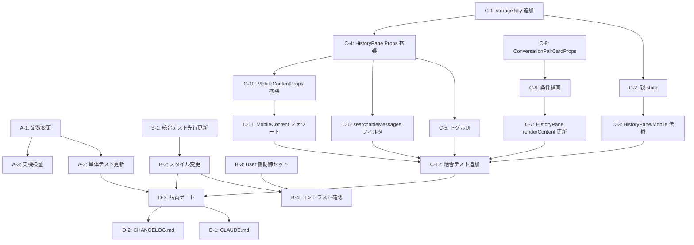

# Issue #725 作業計画

## Issue 概要

- **タイトル**: feat(history): improve User/Assistant visual hierarchy in HistoryPane (折りたたみ強化 + 視覚優先度差 + User onlyフィルタ)
- **Issue番号**: #725
- **サイズ**: M（案A 5分 + 案B 30分 + 案C 半日 ≒ 5-6時間）
- **優先度**: Medium（UI/UX 改善、機能追加・破壊的変更なし）
- **依存Issue**: なし（参考: #168 showArchived, #485 onInsertToMessage, #701 historyDisplayLimit, #716 検索）
- **作業ブランチ**: `feature/725-worktree`（既存・このworktreeで作業）

## 設計判断サマリ（Issue Review Stage 1-4 反映済み）

| 論点 | 採用方針 |
|------|---------|
| 案C state 配置 | `WorktreeDetailRefactored` 親持ち + props 伝播（既存 #168/#701 パターン） |
| localStorage 値表現 | `'true'/'false'`（既存 `commandmate:showArchived` 整合） |
| トグル ARIA | `aria-pressed`（既存 HistoryPane 検索トグル準拠） |
| Orphan 判定 | `pair.status === 'orphan'`（`pair.type` は実型に存在しない） |
| 検索 × User only 優先順位 | `userOnly` が `autoExpandedIds` より優先（Assistant マッチでも強制表示しない） |
| アイコン | lucide-react `User`/`UserCheck`/`Filter`（絵文字回避） |
| i18n | 既存ラベルすべて英語ハードコーディングと整合（別 Issue で i18n 化） |

## タスク分解

### Phase 1: 案A — デフォルト折りたたみ強化（小）

- [ ] **Task A-1**: `src/components/worktree/ConversationPairCard.tsx:57-60` の定数変更
  - 成果物: `COLLAPSED_MAX_CHARS: 300 → 100`、`COLLAPSED_MAX_LINES: 5 → 2`
  - 依存: なし
- [ ] **Task A-2**: `src/components/worktree/__tests__/ConversationPairCard.test.tsx` のトランケーション関連 assertion 更新
  - 成果物: 既存テストが新定数で通る（必要に応じて閾値テストの input を 100 文字超に調整）
  - 依存: Task A-1
- [ ] **Task A-3 (検証)**: 実機で 2 行表示と日本語マルチバイトでの 1 文以上見えることを確認、スクリーンショットを `dev-reports/issue/725/screenshots/` に保存
  - 成果物: スクリーンショット 1-2 枚（PR description 用）
  - 依存: Task A-1

### Phase 2: 案B — Assistant スタイル弱化 + User 防御セット追加（中）

- [ ] **Task B-1**: `tests/integration/conversation-pair-card.test.tsx` のセレクタを `.text-sm.text-gray-200` → `.text-xs.text-gray-300` に更新（lines 70, 111 / Assistant 側のみ）
  - 成果物: 該当 2 箇所のセレクタ更新
  - 依存: なし（先に書く＝Red 確認）
- [ ] **Task B-2**: `ConversationPairCard.tsx` の Assistant スタイル変更
  - `AssistantMessagesSection` ラッパ: `bg-gray-800/50 border-l-4 border-gray-600 p-3 ... space-y-3` → `bg-gray-900/30 border-l-4 border-gray-700 p-2 ... space-y-2`
  - `AssistantMessageItem` 本文: `text-sm text-gray-200` → `text-xs text-gray-300`
  - 成果物: `:306,349` 周辺の className 更新
  - 依存: Task B-1
- [ ] **Task B-3 (Should Fix)**: `UserMessageSection` 本文 (line 225) に `[word-break:break-word] max-w-full overflow-x-hidden` を追加（Assistant 側との防御セット差解消）
  - 成果物: `:225` className 更新
  - 依存: なし（Task B-2 と独立だが同コミットでよい）
- [ ] **Task B-4 (検証)**: ダークモードで `text-gray-300` on `bg-gray-900/30` が WCAG AA 4.5:1 以上であることを Chrome DevTools で確認、スクリーンショット保存
  - 成果物: コントラスト比チェック結果
  - 依存: Task B-2

### Phase 3: 案C — User only フィルタトグル（大）

#### 3.1 基盤

- [ ] **Task C-1**: `src/config/history-display-config.ts` に `HISTORY_USER_ONLY_STORAGE_KEY = 'commandmate:historyUserOnly'` を追加（DEFAULT_USER_ONLY 等は追加せず最小限）
  - 成果物: `:48` 付近にコメント付きで定数1行追加
  - 依存: なし

#### 3.2 親 (`WorktreeDetailRefactored.tsx`) state 持ち + localStorage 永続化

- [ ] **Task C-2**: 既存 `showArchived` (line 295-307) の直下に `historyUserOnly` state と `handleHistoryUserOnlyChange` を追加
  - 既存 commandmate:showArchived と同じ `'true'`/`'false'` 表現、try/catch でフォールバック
  - safe-off フォールバックコメント追加（旧フォーマット `'1'`/`'0'` は false にフォールバック）
  - 成果物: `:308` 付近に state + callback 追加（10-15行）
  - 依存: Task C-1
- [ ] **Task C-3**: `WorktreeDetailRefactored.tsx` 内の `<HistoryPane>` 呼び出し (line 1530, 1918) と `<MobileContent>` 呼び出しに `historyUserOnly` / `onHistoryUserOnlyChange` props を伝播、`useMemo` 依存配列 (line 1599) にも追加
  - 成果物: 該当 3 箇所への props 追加
  - 依存: Task C-2

#### 3.3 HistoryPane.tsx

- [ ] **Task C-4**: `HistoryPaneProps` に `historyUserOnly?: boolean` / `onHistoryUserOnlyChange?: (next: boolean) => void` を追加
  - 成果物: 型定義 + デフォルト値（`historyUserOnly = false`）
  - 依存: Task C-1
- [ ] **Task C-5**: ヘッダー (`HistoryPane.tsx:430-439` 検索トグル隣) に「User only」トグルボタンを追加
  - `aria-pressed={historyUserOnly}`, `aria-label="Show user messages only"`, lucide-react `User`/`UserCheck` アイコン
  - 成果物: `:438` 付近にボタン 1 個追加（15-20行）
  - 依存: Task C-4
- [ ] **Task C-6**: `searchableMessages` の `useMemo` (line 186) に `historyUserOnly` を加え、true 時は user role のみにフィルタ
  - 成果物: `:186-192` の filter 条件拡張、依存配列に `historyUserOnly` 追加
  - 依存: Task C-4
- [ ] **Task C-7**: `renderContent()` (line 347-371) の `pairs.map` で `historyUserOnly && !pair.userMessage` のペアをスキップ、`ConversationPairCard` に `showAssistant={!historyUserOnly}` を渡す
  - 成果物: `:354-370` 付近の map ロジック更新（5-10行）
  - 依存: Task C-4, Task C-9

#### 3.4 ConversationPairCard.tsx

- [ ] **Task C-8**: `ConversationPairCardProps` に `showAssistant?: boolean`（default `true`）を追加
  - 成果物: 型定義 + デフォルト値
  - 依存: なし
- [ ] **Task C-9**: `AssistantMessagesSection` 描画箇所 (line 492-499) を `showAssistant !== false && pair.assistantMessages.length > 0 && (...)` で条件分岐
  - 成果物: `:492` 周辺の条件式更新（1行）
  - 依存: Task C-8

#### 3.5 モバイル (`WorktreeDetailSubComponents.tsx`)

- [ ] **Task C-10**: `MobileContentProps` (line 826-886) に `historyUserOnly?` / `onHistoryUserOnlyChange?` を追加
  - 成果物: 型定義に 2 prop 追加（既存 `showArchived` と同パターン）
  - 依存: Task C-4
- [ ] **Task C-11**: `MobileContent` (line 889-927) の分割代入と `<HistoryPane>` 呼び出し (line 973-983) に新 props をフォワード
  - 成果物: 分割代入 + props フォワード追加
  - 依存: Task C-10

#### 3.6 テスト

- [ ] **Task C-12**: `src/components/worktree/__tests__/HistoryPane.integration.test.tsx` に以下のテストを追加
  - `User only` トグル ON で `AssistantMessagesSection` が非表示（`data-testid="conversation-pair-card"` 内 Assistant ラベル数のアサート）
  - User only モードで orphan ペア（`userMessage === null`）が非表示
  - `aria-pressed` 属性がトグル状態を反映
  - 検索バー併用時に Assistant マッチがあっても Assistant 部分が表示されない
  - 成果物: 新規 describe ブロック追加（4-5 テスト）
  - 依存: Task C-11

### Phase 4: 横断・ドキュメント

- [ ] **Task D-1**: `CLAUDE.md` モジュールリファレンス更新（5 行）
  - `ConversationPairCard.tsx` 行: `showAssistant?: boolean` prop 追加 (#725)
  - `HistoryPane.tsx` 行: User only トグル + searchableMessages の user role フィルタ (#725)
  - `WorktreeDetailRefactored.tsx` 行: `historyUserOnly` state + localStorage 永続化 (#725)
  - `WorktreeDetailSubComponents.tsx` 行: `MobileContentProps` への user only props 追加 (#725)
  - `history-display-config.ts` 行: `HISTORY_USER_ONLY_STORAGE_KEY` 追加 (#725)
  - 成果物: モジュールリファレンス表の該当行に注記追加
  - 依存: 全実装完了後
- [ ] **Task D-2**: `CHANGELOG.md` [Unreleased] セクションに追記
  - `### Changed` / `### Added` を分けて記載
  - 案A: デフォルト折りたたみを 2行/100文字に強化（#725）
  - 案B: Assistant メッセージのスタイルを弱化（text-xs, p-2, bg-gray-900/30）+ User 側に防御セット追加（#725）
  - 案C: HistoryPane に「User only」フィルタトグルを追加（localStorage 永続化、#725）
  - 成果物: 3-4 行追記
  - 依存: 全実装完了後
- [ ] **Task D-3**: 品質ゲート確認
  - `npx tsc --noEmit` 型エラー 0 件
  - `npm run lint` エラー 0 件
  - `npm run test:unit` 全 pass
  - `npm run build` 成功
  - 成果物: 各コマンドの成功ログ（夢ログでよい）
  - 依存: 全実装完了後

## タスク依存関係

## TDD サイクル方針

各案で Red → Green → Refactor を回す:

- **案A**: Task A-2 で「2行/100文字で打ち切られる」期待値テストを書いて Red → Task A-1 で定数変更 → Green
- **案B**: Task B-1 で integration test セレクタ更新 → Red → Task B-2/B-3 でスタイル変更 → Green
- **案C**: Task C-12 で User only トグル動作の結合テストを先に書いて Red（または各サブタスク完了後に追記）→ Task C-1 〜 C-11 を順次実装 → Green

> 注: C-12 を完全先行で書くと依存しすぎるため、現実的には C-1 〜 C-11 完了後に新規テストを追加し、その時点で `failing test → green` を確認する形でよい。

## コミット粒度（推奨）

1. `feat(history): collapse assistant messages to 2 lines / 100 chars (#725) [案A]` — Phase 1
2. `feat(history): de-emphasize assistant style (text-xs, p-2, bg-gray-900/30) + harden user container (#725) [案B]` — Phase 2
3. `feat(history): add User only filter toggle with localStorage persistence (#725) [案C]` — Phase 3
4. `docs: update CLAUDE.md and CHANGELOG.md for history hierarchy improvements (#725)` — Phase 4

> 1 PR で 4 コミットに分けてレビュアーが段階的にレビューできる構成にする。

## 品質チェック項目

| 項目 | コマンド | 基準 |
|------|---------|------|
| TypeScript | `npx tsc --noEmit` | 型エラー 0 件 |
| ESLint | `npm run lint` | エラー 0 件、警告は許容（既存準拠） |
| Unit Test | `npm run test:unit` | 全テストパス、新規追加 4-5 件含む |
| Integration Test | `npm run test:integration` | 全パス（conversation-pair-card.test.tsx のセレクタ更新含む） |
| Build | `npm run build` | 成功 |
| 実機検証 | dev サーバ + ブラウザ | 案A スクリーンショット、案B コントラスト確認、案C トグル動作 |

## Definition of Done

- [ ] 案A/B/C すべて実装完了
- [ ] 既存テストすべて pass（integration test セレクタ更新含む）
- [ ] 新規結合テスト（User only トグル/orphan/検索併用）追加・pass
- [ ] TypeScript / ESLint / Build 全パス
- [ ] CLAUDE.md / CHANGELOG.md 更新
- [ ] PR description にスクリーンショット添付（案A 2 vs 3 行比較、案C トグル状態 ON/OFF）
- [ ] Issue #725 のレビュー履歴セクションに本実装 PR 番号を追記

## 次のアクション

- `/pm-auto-dev 725` で TDD 自動実装開始
- 完了後、`/create-pr` で PR 作成
