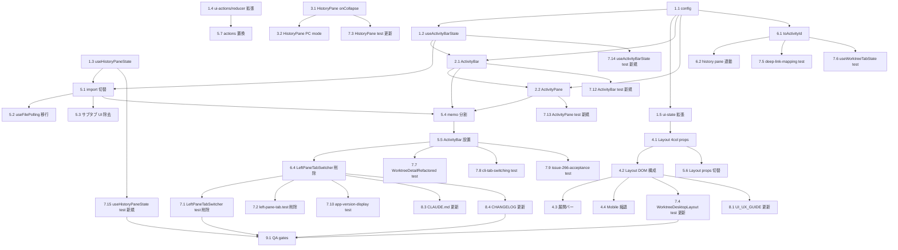

# Issue #727 作業計画書

## Issue: feat(layout): replace LeftPaneTabSwitcher with VS Code-style Activity Bar + relocate History pane (PC)

| 項目 | 値 |
|------|---|
| **Issue 番号** | #727 |
| **サイズ** | **L**（新規 5 ファイル + 既存 9 ファイル改修 + テスト 11 更新/削除 + 4 新規） |
| **優先度** | High（UX 視覚的破壊的変更、PC レイアウト全面再構成） |
| **依存 Issue** | なし（#728 はマージ順序ガイドあり） |
| **ブランチ** | `feature/727-worktree`（現在のブランチ） |
| **対象 PR ベース** | `main`（プロジェクト方針: feature → main 直 PR、`develop` は本リポジトリでは未使用） |

---

## 1. 全体方針

「VS Code 風 Activity Bar + History 独立カラム化」を**先に基盤型・hook・config を確立** → **UI atom を実装** → **layout 統合** → **既存統合点（WorktreeDetailRefactored）の差し替え**の順で漸進的に進める。各 Phase 単位で `npx tsc --noEmit` と関連 unit test を緑に保つ。

**重要な不変条件**:
- モバイル経路（`WorktreeDetailSubComponents.tsx` の `case 'memo'` / `case 'history'` / Mobile HistoryPane の Message/Git サブタブ）は**一切触らない**
- `NotesAndLogsPane.tsx` 本体は削除しない（モバイル依存のため）
- `historySubTab` ローカル state（`WorktreeDetailRefactored.tsx:293`）はモバイル props 伝播のため**残置**
- 既存 deep-link URL（`?pane=…`）は引き続き機能する（マッピング先のみ刷新）

---

## 2. Phase 構成

### Phase 1: 型・config・hook 基盤（依存なしの leaf モジュール）

| Task | 概要 | 成果物 | 依存 |
|------|------|--------|------|
| **1.1** | `ActivityId` 型 / `ACTIVITIES` / `ACTIVITY_BAR_STORAGE_KEY` / `DEFAULT_ACTIVITY` 定義 | `src/config/activity-bar-config.ts`（新規） | なし |
| **1.2** | `useActivityBarState` フック（active / setActive / toggle / localStorage 永続化 / hydration 安全） | `src/hooks/useActivityBarState.ts`（新規） | 1.1 |
| **1.3** | `useHistoryPaneState` フック（visible / width / toggle / setWidth / localStorage 永続化 / hydration 安全） | `src/hooks/useHistoryPaneState.ts`（新規） | なし |
| **1.4** | `WorktreeUIAction` union 拡張（`SET_ACTIVE_ACTIVITY` / `TOGGLE_ACTIVITY` / `TOGGLE_HISTORY_PANE` / `SET_HISTORY_WIDTH`）、`WorktreeUIActions` interface / `worktreeUIReducer` 追加 case | `src/types/ui-actions.ts` / `src/hooks/useWorktreeUIState.ts` 更新 | なし |
| **1.5** | `LayoutState` に `activityBar: { active: ActivityId \| null }` / `historyPane: { visible, width, collapsed }` セクション追加、`initialLayoutState` 初期値追加（既存 `leftPaneTab` / `leftPaneCollapsed` は残置） | `src/types/ui-state.ts` 更新 | 1.1 |

**完了条件**:
- `npx tsc --noEmit` PASS
- 新規 unit テスト 2 本（1.2 / 1.3）が単独で PASS

---

### Phase 2: UI atom（ActivityBar / ActivityPane）

| Task | 概要 | 成果物 | 依存 |
|------|------|--------|------|
| **2.1** | `ActivityBar.tsx` 実装。6 アイコン縦並び、48px 幅、`role="tablist"` / `aria-orientation="vertical"` / `aria-selected` / `aria-label` / `aria-controls="worktree-activity-pane"`、Tab + ArrowUp/Down + Enter/Space キーボード操作、tooltip（hover） | `src/components/worktree/ActivityBar.tsx`（新規） | 1.1 / 1.2 |
| **2.2** | `ActivityPane.tsx` 実装。`active` に応じて FileTreeView 系 / GitPane / MemoPane / ExecutionLogPane / AgentSettingsPane / TimerPane を切替描画。各子コンポーネントは ErrorBoundary でラップ。`id="worktree-activity-pane"` | `src/components/worktree/ActivityPane.tsx`（新規） | 1.1 / 2.1 |

**完了条件**:
- ActivityBar / ActivityPane の Storybook 不要、unit test（Phase 6 で記述）が単独 PASS
- `npx tsc --noEmit` PASS

---

### Phase 3: HistoryPane 拡張（折りたたみ + PC モード）

| Task | 概要 | 成果物 | 依存 |
|------|------|--------|------|
| **3.1** | `HistoryPane.tsx` に `onCollapse?: () => void` props 追加、ヘッダー右端に `<` ボタン追加 | `src/components/worktree/HistoryPane.tsx` 更新 | なし |
| **3.2** | `HistoryPane` を「PC モード」では Message/Git サブタブを描画しないように変更（呼び出し側で historySubTab を渡さない、または props で抑制）。モバイル経路は現状維持。 | `src/components/worktree/HistoryPane.tsx` 更新 | 3.1 |

**完了条件**:
- 既存 `tests/unit/components/HistoryPane.test.tsx` の更新版が PASS
- モバイル E2E（手元実行）が引き続き動作

---

### Phase 4: WorktreeDesktopLayout 4 カラム化

| Task | 概要 | 成果物 | 依存 |
|------|------|--------|------|
| **4.1** | `WorktreeDesktopLayoutProps` を 4 カラム props に再構成（`activityBar` / `activityPane` / `historyPane` / `rightPane` + 各幅 / resize callback）。旧 `leftPane` props は完全削除（互換 shim なし、内部参照は WorktreeDetailRefactored 1 箇所） | `src/components/worktree/WorktreeDesktopLayout.tsx` 更新 | 1.5 |
| **4.2** | DesktopLayout 内部を [ActivityBar(48px固定)] + Resizer + [ActivityPane(可変)] + Resizer + [HistoryPane(可変)] + Resizer + [Right] に再構成。ActivityPane / HistoryPane が null（閉じている）時はそのカラムごと非表示・Resizer も非表示。新 DOM ID 設計（`worktree-activity-bar` / `worktree-activity-pane` / `worktree-history-pane` / `worktree-right-pane`）を反映 | 同上 | 4.1 |
| **4.3** | 折りたたみ展開バー実装（HistoryPane クローズ時に右隣に `>` 24px 幅バー）。Issue #688 の leftPane 展開バーパターンを踏襲 | 同上 | 4.2 |
| **4.4** | モバイル経路（`useIsMobile` true）は既存の 2 paneモバイル切替 UI を維持（`activityBar`/`activityPane`/`historyPane` を組み合わせて元の 2 ペイン構造に縮退）。本タスクではモバイル経路の見た目は変えない | 同上 | 4.2 |

**完了条件**:
- `tests/unit/components/WorktreeDesktopLayout.test.tsx`（更新版）が PASS
- `npx tsc --noEmit` PASS

---

### Phase 5: 統合（WorktreeDetailRefactored 差し替え）

最も影響範囲の大きい単一ファイル改修。Phase 1-4 が緑であることを前提に着手。

| Task | 概要 | 成果物 | 依存 |
|------|------|--------|------|
| **5.1** | `LeftPaneTabSwitcher` import 削除、`useActivityBarState` / `useHistoryPaneState` import 追加 | `src/components/worktree/WorktreeDetailRefactored.tsx` 更新 | 1.2 / 1.3 |
| **5.2** | `useFilePolling` の `enabled: state.layout.leftPaneTab === 'files'`（:269）を `enabled: activeActivity === 'files'` に置換 | 同上 | 5.1 |
| **5.3** | `historySubTab` state（:293）を**残置**（モバイル `MobileContent` props のため）。PC 経路の Message/Git サブタブ UI（:1518-1568）を削除 | 同上 | 5.1 |
| **5.4** | `leftPaneMemo`（:1507-1623, deps 38 要素）を `activityPaneMemo` / `historyPaneMemo` に分割。各 memo 直前に Issue #411 R3-007 メンテナンスコメントを記述 | 同上 | 5.1 / 2.1 / 2.2 / 3.x |
| **5.5** | `<LeftPaneTabSwitcher>` 呼び出し（:1510-）を `<ActivityBar>` に置換、`<ActivityPane>` を Activity 別子レンダリングに置換 | 同上 | 5.4 |
| **5.6** | `WorktreeDesktopLayout` への props 切替（旧 `leftPane` → `activityBar` / `activityPane` / `historyPane` / `rightPane`） | 同上 | 4.1 |
| **5.7** | `actions.toggleLeftPane` / `actions.setLeftPaneTab` の PC 呼び出し箇所を新 actions（`actions.setActiveActivity` / `actions.toggleHistoryPane` 等）に置換。モバイル `MobileContent` 側の旧 actions 呼び出しは残置 | 同上 | 1.4 |

**完了条件**:
- WorktreeDetailRefactored 関連の既存 unit test（更新版）が PASS
- 開発サーバー起動 → PC で Activity 切替 / History 折りたたみが動作
- `npx tsc --noEmit` PASS

---

### Phase 6: Deep-link 互換性 / レガシー削除

| Task | 概要 | 成果物 | 依存 |
|------|------|--------|------|
| **6.1** | `useWorktreeTabState.ts` に `toActivityId(pane: DeepLinkPane): ActivityId \| null` ヘルパー追加（`?pane=git→git`、`?pane=logs→schedules`、`?pane=notes/agent/timer/files→同名`、`?pane=history→null`）。既存 `toLeftPaneTab` / `toHistorySubTab` はモバイル / 後方互換用に残置 | `src/hooks/useWorktreeTabState.ts` 更新 | 1.1 |
| **6.2** | `UseWorktreeTabStateReturn` に `activityId: ActivityId \| null` を追加、`?pane=history` の場合は History pane を表示する旨の挙動を WorktreeDetailRefactored 側で連動（History pane visible を ON） | 同上 / 5.x | 6.1 |
| **6.3** | `src/lib/deep-link-validator.ts` の `VALID_PANES` はそのまま、`'logs' → 'schedules'` の Activity マッピングをコメントで明示 | `src/lib/deep-link-validator.ts` 更新 | なし |
| **6.4** | `src/components/worktree/LeftPaneTabSwitcher.tsx` を**削除** | 削除 | 5.5 |

**完了条件**:
- `npx tsc --noEmit` PASS（LeftPaneTabSwitcher 参照がすべて消えていること）
- 手動: `?pane=git` / `?pane=logs` / `?pane=notes` / `?pane=history` で起動して期待動作確認

---

### Phase 7: テスト更新 / 新規

| Task | 概要 | 成果物 | 依存 |
|------|------|--------|------|
| **7.1** | `tests/unit/components/worktree/LeftPaneTabSwitcher.test.tsx` を**削除** | 削除 | 6.4 |
| **7.2** | `tests/unit/types/left-pane-tab.test.ts` を**削除**（型同一性検証の意義消失） | 削除 | 6.4 |
| **7.3** | `tests/unit/components/HistoryPane.test.tsx` 更新（`onCollapse` props / `<` ボタンクリック検証追加） | 更新 | 3.1 |
| **7.4** | `tests/unit/components/WorktreeDesktopLayout.test.tsx` 更新（4 カラム構造 / 新 DOM ID / 各 Resizer の有無検証） | 更新 | 4.x |
| **7.5** | `tests/unit/hooks/deep-link-mapping.test.ts` 更新（MAPPING_TABLE に `activityId` 列追加、`historySubTab` はモバイル互換として残置） | 更新 | 6.1 |
| **7.6** | `tests/unit/hooks/useWorktreeTabState.test.ts` 更新（22 件アサーション、`activityId` 期待値追加、PC `leftPaneTab` 派生は deprecated 化 or 削除） | 更新 | 6.1 |
| **7.7** | `tests/unit/components/worktree/WorktreeDetailRefactored.test.tsx` 更新（`vi.mock('LeftPaneTabSwitcher')` → `vi.mock('ActivityBar')`、`getByTestId('left-pane-tab-switcher')` 11 箇所を `getByTestId('activity-bar')` 等に置換、Files タブ切替テストを ArrowDown/Enter 経路へ） | 更新 | 5.5 |
| **7.8** | `tests/unit/components/worktree/WorktreeDetailRefactored-cli-tab-switching.test.tsx` 更新（vi.mock / testid 置換） | 更新 | 5.5 |
| **7.9** | `tests/integration/issue-266-acceptance.test.tsx` 更新（`getByTestId('left-pane-tab-switcher')` :154 を ActivityBar 経由検証へ） | 更新 | 5.5 |
| **7.10** | `tests/unit/components/app-version-display.test.tsx` から不要な `vi.mock('@/components/worktree/LeftPaneTabSwitcher')` :138-140 を削除 | 更新 | 6.4 |
| **7.11** | `tests/unit/components/worktree/WorktreeDetailRefactored-mobile-overflow.test.tsx` — 影響確認のみ（変更なしを確認） | 確認 | 5.x |
| **7.12** | 新規: `tests/unit/components/worktree/ActivityBar.test.tsx`（6 アイコン描画 / クリックトグル / キーボード ArrowUp/Down + Enter/Space / aria 属性 / aria-controls） | 新規 | 2.1 |
| **7.13** | 新規: `tests/unit/components/worktree/ActivityPane.test.tsx`（各 activity に対応する子描画 / ErrorBoundary 包含検証） | 新規 | 2.2 |
| **7.14** | 新規: `tests/unit/hooks/useActivityBarState.test.ts`（active 切替 / toggle / localStorage 永続化 / 不正値 fallback / hydration 前 default 動作） | 新規 | 1.2 |
| **7.15** | 新規: `tests/unit/hooks/useHistoryPaneState.test.ts`（visible / width / toggle / setWidth / localStorage 永続化 / hydration 前 default） | 新規 | 1.3 |
| **7.16** | E2E 影響確認（ローカルで 1 回ずつ実行）: `mobile-cmate-tab.spec.ts` / `worktree-detail.spec.ts` / `file-tree-operations.spec.ts` / `markdown-editor.spec.ts` | 実行確認 | 5.x |

**完了条件**:
- `npm run test:unit` 全 PASS（既存 + 新規）
- E2E は対象 4 spec 手元実行 PASS

---

### Phase 8: ドキュメント / モジュールリファレンス

| Task | 概要 | 成果物 | 依存 |
|------|------|--------|------|
| **8.1** | `docs/UI_UX_GUIDE.md` :219 付近の「`WorktreeDesktopLayout.tsx # デスクトップ2カラム`」記述を 4 カラム構成（ActivityBar / ActivityPane / History / Right）へ更新 | 更新 | 4.x |
| **8.2** | `docs/en/UI_UX_GUIDE.md`（存在すれば）同上の英訳更新 | 更新 | 8.1 |
| **8.3** | `CLAUDE.md` モジュールリファレンス: `LeftPaneTabSwitcher.tsx` 行を削除、新規 `ActivityBar.tsx` / `ActivityPane.tsx` / `useActivityBarState.ts` / `useHistoryPaneState.ts` / `activity-bar-config.ts` を追加 | 更新 | 6.4 |
| **8.4** | `CHANGELOG.md` `[Unreleased]` セクションに視覚的破壊的変更を明記（"BREAKING (PC layout): VS Code 風 Activity Bar + History 独立カラム化（Issue #727）"） | 更新 | 6.4 |

**完了条件**:
- ドキュメント 4 ファイル更新済み
- `git diff CLAUDE.md docs/ CHANGELOG.md` で意図通りの差分

---

### Phase 9: 最終 QA / UAT 準備

| Task | 概要 | 成果物 | 依存 |
|------|------|--------|------|
| **9.1** | `npm run lint` / `npx tsc --noEmit` / `npm run test:unit` / `npm run build` 全 PASS | 実行ログ | Phase 1-8 完了 |
| **9.2** | 開発サーバー起動 → PC ブラウザで Activity 切替 / History 折りたたみ / Resize / Deep link（`?pane=git` 等）動作確認 | 手動確認結果 | 9.1 |
| **9.3** | localStorage 値確認（DevTools）: `commandmate.worktree.activeActivity` / `commandmate.worktree.historyVisible` / `commandmate.worktree.historyWidth` が記録されること | 手動確認結果 | 9.2 |

---

## 3. タスク依存関係

---

## 4. 品質チェック項目（Definition of Done）

| 項目 | コマンド | 基準 |
|------|---------|------|
| ESLint | `npm run lint` | エラー 0 件 |
| TypeScript | `npx tsc --noEmit` | 型エラー 0 件 |
| Unit Test | `npm run test:unit` | 既存 + 新規 4 件すべて PASS |
| Build | `npm run build` | 成功 |
| E2E 影響確認 | `npx playwright test tests/e2e/mobile-cmate-tab.spec.ts tests/e2e/worktree-detail.spec.ts tests/e2e/file-tree-operations.spec.ts tests/e2e/markdown-editor.spec.ts` | 既存 4 件すべて PASS |
| 手動 PC 確認 | 開発サーバー / Activity 6 種切替 + History 折りたたみ + Resize + Deep link 4 種 | 期待動作 |

---

## 5. リスクと緩和策

| リスク | 影響 | 緩和策 |
|--------|------|--------|
| `leftPaneMemo` 分割で deps 列挙漏れ → stale closure | Activity 切替で中身が更新されない subtle bug | Issue #411 R3-007 ガイドラインに従い、Task 5.4 の memo 直前にメンテナンスコメント記述。Task 7.7 の単体テストで Activity 切替時の再レンダリング検証を追加 |
| モバイル経路の `historySubTab` / `NotesAndLogsPane` を誤って削除 | モバイル build 破壊 | Task 5.3 / 6.4 で**残置するもの**を明示。Phase 9 で手動モバイル E2E（mobile-cmate-tab.spec.ts）確認 |
| Deep link `?pane=git` の旧マッピング (`leftPaneTab='history' + historySubTab='git'`) と新マッピング (`activityId='git'`) の差で URL 共有後の起動が変わる | UAT 不合格リスク | Task 7.5 の deep-link-mapping test に新旧マッピングの差を MAPPING_TABLE で明示。Phase 9.2 で全 URL パターン手動確認 |
| Issue #728（ターミナル分割）と `WorktreeDesktopLayout.tsx` の並行編集衝突 | merge conflict / rebase 困難 | Issue 本文「マージ順序ガイド」に従い、本 Issue を先行マージ。#728 担当者は本ブランチに rebase |
| `useFilePolling` 移行（Task 5.2）で hydration 直後に余計な fetch 発火 | `?pane=git` 起動時に Files API が一度呼ばれる無駄 | Task 1.2 の `useActivityBarState` で hydration 前は `DEFAULT_ACTIVITY = 'files'` を返す方針だが、`?pane=git` 起動時は早期 URL 反映が必要。Task 6.2 で `useWorktreeTabState.activityId` を初回レンダー前に確定し `useActivityBarState` の初期値に渡す設計とする |
| `WorktreeUIAction` 拡張で既存 reducer の網羅性検証 (`switch (action.type)`) が exhaustive でない場合の TS エラー | コンパイル不可 | Task 1.4 で `default: { const _: never = action; throw new Error(_); }` exhaustive check を維持 |

---

## 6. 成果物チェックリスト

### 新規ファイル（5 件）
- [ ] `src/config/activity-bar-config.ts`
- [ ] `src/hooks/useActivityBarState.ts`
- [ ] `src/hooks/useHistoryPaneState.ts`
- [ ] `src/components/worktree/ActivityBar.tsx`
- [ ] `src/components/worktree/ActivityPane.tsx`

### 既存変更（11 件）
- [ ] `src/types/ui-state.ts`
- [ ] `src/types/ui-actions.ts`
- [ ] `src/hooks/useWorktreeUIState.ts`
- [ ] `src/hooks/useWorktreeTabState.ts`
- [ ] `src/lib/deep-link-validator.ts`
- [ ] `src/components/worktree/HistoryPane.tsx`
- [ ] `src/components/worktree/WorktreeDesktopLayout.tsx`
- [ ] `src/components/worktree/WorktreeDetailRefactored.tsx`
- [ ] `docs/UI_UX_GUIDE.md`
- [ ] `docs/en/UI_UX_GUIDE.md`（存在すれば）
- [ ] `CLAUDE.md` / `CHANGELOG.md`

### 削除（3 件）
- [ ] `src/components/worktree/LeftPaneTabSwitcher.tsx`
- [ ] `tests/unit/components/worktree/LeftPaneTabSwitcher.test.tsx`
- [ ] `tests/unit/types/left-pane-tab.test.ts`

### 既存テスト更新（9 件）
- [ ] `tests/unit/components/HistoryPane.test.tsx`
- [ ] `tests/unit/components/WorktreeDesktopLayout.test.tsx`
- [ ] `tests/unit/hooks/deep-link-mapping.test.ts`
- [ ] `tests/unit/hooks/useWorktreeTabState.test.ts`
- [ ] `tests/unit/components/worktree/WorktreeDetailRefactored.test.tsx`
- [ ] `tests/unit/components/worktree/WorktreeDetailRefactored-cli-tab-switching.test.tsx`
- [ ] `tests/integration/issue-266-acceptance.test.tsx`
- [ ] `tests/unit/components/app-version-display.test.tsx`
- [ ] `tests/unit/components/worktree/WorktreeDetailRefactored-mobile-overflow.test.tsx`（影響確認のみ）

### 新規テスト（4 件）
- [ ] `tests/unit/components/worktree/ActivityBar.test.tsx`
- [ ] `tests/unit/components/worktree/ActivityPane.test.tsx`
- [ ] `tests/unit/hooks/useActivityBarState.test.ts`
- [ ] `tests/unit/hooks/useHistoryPaneState.test.ts`

### E2E 影響確認（4 件）
- [ ] `tests/e2e/mobile-cmate-tab.spec.ts`
- [ ] `tests/e2e/worktree-detail.spec.ts`
- [ ] `tests/e2e/file-tree-operations.spec.ts`
- [ ] `tests/e2e/markdown-editor.spec.ts`

---

## 7. 次のアクション

作業計画完了後、`/pm-auto-dev 727` を実行して TDD 自動開発フェーズに進む。

- ブランチ: `feature/727-worktree`（既存 / そのまま使用）
- TDD は Phase 1（基盤）→ Phase 2（atom）→ Phase 3（HistoryPane）→ Phase 4（Layout）→ Phase 5（統合）→ Phase 6（deep-link / 削除）→ Phase 7（テスト）→ Phase 8（ドキュメント）→ Phase 9（QA）の順で進行する想定。
- PR 作成は Phase 9 完了後、`/create-pr` 経由。base ブランチは `main`。
