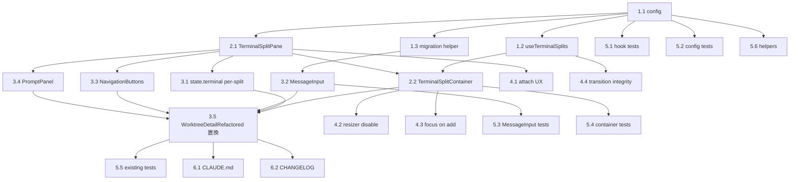

# Issue #728 作業計画書

## Issue: feat(terminal): add 1-3 horizontal terminal split with per-split CLI selection and MessageInput (PC)

- **Issue 番号**: #728
- **サイズ**: **L**（新規4ファイル、既存変更6ファイル、既存テスト6本影響、state.terminal の per-split化が大きい）
- **優先度**: Medium
- **依存 Issue**: #727 (Activity Bar 再構成)、#730 (TerminalContainer 構造)
- **ブランチ**: `feature/728-worktree`（既存）
- **PC専用**: モバイル経路 (`MobileContent`) は無変更

---

## 設計概要（Issueレビュー後の確定事項）

| 項目 | 決定 |
|------|------|
| スプリット最大数 | 1 / 2 / 3 |
| 分割方向 | 左右のみ |
| 同一 (worktreeId, cliToolId) 複数スプリット | **禁止**（CLI セレクターで disabled） |
| Auto-Yes / poller / tmuxキー設計 | 現状 `(worktreeId, cliToolId)` 複合キーを維持 |
| localStorage キー | `commandmate:terminalSplits:${worktreeId}`（worktree-scope） |
| MessageInput draft キー | `commandmate:draft-message:${worktreeId}:${splitIndex}` |
| 状態管理 | `useTerminalSplits` 独立フック（LayoutState 不変、useWorktreeUIState 不変） |
| state.terminal 構造 | per-split 化（推奨: 各 TerminalSplitPane で useState 保持） |
| HistoryPane / MemoPane 挿入先 | `focusedSplitIndex`（`MessageInput onFocus` で更新） |
| `pendingInsertText` | `Map<splitIndex, string \| null>` 化 |
| `isSelectionListActive` | per-split 化 |
| `FilePanelSplit` | シグネチャ無変更（terminalHeader=null 渡し） |
| 共通 CLI tab header | 廃止、各 TerminalSplitPane ヘッダー内に CLI セレクター + 検索ボタン移管 |
| アクセシビリティ | TerminalSplitContainer `role="group"`、各 Pane `role="region"`、add/remove ボタンに aria-label |
| Mobile fallback | `MobileContent` 経路は単一 Terminal 維持、useTerminalSplits 非呼び出し or MIN_SPLITS=1 固定 |

---

## Phase 1: 設定・フック・型基盤（Foundation）

### Task 1.1: terminal-split-config 定数 + バリデーション
- **成果物**: `src/config/terminal-split-config.ts`（新規）
- **内容**:
  - `MIN_SPLITS = 1`、`MAX_SPLITS = 3`
  - `TERMINAL_SPLITS_STORAGE_KEY_PREFIX = 'commandmate:terminalSplits:'`
  - `getTerminalSplitsStorageKey(worktreeId)`
  - `TerminalSplitConfig` 型（`splits: {cliToolId: CliToolId}[]`, `widths: number[]`）
  - `DEFAULT_SPLIT_CONFIG`
  - `isValidSplitConfig(unknown): boolean`（型ガード、splits/widths 検証、widths 各要素 > 0 かつ有限数チェック）
- **依存**: なし
- **テスト**: 後続 Task 5.1 で網羅
- **推定**: 0.5h

### Task 1.2: useTerminalSplits フック
- **成果物**: `src/hooks/useTerminalSplits.ts`（新規）
- **公開API**:
  ```ts
  function useTerminalSplits(worktreeId: string): {
    splits: { cliToolId: CliToolId }[];
    widths: number[];
    addSplit(): void;
    removeSplit(): void;
    setSplitCliTool(idx: number, cliId: CliToolId): void;
    setSplitWidth(widths: number[]): void;
    availableCliTools(idx: number): CliToolId[]; // 同一CLI禁止のため除外
    focusedSplitIndex: number;
    setFocusedSplitIndex(idx: number): void;
  };
  ```
- **挙動**:
  - 初期化: localStorage 読み取り → `isValidSplitConfig` 検証 → 不正なら `DEFAULT_SPLIT_CONFIG` フォールバック + `console.warn`
  - addSplit: `MAX_SPLITS` 上限で no-op、追加スプリットは `availableCliTools` の先頭で初期化（または現状ない CLI から選ぶ）、widths は既存末尾を半分にして新スプリット末尾に同値配置
  - removeSplit: `MIN_SPLITS` 下限で no-op、末尾スプリットを削除、widths も末尾削除＋残存 widths を再正規化
  - 書き込み: 各 state 変更で localStorage に保存（try/catch、quota 失敗時黙ってスキップ）
  - `focusedSplitIndex`: 初期値 0、`splits.length` 縮小時は `min(focusedSplitIndex, splits.length-1)` にクランプ
- **依存**: Task 1.1
- **推定**: 1.5h

### Task 1.3: MessageInput draft 旧キー → 新キー マイグレーションヘルパー
- **成果物**: `src/components/worktree/MessageInput.tsx` の内部関数 or `src/lib/draft-key-migration.ts`（新規、規模次第）
- **挙動**: `migrateLegacyDraftKey(worktreeId)`:
  - 旧キー `commandmate:draft-message:${worktreeId}` が存在 → 新キー `commandmate:draft-message:${worktreeId}:0` に書き戻し → 旧キー削除
  - try/catch、失敗時は何もしない
  - 二重実行安全（旧キーがなければ no-op）
- **呼び出し点**: MessageInput 初回マウント時 useEffect 内 (worktreeId 変化時に再実行)
- **依存**: Task 1.1
- **推定**: 0.5h

---

## Phase 2: コアコンポーネント（New components）

### Task 2.1: TerminalSplitPane コンポーネント
- **成果物**: `src/components/worktree/TerminalSplitPane.tsx`（新規）
- **役割**: 単一スプリットの内部構成
  - **ヘッダー**: CLI セレクター（`availableCliTools` で disabled 制御） + Issue #47 ターミナル検索ボタン
  - **ボディ**: `TerminalDisplay`（既存）
  - **下部UI**: `NavigationButtons` + `PromptPanel` + `MessageInput`
  - per-split state:
    - `pendingInsertText: string | null`（このスプリットへの挿入予約）
    - `isSelectionListActive: boolean`
    - `terminalOutput`、`terminalIsActive`、`terminalIsThinking`、`autoScroll`、`terminalScrollTop` 等の state.terminal slice 相当（Task 3.1 で確定）
  - per-split polling effect:
    - `useResponsePoller` 相当のフェッチ Effect を per-split で起動（既存 `fetchCurrentOutput` を `cliToolId` 受け取り版にリファクタした関数を呼ぶ）
  - `role="region"`、`aria-label={`Terminal split ${splitIndex+1}`}` 付与
- **props**:
  ```ts
  interface TerminalSplitPaneProps {
    worktreeId: string;
    splitIndex: number;
    cliToolId: CliToolId;
    availableCliTools: CliToolId[];
    onCliToolChange: (cliId: CliToolId) => void;
    onFocus: () => void; // MessageInput / TerminalDisplay focus 時呼ぶ
    pendingInsertText: string | null;
    onConsumeInsertText: () => void; // 挿入完了で pending クリア
    // 既存 WorktreeDetailRefactored から渡される最小props（sendMessage 系・worktree path 系）
    ...
  }
  ```
- **依存**: Task 1.1
- **推定**: 3.0h（state.terminal の per-split 化を含むが、その確定は Task 3.1）

### Task 2.2: TerminalSplitContainer コンポーネント
- **成果物**: `src/components/worktree/TerminalSplitContainer.tsx`（新規）
- **役割**:
  - useTerminalSplits を呼んで splits / widths / actions を取得
  - splits を flex 配列にレンダリング、各 splits 間に PaneResizer
  - ヘッダーに「分割追加」「分割削除」ボタン
    - 1 split 時: 分割削除 disabled
    - 3 split 時: 分割追加 disabled
    - PaneResizer ドラッグ中: 両方とも disabled
  - 分割追加直後: 新スプリットの MessageInput textarea に focus（`useEffect` で ref.focus()）
  - `role="group"` + `aria-label="Terminal splits"`
- **props**:
  ```ts
  interface TerminalSplitContainerProps {
    worktreeId: string;
    // WorktreeDetailRefactored から流す必要のあるコンテキスト（sendMessage, isMobile=false 前提）
    ...
  }
  ```
- **依存**: Task 1.2, Task 2.1
- **推定**: 2.0h

---

## Phase 3: 既存コードの per-split 化（Existing wiring）

### Task 3.1: state.terminal の per-split 化
- **成果物変更**: `src/components/worktree/WorktreeDetailRefactored.tsx`
- **方針**: 推奨案 (B) — `state.terminal.*` の slice を reducer から除去し、各 `TerminalSplitPane` 内 `useState` 保持
  - 除去対象 state: `state.terminal.output`、`state.terminal.isActive`、`state.terminal.isThinking`、`state.terminal.autoScroll`、`activeCliTab`
  - `activeCliTab` の役割: `TerminalSplitPane.props.cliToolId` で完全置換
  - `fetchCurrentOutput` を `fetchCurrentOutputForCli(worktreeId, cliToolId)` にリファクタ（worktreeId/cliToolId を引数化）
  - ポーリング Effect を per-split に分散
- **互換性懸念**:
  - モバイル経路 (`MobileContent`) は **既存挙動を変えない**ため、reducer の terminal slice を即座に削除はせず、まず TerminalSplitPane が自前 state を持ち、MobileContent は引き続き state.terminal slice を読む二重サポート期間を許容する
  - 二重サポートが冗長になる場合は、TerminalSplitPane 内 useState の代わりに「単一 reducer に Map<cliToolId, TerminalState>」を使う案 (A) にスイッチ
- **テスト影響**: `WorktreeDetailRefactored.test.tsx`, `WorktreeDetailRefactored-cli-tab-switching.test.tsx`（Task 5.5）
- **依存**: Task 2.1, Task 2.2
- **推定**: 3.0h

### Task 3.2: MessageInput の splitIndex prop 化 + draft キースコープ化
- **成果物変更**: `src/components/worktree/MessageInput.tsx`
- **内容**:
  - `splitIndex: number = 0` prop を追加（後方互換: モバイル経路は省略で 0）
  - `DRAFT_STORAGE_KEY_PREFIX` を `commandmate:draft-message:` のまま、ストレージキー生成を `getDraftKey(worktreeId, splitIndex) = '${prefix}${worktreeId}:${splitIndex}'` に変更
  - Task 1.3 のマイグレーション処理を初回マウント useEffect で呼ぶ（splitIndex=0 のときのみ）
  - `onFocus` callback prop を追加し、textarea focus 時に呼ぶ（TerminalSplitPane 側で `setFocusedSplitIndex` を渡す）
- **互換性**: モバイル経路は `splitIndex` 省略で デフォルト 0、旧キー存在時のみ migration 走るため挙動変化最小
- **依存**: Task 1.3
- **推定**: 1.0h

### Task 3.3: NavigationButtons の per-split 対応
- **成果物変更**: `src/components/worktree/NavigationButtons.tsx`
- **内容**:
  - `cliToolId: CliToolId` props を必須化（既に持っているなら確認のみ）
  - special-keys API 呼出時に `cliToolId` を body に含める（既存実装の流用、変更最小）
- **サーバ側 (`src/app/api/worktrees/[id]/special-keys/route.ts`)**: 既に `cliToolId` を body で受けるため無変更
- **依存**: Task 2.1
- **推定**: 0.5h

### Task 3.4: PromptPanel の per-split マウント対応
- **成果物変更**: `src/components/worktree/PromptPanel.tsx`
- **内容**:
  - `isSelectionListActive` を props で受ける形に整理（既に props ならそのまま）
  - 各 TerminalSplitPane 内に独立してマウントされる前提でレイアウト調整
- **依存**: Task 2.1
- **推定**: 0.5h

### Task 3.5: WorktreeDetailRefactored の置換
- **成果物変更**: `src/components/worktree/WorktreeDetailRefactored.tsx`
- **内容**:
  - `if (!isMobile)` ブランチ内、`WorktreeDesktopLayout` に渡している `terminal` (= `FilePanelSplit`) の `terminal` prop を `<TerminalSplitContainer worktreeId={worktreeId} {...wire} />` に置換
  - `FilePanelSplit` の `terminalHeader` prop を `null` に変更（共通 CLI tab header `terminalHeaderMemo` を廃止）
  - `MessageInput` / `NavigationButtons` / `PromptPanel` の WorktreeDesktopLayout 直下マウントを除去（per-split に移管）
  - `pendingInsertText` 単一 state → `Map<splitIndex, string|null>` 化（HistoryPane の挿入は `focusedSplitIndex` で解決）
  - HistoryPane の `onInsertToMessage` を `(text) => insertToSplit(focusedSplitIndex, text)` に書き換え
  - `MobileContent` 分岐は無変更
- **依存**: Task 2.1, Task 2.2, Task 3.1, Task 3.2, Task 3.3, Task 3.4
- **推定**: 2.5h

---

## Phase 4: 受入条件詰め（UX details）

### Task 4.1: 新規スプリット attach 中 UX
- **対象**: `TerminalSplitPane.tsx`
- **内容**: tmux セッション attach 完了までは MessageInput を `disabled`、ターミナル領域にスケルトン UI（"Attaching {cliTool} session..." or 既存 loader 流用）
- **検出方法**: 既存の polling Effect 初回フェッチ完了 or 既存 `useEffect` で start_session API 完了
- **依存**: Task 2.1
- **推定**: 1.0h

### Task 4.2: PaneResizer ドラッグ中の分割ボタン disable
- **対象**: `TerminalSplitContainer.tsx`
- **内容**: PaneResizer が `isDragging` 状態を props/event で通知できない場合は、TerminalSplitContainer 内で `onResizeStart`/`onResizeEnd` をラップして自前 state 管理
- **依存**: Task 2.2
- **推定**: 0.5h

### Task 4.3: 分割追加時の MessageInput textarea focus 移動
- **対象**: `TerminalSplitContainer.tsx` + `TerminalSplitPane.tsx`
- **内容**: 新スプリット mount 時に `useEffect(() => textareaRef.current?.focus(), [])`
- **依存**: Task 2.1, Task 2.2
- **推定**: 0.5h

### Task 4.4: 分割数遷移整合性（既存スプリット state 保持）
- **対象**: `useTerminalSplits.ts` + `TerminalSplitPane.tsx`
- **内容**:
  - splits の追加削除で widths 配列を正しく更新（追加: 末尾要素を半分にして追加 / 削除: 末尾削除 + 残りを再正規化）
  - 1→2→3→2→1 で index 0..n-1 のスプリットの state（CLI 選択は useTerminalSplits state、MessageInput 下書きは localStorage draft キー、scroll/output は TerminalSplitPane 内 useState）は保持
- **テスト**: Task 5.1 unit
- **依存**: Task 1.2, Task 2.1
- **推定**: 0.5h

---

## Phase 5: テスト（Tests）

### Task 5.1: useTerminalSplits hook 単体テスト（新規）
- **成果物**: `tests/unit/hooks/useTerminalSplits.test.ts`（新規）
- **カバレッジ目標**: 90%以上
- **テストケース**:
  - addSplit / removeSplit の境界 (MIN/MAX) で no-op
  - setSplitCliTool が指定 index のみ更新
  - setSplitWidth が widths のみ更新
  - availableCliTools が他スプリット選択中の CLI を除外
  - setFocusedSplitIndex 更新、初期値 0、splits 縮小時のクランプ
  - localStorage 復元: 正常データで state 反映
  - **stale state フォールバック**: `splits.length=4`、`splits.length=0`、`widths.length !== splits.length`、`widths` に NaN/負/0 を含む → DEFAULT へフォールバック
  - 1→2→3→2→1 遷移で既存 index の cliToolId が保持される
- **依存**: Task 1.2
- **推定**: 2.0h

### Task 5.2: terminal-split-config 単体テスト（新規）
- **成果物**: `tests/unit/config/terminal-split-config.test.ts`（新規）
- **テストケース**: `isValidSplitConfig` の正常系/異常系網羅
- **依存**: Task 1.1
- **推定**: 0.5h

### Task 5.3: MessageInput draft キースコープ化 + マイグレーション単体テスト（既存更新）
- **成果物**: `tests/unit/components/worktree/MessageInput.test.tsx`（既存更新）
- **テストケース追加**:
  - `splitIndex` 違いで draft キーが別々
  - 旧キー `commandmate:draft-message:${worktreeId}` 存在時、初回マウントで splitIndex=0 に書き戻し + 旧キー削除
  - `onFocus` で props callback 呼び出し
- **依存**: Task 3.2
- **推定**: 1.0h

### Task 5.4: TerminalSplitContainer / TerminalSplitPane 単体テスト（新規）
- **成果物**:
  - `tests/unit/components/worktree/TerminalSplitContainer.test.tsx`（新規）
  - `tests/unit/components/worktree/TerminalSplitPane.test.tsx`（新規）
- **テストケース**:
  - 分割追加/削除ボタンの disabled 状態（1 split / 3 split / dragging）
  - role / aria-label の付与
  - 同一CLI複数選択不可: 隣スプリット選択中の option が disabled
  - 各 Pane の onFocus が setFocusedSplitIndex を呼ぶ
- **依存**: Task 2.1, Task 2.2, Task 4.1, Task 4.2, Task 4.3
- **推定**: 2.0h

### Task 5.5: 既存テスト更新
- **対象**:
  - `tests/unit/components/WorktreeDetailRefactored.test.tsx` — PC 経路の DOM 構造変化追従、HistoryPane の onInsertToMessage が focusedSplitIndex に向く検証追加
  - `tests/unit/components/worktree/WorktreeDetailRefactored-cli-tab-switching.test.tsx` — `activeCliTab` 廃止に伴う再設計（テスト対象が「PC ではスプリットごとに cliToolId を持つ」前提に変更）
  - `tests/unit/components/WorktreeDesktopLayout.test.tsx` — snapshot 更新（必要なら）
  - `tests/unit/hooks/useWorktreeUIState.test.ts` — terminalSplits 関連 action / state が **追加されていない** ことを reducer touched 検証で担保
  - 旧 `commandmate:draft-message:${worktreeId}` 直接参照の fixture/mock を grep して洗い出し、新キー or migration テスト fixture に置換
- **依存**: Task 3.1, Task 3.2, Task 3.5
- **推定**: 3.0h

### Task 5.6: テスト共通ヘルパー追加
- **成果物**: `tests/helpers/terminal-splits.ts`（新規 or 既存ヘルパー拡張）
- **内容**:
  - `mockTerminalSplitsLocalStorage(worktreeId, state)`
  - `seedLegacyDraftKey(worktreeId, value)`
  - `clearTerminalSplitsLocalStorage()`
- **依存**: Task 1.1
- **推定**: 0.5h

### Task 5.7: Playwright e2e（Should Have、時間あれば）
- **成果物**: `tests/e2e/terminal-splits.spec.ts`（新規）
- **シナリオ**:
  - 分割追加 → スプリット2で別 CLI 選択 → 入力 → 分割削除 → リロードで永続化確認
  - PaneResizer ドラッグで幅変更 → リロード後復元
- **依存**: 全タスク
- **推定**: 1.5h（オプション）

---

## Phase 6: ドキュメント（Docs）

### Task 6.1: CLAUDE.md 更新
- **対象**: `CLAUDE.md`
- **内容** (Issue #727/#730 と同じ形式):
  - モジュールリファレンス表に新規 4 行追加:
    - `src/components/worktree/TerminalSplitContainer.tsx`（Issue #728）
    - `src/components/worktree/TerminalSplitPane.tsx`（Issue #728）
    - `src/config/terminal-split-config.ts`（Issue #728）
    - `src/hooks/useTerminalSplits.ts`（Issue #728）
  - 既存ファイル行末尾に注記追加:
    - `WorktreeDetailRefactored.tsx`: 「Issue #728で WorktreeDesktopLayout 内の terminal 領域を TerminalSplitContainer に置換、MessageInput / NavigationButtons / PromptPanel をスプリット内部に移管」
    - `MessageInput.tsx`: 「Issue #728で splitIndex prop 追加、draft キーを (worktreeId, splitIndex) でスコープ化」
    - `FilePanelSplit.tsx`: 「Issue #728では無変更（terminal=TerminalSplitContainer を受け取り、terminalHeader=null）」
- **依存**: Phase 1-3 完了
- **推定**: 0.5h

### Task 6.2: CHANGELOG.md 更新
- **対象**: `CHANGELOG.md`
- **内容**: `[Unreleased]` セクションに `feat(terminal): add PC terminal 1-3 horizontal split (#728)` を追記
- **推定**: 0.1h

---

## タスク依存関係



## 推定工数サマリ

| Phase | 推定 |
|------|-----:|
| Phase 1 | 2.5h |
| Phase 2 | 5.0h |
| Phase 3 | 7.5h |
| Phase 4 | 2.5h |
| Phase 5 | 9.0h（e2e 含む） |
| Phase 6 | 0.6h |
| **合計** | **27.1h**（e2e 抜きで 25.6h） |

## 品質チェック項目

| チェック項目 | コマンド | 基準 |
|-------------|----------|------|
| ESLint | `npm run lint` | エラー0件 |
| TypeScript | `npx tsc --noEmit` | 型エラー0件 |
| Unit Test | `npm run test:unit` | 全テストパス、新規テスト90%+ |
| Build | `npm run build` | 成功 |

## Definition of Done

- [ ] Phase 1-6 全タスク完了
- [ ] 単体テストカバレッジ: 新規モジュール（useTerminalSplits / terminal-split-config）90%以上
- [ ] 既存テストすべて green
- [ ] CIチェック全パス（lint, type-check, test, build）
- [ ] 受入条件すべて充足
  - 分割操作（1→2→3 / 3→2→1、PaneResizer 連動、attach UX、a11y）
  - 独立性（CLI/MessageInput/Auto-Yes/Navigation/特殊キー/HistoryPane 挿入先）
  - 永続化（splits / widths / CLI 選択、stale state フォールバック、旧 draft キーマイグレーション）
  - 既存機能との互換性（FilePanelSplit 無変更、tmux 影響なし、検索維持、Resizer 非干渉）
  - 横断（PC のみ、MobileContent 無変更）
- [ ] CLAUDE.md / CHANGELOG.md 更新

## リスク・留意事項

1. **state.terminal の per-split 化（Task 3.1）が最も影響大** — モバイル経路との整合性を取りつつ reducer slice をどこまで残すかの判断が必要。実装中に推奨案 (B) が破綻したら案 (A: Map<cliToolId, TerminalState>) にスイッチする選択肢を残す。
2. **既存テストの破壊 (Task 5.5)** — 特に `WorktreeDetailRefactored-cli-tab-switching.test.tsx` は `activeCliTab` 中心テストのため大幅再設計。テスト名/責務の再定義から実施。
3. **PaneResizer 並列 5 個マウント** — drag end 時の `document.body.style.cursor` / `userSelect` 残留が複数 instance で発生しないか e2e で目視確認。
4. **Mobile 経路の二重サポート期間** — Task 3.1 完了後に MobileContent から state.terminal slice 依存を切り離す Issue を別建てする選択肢あり（本 Issue では維持）。
5. **同一CLI複数禁止の UX**: CLI セレクター内で他スプリット使用中の CLI が "（other split で使用中）" のような注記付きで disabled になることが望ましい。Phase 2 で UI 細部詰め。

## 次のアクション

- [ ] Phase 5（TDD自動開発）に進む: `/pm-auto-dev 728`
- [ ] Phase 5 完了後、`/create-pr` で PR 作成
