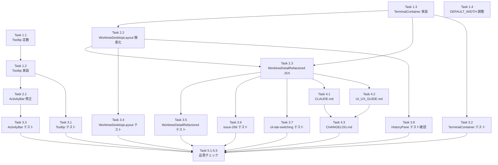

# Issue #730 作業計画書

## Issue 概要

- **Issue**: #730 fix(layout): ActivityBar full-height + custom tooltip + History inside Terminal container (#727 follow-up)
- **サイズ**: **M** (新規2ファイル / 変更5ファイル / テスト更新5ファイル + 新規2ファイル / ドキュメント3ファイル)
- **優先度**: Medium (UX 改善、機能追加なし)
- **依存Issue**: #727 (親、完了済み)
- **ラベル**: bug, enhancement
- **対象範囲**: PC版 (`useIsMobile=false`) のみ

## 前提

- Phase 1 マルチステージレビューで Issue 本文は確定
- 親 Issue #727 のアーキテクチャ (`ActivityBar` / `ActivityPane` / `useActivityBarState` / `useHistoryPaneState` / `WorktreeDesktopLayout`) は維持
- 既存 localStorage キー (`commandmate.worktree.historyVisible` / `historyWidth`) は流用
- モバイル経路 (`MobileContent`) は変更しない (`WorktreeDesktopLayout` 内の `MobileLayout` fallback は dead code として削除のみ)

## 実テストファイルパス (Issue 内記述との差分メモ)

Issue 本文では `tests/unit/components/worktree/` 配下を想定していたが、実際は以下:

| Issue 内記述 | 実パス |
|----|----|
| `tests/unit/components/worktree/WorktreeDesktopLayout.test.tsx` | **`tests/unit/components/WorktreeDesktopLayout.test.tsx`** |
| `tests/unit/components/worktree/WorktreeDetailRefactored.test.tsx` | **`tests/unit/components/WorktreeDetailRefactored.test.tsx`** |
| `tests/unit/components/worktree/issue-266-acceptance.test.tsx` | **`tests/integration/issue-266-acceptance.test.tsx`** |
| `tests/unit/components/worktree/WorktreeDetailRefactored-cli-tab-switching.test.tsx` | `tests/unit/components/worktree/WorktreeDetailRefactored-cli-tab-switching.test.tsx` (一致) |
| `tests/unit/components/worktree/ActivityBar.test.tsx` | `tests/unit/components/worktree/ActivityBar.test.tsx` (一致) |
| `tests/unit/components/HistoryPane.test.tsx` | `tests/unit/components/HistoryPane.test.tsx` (一致) |
| 新規 `tests/unit/components/common/Tooltip.test.tsx` | 配置先 `tests/unit/components/common/` (新規) |
| 新規 `tests/unit/components/worktree/TerminalContainer.test.tsx` | 配置先 `tests/unit/components/worktree/` (新規) |

実装時はこのパス対応表に従う。

---

## 詳細タスク分解

### Phase 1: 基盤コンポーネント (新規)

#### Task 1.1 — Tooltip 定数定義 & スタイル
- **成果物**: `src/components/common/Tooltip.tsx` (新規)
- **内容**:
  - `TOOLTIP_DELAY_MS = 100` 定数 export
  - `TooltipPlacement` 型: `'top' | 'right' | 'bottom' | 'left'`
  - placement → CSS className map (`placementClass`)
- **依存**: なし
- **テスト**: Task 2.1 で同時実装 (Red-Green-Refactor)
- **見積**: 30分

#### Task 1.2 — Tooltip コンポーネント実装
- **成果物**: `src/components/common/Tooltip.tsx` (同ファイル拡張)
- **内容**:
  - `Tooltip({ content, placement='right', delay=TOOLTIP_DELAY_MS, children })`
  - `useState<boolean>` で visibility 管理
  - `useRef<NodeJS.Timeout | null>` で timer 管理
  - `useEffect` cleanup で unmount 時 `clearTimeout`
  - `onMouseEnter` / `onMouseLeave` ハンドラ
  - children を `React.cloneElement` で再生成せず、wrapper span に `tabIndex={-1}` 付与
  - 可視時 tooltip 要素: `role="tooltip"` + `aria-hidden="true"` + `z-40` + ダークテーマ
- **依存**: Task 1.1
- **見積**: 1時間

#### Task 1.3 — TerminalContainer 実装
- **成果物**: `src/components/worktree/TerminalContainer.tsx` (新規)
- **内容**:
  - `HISTORY_PANE_ID = 'worktree-history-pane'` 定数 export (WorktreeDesktopLayout から移管)
  - Props: `history: ReactNode`, `terminal: ReactNode`
  - `useHistoryPaneState()` から `{ visible, width, toggle, setWidth }` 取得
  - visible=true: HistoryPane wrapper div (id=HISTORY_PANE_ID, width%, ErrorBoundary "HistoryPane") + `PaneResizer` (onResize=setWidth, ariaValueNow=width)
  - visible=false: `CollapsedExpandBar`-like (新規 or 既存 `HistoryExpandBar` を `WorktreeDesktopLayout` から移管) — onExpand=toggle, aria-controls=HISTORY_PANE_ID
  - 右側: terminal を ErrorBoundary "TerminalAndFilePanel" で包む
  - `flex h-full min-h-0` 配置
- **依存**: Task 1.2 不要、`useHistoryPaneState` 既存、`PaneResizer` 既存、`ErrorBoundary` 既存
- **見積**: 1.5時間

#### Task 1.4 — useHistoryPaneState DEFAULT_WIDTH 調整
- **成果物**: `src/hooks/useHistoryPaneState.ts` (変更)
- **内容**:
  - `DEFAULT_HISTORY_WIDTH = 25` → **`40`** に変更
  - `MIN_HISTORY_WIDTH` / `MAX_HISTORY_WIDTH` は維持 (10/60、TerminalContainer 内の clamp は引き続き有効)
  - JSDoc を「TerminalContainer 内の percent 基準」に更新
- **依存**: なし
- **見積**: 15分

### Phase 2: 既存コンポーネント修正

#### Task 2.1 — ActivityBar: title削除 + Tooltip ラップ
- **成果物**: `src/components/worktree/ActivityBar.tsx` (変更)
- **内容**:
  - L103 `title={activity.label}` 削除
  - 各 `<button>` を `<Tooltip content={activity.label} placement="right">` でラップ
  - `aria-label` は維持
  - `buttonRefs.current[index] = el` の ref は `<button>` に付与継続 (Tooltip は ref 透過設計)
  - JSDoc 更新 (Issue #730 追記)
- **依存**: Task 1.2 (Tooltip)
- **見積**: 30分

#### Task 2.2 — WorktreeDesktopLayout: prop 削除 + 2カラム化 + MobileLayout削除
- **成果物**: `src/components/worktree/WorktreeDesktopLayout.tsx` (変更)
- **内容**:
  - **削除**:
    - props `activityBar` / `historyPane` / `historyPaneCollapsed` / `onToggleHistoryPane` / `onHistoryPaneResize` / `historyPaneWidth`
    - `MobileLayout` コンポーネント定義 (L89-148) + 利用箇所 (L310-313)
    - `HistoryExpandBar` コンポーネント (TerminalContainer に移管後不要)
    - `useIsMobile` import (削除されるため)
    - `HISTORY_PANE_ID` (TerminalContainer に移管)
    - `RIGHT_PANE_ID` / `ACTIVITY_BAR_ID` の活用箇所整理 (`ACTIVITY_BAR_ID` は ActivityBar 内部に既設のため不要)
    - `activity-bar-slot` div ブロック (L325-332)
    - history 関連の `ResizableColumn` 呼び出し (L348-362)
  - **残す**:
    - `activityPane` / `rightPane` props + width / onResize / min/max
    - `role="main"` + `data-testid="desktop-layout"` の root div
    - ActivityPane 用 `ResizableColumn` 呼び出し
    - Right Pane div (id=RIGHT_PANE_ID, ErrorBoundary "TerminalPane")
  - JSDoc コメントを「3カラム → 実質 2カラム (ActivityPane + Right)」に更新
- **依存**: Task 1.3 (TerminalContainer に id 移管が完了している前提)
- **見積**: 1時間

#### Task 2.3 — WorktreeDetailRefactored: JSX 構造再構成
- **成果物**: `src/components/worktree/WorktreeDetailRefactored.tsx` (変更)
- **内容**:
  - 既存 `activityBarMemo` は維持 (L1530-1533)
  - 既存 `historyPaneMemo` は維持 (L1649-1683) — TerminalContainer に渡す
  - **PC 経路 (`!isMobile`) のJSX再構成** (L1700-1801 周辺):
    ```tsx
    return (
      <ErrorBoundary componentName="WorktreeDetailRefactored">
        <div className="flex h-full overflow-hidden relative">
          {activityBarMemo}  {/* ActivityBar 全高貫通 */}
          <div className="flex flex-col flex-1 min-h-0">
            <DesktopHeader ... />
            {worktree?.gitStatus && <BranchMismatchAlert ... />}
            <div className="flex-1 min-h-0">
              <WorktreeDesktopLayout
                activityPane={activityPaneMemo}
                rightPane={<TerminalContainer history={historyPaneMemo} terminal={rightPaneMemo} />}
                // historyPane / activityBar / onHistoryPaneResize / historyPaneCollapsed 等は削除
              />
            </div>
            {isSelectionListActive && <NavigationButtonsWrapper>...</NavigationButtonsWrapper>}
            <MessageInputWrapper>...</MessageInputWrapper>
          </div>
          {state.prompt.visible && !autoYesEnabled && <PromptPanel ... />}
          <InfoModal ... />
          {editorFilePath && <Modal>MarkdownEditor</Modal>}
          <ToastContainer ... />
        </div>
      </ErrorBoundary>
    );
    ```
  - `TerminalContainer` import 追加
  - `historyPaneWidth` / `handleHistoryPaneResize` / `historyPaneVisible` / `toggleHistoryPane` は TerminalContainer 内 useHistoryPaneState() に移譲するため、WorktreeDetailRefactored から削除可能 (ただし `historyPaneMemo` の依存配列で参照しているため、関連 props の渡し先見直しが必要)
  - `MAINTENANCE NOTE` コメント更新 (Issue #730 追記)
- **依存**: Task 1.3 (TerminalContainer), Task 2.2 (WorktreeDesktopLayout 簡素化)
- **見積**: 2時間

### Phase 3: テスト

#### Task 3.1 — Tooltip 単体テスト (新規)
- **成果物**: `tests/unit/components/common/Tooltip.test.tsx` (新規)
- **テストケース**:
  - 初期状態で tooltip が非表示
  - `onMouseEnter` 後 100ms 経過で tooltip 表示
  - 100ms 経過前に `onMouseLeave` → tooltip 表示されない
  - 100ms 経過前に unmount → setTimeout が fire しない (`vi.useFakeTimers()`)
  - `placement="right"` で適切な className 適用
  - dark theme クラス (`bg-gray-900`, `text-gray-100`) 適用
  - `role="tooltip"` + `aria-hidden="true"` 付与
  - children の `aria-label` が維持される
  - wrapper span が `tabIndex={-1}`
  - children に独自の ref/onClick/onKeyDown を持つ場合、それらが正常動作 (ref/イベント透過)
- **依存**: Task 1.2 (実装)
- **見積**: 1.5時間
- **カバレッジ**: 100% (新規ファイル)

#### Task 3.2 — TerminalContainer 単体テスト (新規)
- **成果物**: `tests/unit/components/worktree/TerminalContainer.test.tsx` (新規)
- **テストケース**:
  - visible=true 時 history wrapper div に id=`worktree-history-pane` 付与
  - visible=true 時 width style 適用 (`${width}%`)
  - visible=true 時 `PaneResizer` 表示
  - visible=false 時 expand bar 表示 + aria-controls="worktree-history-pane"
  - terminal 側は常に表示
  - History が ErrorBoundary "HistoryPane" で包まれる
  - Terminal が ErrorBoundary "TerminalAndFilePanel" で包まれる
  - useHistoryPaneState の toggle/setWidth が呼ばれる
  - **WorktreeDesktopLayout.test.tsx から HistoryPane 関連 6 ケースを移管**:
    - `historyPane` rendered when provided
    - `historyPane` collapsed when `historyPaneCollapsed=true`
    - expand bar shown when collapsed
    - resize callback delivered
    - `id='worktree-history-pane'` assertion
    - aria-controls assertion
- **依存**: Task 1.3 (実装)
- **見積**: 2時間
- **カバレッジ**: 90%以上

#### Task 3.3 — ActivityBar 既存テスト更新
- **成果物**: `tests/unit/components/worktree/ActivityBar.test.tsx` (変更)
- **変更内容**:
  - `title` 属性 assertion 削除
  - Tooltip ラップ後の DOM 構造 (各 `<button>` が `<span>` 内) を許容するセレクタに調整
  - `ArrowDown/ArrowUp/Home/End` キーボードナビゲーション (L82-99) が PASS することを確認
  - Tooltip 表示の a11y 追加テスト (hover 後 100ms 経過で `role="tooltip"` 要素出現)
- **依存**: Task 2.1 (実装)
- **見積**: 1時間

#### Task 3.4 — WorktreeDesktopLayout 既存テスト更新
- **成果物**: `tests/unit/components/WorktreeDesktopLayout.test.tsx` (変更)
- **変更内容**:
  - `activityBar` / `historyPane` / `historyPaneCollapsed` / `onToggleHistoryPane` / `onHistoryPaneResize` / `historyPaneWidth` 関連 11 ケース削除
  - Mobile fallback ブロック (L151-184) 削除
  - 残るは 2 カラム (activityPane / rightPane) + activityPaneWidth/onActivityPaneResize + role=main + activity-pane-slot id assertion
- **依存**: Task 2.2 (実装)
- **見積**: 1時間

#### Task 3.5 — WorktreeDetailRefactored 既存テスト更新
- **成果物**: `tests/unit/components/WorktreeDetailRefactored.test.tsx` (変更)
- **変更内容**:
  - WorktreeDesktopLayout の mock 定義 (L72-91 周辺) から `historyPane` / `activityBar` / `historyPaneCollapsed` / `onToggleHistoryPane` を削除
  - 必要なら `TerminalContainer` の mock を追加
  - `getByTestId('activity-bar')` を呼ぶ 12 ケース以上を Tooltip ラップ後の DOM 構造に整合させる
- **依存**: Task 2.2, Task 2.3 (実装)
- **見積**: 1.5時間

#### Task 3.6 — issue-266 結合テスト更新
- **成果物**: `tests/integration/issue-266-acceptance.test.tsx` (変更、実パスに注意)
- **変更内容**:
  - WorktreeDesktopLayout の mock 定義から `historyPane` / `activityBar` 削除
  - 必要なら `TerminalContainer` mock 追加
- **依存**: Task 2.2, Task 2.3 (実装)
- **見積**: 30分

#### Task 3.7 — cli-tab-switching テスト更新
- **成果物**: `tests/unit/components/worktree/WorktreeDetailRefactored-cli-tab-switching.test.tsx` (変更)
- **変更内容**:
  - WorktreeDesktopLayout mock から `historyPane` / `activityBar` 削除
- **依存**: Task 2.2, Task 2.3 (実装)
- **見積**: 30分

#### Task 3.8 — HistoryPane 既存テスト維持確認
- **成果物**: `tests/unit/components/HistoryPane.test.tsx` (変更なしで PASS 確認)
- **内容**: `aria-controls="worktree-history-pane"` assertion (L571) が TerminalContainer 内 id 継続前提で維持される PASS 確認のみ
- **依存**: Task 2.2, Task 1.3 (実装)
- **見積**: 15分

### Phase 4: ドキュメント

#### Task 4.1 — CLAUDE.md 更新
- **成果物**: `CLAUDE.md`
- **変更内容**:
  - `WorktreeDesktopLayout.tsx` 行 (L246 付近): 「PC版 4カラム構成」→「PC版 3カラム構成 (ActivityBar / ActivityPane / Right=TerminalContainer)、history は TerminalContainer 内に移譲」
  - 新規行追加:
    - `src/components/common/Tooltip.tsx` (Issue #730)
    - `src/components/worktree/TerminalContainer.tsx` (Issue #730)
  - `WorktreeDetailRefactored.tsx` 行: Issue #730 として ActivityBar 全高化を追記
- **依存**: Task 2.x 完了
- **見積**: 30分

#### Task 4.2 — UI_UX_GUIDE.md 更新
- **成果物**: `docs/UI_UX_GUIDE.md`
- **変更内容**:
  - L24「デスクトップ | 4カラム構成」→「3 カラム + Right 内 History 内包」
  - L47-63 のレイアウト ASCII 図を新構造に更新
  - L219-223 のコンポーネント階層に `TerminalContainer.tsx` 追加、`HistoryPane.tsx` の説明更新
- **依存**: Task 2.x 完了
- **見積**: 30分
- **備考**: `docs/UI_UX_GUIDE-en.md` は存在しないため対象外 (Issue 本文と差分。CHANGELOG にも英語版なしと明記)

#### Task 4.3 — CHANGELOG.md 更新
- **成果物**: `CHANGELOG.md`
- **変更内容**: `[Unreleased]` 配下に追記
  - **Changed**:
    - PC layout restructured from 4-column to 3-column (#730)
    - ActivityBar now extends full height (Header bottom to viewport bottom), VS Code style (#730)
    - History pane embedded inside Terminal area (TerminalContainer) (#730)
  - **Added**:
    - New `Tooltip` component for ActivityBar icons (100ms delay, dark theme, role="tooltip") (#730)
    - New `TerminalContainer` component (History + Terminal layout wrapper) (#730)
  - **Breaking Changes**:
    - `WorktreeDesktopLayout` props removed: `activityBar`, `historyPane`, `historyPaneCollapsed`, `onToggleHistoryPane`, `onHistoryPaneResize`, `historyPaneWidth` (#730)
    - `?pane=history` deep link visual position changed from center to right (Terminal area inside) (#730)
    - `DEFAULT_HISTORY_WIDTH` semantics changed from "% of full layout" to "% of Terminal area" (default value 25 → 40) (#730)
- **依存**: Task 4.1 / 4.2 完了
- **見積**: 30分

### Phase 5: 品質チェック & 仕上げ

#### Task 5.1 — ESLint
- **コマンド**: `npm run lint`
- **基準**: エラー0件、警告0件

#### Task 5.2 — TypeScript 型チェック
- **コマンド**: `npx tsc --noEmit`
- **基準**: 型エラー0件

#### Task 5.3 — Unit Test
- **コマンド**: `npm run test:unit`
- **基準**: 全テスト PASS、既存テストの大半は通る (layout 変更分のみ更新)

#### Task 5.4 — Integration Test
- **コマンド**: `npm run test:integration` (issue-266 含む)
- **基準**: PASS

#### Task 5.5 — Build
- **コマンド**: `npm run build`
- **基準**: 成功

---

## タスク依存関係



---

## 実装順序 (TDD 推奨)

1. **Tooltip**: Test (3.1) ↔ Implementation (1.1 → 1.2) を Red-Green-Refactor
2. **TerminalContainer**: Test (3.2) ↔ Implementation (1.3) を Red-Green-Refactor
3. **useHistoryPaneState DEFAULT_WIDTH**: Task 1.4 (既存テスト調整)
4. **ActivityBar**: Test (3.3) ↔ Implementation (2.1)
5. **WorktreeDesktopLayout**: Test (3.4) ↔ Implementation (2.2)
6. **WorktreeDetailRefactored**: Test (3.5) ↔ Implementation (2.3)
7. **関連テスト統合**: 3.6, 3.7, 3.8
8. **ドキュメント**: 4.1, 4.2, 4.3
9. **品質チェック**: 5.1 〜 5.5

---

## 品質チェック項目

| チェック項目 | コマンド | 基準 |
|-------------|----------|------|
| ESLint | `npm run lint` | エラー0件、警告0件 |
| TypeScript | `npx tsc --noEmit` | 型エラー0件 |
| Unit Test | `npm run test:unit` | 全テストPASS |
| Integration Test | `npm run test:integration` | 全テストPASS |
| Build | `npm run build` | 成功 |

## 成果物チェックリスト

### コード
- [ ] `src/components/common/Tooltip.tsx` (新規)
- [ ] `src/components/worktree/TerminalContainer.tsx` (新規)
- [ ] `src/components/worktree/ActivityBar.tsx` (変更)
- [ ] `src/components/worktree/WorktreeDesktopLayout.tsx` (変更)
- [ ] `src/components/worktree/WorktreeDetailRefactored.tsx` (変更)
- [ ] `src/hooks/useHistoryPaneState.ts` (変更)

### テスト
- [ ] `tests/unit/components/common/Tooltip.test.tsx` (新規)
- [ ] `tests/unit/components/worktree/TerminalContainer.test.tsx` (新規)
- [ ] `tests/unit/components/worktree/ActivityBar.test.tsx` (変更)
- [ ] `tests/unit/components/WorktreeDesktopLayout.test.tsx` (変更)
- [ ] `tests/unit/components/WorktreeDetailRefactored.test.tsx` (変更)
- [ ] `tests/integration/issue-266-acceptance.test.tsx` (変更)
- [ ] `tests/unit/components/worktree/WorktreeDetailRefactored-cli-tab-switching.test.tsx` (変更)
- [ ] `tests/unit/components/HistoryPane.test.tsx` (PASS 確認のみ)

### ドキュメント
- [ ] `CLAUDE.md` 更新
- [ ] `docs/UI_UX_GUIDE.md` 更新
- [ ] `CHANGELOG.md` `[Unreleased]` 追記

---

## Definition of Done

- [ ] 全タスク (1.x / 2.x / 3.x / 4.x / 5.x) 完了
- [ ] 受入条件 Tooltip / ActivityBar 全高 / History 内包 / 横断 すべて満たす
- [ ] `npm run lint` / `npx tsc --noEmit` / `npm run test:unit` / `npm run test:integration` / `npm run build` 全 PASS
- [ ] CHANGELOG 更新済み、Breaking Changes 明記
- [ ] CLAUDE.md / UI_UX_GUIDE.md 更新済み

---

## リスク / 注意事項

1. **WorktreeDetailRefactored の JSX 再構成 (Task 2.3)** が最大の作業範囲。既存の useMemo 依存配列と組み合わせて、render 性能の regression が出ないことを確認する
2. **MobileLayout fallback 削除 (Task 2.2)** は dead code 確認済みだが、念のため `useIsMobile=true` 時の経路が `MobileContent` に確実に分岐していることを E2E ライクなテストでも確認するのが望ましい (Phase 5 で `WorktreeDetailRefactored-mobile-overflow.test.tsx` を新規 break しないこと)
3. **`DEFAULT_HISTORY_WIDTH` 25→40 変更 (Task 1.4)** で既存ユーザの localStorage 値 (25 等) はそのまま使われ続けるため、見た目が狭く感じる可能性あり。CHANGELOG Breaking Changes に明示
4. **Tooltip cleanup (Task 1.2)** で `useEffect` 依存配列が空のため、`timerRef.current` が常に最新を参照する必要がある (eslint-react-hooks の警告抑制が必要な場合あり)
5. **TerminalContainer 内 HistoryPane の ref/onCollapse 連携**: 現状 `historyPaneMemo` で `onCollapse={toggleHistoryPane}` を渡しているが、TerminalContainer 内 `useHistoryPaneState().toggle` と同等のため、`historyPaneMemo` から `onCollapse` props を渡す必要があるかどうか実装時に確認 (HistoryPane 自身が toggle を呼ぶ場合、TerminalContainer 内の hook と二重管理にならないこと)

---

## 次のアクション

作業計画承認後:
1. **ブランチ**: 現在の `feature/730-worktree` で実装継続
2. **タスク実行**: 上記順序で `/pm-auto-dev 730` により TDD 自動化
3. **進捗報告**: `/progress-report`
4. **PR 作成**: `/create-pr`
