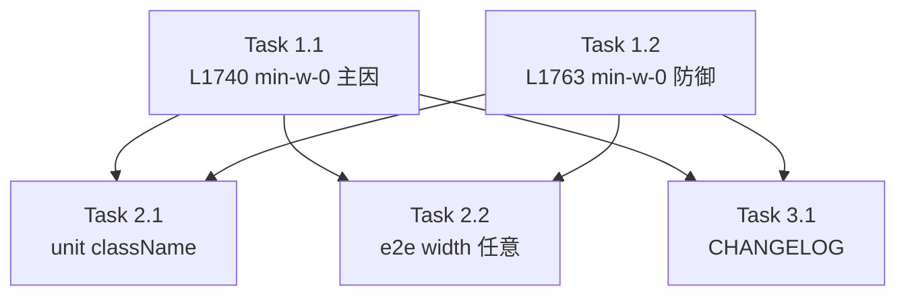

# 作業計画書 — Issue #732

## Issue: fix(layout): missing min-w-0 causes horizontal overflow, hiding FilePanel off-screen (#730 follow-up)
- **Issue番号**: #732
- **サイズ**: S（CSS className 2箇所追記のみ）
- **優先度**: High（FilePanel が画面外で実質利用不可の機能退行）
- **依存Issue**: #730（本不具合を導入）、#727（Activity Bar 基盤）
- **設計方針書**: `dev-reports/design/issue-732-min-w-0-overflow-fix-design-policy.md`

---

## 詳細タスク分解

### Phase 1: 実装

- [ ] **Task 1.1**: `WorktreeDetailRefactored.tsx:1740` の `
` に `min-w-0` を追記（**主因**）
  - 成果物: `src/components/worktree/WorktreeDetailRefactored.tsx`
  - 結果: `flex flex-col flex-1 min-h-0 min-w-0`
  - コメント付与（DR1-001）: 主因である旨を簡潔に注記
  - 依存: なし

- [ ] **Task 1.2**: `WorktreeDetailRefactored.tsx:1763` の `
` に `min-w-0` を追記（**防御的補強**）
  - 成果物: `src/components/worktree/WorktreeDetailRefactored.tsx`
  - 結果: `flex-1 min-h-0 min-w-0`
  - コメント付与（DR1-001）: 防御的補強である旨を簡潔に注記
  - **注意**: モバイル経路の `flex-1 min-h-0`（~L1590）は編集しない
  - 依存: なし

### Phase 2: テスト（TDD: Red → Green）

- [ ] **Task 2.1**: unit テスト — 対象 2 コンテナの className に `min-w-0` が含まれることをアサート
  - 成果物: `tests/unit/components/WorktreeDetailRefactored.test.tsx`（または新規 layout 専用テスト）
  - 注意: 既存テストは `WorktreeDesktopLayout`/`TerminalContainer` をモックしているため、対象 div を実 DOM に描画してクラスを検証できる構成を選ぶ。jsdom は幅を計算しないため className レベルの回帰防止に留める。
  - 依存: Task 1.1, 1.2

- [ ] **Task 2.2（任意・推奨）**: e2e（Playwright）— Files→ファイルクリックで `file-panel-pane.getBoundingClientRect().right <= window.innerWidth`、`desktop-layout` 幅 ≤ viewport、History 表示/非表示・ActivityPane 幅変更でも成立
  - 成果物: `tests/e2e/*.spec.ts`
  - 依存: Task 1.1, 1.2

### Phase 3: ドキュメント

- [ ] **Task 3.1**: `CHANGELOG.md` [Unreleased] にバグ修正を記載
  - 成果物: `CHANGELOG.md`
  - 依存: Task 1.x

---

## タスク依存関係

---

## 品質チェック項目

| チェック項目 | コマンド | 基準 |
|-------------|----------|------|
| ESLint | `npm run lint` | エラー0件 |
| TypeScript | `npx tsc --noEmit` | 型エラー0件 |
| Unit Test | `npm run test:unit` | 全テストパス |
| Build | `npm run build` | 成功 |

---

## Definition of Done

- [ ] L1740/L1763 に `min-w-0` 追記済み（コメント付き）
- [ ] モバイル経路（~L1590）未変更
- [ ] unit テストで className 回帰防止アサート追加・PASS
- [ ] lint / tsc / test:unit / build 全PASS
- [ ] CHANGELOG 更新
- [ ] （任意）e2e で viewport 内表示を検証
- [ ] PC 1920px で Files→ファイルクリックで FilePanel が viewport 内に表示される（受入条件）

---

## 次のアクション

1. **ブランチ**: `feature/732-worktree`（既存・現在のブランチ）
2. **実装**: `/pm-auto-dev 732`（TDD: Red-Green-Refactor）
3. **PR作成**: `/create-pr`
