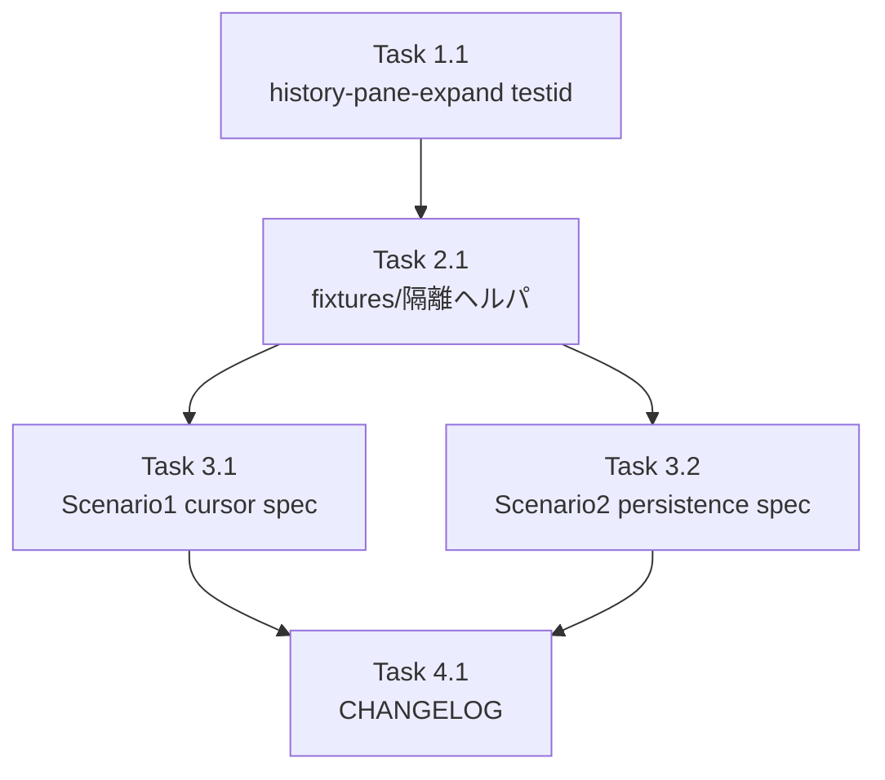

# Issue #735 作業計画書

## Issue: test(e2e): add Playwright e2e for PaneResizer 複数インスタンス並列 + cross-worktree persistence (#728 R3-008)

**Issue番号**: #735
**サイズ**: M
**優先度**: Medium
**依存Issue**: #728（実装済み・親）
**ブランチ**: `feature/735-worktree`（作成済み）

---

## 0. 確定した方針判断（work-plan で決定）

### CI 統合方針: **方針 B（CI 統合は本 Issue スコープ外）** を採用

**根拠**:
1. worktree 詳細画面（`/worktrees/[id]`）は tmux/Claude CLI セッション・実 git スキャン・共有 db.sqlite に強く依存し、GitHub Actions（tmux/CLI 不在）で安定動作させるには多数 API ルートのモックが必要。autonomous 実装で GH Actions を確実に緑化するまでの反復コスト・flaky リスクが高い。
2. 本 Issue の**核心価値は「AC-27 を機械検証する e2e spec 群そのもの」**であり、CI 配線は付随的。Issue 本文（方針 B）でもスコープ外化が明示的に許容されている。
3. ただし新規 spec は **API モック（`page.route`）/ chromium self-skip / localStorage 隔離**で記述し、**CI-ready な構造**にしておく。CI 配線は別 Issue で低コストに追加可能とする。

**受入条件の確定形**: 「**ローカル e2e（chromium）で2シナリオが PASS**」＋「lint/tsc/test:unit/build 全 PASS」。`.github/workflows/*.yml`・`package.json` の CI 配線は**無変更**。

> この方針は Issue 本文「CI 統合方針 → 方針 B」に対応。実装後、進捗報告に CI 配線が follow-up である旨を明記する。

---

## 1. タスク分解

### Phase 1: プロダクションコード（最小・additive）

- [ ] **Task 1.1**: `history-pane-expand` testid 追加
  - 成果物: `src/components/worktree/TerminalContainer.tsx`
  - 内容: History 展開ボタン（**L56 付近の内部 `<button>`**, `aria-label="Expand history panel"`）に `data-testid="history-pane-expand"` を付与。ラッパ div（`terminal-container-expand-bar`）ではなくボタン本体へ。
  - 純 additive（DOM 属性1つ）。props/`React.memo`/ランタイム挙動不変。
  - 依存: なし

### Phase 2: テストフィクスチャ／隔離ヘルパ

- [ ] **Task 2.1**: e2e フィクスチャ・ヘルパ作成
  - 成果物: `tests/e2e/fixtures/terminal-split-helpers.ts`（または同等）
  - 内容:
    - **API モックヘルパ**: `page.route('**/api/worktrees/**', ...)` 等で worktree 詳細画面を **DB/git/セッション非依存**で描画させる。worktree 詳細ページのレンダリングに必要な最小 API レスポンス（worktree メタ、current-output 等）を mock。
    - **localStorage 隔離ヘルパ**: `page.addInitScript` で `commandmate:terminalSplits:*` と split-width 永続化キーをクリアし、**既知初期状態（split=1）**から開始。
    - 一意 worktreeId 定数（`e2e-split-a` / `e2e-split-b`）。
  - 依存: Task 1.1（testid を使う場合）
  - ⚠ **リスク**: worktree 詳細ページの描画に必要な API 群の特定がこのタスクの肝。実装時に `npm run dev` で実画面を開き、Network タブ / 既存 `worktree-detail.spec.ts` を参照して必要 route を洗い出す。

### Phase 3: e2e spec 実装

- [ ] **Task 3.1**: Scenario 1 — PaneResizer cursor 非残留
  - 成果物: `tests/e2e/terminal-split-resizer-cursor.spec.ts`
  - 内容:
    - 冒頭 `test.skip(({}, testInfo) => testInfo.project.name !== 'chromium', 'PC-only UI')`
    - `test.use({ viewport: { width: 1920, height: 1080 } })`（global は触らない）
    - `beforeEach` で localStorage 隔離＋API モック適用
    - Files activity 有効化（`activity-bar-button-files`）→ `add-terminal-split` ×2（split=3）
    - resizer 並存確認（split間 `split-resizer-0/1` の存在 + History/ActivityPane resizer）
    - `split-resizer-0` を `dragTo` → `document.body.style.cursor` が `'col-resize'` でないこと（空文字を期待 / `not.toBe('col-resize')`）
  - 依存: Task 1.1, 2.1

- [ ] **Task 3.2**: Scenario 2 — cross-worktree localStorage 分離
  - 成果物: `tests/e2e/terminal-split-cross-worktree-persistence.spec.ts`
  - 内容:
    - chromium self-skip + viewport + 隔離 beforeEach + API モック（A/B 両 worktree）
    - A: `add-terminal-split` ×2 → `terminal-split-pane-*` 3件
    - B 切替: 1件（default）→ `add-terminal-split` → 2件
    - A 復帰: 3件（B の影響を受けない）
    - B 復帰: 2件
  - 依存: Task 2.1
  - 注: Task 3.1 と統合 spec にしてもよい（Issue 受入条件で許容）。ただし isolation のため別ファイル推奨。

### Phase 4: ドキュメント

- [ ] **Task 4.1**: CHANGELOG 更新
  - 成果物: `CHANGELOG.md`
  - 内容: `[Unreleased]` に `test(e2e): AC-27 自動化（PaneResizer cursor 非残留 / cross-worktree 永続化）+ history-pane-expand testid 追加` を Added/Test として記載
  - 依存: Phase 1-3 完了後

- [ ] **Task 4.2**（任意）: `docs/implementation-history.md` に本 Issue 追記
  - 任意。module-reference への testid 追記は不要（テスト用 testid のため）。

---

## 2. タスク依存関係

---

## 3. 品質チェック項目

| チェック項目 | コマンド | 基準 |
|-------------|----------|------|
| ESLint | `npm run lint` | エラー0件 |
| TypeScript | `npx tsc --noEmit` | 型エラー0件 |
| Unit Test | `npm run test:unit` | 全テストパス（回帰なし） |
| Build | `npm run build` | 成功 |
| **E2E（本 Issue 核心）** | `npm run test:e2e -- terminal-split` | Scenario 1/2 が chromium で PASS |

> E2E は Playwright が `webServer: npm run dev` を自動起動（`reuseExistingServer: !CI`）。ローカルで dev サーバ起動済みなら再利用。

---

## 4. 成果物チェックリスト

#### コード（プロダクション）
- [ ] `TerminalContainer.tsx` に `data-testid="history-pane-expand"`（additive）

#### テスト
- [ ] `tests/e2e/fixtures/terminal-split-helpers.ts`（API モック＋localStorage 隔離）
- [ ] `tests/e2e/terminal-split-resizer-cursor.spec.ts`（Scenario 1）
- [ ] `tests/e2e/terminal-split-cross-worktree-persistence.spec.ts`（Scenario 2）

#### ドキュメント
- [ ] `CHANGELOG.md`

---

## 5. Definition of Done

- [ ] 全タスク完了
- [ ] Scenario 1（cursor 非残留）/ Scenario 2（cross-worktree 分離）が chromium でローカル PASS
- [ ] 既存 e2e spec への汚染なし（一意 worktreeId + localStorage 隔離で担保）
- [ ] `playwright.config.ts` の projects/global 設定は無変更
- [ ] CI（lint/type-check/test:unit/build）全パス
- [ ] CHANGELOG 更新完了
- [ ] CI への e2e 統合は follow-up（進捗報告に明記）

---

## 6. リスクと対策

| リスク | 影響 | 対策 |
|--------|------|------|
| worktree 詳細ページの API モックが複雑で画面が描画されない | Scenario が組めない | 実装時に `npm run dev` で実画面の Network を確認し必要 route を特定。最小モックで段階的に組む。最悪、seed DB + `workers:1` 方式にフォールバック |
| `dragTo` の座標計算で cursor 検証が安定しない | Scenario 1 flaky | `not.toBe('col-resize')`（空文字期待）で緩く検証。drag は mousedown→move→mouseup を明示する手動操作にフォールバック可 |
| e2e がローカルで dev サーバ依存により遅い/タイムアウト | 検証時間超過 | chromium 単独・spec 単位実行。`reuseExistingServer` で dev 再利用 |
| split UI が viewport 幅不足で出ない | resizer 描画されず | `test.use({ viewport: 1920x1080 })` を明示 |

---

## 7. 次のアクション

1. **Task 実行**: `/pm-auto-dev 735`（TDD 実装。本 Issue は e2e 中心のため、spec を「失敗する状態（Red）」→ testid 追加・fixtures 整備で「PASS（Green）」へ）
2. **進捗報告**: `/progress-report`
3. **PR作成**: `/create-pr`（方針 B＝CI 配線なしを明記、follow-up Issue を提案）
