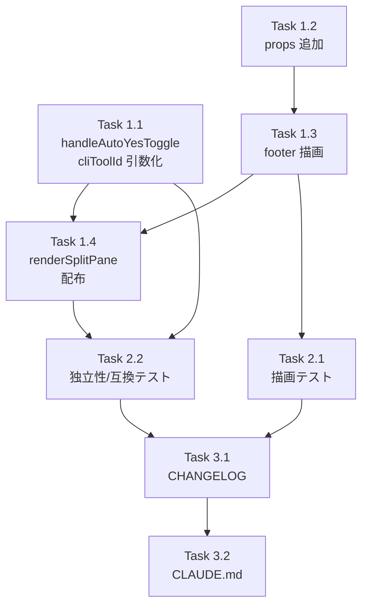

# Issue #740 作業計画書

## Issue: fix(terminal): missing AutoYesToggle in PC per-split footer breaks per-Agent Auto-Yes selection (#728 follow-up)

**Issue番号**: #740
**サイズ**: S〜M（局所的なUI配線修正 + ハンドラのパラメータ化）
**優先度**: Medium（機能欠落バグ、Mobile では回避可能）
**依存Issue**: #728（由来）/ #525（per-agent Map）/ #501（サーバー側 poller）
**ラベル**: bug, enhancement
**ブランチ**: `feature/740-worktree`（作業中）

---

## ゴール

PC版の各ターミナル split footer に `AutoYesToggle` を追加し、**CLI 単位で独立した Auto-Yes ON/OFF 操作**を可能にする。状態は親 (`WorktreeDetailRefactored`) の per-CLI Map `autoYesStateMap` を単一の真実源とし、各 split へ props で配布する。Mobile 経路と split0→activeCliTab 同期は後方互換を維持。

> ⚠ Issue review（Phase 1）で確定した重要事項: `useAutoYes` は enabled/expiresAt/toggle を返さない（戻り値 `{lastAutoResponse}` のみ）。**split 内で `useAutoYes` を新規に呼ばない**。client-side auto-response は per-split 化しない（#501 サーバー poller に委譲）。

---

## 詳細タスク分解

### Phase 1: 実装

- [ ] **Task 1.1: `handleAutoYesToggle` の cliToolId パラメータ化**
  - ファイル: `src/components/worktree/WorktreeDetailRefactored.tsx`（L810-835）
  - 内容: 対象 CLI を引数で受ける形へ変更。**カリー化** `makeAutoYesToggleHandler(cliToolId) => (params) => Promise<void>` を推奨（AutoYesToggle の `onToggle: (params) => Promise<void>` シグネチャと互換のため）。API body の `cliToolId` と `setAutoYesStateMap` の `next.set(<cliToolId>, ...)` を引数値に。`prevAutoYesEnabledRef` の更新は activeCliTab 分のみ（既存挙動）に限定するか、影響を検討。
  - Mobile 互換: `handleAutoYesToggle`（既存名・activeCliTab 既定）を `makeAutoYesToggleHandler(activeCliTab)` の薄いラッパとして残し、L1900 の Mobile 呼び出しを無改修で維持。
  - 依存: なし

- [ ] **Task 1.2: `TerminalSplitPaneContent` に props 追加**
  - ファイル: `src/components/worktree/TerminalSplitPaneContent.tsx`
  - 内容: `TerminalSplitPaneContentProps` に `autoYesExpiresAt?: number | null` / `lastAutoResponse?: string | null` / `onAutoYesToggle: (params: AutoYesToggleParams) => Promise<void>` を追加（`autoYesEnabled` は既存）。props JSDoc（L56-59 の "globally keyed by activeCliTab" 説明）を per-CLI トグル対応へ更新。
  - 依存: なし（Task 1.1 と並行可）

- [ ] **Task 1.3: `AutoYesToggle` を footer に描画**
  - ファイル: `src/components/worktree/TerminalSplitPaneContent.tsx`（`footerSlot`, L161-213）
  - 内容: `footerSlot` の `
` 先頭に `<AutoYesToggle enabled={autoYesEnabled} expiresAt={autoYesExpiresAt ?? null} onToggle={onAutoYesToggle} lastAutoResponse={lastAutoResponse ?? null} cliToolName={cliToolId} />` を追加。`useMemo` 依存配列に `autoYesEnabled, autoYesExpiresAt, onAutoYesToggle, lastAutoResponse` を追加。`import { AutoYesToggle, type AutoYesToggleParams }` 追加。
  - 依存: Task 1.2

- [ ] **Task 1.4: `renderSplitPane` で per-split 配布**
  - ファイル: `src/components/worktree/WorktreeDetailRefactored.tsx`（`renderSplitPane`, L1432-1479）
  - 内容: `paneAutoYesEnabled` に加え `paneAutoYesExpiresAt = autoYesStateMap.get(paneCli)?.expiresAt ?? null` を算出。`TerminalSplitPaneContent` に `autoYesExpiresAt={paneAutoYesExpiresAt}`、`lastAutoResponse={lastAutoResponse}`（親 L1175 の値を流用）、`onAutoYesToggle={makeAutoYesToggleHandler(paneCli)}` を追加。`useCallback` 依存配列に必要な値（`autoYesStateMap`, `lastAutoResponse`, `makeAutoYesToggleHandler`）を追加。`makeAutoYesToggleHandler` は `useCallback` で安定参照にする（split 再レンダリング抑制）。
  - 依存: Task 1.1, Task 1.3

### Phase 2: テスト

- [ ] **Task 2.1: TerminalSplitPaneContent 単体テスト**
  - ファイル: `tests/unit/components/worktree/TerminalSplitPaneContent.test.tsx`（既存・追記）
  - 内容: AutoYesToggle を `vi.mock` で軽量化し、(a) `autoYesEnabled`/`autoYesExpiresAt` props で footer に AutoYesToggle が描画されること、(b) トグル操作で `onAutoYesToggle` が呼ばれること、(c) `cliToolName={cliToolId}` が渡ること、(d) `autoYesEnabled=true` のとき PromptPanel が抑制されること（既存 `showPrompt` 挙動の回帰）を検証。
  - カバレッジ目標: 追加分岐を網羅
  - 依存: Task 1.3

- [ ] **Task 2.2: per-split 独立性 / 後方互換テスト**
  - ファイル: `tests/unit/components/worktree/TerminalSplitPaneContent.test.tsx`（中心）。WorktreeDetailRefactored 結合は重いため、`renderSplitPane` の配布ロジック相当（`autoYesStateMap.get(paneCli)` による per-CLI 解決）または `makeAutoYesToggleHandler(cliToolId)` の cliToolId 束縛を単体検証で代替。
  - 内容: 異なる `cliToolId` を与えた 2 インスタンスで、それぞれの `onAutoYesToggle` が自身の cliToolId スコープで動作することを検証。Mobile 既定経路（activeCliTab）の `handleAutoYesToggle` が壊れないことを確認（可能なら）。
  - 依存: Task 1.1, Task 1.4

### Phase 3: ドキュメント

- [ ] **Task 3.1: CHANGELOG 更新**
  - ファイル: `CHANGELOG.md`
  - 内容: `[Unreleased]` の `Fixed` に「PC版 per-split footer に AutoYesToggle を復活（#728 follow-up）、CLI 単位の独立 Auto-Yes 操作を可能化」を追記。

- [ ] **Task 3.2: CLAUDE.md モジュールリファレンス更新**
  - ファイル: `CLAUDE.md`
  - 内容: `TerminalSplitPaneContent.tsx` / `WorktreeDetailRefactored.tsx` の行に Issue #740 の変更概要を追記。

---

## タスク依存関係

---

## 品質チェック項目

| チェック項目 | コマンド | 基準 |
|-------------|----------|------|
| ESLint | `npm run lint` | エラー0件 |
| TypeScript | `npx tsc --noEmit` | 型エラー0件 |
| Unit Test | `npm run test:unit` | 全テストパス |
| Build | `npm run build` | 成功 |

---

## Definition of Done

- [ ] PC版で各 split footer に AutoYesToggle が表示される
- [ ] A=Claude, B=Codex で B 単独 ON が A に影響しない（cliToolId パラメータ化）
- [ ] Auto-Yes ON 中は対応 split の PromptPanel が非表示（既存挙動維持）
- [ ] Mobile の AutoYesToggle 挙動・split0→activeCliTab 同期が後方互換維持
- [ ] 非アクティブ split のサーバー同期はスコープ外（受入確認のみ）
- [ ] client-side auto-response は per-split 化しない（#501 委譲）
- [ ] 回帰テスト追加（Task 2.1 / 2.2）
- [ ] `npm run lint` / `npx tsc --noEmit` / `npm run test:unit` / `npm run build` 全PASS
- [ ] CHANGELOG.md / CLAUDE.md 更新

---

## リスク・留意点

1. **`makeAutoYesToggleHandler` の参照安定性**: split の不要な再レンダリングを防ぐため `useCallback` で安定化。依存は `worktreeId` のみ（cliToolId は引数）。
2. **`lastAutoResponse` のスコープ**: 親 L1175 の useAutoYes は activeCliTab 単一スコープ。全 split に同じ値を流用する（正確な per-split 通知は本Issueスコープ外）。最小修正として許容。
3. **非アクティブ split のサーバー同期ギャップ**: スコープ外として Issue に明記済み。テストでこの挙動を要求しない。
4. **既存テストの回帰**: `TerminalSplitPaneContent.test.tsx` の既存アサーション（footer 内の NavigationButtons/PromptPanel/MessageInput 描画）が AutoYesToggle 追加で壊れないこと。

---

## 次のアクション

1. **タスク実行**: `/pm-auto-dev 740`（TDD実装）
2. **進捗報告**: pm-auto-dev 内で自動生成
3. **PR作成**: `/create-pr`
