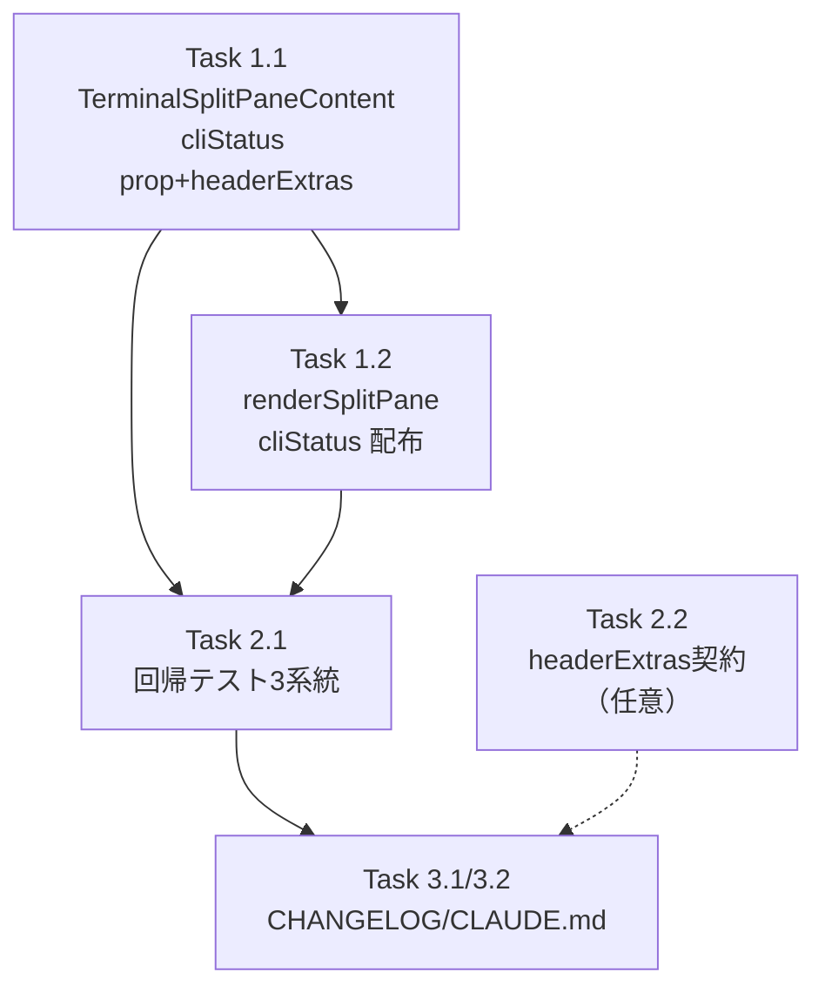

# 作業計画: Issue #743

## Issue: fix(terminal): missing AI agent status indicator in PC per-split header (#728 follow-up)

**Issue番号**: #743
**サイズ**: S（局所的UI修正・既存パターン流用）
**優先度**: Medium（バグ／視認性低下、機能停止ではない）
**依存Issue**: #728（PC 1-3分割、完了済み）／類似パターン #740（AutoYesToggle 移行漏れ、完了済み）
**ラベル**: bug, enhancement

## ゴール

PCターミナルの各 split header に AIエージェント status indicator（dot/スピナー）を復活させる。データは親 `WorktreeDetailRefactored` の `worktree.sessionStatusByCli[paneCli]` を **導出済み `cliStatus: BranchStatus` 文字列**として `TerminalSplitPaneContent` に prop 配布し、`headerExtras` 経由で `TerminalSplitPane` header に描画する（#740 と同型）。Mobile経路は無改修。

## 詳細タスク分解

### Phase 1: 実装

- [ ] **Task 1.1**: `TerminalSplitPaneContent.tsx` に `cliStatus?: BranchStatus` prop 追加（optional・未指定時 `'idle'` フォールバック）
  - 成果物: `src/components/worktree/TerminalSplitPaneContent.tsx`
  - 内容:
    - import 追加: `import { SIDEBAR_STATUS_CONFIG } from '@/config/status-colors';` ／ 型 `import type { BranchStatus } from '@/types/sidebar';`
    - props interface に `cliStatus?: BranchStatus;`（JSDoc付き、#740 の autoYes prop群に倣う）と分割代入のデフォルト `cliStatus = 'idle'`
    - `const statusConfig = SIDEBAR_STATUS_CONFIG[cliStatus];`
    - `statusIndicator` を `useMemo`（依存: `statusConfig.type`, `statusConfig.className`, `statusConfig.label`, `splitIndex`）で生成（Mobile 正準のインラインspan、`data-testid={split-status-indicator-${splitIndex}}`、`title` のみ）
    - return の `<TerminalSplitPane>` に `headerExtras={statusIndicator}` を配線
  - 依存: なし

- [ ] **Task 1.2**: `WorktreeDetailRefactored.tsx` の `renderSplitPane` で `cliStatus` を導出して配布
  - 成果物: `src/components/worktree/WorktreeDetailRefactored.tsx`
  - 内容:
    - `renderSplitPane`（L1459-1517）内で `const paneCliStatus = deriveCliStatus(worktree?.sessionStatusByCli?.[paneCli]);`（`deriveCliStatus` は Mobile経路 L99 で import 済み→追加不要）
    - `<TerminalSplitPaneContent ... cliStatus={paneCliStatus} />` を追加
    - **`useCallback` 依存配列に `worktree` 全体は入れない**。`worktree?.sessionStatusByCli` を参照するため依存に追加が必要だが、毎ポーリング再生成の影響は「子に渡すのが導出済み文字列のみ」であるため許容（再生成しても子の memo は status 不変なら破られない）。依存設計は S3-001 の趣旨（無駄 render 回避）を満たすことを実装時に確認
    - **Mobile経路 L1947-1974 は変更しない**
  - 依存: Task 1.1

### Phase 2: テスト

- [ ] **Task 2.1**: `TerminalSplitPaneContent.test.tsx` に回帰テスト追加（3系統）
  - 成果物: `tests/unit/components/worktree/TerminalSplitPaneContent.test.tsx`
  - 系統:
    1. 状態別描画: `cliStatus` 各値（idle/ready/waiting → dot、running/generating → spinner）で `data-testid=split-status-indicator-${splitIndex}` の className/構造を assert
    2. prop 未指定フォールバック: `cliStatus` 未指定で idle（グレー dot）描画。既存8ケースを無改修温存
    3. per-split 独立: splitA=running（青スピナー）/ splitB=idle（グレー dot）が独立描画
  - 依存: Task 1.1
  - カバレッジ目標: 新規分岐を網羅

- [ ] **Task 2.2** (任意): `TerminalSplitPane.test.tsx` に `headerExtras` 描画契約の additive ケース（変更最小）
  - 成果物: `tests/unit/components/worktree/TerminalSplitPane.test.tsx`
  - 依存: なし（TerminalSplitPane 自体は無改修）

### Phase 3: ドキュメント

- [ ] **Task 3.1**: `CHANGELOG.md` [Unreleased] Fixed に追記
  - 成果物: `CHANGELOG.md`
- [ ] **Task 3.2**: `CLAUDE.md` モジュールリファレンス更新（TerminalSplitPaneContent / WorktreeDetailRefactored の #743 注記）
  - 成果物: `CLAUDE.md`

## タスク依存関係

## 品質チェック項目

| チェック項目 | コマンド | 基準 |
|-------------|----------|------|
| ESLint | `npm run lint` | エラー0件 |
| TypeScript | `npx tsc --noEmit` | 型エラー0件 |
| Unit Test | `npm run test:unit` | 全テストパス |
| Build | `npm run build` | 成功 |

## Definition of Done

- [ ] 全タスク完了
- [ ] 受入条件（Issue本文）を全て満たす
- [ ] 新prop `cliStatus` は optional・idle フォールバックで既存テスト無改修温存
- [ ] Mobile経路（L1947-1974）無改修
- [ ] memo-safe（status 不変ポーリング周期で無駄 render しない）
- [ ] CIチェック全パス（lint, tsc, test:unit, build）
- [ ] CHANGELOG / CLAUDE.md 更新

## 実装上の注意（レビュー反映済み）

- **import パス**: `deriveCliStatus` は `@/types/sidebar`、`SIDEBAR_STATUS_CONFIG` は `@/config/status-colors`（`status-config.ts` は存在しない）
- **status値**: `'idle' | 'ready' | 'running' | 'waiting' | 'generating'`（`'processing'` は無い）。spinner判定は `statusConfig.type === 'spinner'`
- **フィールド名**: `statusConfig.className`（`colorClass` は無い）
- **存在しない**: `useWorktreeStatusByCli` hook / `<Spinner/>` component は使わない（インラインspan）
- **a11y**: Mobile正準に合わせ `title` のみ（aria-label 二重読み上げ回避）

## 次のアクション

1. **ブランチ**: `feature/743-worktree`（既にチェックアウト済み）
2. **実装**: `/pm-auto-dev 743`（TDD）
3. **PR作成**: `/create-pr`
