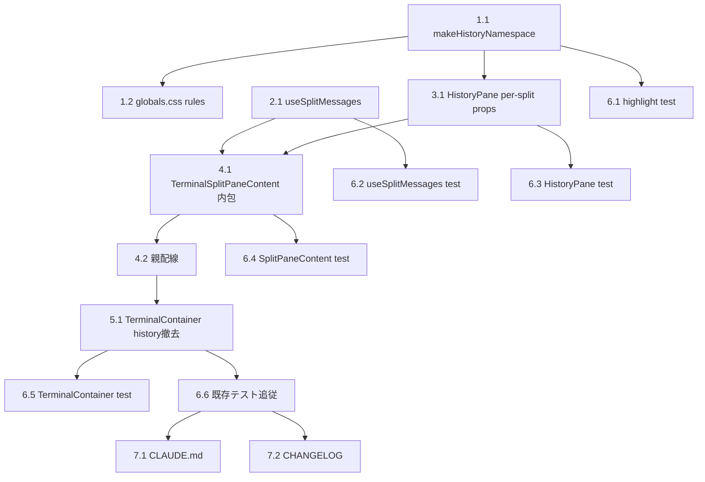

# Issue #744 作業計画書

## Issue: feat(terminal): move HistoryPane into each split with per-cliToolId message filtering (#728 follow-up)

**Issue番号**: #744
**サイズ**: M（UI再構成＋新規フック＋ハイライト名前空間 per-split 化）
**優先度**: Medium
**種別**: 機能追加（PC専用UI、#728/#736/#740/#743 follow-up シリーズ）
**依存Issue**: #728（PC 1-3 split）、#716（History検索）、#725（User onlyフィルタ）、#701（表示件数）
**対象ブランチ**: `feature/744-worktree`（既存）

---

## 設計サマリー（Issueレビュー反映後の確定方針）

`HistoryPane` を各 PC ターミナル split 内に内包し、その split の `cliToolId` のメッセージのみ表示する。

**確定した重要設計判断（Issueレビュー由来）**:

1. **per-split 独立 fetch（S1-001/002 Must Fix）**: `state.messages` は `fetchMessages` が `?cliTool=<activeCliTab>` でサーバ側フィルタ済みのため activeCliTab 1種類しか保持しない。各 split が自分の `cliToolId` でメッセージを独立取得する新フック `useSplitMessages({ worktreeId, cliToolId, limit, includeArchived })` を新設（`/api/worktrees/[id]/messages?cliTool=<paneCli>` を fetch、API/DB は既存対応）。`useTerminalPanePolling` と同型（requestId stale-guard ＋ visibilitychange pause）。

2. **検索ハイライト名前空間の per-split 分離（S3-001 Must Fix）**: `HISTORY_SEARCH_NAMESPACE` は全split共有のグローバル定数（CSS Custom Highlight 名 `history-search` ＋ fallback overlay id 単一）。複数 HistoryPane 同時 mount で `CSS.highlights.set('history-search', ...)` が互いを上書きし、ハイライトを消し合う correctness バグ。`makeHistoryNamespace(splitIndex)` ファクトリで `history-search-${splitIndex}` 等に per-instance 化。`::highlight()` は静的 CSS 定義が必要なため `globals.css` に split 0-2 分の rule を追加（MAX_SPLITS=3）。`[data-message-id]` セレクタは scrollContainerRef scoped で衝突なし＝変更不要。

3. **状態の所有（S1-004/S3-004）**: 検索 #716 は各 HistoryPane 内部 state＝自然に per-split。User only #725 / 表示件数 #701 / showArchived #168 は **全split共通**（各 split の fetch クエリへ共通値を渡す）。MVP では共通挙動。

4. **History 幅・折りたたみ（S3-004）**: split 内 history 幅は各 split の内側領域に対する相対値。グローバル `useHistoryPaneState` の width 意味は流用しない。MVP は全split連動の visible/折りたたみで可（Issue記載通り、ドキュメント化）。

5. **挿入ルーティング（S3-005）**: split 内 `onInsertToMessage` はその split の splitIndex 直指定で `pendingInsertTextMap.set(splitIndex, text)` へ。`focusedSplitIndex` 間接参照は使わない。

6. **mobile 非影響（S3-006）**: mobile は `state.messages` を継続使用、`useHistoryPaneState`/`HISTORY_PANE_ID`/expand bar に未接続。全変更は **additive**（`cliToolId` optional、namespace optional）で mobile の HistoryPane 呼び出しを無改修維持。

---

## 詳細タスク分解

### Phase 1: ハイライト名前空間の per-split 化（基盤・Must Fix S3-001）

- [ ] **Task 1.1**: `src/lib/terminal-highlight.ts` に `makeHistoryNamespace(splitIndex: number): HighlightNamespace` ファクトリを追加
  - `highlightName: 'history-search-' + splitIndex`、`currentHighlightName: 'history-search-current-' + splitIndex`、`fallbackOverlayId: 'history-search-fallback-overlay-' + splitIndex`、`fallbackOverlayBgColor` は既存blue流用
  - 既存 `HISTORY_SEARCH_NAMESPACE` / `applyHistoryHighlights` / `clearHistoryHighlights` は **シグネチャ維持**（後方互換）。新たに `namespace` 引数を受ける overload もしくは `applyHistoryHighlights(container, matches, idx, namespace?)` の optional 引数追加（default=HISTORY_SEARCH_NAMESPACE）で additive 化
  - 成果物: `src/lib/terminal-highlight.ts`
  - 依存: なし

- [ ] **Task 1.2**: `src/app/globals.css` に split 0-2 分の `::highlight()` rule を追加
  - `::highlight(history-search-0|1|2)` と `::highlight(history-search-current-0|1|2)`（既存 `history-search` の color/style を踏襲）
  - 既存 `::highlight(history-search)` は mobile fallback 用に残置
  - 成果物: `src/app/globals.css`
  - 依存: Task 1.1（命名規則整合）

### Phase 2: per-split メッセージ取得フック（Must Fix S1-001）

- [ ] **Task 2.1**: `src/hooks/useSplitMessages.ts` を新設
  - シグネチャ: `useSplitMessages({ worktreeId, cliToolId, limit, includeArchived, enabled }): { messages: ChatMessage[]; isLoading: boolean; refresh: () => void }`
  - `/api/worktrees/[id]/messages?cliTool=<cliToolId>&limit=<limit>&includeArchived=<bool>` を fetch、`parseMessageTimestamps` 適用
  - `useTerminalPanePolling` 同型: `requestId` ＋ `inFlightRef` で stale 応答破棄、`document.visibilityState==='hidden'` で polling 停止、IDLE 寄り cadence（既存 message poll 間隔に準拠）、`refresh()` 手動再取得
  - 成果物: `src/hooks/useSplitMessages.ts`
  - 依存: Task なし（API は既存）

### Phase 3: HistoryPane の cliToolId 対応（Must Fix S1-002 / Nice S1-008）

- [ ] **Task 3.1**: `src/components/worktree/HistoryPane.tsx` に per-split 対応 props を additive 追加
  - `splitIndex?: number`（未指定時は従来の単一 namespace 動作）→ 内部の検索ハイライトで `makeHistoryNamespace(splitIndex)` を使用（指定時のみ）
  - `cliToolId?: CLIToolType`（メタ情報・将来用、フィルタは呼び出し側 fetch で実施済みのため HistoryPane 内のクライアントフィルタは不要。S1-008 方針：fetch クエリで絞るため client filter は持たない）
  - `HISTORY_PANE_ID` を DOM `id` に使っている場合は per-split で重複しないよう suffix 付与 or 当該 split では未使用に（S3-007）
  - **後方互換厳守**: 既存 props・既存テストの動作不変（splitIndex/cliToolId 未指定で従来通り）
  - 成果物: `src/components/worktree/HistoryPane.tsx`
  - 依存: Task 1.1

### Phase 4: TerminalSplitPaneContent への内包（Must Fix S1-002）

- [ ] **Task 4.1**: `src/components/worktree/TerminalSplitPaneContent.tsx` の `terminal` slot を `[History | PaneResizer | TerminalDisplay]` 横並びに再構成
  - `useSplitMessages({ worktreeId, cliToolId, limit, includeArchived })` を駆動し HistoryPane に渡す
  - HistoryPane に `splitIndex`・`cliToolId`・`messages`・既存表示系 props（historyUserOnly/historyDisplayLimit/showArchived 等は親から共通値で伝播）を配布
  - split 内 history の visible/width は MVP では `useHistoryPaneState`（共通）参照で可。width はラッパ div で split 内相対に適用（グローバル width 意味は流用しない）
  - `onInsertToMessage` を splitIndex 直指定ルーティングで親へ伝播（S3-005）
  - メッセージ送信後はその split の `useSplitMessages.refresh()` を呼ぶ（S1-006：activeCliTab 限定の親 refresh に依存しない）
  - 成果物: `src/components/worktree/TerminalSplitPaneContent.tsx`
  - 依存: Task 2.1, Task 3.1

- [ ] **Task 4.2**: 親側配線（`src/components/worktree/WorktreeDetailRefactored.tsx`）
  - `renderSplitPane` から各 split に historyUserOnly/historyDisplayLimit/showArchived の共通値、`onInsertToMessage`（splitIndex ルーティング）、`onMessageSent` 連携を配布
  - 既存の `pendingInsertTextMap` / `focusedSplitIndex` 機構を流用（#728）
  - Mobile 経路（L1947-1974 周辺）は **無改修**
  - 成果物: `src/components/worktree/WorktreeDetailRefactored.tsx`
  - 依存: Task 4.1

### Phase 5: TerminalContainer から History 撤去（S1-005 / S3-007）

- [ ] **Task 5.1**: `src/components/worktree/TerminalContainer.tsx` の `history` prop / `useHistoryPaneState` / `HISTORY_PANE_ID` / expand bar の扱いを確定
  - PC では History が各 split に移るため、TerminalContainer の history slot を撤去 or 単純化
  - `data-testid="history-pane-expand"`（#735 e2e）の扱いを決定（撤去 or split 側へ移設）— e2e 影響を明記
  - `WorktreeDetailRefactored.tsx` の `historyPaneMemo` → TerminalContainer 渡しを削除
  - 成果物: `src/components/worktree/TerminalContainer.tsx`, `WorktreeDetailRefactored.tsx`
  - 依存: Task 4.2

### Phase 6: テスト（TDD: 各 Phase で Red-Green）

- [ ] **Task 6.1**: `tests/unit/lib/terminal-highlight.test.ts` に namespace 分離テスト追加
  - `makeHistoryNamespace(0)` と `(1)` が異なる highlightName/overlayId を返す
  - split 0 のハイライト適用が split 1 のハイライトを消さない（mock CSS.highlights）
  - 既存 `HISTORY_SEARCH_NAMESPACE` 動作不変
- [ ] **Task 6.2**: `tests/unit/hooks/useSplitMessages.test.ts` 新規
  - cliToolId 別 fetch URL 検証、stale-guard（requestId）、visibilitychange pause、refresh 動作
- [ ] **Task 6.3**: `tests/unit/components/HistoryPane.test.tsx` 拡張
  - splitIndex 指定時に per-split namespace を使用、未指定時は従来動作（後方互換）
- [ ] **Task 6.4**: `tests/unit/components/worktree/TerminalSplitPaneContent.test.tsx` 拡張
  - split 内に HistoryPane が描画される、cliToolId が useSplitMessages に渡る、onInsertToMessage が splitIndex 経由でルーティング
- [ ] **Task 6.5**: `tests/unit/components/worktree/TerminalContainer.test.tsx` 更新
  - history prop 撤去後の描画（PC では history slot 無し）
- [ ] **Task 6.6**: 既存テスト追従修正
  - `tests/unit/components/worktree/WorktreeDetailRefactored*.test.tsx`（cli-tab-switching 含む）、`WorktreeDesktopLayout.test.tsx` を新構造に追従

### Phase 7: ドキュメント

- [ ] **Task 7.1**: `CLAUDE.md` モジュールリファレンス更新（HistoryPane/TerminalSplitPaneContent/TerminalContainer/terminal-highlight/useSplitMessages の #744 注記）
- [ ] **Task 7.2**: `CHANGELOG.md` [Unreleased] に Added/Changed 記載

---

## タスク依存関係

**実装順序**: Phase 1（基盤）→ Phase 2（フック）→ Phase 3（HistoryPane）→ Phase 4（内包・配線）→ Phase 5（撤去）→ Phase 6（テスト・各Phaseで並走）→ Phase 7（ドキュメント）

---

## 想定影響ファイル一覧

### 新規
| ファイル | 内容 |
|----------|------|
| `src/hooks/useSplitMessages.ts` | per-split メッセージ取得フック |
| `tests/unit/hooks/useSplitMessages.test.ts` | 同テスト |

### 変更
| ファイル | 変更内容 |
|----------|----------|
| `src/lib/terminal-highlight.ts` | `makeHistoryNamespace(splitIndex)` 追加、applyHistoryHighlights/clear に optional namespace |
| `src/app/globals.css` | `::highlight(history-search-0..2 / -current-0..2)` rule 追加 |
| `src/components/worktree/HistoryPane.tsx` | `splitIndex?`/`cliToolId?` props 追加、per-split namespace 使用 |
| `src/components/worktree/TerminalSplitPaneContent.tsx` | terminal slot を [History|Terminal] 化、useSplitMessages 駆動 |
| `src/components/worktree/WorktreeDetailRefactored.tsx` | renderSplitPane 配線、historyPaneMemo→TerminalContainer 撤去 |
| `src/components/worktree/TerminalContainer.tsx` | history prop / expand bar 撤去・簡素化 |
| `tests/unit/lib/terminal-highlight.test.ts` | namespace 分離テスト |
| `tests/unit/components/HistoryPane.test.tsx` | per-split namespace テスト |
| `tests/unit/components/worktree/TerminalSplitPaneContent.test.tsx` | per-split History 描画テスト |
| `tests/unit/components/worktree/TerminalContainer.test.tsx` | history 撤去追従 |
| `tests/unit/components/worktree/WorktreeDetailRefactored*.test.tsx` | 構造追従 |
| `tests/unit/components/worktree/WorktreeDesktopLayout.test.tsx` | 構造追従 |
| `CLAUDE.md` / `CHANGELOG.md` | ドキュメント |

### 影響注意（非変更だが要確認）
- `src/components/worktree/TerminalSplitPane.tsx`（headerExtras/terminal/footer slot — terminal slot に History 同居）
- e2e: `data-testid="history-pane-expand"`（#735）参照箇所 — Task 5.1 で扱い決定

---

## 品質チェック項目

| チェック項目 | コマンド | 基準 |
|-------------|----------|------|
| ESLint | `npm run lint` | エラー0件 |
| TypeScript | `npx tsc --noEmit` | 型エラー0件 |
| Unit Test | `npm run test:unit` | 全テストパス |
| Build | `npm run build` | 成功 |

---

## Definition of Done

- [ ] PC版で 1-3 split に分割時、各 split に独立した HistoryPane が表示される
- [ ] A=Claude / B=Codex で各 History が各 CLI のメッセージのみ（**同時**）表示（per-split fetch で実現）
- [ ] A=Claude / B=Claude で両方とも Claude のメッセージ
- [ ] 2 split 同時検索で互いのハイライトを消さない（namespace 分離）
- [ ] 検索 #716 / User only #725 / 表示件数 #701 が per-split で動作
- [ ] worktree 切替後も各 CLI の History が正しく表示
- [ ] モバイル版の History 挙動は変更なし（無改修）
- [ ] 既存テスト全PASS（HistoryPane の splitIndex/cliToolId 未指定時は従来動作）
- [ ] 新規テスト追加（per-split filtering / namespace 分離 / useSplitMessages）
- [ ] `npm run lint` / `npx tsc --noEmit` / `npm run test:unit` / `npm run build` 全PASS
- [ ] CLAUDE.md / CHANGELOG.md 更新

---

## 次のアクション

1. `/pm-auto-dev 744` で TDD 実装（Red-Green-Refactor）
2. `/create-pr` で PR 作成（feature/744-worktree → develop）
