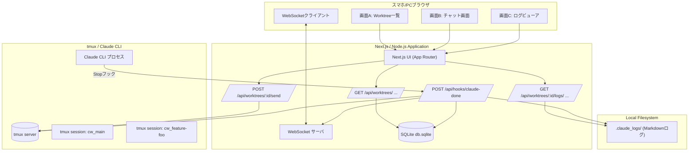
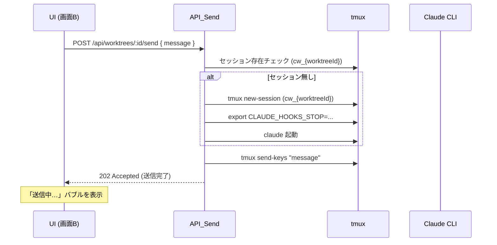
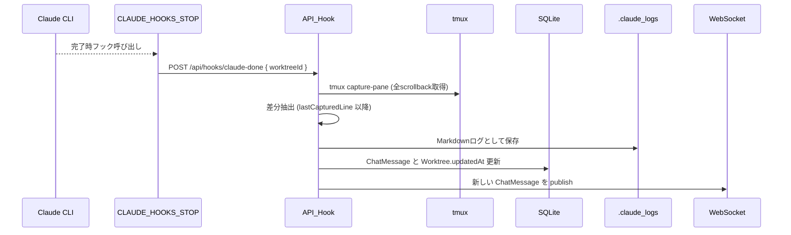
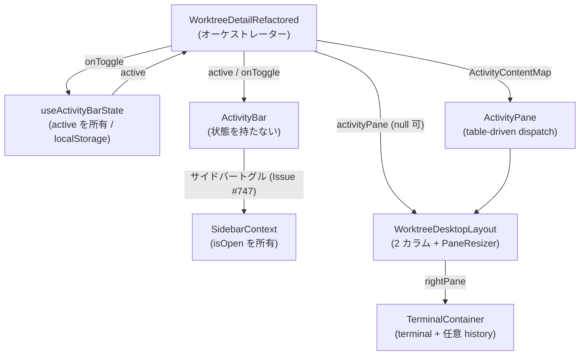
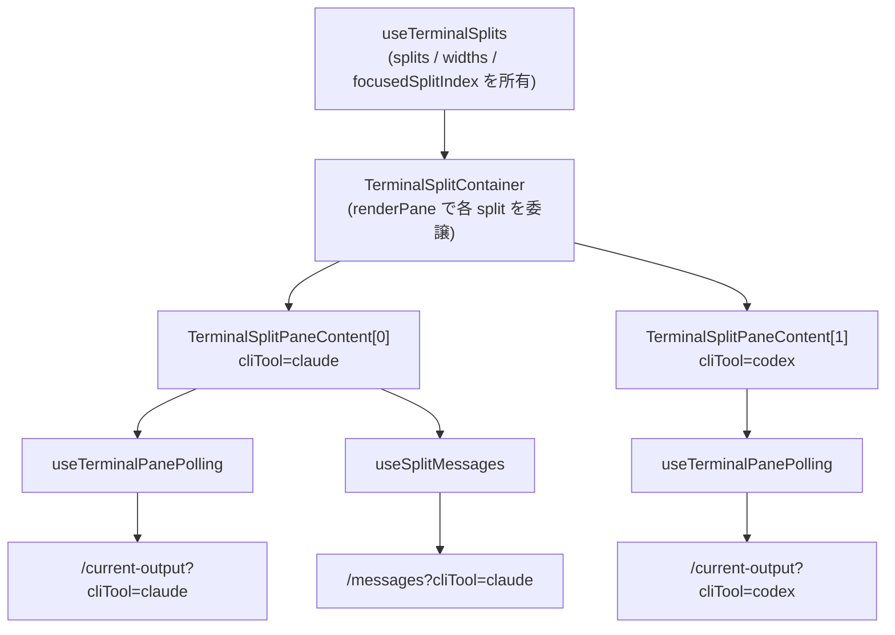

[English](./en/architecture.md)

# docs/architecture.md

# CommandMate Architecture

> git worktree ごとに Claude Code / tmux セッションを張り、スマホブラウザからチャット操作できる開発コンパニオンツールのアーキテクチャ設計書。

このドキュメントは **CommandMate** の技術アーキテクチャを定義します。

- どのようなプロセス／コンポーネントで構成されるか
- どのように Claude CLI / tmux / Web UI が連携するか
- どのレイヤにどの責務を持たせるか

を、実装時の指針としてまとめています。

---

## 0. Scope & Notation

- 対象: `CommandMate` アプリケーション全体
  - Next.js (App Router) ベースの Web UI
  - Node.js API / WebSocket サーバ
  - tmux + Claude CLI セッション管理
  - SQLite / ローカル FS での永続化
- 対象外:
  - Claude 側のモデル挙動
  - 他ツール（mySwiftAgent / myAgentDesk など）との具体的な統合実装

命名・用語:

- **worktree**: git worktree として管理されるブランチディレクトリ
- **worktreeId**: URL セーフな識別子（例: `feature-foo`）
- **tmux session**: `cw_{worktreeId}` という名前の tmux セッション
- **Stop フック**: Claude CLI の `CLAUDE_HOOKS_STOP` に設定する完了フック

---

## 1. System Goals

### 1.1 ゴール

- git worktree ごとに **独立した Claude CLI セッション**を管理する
- スマホや PC のブラウザから、**ブランチ別のチャット UI**として利用できる
- Stop フックを活用し、**ポーリング無しのイベント駆動**で最新の応答を反映する
- 対話の履歴／詳細ログをローカルに安全に保存する

### 1.2 Non-goals

- マルチユーザー SaaS としての動作（あくまでローカル開発者向け）
- セキュリティ境界を超えたネット越しの公開・マルチテナント運用

### 1.3 実装済み機能

- **CLI ツールのサポート** (Issue #4で実装完了、Issue #368/#379/#545 で拡張)
  - Claude Code, Codex CLI, Gemini CLI, Vibe-Local (Ollama), OpenCode, GitHub Copilot の 6 ツール対応
  - Strategy パターンによる拡張可能な設計
  - worktree毎に2〜4エージェントを選択可能（`selected_agents`カラム）
  - Vibe-LocalはOllamaモデルを指定可能（`vibe_local_model`カラム）

---

## 2. Context & Assumptions

### 2.1 前提環境

- 開発者のローカルマシン上で動作
  - macOS / Linux を想定（tmux / Claude CLI が利用可能）
- Claude CLI がインストール済みであり、
  - `claude` コマンドで起動できる
  - `CLAUDE_HOOKS_STOP` を設定できるバージョンである
- git worktree により、複数のブランチディレクトリが管理されている

### 2.2 実行モード

- **ローカルモード（デフォルト）**
  - `CM_BIND = 127.0.0.1`
  - 接続元は同一マシンのみ
- **LAN アクセスモード（任意）**
  - `CM_BIND = 0.0.0.0`
  - リバースプロキシでの認証を推奨（詳細: `docs/security-guide.md`）
  - 同一ネットワーク上のスマホからアクセス可能

---

## 3. High-level Architecture

### 3.1 コンポーネント図



### 3.2 プロセス & ポート
	•	Next.js / Node.js プロセス
	•	ポート: CM_PORT（例: 3000）
	•	バインド: CM_BIND（127.0.0.1 or 0.0.0.0）
	•	機能:
	•	HTTP サーバ（UI, API Routes）
	•	WebSocket サーバ
	•	SQLite への接続
	•	tmux server
	•	システム上に既存の tmux サーバを利用
	•	cw_{worktreeId} というセッション名で CLI ツールを起動
	•	CLI ツールプロセス（Claude Code / Codex CLI）
	•	各 tmux セッション内で選択された CLI ツールが起動
	•	CLAUDE_HOOKS_STOP に設定されたコマンドで完了通知（Claude Code の場合）

⸻

## 4. Data Model

### 4.1 Worktree

```
interface Worktree {
  id: string;              // URLセーフなID ("main", "feature-foo" など)
  name: string;            // 表示名 ("main", "feature/foo" など)
  path: string;            // 絶対パス "/path/to/root/feature/foo"
  lastMessageSummary?: string; // 最後のメッセージ要約
  updatedAt?: Date;        // 最終メッセージの timestamp
}
```

- id
- URL パラメータに使用可能な形式へ正規化した識別子
- 例: feature/foo → feature-foo
- path
- CM_ROOT_DIR を起点とした絶対パス
- updatedAt
- Worktree 一覧を最終更新日時順に並べるために利用

### 4.2 ChatMessage

```
type ChatRole = "user" | "claude";

interface ChatMessage {
  id: string;           // UUID
  worktreeId: string;   // Worktree.id
  role: ChatRole;
  content: string;      // UI表示用の全文
  summary?: string;     // 任意の短い要約
  timestamp: Date;
  logFileName?: string; // 対応する Markdown ログファイル名
  requestId?: string;   // 将来の拡張用: 1送信=1 UUID
}
```

- content:
チャット UI にそのまま表示するテキスト（プロンプト／応答）。
- summary:
Worktree 一覧の lastMessageSummary に反映するための要約（任意）。
- logFileName:
.claude_logs/ 内の詳細ログファイルへのリンク。

### 4.3 WorktreeSessionState

```
interface WorktreeSessionState {
  worktreeId: string;
  lastCapturedLine: number; // tmux capture-pane で最後に取得した行数
}
```

- Stop フック時に tmux capture-pane で scrollback 全体を取得し、
- lastCapturedLine 以降を「今回の新規出力」として扱う差分抽出方式を前提とします。

⸻

## 5. Core Flows

### 5.1 起動 & Worktree スキャン
1. アプリ起動時、CM_ROOT_DIR を基準として git worktree をスキャン。
1. 取得した worktree 情報を基に Worktree レコードを DB に格納／更新。
1. 既存の cw_{worktreeId} tmux セッションがあれば、Worktree と突き合わせて整合性をとる（任意）。

### 5.2 メッセージ送信フロー（UI → Claude）

概要



詳細ステップ
1. UI（画面B）が POST /api/worktrees/:id/send に { message } を送信。
1. API:
    - worktreeId から Worktree を取得し、path を参照。
    - tmux has-session -t cw_{worktreeId} でセッション存在チェック。
    - なければ UC-2（遅延起動フロー）を実行（後述）。
1. tmux send-keys -t cw_{worktreeId} "＜message＞" C-m で Claude CLI へ送信。
1. API は 202 (Accepted) などで UI に即時応答。UI では自分のメッセージ＋「送信中…」バブルを表示。

### 5.3 Stop フック処理フロー（Claude → API → ログ/DB）



詳細ステップ
1. Claude CLI が処理完了時、CLAUDE_HOOKS_STOP に設定されたコマンドを実行。
- 例:
```
HOOK_COMMAND="curl -X POST http://localhost:3000/api/hooks/claude-done \
  -H 'Content-Type: application/json' \
  -d '{\"worktreeId\":\"{worktreeId}\"}'"
export CLAUDE_HOOKS_STOP="${HOOK_COMMAND}"
```
1. POST /api/hooks/claude-done を受け取った API_Hook は、
    - WorktreeSessionState.lastCapturedLine を読み込む（デフォルト 0）。
    - tmux capture-pane -p -S -10000 -t cw_{worktreeId} などで scrollback を取得。
1. 取得したテキストの行数をカウントし、
    - lastCapturedLine 以降の行だけを「新規出力」として抽出。
    - 将来的にマーカー (### REQUEST {id} START/END) が導入される場合は、その範囲のみ抽出する拡張も可能。
1. 抽出した差分を Markdown として .claude_logs/ 以下に保存。
1. ChatMessage のレコードを作成（role = "claude"）し、logFileName を紐付け。
1. Worktree の lastMessageSummary, updatedAt を更新。
1. 新しい ChatMessage を WebSocket 経由で publish し、該当 worktree を閲覧中のクライアントすべてに配信。

### 5.4 WebSocket フロー
- クライアントは接続時に worktreeId を指定して subscribe。
- サーバ側では worktreeId ごとに room / channel を管理。
- 新しい ChatMessage が保存されると、
- 該当 worktreeId を購読中のクライアントにブロードキャスト。

メッセージ形式の例:
```
{
  "type": "chat_message_created",
  "worktreeId": "feature-foo",
  "message": {
    "id": "uuid",
    "role": "claude",
    "content": "Claude の応答...",
    "timestamp": "2025-11-16T03:00:00.000Z",
    "logFileName": "20251116-030000-feature-foo-bd2f8c3d.md"
  }
}
```

### 5.5 エラー時 / 復旧フロー

Stop フックが届かない場合
- UI 側:
- 「送信中…」が一定時間（例: 120 秒）経過しても差し替わらない場合、警告バブルを表示。
- サーバ側:
- Hook API 側でタイムアウトログを残す（実装依存）。
- 手動で .claude_logs/ や tmux の状態を確認することを想定。

tmux セッション / Claude プロセスが落ちた場合
- API_Send 実行時に tmux has-session／プロセス状態をチェック。
- セッションが無い／Claude がいないと判定された場合は UC-2 で再起動。
- Claude CLI の再起動時にも CLAUDE_HOOKS_STOP を再セットする。

⸻

## 6. tmux & CLI Tool Integration

### 6.1 セッション命名規則
- セッション名: `mcbd-{cliToolId}-{worktreeId}`
- 例:
  - Claude: `mcbd-claude-feature-foo`
- 1 worktree に対して 1 セッションを維持する。
- ※ 旧命名規則 `cw_{worktreeId}` からの移行: Issue #4で実装

### 6.1.5 CLI Tool Abstraction Layer (Issue #4で実装)

**設計パターン:**
- Strategy パターンによるCLI tool の抽象化
- `BaseCLITool` 抽象クラスが共通インターフェースを定義:
  ```typescript
  abstract class BaseCLITool {
    abstract id: CLIToolType;
    abstract name: string;
    abstract command: string;

    abstract isInstalled(): Promise<boolean>;
    abstract isRunning(worktreeId: string): Promise<boolean>;
    abstract startSession(worktreeId: string, worktreePath: string): Promise<void>;
    abstract sendMessage(worktreeId: string, message: string): Promise<void>;
    abstract killSession(worktreeId: string): Promise<boolean>;
    getSessionName(worktreeId: string): string;
  }
  ```

**実装クラス:**
- `ClaudeTool` - Claude Code CLI
- `CodexTool` - Codex CLI
- `GeminiTool` - Gemini CLI (Issue #368)
- `VibeLocalTool` - Vibe-Local / Ollama (Issue #368)
- `OpenCodeTool` - OpenCode (Issue #379)
- `CopilotTool` - GitHub Copilot CLI (Issue #545)

**管理:**
- `CLIToolManager` シングルトンクラスで各ツールインスタンスを管理
- ワークツリーの `cliToolId` に基づいて適切なツールを取得

**利点:**
- 新しいCLI toolの追加が容易（`BaseCLITool`を継承するだけ）
- API層は抽象インターフェースのみに依存、具体的な実装に依存しない
- 各ツール固有のロジックをカプセル化

### 6.2 UC-2: 遅延セッション起動フロー

```
# {sessionName}   = cw_{worktreeId}
# {worktreePath}  = /path/to/root/feature/foo
tmux new-session -d -s "{sessionName}" -c "{worktreePath}"

HOOK_COMMAND="curl -X POST http://localhost:3000/api/hooks/claude-done \
  -H 'Content-Type: application/json' \
  -d '{\"worktreeId\":\"{worktreeId}\"}'"

tmux send-keys -t "{sessionName}" "export CLAUDE_HOOKS_STOP='${HOOK_COMMAND}'" C-m
tmux send-keys -t "{sessionName}" "claude" C-m
```
- API から直接 tmux コマンドを叩くラッパーは src/lib/tmux/tmux.ts にまとめる。

### 6.3 死活監視（任意強度）
- シンプルな実装では「セッションの存在」のみチェック。
- より堅牢にする場合:
- tmux list-panes -F "#{pane_pid}" → ps で該当 PID が claude か確認。
- プロンプト状態（claude が終了）になっていた場合、CLAUDE_HOOKS_STOP 再設定 + claude 再起動。

⸻

## 7. Persistence

### 7.1 SQLite (db.sqlite)
- 保存場所の例: ~/.mycodebranchdesk/db.sqlite
- テーブル（イメージ）:
- worktrees:
- id, name, path, last_message_summary, updated_at
- **cli_tool_id** (追加: Issue #4、#379/#545 で拡張) - 使用するCLI tool ('claude' | 'codex' | 'gemini' | 'vibe-local' | 'opencode' | 'copilot')
- **selected_agents** (追加: Issue #368) - 選択中の2〜4エージェント (JSON配列, 例: '["claude","vibe-local"]')
- **vibe_local_model** (追加: Issue #368) - Vibe-Local用Ollamaモデル名 (nullable)
- repository_path, repository_name, description
- last_user_message, last_user_message_at
- favorite, status, link
- chat_messages:
- id, worktree_id, role, content, summary, timestamp, log_file_name, request_id
- message_type, prompt_data
- session_states:
- worktree_id, last_captured_line

### 7.2 Markdown Logs (.claude_logs/)
- 各 worktree ディレクトリ直下に .claude_logs/ ディレクトリを作成。
- ファイル命名規則:

{YYYYMMDD}-{HHmmss}-{worktreeId}-{uuid}.md


- 中身イメージ:
```
# CommandMate Log

## Worktree
feature/foo

## Timestamp
2025-11-16T03:00:00Z

## User

<ユーザーのプロンプト>

## Claude

<Claudeの応答全文>
```

- 削除ポリシー:
- v1 では自動削除は行わず、将来 CLI などでのクリーンアップを検討。

⸻

## 8. Configuration

### 8.1 環境変数一覧（予定）
- CM_ROOT_DIR (必須)
- git worktree 管理のルートディレクトリ
- CM_PORT (任意, デフォルト: 3000)
- CM_BIND (任意, デフォルト: 127.0.0.1)
- 将来的に追加される可能性のあるもの:
- CM_DB_PATH（db.sqlite の保存先）
- CM_LOG_LEVEL（ログ出力レベル）

> **レガシー fallback について**: 旧プレフィックス `MCBD_*`（`MCBD_ROOT_DIR` / `MCBD_PORT` / `MCBD_BIND` / `MCBD_DB_PATH` / `MCBD_LOG_LEVEL` 等）は後方互換のため引き続き参照される。`CM_*` が未設定の場合のみ対応する `MCBD_*` の値に fallback し、その際は deprecation 警告を出力する（実装: `src/lib/env.ts` の `ENV_MAPPING` / `getEnvWithFallback`）。新規設定では `CM_*` を使用すること。

.env.example としてリポジトリに同梱することを想定。

⸻

## 9. Security Model

### 9.1 ローカルモード
- デフォルトは CM_BIND=127.0.0.1
- 同一マシンからのアクセスに限定。
- セキュリティリスクはほぼ OS ユーザーに依存。

### 9.2 LAN アクセスモード
- CM_BIND=0.0.0.0 の場合、同一 LAN 上の任意端末からのアクセスが可能になる
- リバースプロキシ（Nginx / Caddy 等）での認証を推奨（詳細: `docs/security-guide.md`）
- HTTPS / TLS 終端はリバースプロキシに委譲する

⸻

## 10. Extensibility & Future Work

### 10.1 Stop フック拡張
- 将来的に、Stop フックの payload に requestId も含める設計余地を残す:

```
-d '{\"worktreeId\":\"{worktreeId}\", \"requestId\":\"{requestId}\"}'
```

- ChatMessage.requestId とログ名に埋め込むことで、「どのリクエストの応答か」をより厳密にトレース可能。

### 10.2 マルチ LLM / マルチセッション ✅ 実装済み (Issue #4、#368/#379/#545 で拡張)

**実装内容:**
- Claude Code / Codex / Gemini / Vibe-Local / OpenCode / GitHub Copilot の 6 ツールに対応
- ワークツリーごとに `cliToolId` フィールドで使用するCLIツールを管理
- Strategy パターンによる抽象化:
  - `BaseCLITool` 抽象クラス
  - `ClaudeTool` / `CodexTool` / `GeminiTool` / `VibeLocalTool` / `OpenCodeTool` / `CopilotTool` 実装クラス
  - `CLIToolManager` シングルトンでツールインスタンスを管理
- データベーススキーマ: `worktrees.cli_tool_id` カラム（デフォルト: 'claude'）
- 対応API:
  - `POST /api/worktrees/:id/send` - メッセージ送信
  - `POST /api/worktrees/:id/respond` - プロンプト応答
  - `POST /api/worktrees/:id/kill-session` - セッション終了
  - `GET /api/worktrees` - ワークツリー一覧（セッション状態含む）

**将来拡張:**
- その他のCLIを追加する場合は、`BaseCLITool`を継承して実装
- Stop フックの仕様が異なる場合は各ツールクラス内で対応

### 10.3 リアルタイムステータス検出 ✅ 実装済み (Issue #31)

**実装内容:**
- ターミナル出力を直接解析してCLIツールの状態をリアルタイム検出
- サイドバーに視覚的なステータスインジケーターを表示
- 2秒間隔でポーリング更新

**ステータス種別:**
| ステータス | 表示 | 検出条件 |
|-----------|------|----------|
| `idle` | グレー● | セッション未起動 |
| `ready` | 緑● | 入力プロンプト `❯` 表示中 |
| `running` | 青スピナー | 思考インジケータ検出 |
| `waiting` | 黄● | インタラクティブプロンプト検出 |

**検出ロジック:**
1. `captureSessionOutput()` でターミナル出力を取得
2. ANSIエスケープコードを除去
3. 空行をフィルタリングして最後15行を抽出
4. 優先順位に従ってパターンマッチング:
   - インタラクティブプロンプト → `waiting`
   - 思考インジケータ (`✻ Thinking…`) → `running`
   - 入力プロンプト (`❯`) → `ready`
   - それ以外 → `running` (処理中と推定)

**関連ファイル:**
- `src/config/status-colors.ts` - ステータス色の一元管理
- `src/lib/detection/cli-patterns.ts` - CLIツール別パターン定義
- `src/lib/detection/prompt-detector.ts` - プロンプト検出
- `src/types/sidebar.ts` - ステータス判定ロジック

詳細は [ステータスインジケーター](./features/sidebar-status-indicator.md) を参照。

### 10.4 リポジトリ削除機能 ✅ 実装済み (Issue #69)

**実装内容:**
- 登録済みリポジトリを削除するAPIエンドポイントとUI
- 関連するworktree、セッション、ポーリングを一括クリーンアップ
- Facadeパターンによるセッション停止処理の一元化

**対応API:**
- `DELETE /api/repositories` - リポジトリ削除（リクエストボディで `repositoryPath` を指定）

**リクエスト/レスポンス:**
```json
// Request
{ "repositoryPath": "/path/to/repository" }

// Response (200 OK)
{
  "success": true,
  "deletedWorktreeCount": 3,
  "warnings": []
}
```

**エラーレスポンス:**
| ステータス | 条件 |
|-----------|------|
| 400 | `repositoryPath` 未指定 |
| 404 | リポジトリが存在しない |

**削除処理フロー:**
1. リポジトリに属する全worktree IDを取得
2. 各worktreeのtmuxセッションをkill（失敗してもwarningsに記録して続行）
3. response-pollerを停止
4. WebSocket購読状態をクリーンアップ
5. DBからworktreeレコードをCASCADE削除
6. `repository_deleted` イベントをbroadcast

**段階的エラーハンドリング:**
- セッションkill失敗時もDB削除は継続
- 失敗情報は `warnings` 配列で返却

**UI実装:**
- リポジトリフィルターチップにホバー時削除ボタン（×）表示
- 確認ダイアログで「delete」入力必須
- `WORKTREE_REPOS` 環境変数設定リポジトリに警告アイコン（⚠️）表示

**関連ファイル:**
- `src/lib/session-cleanup.ts` - セッション/ポーラー停止のFacade
- `src/app/api/repositories/route.ts` - DELETEエンドポイント
- `src/lib/db.ts` - `getWorktreeIdsByRepository()`, `deleteRepositoryWorktrees()`
- `src/lib/ws-server.ts` - `cleanupRooms()`

### 10.5 Observability
- 将来的に:
- 応答時間（latency）の計測
- エラー率
- セッションごとの履歴メトリクス
- などを可視化するため、ChatMessage や Worktree にメタ情報フィールドを拡張する余地を残す。

---

## 11. URL設計・画面遷移 (Issue #600)

### 11.1 URL一覧

| パス | 画面名 | 説明 |
|------|--------|------|
| `/` | Home | ダッシュボード。セッションサマリー・ショートカットカード |
| `/sessions` | Sessions | Worktree一覧。フィルタ・ソート・グループ化 |
| `/repositories` | Repositories | リポジトリ管理。追加・同期・削除 |
| `/review` | Review | レビュー待ちWorktree一覧。Done/Approval/Stalledフィルタ |
| `/more` | More | 設定・外部アプリ・バージョン情報 |
| `/worktrees/[id]` | Worktree Detail | Worktree詳細。ターミナル・履歴・ファイル・メモ |
| `/worktrees/[id]?pane=<DeepLinkPane>` | Worktree Detail (deep link) | 特定ペインを直接表示 |

### 11.2 DeepLinkPane 値

`?pane=` クエリパラメータで指定可能な値:

| pane値 | デスクトップ左ペイン | モバイルタブ | 説明 |
|--------|---------------------|-------------|------|
| `terminal` | history | Terminal | ターミナル表示（デフォルト） |
| `history` | history | History | 会話履歴 |
| `git` | history | History | Gitコミット履歴 |
| `files` | files | Files | ファイルツリー・エディタ |
| `notes` | memo | CMATE | メモ・ノート |
| `logs` | memo | CMATE | 実行ログ |
| `agent` | memo | CMATE | エージェント設定 |
| `timer` | memo | CMATE | タイマー |
| `info` | history | Info | Worktree情報 |

### 11.3 画面遷移図

```
Home (/)
  |-- Sessions (/sessions) --> Worktree Detail (/worktrees/[id])
  |-- Repositories (/repositories)
  |-- Review (/review) --> Worktree Detail (/worktrees/[id]?pane=terminal)
  |-- More (/more)

Worktree Detail (/worktrees/[id])
  |-- ?pane=terminal (default)
  |-- ?pane=history
  |-- ?pane=git
  |-- ?pane=files
  |-- ?pane=notes / logs / agent / timer
  |-- ?pane=info
```

### 11.4 ナビゲーション構造

**PC（デスクトップ）:**
- Header: 5画面ナビゲーションリンク（Home / Sessions / Repositories / Review / More）
- Sidebar: Worktree一覧（ソート・グループ化・検索）
- メインエリア: 選択中のページコンテンツ

**モバイル:**
- GlobalMobileNav: 下部固定5タブ（Home / Sessions / Review / Repositories / More）
- Worktree Detail内: MobileTabBar（Terminal / History / Files / CMATE / Info）
  - MobileTabBarは`onSearchParamsChange`コールバックで`?pane=`を更新

### 11.5 データフロー

```
useWorktreesCache() ── 唯一のworktree一覧取得元
  |
  +-- WorktreesCacheProvider
  |     |
  |     +-- WorktreeSelectionProvider (externalWorktrees)
  |           |-- 選択中worktree ID管理
  |           |-- 詳細取得 (GET /api/worktrees/:id)
  |           |-- markAsViewed
  |
  +-- useWorktreeList() ── ソート・フィルタ・グループ化
        |-- Sidebar
        |-- Sessions画面
```

⸻

## 12. UI Layout Architecture (PC, Issue #727 / #730 / #747)

> **注**: 既存 §11.2 DeepLinkPane 表・§11.4 ナビゲーション構造は #600 時点の旧デスクトップ左ペインモデル（history / files / memo, MobileTabBar）を前提とした記述であり、現行 PC UI は本章の ActivityBar モデルへ置き換わっている（旧 §11.2 / §11.4 の整理は本章のスコープ外）。

本章は PC 版 UI 最上位レイアウトの **責務境界・状態所有・データフロー**（なぜその構造か / 状態の所有者は誰か）を扱う。視覚的なレイアウト・操作（キーボード / Tooltip）・コンポーネントカタログの詳細は [docs/UI_UX_GUIDE.md](./UI_UX_GUIDE.md) を正（SSOT）とし、本章では再掲しない。

### 12.1 コンポーネントの責務と状態所有

- **ActivityBar** (`src/components/worktree/ActivityBar.tsx`): Activity 選択状態を**所有しない**完全な制御コンポーネント。`active` / `onToggle` を props で受け取り、`@/config/activity-bar-config` の `ACTIVITIES`（Files / Git / Notes / Schedules / Agent / Timer の 6 Activity）を描画する。最上部のサイドバートグル (Issue #747) のみ例外で、`useSidebarContext()` から `{ isOpen, toggle }` を直接読み取り、`role="tablist"` の外側に配置されてタブのキーボードナビゲーションに干渉しない。
- **ActivityPane** (`ActivityPane.tsx`): 状態を持たない table-driven のディスパッチャ。親が構築した `ActivityContentMap`（`Partial<Record<ActivityId, ReactNode>>`）から `activities[active]` を 1 つだけ選び `ErrorBoundary` 経由で描画する。単一の `active` キーで 1 ノードのみを描画するため、**多 Activity 同時表示は構造的に不可能**。
- **TerminalContainer** (`TerminalContainer.tsx`, Issue #730): `terminal` スロット（常時）と `history` スロット（任意）を内包する。Issue #744 以降、PC では最上位 History カラムを描画せず、History は各ターミナル split 内へ移管された（後述 §13）。`history` prop と `useHistoryPaneState` 配線は #730 単一カラムレイアウトとの後方互換として残置している。
- **WorktreeDesktopLayout** (`WorktreeDesktopLayout.tsx`, Issue #730): ActivityPane と Right ペインの **2 カラム構成**。Issue #730 で 4 カラムから 2 カラムへ簡素化し（History は Right 内の TerminalContainer へ、ActivityBar は親側で全高描画へ移動）、`activityPane === null` のとき Activity カラムと境界の PaneResizer を共に隠す。
- **PaneResizer** (`PaneResizer.tsx`): 一過性のドラッグ状態のみを持つ汎用リサイザ。**ピクセル差分を `onResize(delta)` で親へ通知するのみ**で、ペイン幅の確定は親が行う（WorktreeDesktopLayout の Activity↔Right 境界、TerminalContainer の History↔Terminal 境界の両方で再利用）。

### 12.2 状態の所有者（カスタムフック）

- **useActivityBarState** (`src/hooks/useActivityBarState.ts`): `active` 状態の単一情報源。`commandmate.worktree.activeActivity` に永続化するが、**閉じた状態（null）は永続化しない**（最後に選択した Activity のみ保存して再訪時に復元）。不正値・未設定時は `DEFAULT_ACTIVITY = 'files'` にフォールバックし、初期描画は決定的に `DEFAULT_ACTIVITY`・localStorage 読み取りはマウント後の `useEffect` で行う（hydration mismatch 回避）。
- **SidebarContext** (`src/contexts/SidebarContext.tsx`): サイドバー `isOpen` を `useReducer` で所有。ActivityBar のハンバーガー (Issue #747) は本 context を直接参照し、Activity 選択（props 経由）とは別系統のデータフローを成す。

オーケストレーター (`WorktreeDetailRefactored.tsx`) が `useActivityBarState` を呼んで `ActivityContentMap` を構築し、ActivityBar / ActivityPane / WorktreeDesktopLayout へ配線する。

### 12.3 データフロー図



> **forward-reference**: per-agent（CLI 単位）の session status indicator は Issue #743 / #749 / #751 で実装済み（per-split header の status・DesktopHeader の agent status row）。本章のスコープ外であり、詳細は将来追記する（任意）。

⸻

## 13. TerminalSplits Strategy (PC, Issue #728 / #736 / #744)

本章は PC 版ターミナルの 1〜3 分割と、分割ごとに独立した per-(worktreeId, cliToolId) の fan-out ポーリング戦略を扱う。

### 13.1 分割状態の管理（useTerminalSplits）

- 状態の所有者は `src/hooks/useTerminalSplits.ts`（Issue #728）。VS Code 風レイアウト用 reducer（activityBar / historyPane 等）には**意図的に統合せず**、action の肥大化を避けて分離している。
- 定数（`src/config/terminal-split-config.ts`）: `MIN_SPLITS = 1`、`MAX_SPLITS = 3`、`DEFAULT_SPLIT_CONFIG = { splits: [{ cliToolId: 'claude' }], widths: [1] }`。
- 永続化は **worktree 単位**（`getTerminalSplitsStorageKey(worktreeId)` をキーに splits + widths を localStorage へ保存）。worktreeId 変更時に再読込し `focusedSplitIndex` を 0 リセットする。
- 読込時に `isValidSplitConfig` で検証し（`splits.length ∈ [1, 3]`、`widths.length === splits.length`、各 width は有限かつ正）、不合格なら `DEFAULT_SPLIT_CONFIG` にフォールバックする（外部編集・stale データ防御）。
- **同一 CLI 複数選択禁止ガード**: `setSplitCliTool` は他 split が同じ CLI を使用中なら変更を拒否し、`availableCliTools(idx)` は使用中 CLI を除外したリストを返す（UI の `<select>` で該当 option を無効化）。CLI 種別数（6）が `MAX_SPLITS`（3）を上回るため、`addSplit` 時の未使用 CLI 割り当ては枯渇しない。

### 13.2 per-(worktreeId, cliToolId) fan-out ポーリング（useTerminalPanePolling）

- 各 `TerminalSplitPaneContent` が `src/hooks/useTerminalPanePolling.ts` を 1 インスタンス所有し、`GET /api/worktrees/{worktreeId}/current-output?cliTool={cliToolId}` を**独立に**叩く（split 0 = Claude、split 1 = Codex がそれぞれポーリング）。
- 所有する状態: `output` / `isRunning` / `isThinking` / `isSelectionListActive` / `attaching`（初回の成功 fetch まで true）/ `autoScroll`（ペイン単位）/ prompt。Auto-Yes 状態と History メッセージは activeCliTab スコープのグローバルのため**意図的に所有しない**。
- **stale 応答破棄（2 軸）**: fetch 毎にインクリメントする `requestId` と、毎レンダで現在の CLI を記録する `inFlightCliToolRef` を応答時に照合し、いずれかが一致しない応答（順序逆転・CLI 切替跨ぎ）を破棄する。サーバ応答に含まれる `cliToolId` が要求 CLI と異なる場合も破棄する。
- ポーリング周期は `isRunning` で切り替える（`ACTIVE_POLLING_INTERVAL_MS = 2000` / `IDLE_POLLING_INTERVAL_MS = 5000`）。`document.visibilityState === 'hidden'` の tick はスキップし、可視復帰時に 1 回だけ再 fetch する（バックグラウンド時のポーリング停止）。
- `compositeKey = {worktreeId}::{cliToolId}` の変化時に `requestId` を bump し、output / prompt をクリアして `attaching` 状態へ戻す（fresh attach として扱う）。

### 13.3 per-split メッセージ履歴と namespace 分離

- **useSplitMessages** (`src/hooks/useSplitMessages.ts`, Issue #744): 各 split が `GET /api/worktrees/{worktreeId}/messages?cliTool={cliToolId}` を独立 fetch する（`SPLIT_MESSAGES_POLL_INTERVAL_MS = 5000`）。親の `state.messages` は activeCliTab に絞り込み済みのため、split A=Claude と split B=Codex の同時表示には流用できない。stale-guard は useTerminalPanePolling と同型。
- **makeHistoryNamespace** (`src/lib/terminal-highlight.ts`, Issue #744): `CSS.highlights` は name をキーとするグローバル Map であり、複数の HistoryPane が同一 namespace（`HISTORY_SEARCH_NAMESPACE`）を使うと検索ハイライトが相互に上書きされる。`makeHistoryNamespace(splitIndex)` が split index サフィックス付きの namespace（`history-search-{idx}` 等）を返し、各 split が別レジストリキーでハイライトを保持して衝突を回避する。`applyHistoryHighlights` 等は namespace 引数を省略すると従来の共有 namespace を採用するため、Mobile / 単一ペインの呼び出しは無変更（後方互換）。

### 13.4 Mobile 経路との差分

- Mobile は `MobileTerminalTab` が `useTerminalPanePolling` を**単一インスタンス**のみ所有し、terminal タブ表示時にだけマウントする（activeCliTab に対応する 1 CLI のみポーリング）。
- Issue #736 で terminal reducer slice を撤去し、PC / Mobile とも `useTerminalPanePolling` から output を取得するようになった。PC は split 数（最大 3）ぶんを**並列**起動する点が Mobile との差分である。

### 13.5 データフロー図



> **補足**: History ペインの表示 / 幅は MVP では全 split 共通の `useHistoryPaneState` を参照する（per-split 独立の開閉・幅は将来の拡張余地）。

⸻