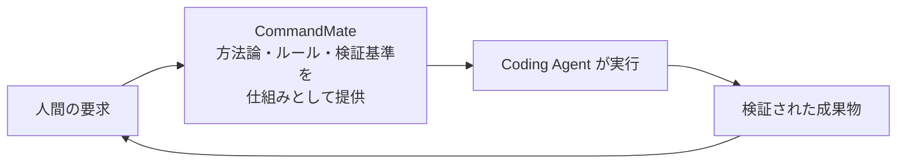

[English](./en/concept.md)

# CommandMate - Concept

> **From vibe coding to Vibe Engineering.**
>
> vibe coding から、Vibe Engineering へ。

CommandMate は、エンジニアリングの規律をワークフローそのものに組み込みます。
作業の前に契約を、作業の後に検証ゲートを、その全体に証跡を。
どのコーディングエージェントでも、あなたの要求を検証済みの成果物に変えられます。

このドキュメントは Vision / Mission / 中核原則 / 実装の **正本** です。
公開面（LP・README・チュートリアル・product-highlights）が使う文言は
[docs/design/public-messaging.md](./design/public-messaging.md) に集約しています。

---

## 4 段の梯子

上から下へ、抽象から具体へ。下の段は必ず 1 つ上の段の手段になっています。

| 段 | 内容 |
|---|---|
| **Vision** | 専門的な開発知識を AI に丸投げせず、仕組みとして補完する |
| **Mission** | 誰でもベストプラクティスに沿って AI とプロダクトを作れるようにする |
| **中核原則** | どのコーディングエージェントでも、要求から検証済みの成果へ再現可能に至れること |
| **実装** | Task Contract / Issue 駆動 / Skills / 並列実行 / 独立検証 / Evidence / PR workflow |

中核原則は Mission そのものではなく、Mission を成立させるための**手段**です。
「誰でも」を成立させるには、担い手が変わっても・エージェントが変わっても
同じ結果に至れる必要があり、その条件が「再現可能」です。

---

## ループ

CommandMate は、エージェントと人の間に立って**方法論・ルール・検証基準を仕組みとして渡す**層です。
賢さを足すのではなく、賢さが空回りしないための枠を渡します。

- **人間の要求** — Issue、あるいは一行の依頼
- **CommandMate** — 契約（やってよい範囲・完了条件）、Skill（方法論）、検証ゲート（合否基準）を渡す
- **Coding Agent** — Claude Code / Codex / Gemini CLI などが、その枠の中で実行する
- **検証された成果物** — 「エージェントがそう言った」ではなく、検証ランの exit code が返した結果

最後の矢印が重要です。検証済みの成果物は次の要求の出発点になり、
その過程で残った証跡（commit・ゲートログ・履歴）が次の判断材料になります。

---

## Vibe Engineering

> **Vibe Engineering — 作るのは AI。エンジニアリングを保証するのは、あなたの専門知識ではなく仕組み。**

vibe coding は、AI との対話で直感的に作るスタイルです。速く、楽しく、実際に動くものが出てきます。
CommandMate はこれを否定しません。**出発点として扱います。**

問題は、丸投げしたときに「本当にできているのか」を判断する材料が
チャットの履歴しか残らないことです。判断できる人には判断できる。
判断できない人には判断できない。ここで結果が人の専門知識に依存してしまいます。

**AI を賢くするのではなく、AI を使う側に必要だったソフトウェアエンジニアリング能力を仕組み化する。**

これが CommandMate の芯です。
契約を書く・検証基準を宣言する・証跡を残すという、これまで経験のある人の頭の中にあった手順を、
ファイルとコマンドとゲートに落とします。仕組みに乗れば、専門知識の有無にかかわらず同じ結果に至ります。

> **語の出典**: "vibe engineering" は Simon Willison 氏が 2025 年に提唱した語です
> （[Vibe engineering, 2025-10-07](https://simonwillison.net/2025/Oct/7/vibe-engineering/)）。
> 原文は「経験を積んだプロが、責任を持ったまま LLM で仕事を加速する」側を指しており、
> 規律を**人が持っている**ことが前提です。CommandMate はその規律を**仕組み側に置く**ため、
> 対象が「専門知識を持たない人」まで広がります。詳細な突合は
> [public-messaging.md](./design/public-messaging.md) の出典節にあります。

---

## 実装と製品機能の対応

実装 7 項目は、すべて実在する機能に対応しています。

| 実装 | 製品機能 |
|---|---|
| **Task Contract** | `.commandmate/tasks/*.yaml` ・ `commandmate send --contract` ・ `commandmate task list` / `task show`（[設計](./design/task-contract.md)） |
| **Issue 駆動** | 公式 Catalog の Skill `cmate-issue-authoring` / `cmate-issue-refinement` / `cmate-task-contract` |
| **Skills** | 公式 Catalog からの install / update（`commandmate skill list` / `install` / `update`、[ガイド](./user-guide/skills.md)） |
| **並列実行** | worktree ごとの独立セッションと複数 CLI（claude / codex / gemini / vibe-local / opencode / copilot / antigravity / command-code） |
| **独立検証** | `.commandmate/verify.yaml` ・ `commandmate verify` / `wait --verify` ・ exit 0 / 20 / 21（[設計](./design/verification-config.md)） |
| **Evidence** | work-evidence / scope ゲート ・ `commandmate verify history` / `task show` ・ `commandmate report metrics` |
| **PR workflow** | Skill `cmate-orchestrate` / `cmate-acceptance-test` ・ `/create-pr` |

3 つだけ補足します。

**契約は送信時のスナップショットです。** `commandmate send --contract` を実行した時点の
yaml の内容が、そのタスクの判定基準になります。あとから yaml を直しても、
`send --contract` で切り直すまで裁定は変わりません。

**判定は必ず実 exit code で行います。** 出力を grep して合否を決めると `$?` が隠れます。
`0` は合格、`20` はゲート不合格、`21` は作業証跡がゼロ（＝そもそも着手されていない）です。
「判定できなかった」と「判定した結果ダメだった」は別物として扱われます。

**証跡は後から読めます。** `verify history` でどの検証ランがいつ何で落ちたかを、
`task show` でどの契約でどう指示したかを、`report metrics` で成功率と人の介入回数を追えます。

---

## 誰に届くか

**専門知識を持たない人でも、仕組みに乗れば同じ結果に至れる。** これが対象の切り方です。
職種や経験年数ではなく、「仕組みに乗るかどうか」だけが条件になります。

- **これから AI とプロダクトを作る人** — 何をどう検証すればよいかを、契約と verify.yaml が示します
- **チームで品質を揃えたい人** — 方法論を Skill として配れば、担い手が変わっても手順が変わりません
- **複数のタスクを同時に進めたい人** — worktree ごとに契約 1 つで、混ざらずに並列で走ります

そのうえで、CommandMate は **PC の前に座っていなくても手綱を持てる**ように作られています。
エージェントが入力待ちになったら、バッジ・トースト・タブタイトル・通知で届き、
スマートフォンのブラウザからそのまま応答できます。
まとまった時間が取れなくても、待ち時間が作業の停止にはなりません。
これは価値の中心ではなく、**中心を成立させるための条件**です。

---

## 関連ドキュメント

| ドキュメント | 内容 |
|---|---|
| [公開面 発信仕様](./design/public-messaging.md) | 公開面の文言の単一ソース（hero・定義文・4 カード・With / Without・禁止語） |
| [Task Contract 設計](./design/task-contract.md) | 契約ファイルの形式と裁定 |
| [検証設定 設計](./design/verification-config.md) | `.commandmate/verify.yaml` とゲートの仕様 |
| [Skills ガイド](./user-guide/skills.md) | Catalog からの Skill 導入と更新 |
| [チュートリアル](./user-guide/tutorial.md) | サンプルリポジトリで契約 → 検証を 15 分で体験する |
| [クイックスタート](./user-guide/quick-start.md) | 5 分で始める開発フロー |
| [アーキテクチャ](./architecture.md) | システム設計 |

---

MIT License. CommandMate はオープンソースとして公開しています。
