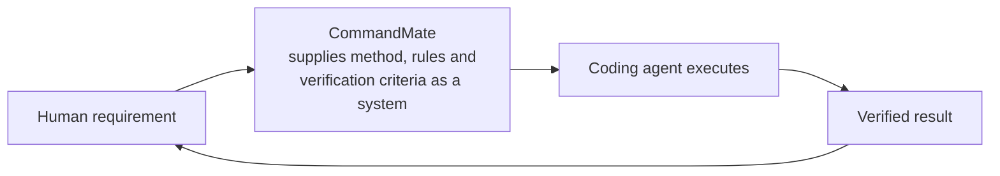

[日本語版](../concept.md)

# CommandMate - Concept

> **From vibe coding to Vibe Engineering.**

CommandMate builds the engineering discipline into the workflow: a contract before the work,
verification gates after it, evidence throughout.
Any coding agent turns your requirement into a verified result.

This document is the **canonical source** for the Vision, the Mission, the core principle and the
implementation. The wording every public surface uses (landing page, README, tutorial,
product highlights) lives in [docs/design/public-messaging.md](../design/public-messaging.md).

---

## The Four Rungs

Top to bottom, abstract to concrete. Each rung is the means by which the rung above it happens.

| Rung | Statement |
|---|---|
| **Vision** | Do not offload professional engineering knowledge to the AI — supply it as a system |
| **Mission** | Let anyone build a product with AI while following best practices |
| **Core principle** | With any coding agent, a requirement reaches a verified result reproducibly |
| **Implementation** | Task Contract / issue-driven work / Skills / parallel execution / independent verification / evidence / PR workflow |

The core principle is not the Mission itself; it is the **means** that makes the Mission hold.
"Anyone" only works if a different person, or a different agent, still arrives at the same
result — and that condition is what "reproducibly" names.

---

## The Loop

CommandMate sits between you and the agent and **hands over the method, the rules and the
verification criteria as a system**. It does not add intelligence; it adds the frame that keeps
intelligence from spinning in place.

- **Human requirement** — an issue, or a one-line request
- **CommandMate** — hands over a contract (allowed scope, definition of done), Skills (the method) and verification gates (the pass/fail criteria)
- **Coding agent** — Claude Code, Codex, Gemini CLI and others execute inside that frame
- **Verified result** — not "the agent said so", but what the exit code of a verification run returned

The last arrow matters. A verified result becomes the starting point of the next requirement, and
the evidence left behind along the way — commits, gate logs, history — becomes the material for
the next decision.

---

## Vibe Engineering

> **Vibe Engineering — the AI does the building; the system, not your expertise, guarantees the engineering.**

Vibe coding is building intuitively through conversation with an AI. It is fast, it is fun, and
something that actually runs comes out of it. CommandMate does not reject that.
**It treats it as the starting point.**

The problem is what is left behind when you hand the whole thing over: the only material for
judging whether it is really done is a chat transcript. Someone who can judge, judges.
Someone who cannot, cannot. At that moment the outcome starts depending on a person's expertise.

**We do not make the AI smarter. We make the software-engineering ability its user needed into a system.**

That is the core of CommandMate. Writing a contract, declaring the verification criteria, leaving
evidence — steps that used to live in an experienced person's head — become files, commands and
gates. Ride the system, and you arrive at the same result whether or not you have the expertise.

> **Where the term comes from**: "vibe engineering" was coined by Simon Willison in 2025
> ([Vibe engineering, 2025-10-07](https://simonwillison.net/2025/Oct/7/vibe-engineering/)).
> His post describes seasoned professionals accelerating their work with LLMs while staying
> accountable for what they ship, so the discipline is assumed to live **in the person**.
> CommandMate puts that discipline **in the system instead**, which widens the audience to people
> without the expertise. The full comparison is recorded in the sourcing section of
> [public-messaging.md](../design/public-messaging.md) (Japanese).

---

## From Implementation to Product Features

All seven implementation items map to features that actually exist.

| Implementation | Product feature |
|---|---|
| **Task Contract** | `.commandmate/tasks/*.yaml`, `commandmate send --contract`, `commandmate task list` / `task show` ([design](../design/task-contract.md), Japanese) |
| **Issue-driven work** | Catalog Skills `cmate-issue-authoring` / `cmate-issue-refinement` / `cmate-task-contract` |
| **Skills** | Install and update from the official Catalog (`commandmate skill list` / `install` / `update`, [guide](../user-guide/skills.md), Japanese) |
| **Parallel execution** | An independent session per worktree, across several CLIs (claude / codex / gemini / vibe-local / opencode / copilot / antigravity) |
| **Independent verification** | `.commandmate/verify.yaml`, `commandmate verify` / `wait --verify`, exit 0 / 20 / 21 ([design](../design/verification-config.md), Japanese) |
| **Evidence** | work-evidence and scope gates, `commandmate verify history` / `task show`, `commandmate report metrics` |
| **PR workflow** | Skills `cmate-orchestrate` / `cmate-acceptance-test`, `/create-pr` |

Three notes.

**A contract is a snapshot taken at send time.** The contents of the yaml at the moment you ran
`commandmate send --contract` are what that task is judged against. Editing the yaml afterwards
changes nothing until you re-cut the task with another `send --contract`.

**The verdict is always the real exit code.** Grepping the output to decide pass or fail hides
`$?`. `0` is a pass, `20` means a gate failed, and `21` means there is no evidence of work at all
(nothing was ever started). "We could not judge" and "we judged it and it failed" stay distinct.

**Evidence is readable afterwards.** `verify history` shows which verification run failed, when
and on what; `task show` shows which contract asked for what; `report metrics` shows the success
rate and how often a human had to step in.

---

## Who This Reaches

**Someone without the expertise still arrives at the same result, as long as they ride the
system.** That is how the audience is cut: not by job title or years of experience, but only by
whether you ride the system.

- **People about to build a product with AI** — the contract and `verify.yaml` state what to verify and how
- **People who want consistent quality across a team** — ship the method as a Skill and the steps stay the same when the person changes
- **People running several tasks at once** — one worktree and one contract per task, running in parallel without bleeding into each other

On top of that, CommandMate is built so you can **keep hold of the reins without sitting at your
PC**. When an agent starts waiting for input it reaches you through a badge, a toast, the tab
title and a push notification, and you can answer straight from your phone's browser. Not having
a large block of time does not turn waiting into a stop. This is not the centre of the value —
it is the condition that lets the centre hold.

---

## Related Documents

| Document | Contents |
|---|---|
| [Public messaging spec](../design/public-messaging.md) | Single source for public wording: hero, definition, four cards, With / Without, banned terms (Japanese) |
| [Task Contract design](../design/task-contract.md) | Contract file format and how it is judged (Japanese) |
| [Verification config design](../design/verification-config.md) | `.commandmate/verify.yaml` and the gate specification (Japanese) |
| [Skills guide](../user-guide/skills.md) | Installing and updating Skills from the Catalog (Japanese) |
| [Tutorial](./user-guide/tutorial.md) | Work through contract to verification in fifteen minutes on a sample repository |
| [Quick Start](./user-guide/quick-start.md) | The development flow in five minutes |
| [Architecture](./architecture.md) | System design |

---

MIT License. CommandMate is released as open source.
