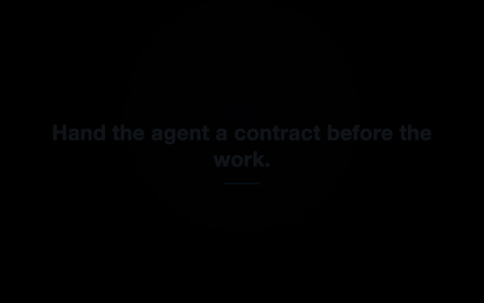
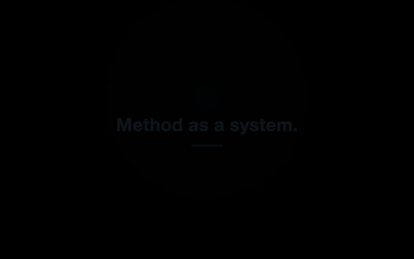

[日本語版](../../features/product-highlights.md)

# Product Highlights

> **Vibe Engineering — the AI does the building; the system, not your expertise, guarantees the
> engineering.**

CommandMate builds the engineering discipline into the workflow: a contract before the work,
verification gates after it, evidence throughout. The four rungs run from the Vision (do not
offload professional engineering knowledge to the AI — supply it as a system) down through the
Mission (let anyone build a product with AI while following best practices) and the core
principle (with any coding agent, a requirement reaches a verified result reproducibly) to the
implementation you see below: Task Contract, issue-driven work, Skills, parallel execution,
independent verification, evidence and the PR workflow. The canonical statement of all four lives
in [Concept](../concept.md).

Each highlight below is shown as a 20-second demo, recorded with the UI in English.

> **How the demos were recorded**
> Every take runs in an isolated environment (a throwaway seed repository, a dedicated port, a
> dedicated database, a substituted `$HOME`), so no private repository name, personal path, or
> source code appears.
> No real LLM is involved: a "fake agent" replays captured terminal output inside a tmux session.
> **Only the LLM is substituted** — status detection, response polling, the sidebar status dots
> and the verification gates are all the production code paths.

---

## 1. Verified, Not Vibe-Checked

A contract declares the scope and the definition of done before the work starts; a verification
run decides afterwards whether it was met. The verdict is the real exit code — `0` passed,
`20` a gate failed, `21` nothing was done. The gates in this clip are executed for real.



[mp4](../../images/features/cm-11-contract-verify.en.mp4)

## 2. Method as a System

The method is not in someone's head — it is installed as a Skill from the official Catalog into
the worktree that needs it, and from then on it is there to call from the composer.



[mp4](../../images/features/cm-12-install-skill.en.mp4)

## 3. Git Worktree Sessions

One session per worktree, so work on several branches runs at the same time without the
sessions interfering with each other. A worktree created outside CommandMate — by plain `git`,
or by an agent — is picked up by a scan rather than recreated.


[mp4](../../images/features/cm-01-parallel-worktrees.en.mp4)

## 4. Session Status at a Glance

Running, waiting and idle are shown by the sidebar colour and the status dot on each branch, and
everything that needs an answer collects on the Review screen — so you can tell which agent is
stuck without opening every session, and answer it where you found it.


[mp4](../../images/features/cm-02-status-at-a-glance.en.mp4)

## 5. Waiting Reaches You

An agent that has stopped to ask for confirmation is surfaced the moment it stops — the sidebar
grows a "needs attention" pill and a toast appears — and you answer from your phone. A session
cannot sit blocked for hours without anyone noticing.


[mp4](../../images/features/cm-03-never-miss-waiting.en.mp4)

## 6. Multi-Agent Support

Switch between Claude Code, Codex, Gemini CLI, Copilot, OpenCode, Antigravity and local models by
tab, and pick the right one per task. A single worktree can hold several agent sessions side by
side.


[mp4](../../images/features/cm-04-multi-agent.en.mp4)

## 7. Asynchronous Execution

Send a message and walk away. Progress is tracked server-side, so the result and the status
are still there when you come back.


[mp4](../../images/features/cm-05-send-and-walk-away.en.mp4)

## 8. Approve from Your Phone

At phone width a confirmation prompt opens as a sheet you can answer on the spot —
no walking back to your desk just to approve something.


[mp4](../../images/features/cm-06-approve-from-phone.en.mp4)

## 9. Automatic Completion Detection

Terminal output is parsed to decide when a response has finished, and the overview returns to
ready on its own. You never have to go and check whether it is done.


[mp4](../../images/features/cm-07-completion-detected.en.mp4)

## 10. The Terminal, in the Browser

Each worktree's tmux session is shown as-is in the browser. CommandMate sits on top of your
existing tmux setup rather than replacing it.


[mp4](../../images/features/cm-08-tmux-in-browser.en.mp4)

## 11. File Viewer

The worktree's file tree sits next to the session, and an uncommitted diff opens in the pane
beside it — so you can read what changed without opening an IDE. Markdown can also be edited in
the browser.


[mp4](../../images/features/cm-09-files-beside-session.en.mp4)

## 12. Runs 100% Locally

The server, the database and the sessions all run on your own machine. No external server, no
cloud relay, no account — the only outbound traffic is the agent CLI's own API calls. MIT licensed.


[mp4](../../images/features/cm-10-local-and-npx.en.mp4)

---

## What the demos do and do not show

Nothing is claimed in a caption that is not on screen. Read them with these caveats:

- The scene library has twelve entries and each cut places only the ones its claim needs, so the
  cuts differ by footage and not only by caption. Five of them — **6. Multi-Agent Support**,
  **7. Asynchronous Execution**, **9. Automatic Completion Detection**, **10. The Terminal, in the
  Browser** and **12. Runs 100% Locally** — are still cut from the same three browser scenes
  (branch list / send-and-generate / back to ready), reordered and reweighted, because those are
  the screens their claims are about.
- **6. Multi-Agent Support** shows the agent tabs at the top of the screen, but the act of
  switching tabs was not filmed — no scene drives it.
- **5. Waiting Reaches You** films two of the four channels the card names: the sidebar pill and
  the toast. The tab-title count is real but sits in browser chrome the recorder does not capture,
  and Web Push needs a subscribed device; both are stated on the card, not claimed over footage.
- **11. File Viewer** shows the file tree beside the session and a diff opened from the Git
  activity; editing a file in the Markdown editor is not part of the demo (the feature exists).
- **1. Verified, Not Vibe-Checked** is filmed from a tmux pane rather than a browser: Task
  Contract, the gates and the evidence have no Web UI yet, so the CLI's output is the only surface
  that shows them. Nothing in that clip is stubbed — `GATE unit PASS` is the real exit code of the
  seed repository's `node --test`.
- **2. Method as a System** reaches the network: the Catalog URL is a compile-time constant behind
  an exact-match allowlist, so it cannot be pointed at a local fixture. When the Catalog is
  unreachable the recorder reports a skip with its reason instead of filming an empty panel.
- Product claims that cannot appear on screen (100% local, MIT, `npx` in 60 seconds) are placed
  on the text cards in **12**.

## Why GIF and mp4 both

GitHub's markdown viewer does not render `<video>` — the element is not on its HTML allowlist,
and video attachments only play in issue, pull request and discussion comments. So the file
that plays inline here is the GIF; the mp4 is kept alongside it at full quality.

- GIF: 600px / 10fps / roughly 1.0–1.5MB
- mp4: 1280x800 / 30fps / h264 / roughly 0.5–0.7MB

## Regenerating

The storyboard is the only place wording is edited.

```bash
# change the wording
$EDITOR docs/images/features/storyboards/01-parallel-worktrees.yaml

# re-shoot one highlight
.claude/skills/demo-video/scripts/demo-video.sh \
  --storyboard docs/images/features/storyboards/01-parallel-worktrees.yaml \
  --out docs/images/features

# rebuild the GIF the page actually plays (written beside the mp4)
.claude/skills/video-to-gif/scripts/to-gif.sh \
  docs/images/features/cm-01-parallel-worktrees.ja.mp4 \
  docs/images/features/cm-01-parallel-worktrees.en.mp4
```

The GIF step steps resolution, frame rate and palette down until the file fits its byte budget
(1.5MB by default). If it never fits it writes nothing and exits 1, and it always prints how many
bytes committing the result would add.

Three things about the storyboards are worth knowing before editing one:

- A scene of `type: code` typesets a file as a still card instead of recording a browser. Its
  `source` is resolved against the storyboard's own directory and may not leave it, so a cut can
  only ship a listing it sits with — see `storyboards/code/` and `11-contract-verify.yaml`.
- `contract-verify` is filmed from a tmux pane, not a browser, and runs the gates for real. It is
  the slowest scene in the library by a wide margin. Its pane is **26 rows** rather than a
  best-fit, and that number is load-bearing: the telop band is fixed at 7.5% from the bottom of
  the frame for every cut, and a taller pane puts the `GATE` block underneath it. `cli-scene.sh`
  therefore also routes the two machine-readable stdout payloads (the task id, the prompt JSON) to
  files — its banners print the redirect, so the pane never shows a command it did not run.
- `install-skill` needs the network. Offline it fails the run by design; `--allow-skip` turns that
  into a reported skip.

A storyboard's scene duration is capped by the length of the take; anything longer is trimmed
from the **front**, and anything shorter is padded with a frozen last frame. Both matter when you
pick a slot: the payoff of a browser scene is at its end, so a short slot seeks past the setup —
but a scene whose payoff is at the *start* (the Review list before the row is answered) needs a
slot close to the whole take. Measured over the 2026-08-18 re-shoot: branch list 4.1–4.7s /
send-and-generate 20.8–26.5s / attention badge 5.8–6.1s / mobile approval 11.3–12.8s /
Review screen 15.8–17.8s / diff 9.7–10.2s / slash palette 12.0–15.2s / install Skill 10.3–12.7s /
back to ready 3.7–4.2s / contract-verify 37.3–38.8s.

Video is already compressed, so git cannot delta it — **do not re-commit all twelve every time you
regenerate** (`docs/images/demo-mobile.gif` already sits in history in four versions). Replace
only what actually changed. The exception was this re-shoot: the Activity Bar gained icons between
takes, so a partial update would have produced a page mixing two versions of the chrome.

`docs/images/demo-desktop.mp4` and `demo-mobile.mp4` are the old recordings made on a personal
machine; they remain only because the README GIFs reference them. **Do not reuse them**
(see [website/assets/media/README.md](../../../website/assets/media/README.md)).

## Related documents

- [README](../../../README.md) — Key Features table
- [Concept](../concept.md) — Vision, Mission, core principle, implementation
- [Architecture](../architecture.md)
- [Sidebar Status Indicator](./sidebar-status-indicator.md)
