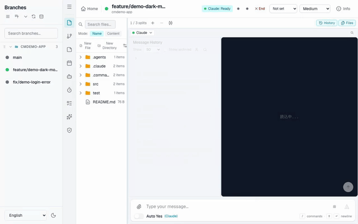

[日本語版](../../features/product-highlights.md)

# Product Highlights

CommandMate is a **local control plane** that adds orchestration and visibility on top of the
agent CLIs you already use. It replaces neither tmux, nor Git worktrees, nor your terminal —
it makes them manageable once there are more than a couple of them.

Each highlight below is shown as a 20-second demo, recorded with the UI in English.

> **How the demos were recorded**
> Every take runs in an isolated environment (a throwaway seed repository, a dedicated port, a
> dedicated database), so no private repository name, personal path, or source code appears.
> No real LLM is involved: a "fake agent" replays captured terminal output inside a tmux session.
> **Only the LLM is substituted** — status detection, response polling, and the sidebar status
> dots are all the production code paths.

---

## 1. Git Worktree Sessions

One session per worktree, so work on several branches runs at the same time without the
sessions interfering with each other.


[mp4](../../images/features/cm-01-parallel-worktrees.en.mp4)

## 2. Session Status at a Glance

Running, waiting and idle are shown by the sidebar colour and the counts on the overview,
so you can tell which agent is stuck without opening a session.


[mp4](../../images/features/cm-02-status-at-a-glance.en.mp4)

## 3. Waiting-for-Approval Detection

An agent that has stopped to ask for confirmation is detected and surfaced as waiting,
so a session cannot sit blocked for hours without anyone noticing.


[mp4](../../images/features/cm-03-never-miss-waiting.en.mp4)

## 4. Multi-Agent Support

Switch between Claude Code, Codex, Gemini and others by tab, and pick the right one per task.
A single worktree can hold several agent sessions side by side.


[mp4](../../images/features/cm-04-multi-agent.en.mp4)

## 5. Asynchronous Execution

Send a message and walk away. Progress is tracked server-side, so the result and the status
are still there when you come back.



[mp4](../../images/features/cm-05-send-and-walk-away.en.mp4)

## 6. Approve from Your Phone

At phone width a confirmation prompt opens as a sheet you can answer on the spot —
no walking back to your desk just to approve something.


[mp4](../../images/features/cm-06-approve-from-phone.en.mp4)

## 7. Automatic Completion Detection

Terminal output is parsed to decide when a response has finished, and the overview returns to
ready on its own. You never have to go and check whether it is done.


[mp4](../../images/features/cm-07-completion-detected.en.mp4)

## 8. The Terminal, in the Browser

Each worktree's tmux session is shown as-is in the browser. CommandMate sits on top of your
existing tmux setup rather than replacing it.


[mp4](../../images/features/cm-08-tmux-in-browser.en.mp4)

## 9. File Viewer

The worktree's file tree sits next to the session, so you can check what changed without
opening an IDE. Markdown can also be edited in the browser.


[mp4](../../images/features/cm-09-files-beside-session.en.mp4)

## 10. Runs 100% Locally

The server, the database and the sessions all run on your own machine. No external server, no
cloud relay, no account — the only outbound traffic is the agent CLI's own API calls. MIT licensed.


[mp4](../../images/features/cm-10-local-and-npx.en.mp4)

---

## What the demos do and do not show

Nothing is claimed in a caption that is not on screen. Read them with these caveats:

- All ten use the **same four scenes** (overview / send-and-generate / mobile approval /
  completion), re-captioned and re-timed per highlight. The recording script films exactly
  those four.
- **9. File Viewer** shows the file tree sitting beside the session; editing a file in the
  Markdown editor is not part of the demo (the feature itself exists).
- **4. Multi-Agent Support** shows the agent tabs at the top of the screen, but the act of
  switching tabs was not filmed.
- Product claims that cannot appear on screen (100% local, MIT, `npx` in 60 seconds) are placed
  on the text card in **10**.

## Why GIF and mp4 both

GitHub's markdown viewer does not render `<video>` — the element is not on its HTML allowlist,
and video attachments only play in issue, pull request and discussion comments. So the file
that plays inline here is the GIF; the mp4 is kept alongside it at full quality.

- GIF: 600px / 10fps / roughly 1.2–1.5MB
- mp4: 1280x800 / 30fps / h264 / roughly 0.6MB

## Regenerating

The storyboard is the only place wording is edited.

```bash
# change the wording
$EDITOR docs/images/features/storyboards/01-parallel-worktrees.yaml

# re-shoot one highlight
.claude/skills/demo-video/scripts/demo-video.sh \
  --storyboard docs/images/features/storyboards/01-parallel-worktrees.yaml \
  --out docs/images/features
```

A storyboard's scene duration is capped by the length of the take; anything longer is padded
with a frozen last frame. Measured: overview 4.1–5.2s / send-and-generate 15.4–18.5s /
mobile approval 5.9–6.0s / completion 3.6s.

Video is already compressed, so git cannot delta it — **do not re-commit all ten every time you
regenerate** (`docs/images/demo-mobile.gif` already sits in history in four versions). Replace
only what actually changed.

`docs/images/demo-desktop.mp4` and `demo-mobile.mp4` are the old recordings made on a personal
machine; they remain only because the README GIFs reference them. **Do not reuse them**
(see [website/assets/media/README.md](../../../website/assets/media/README.md)).

## Related documents

- [README](../../../README.md) — Key Features table
- [Architecture](../architecture.md)
- [Sidebar Status Indicator](./sidebar-status-indicator.md)
