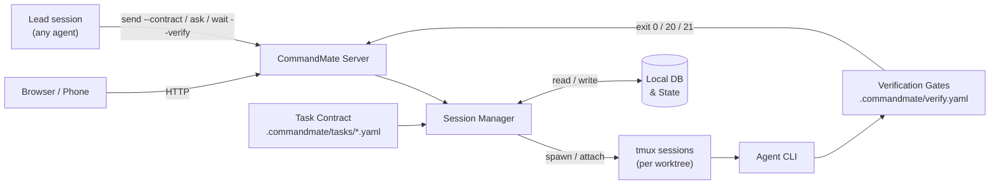

[日本語版](../../user-guide/how-it-works.md)

# How CommandMate works

The long form of the README (moved here in Issue #3061): what the lead does, what the gates decide,
how waiting reaches you, the feature tables, the supported agents, and the Vibe Engineering workflow.
The README keeps the short version; the [website](https://kewton.github.io/CommandMate/) keeps the
pitch.

---

## More agents, same you

- The agents are parallel. You are still single-threaded.
- From the outside, an idle agent and one waiting on you look the same.
- The agent's summary of what it did is not evidence of what it did.
- Nobody can safely merge a PR that nobody understands.

CommandMate puts the machinery around the CLIs you already run: a lead that hands out contracts, session state read from the agents' own hooks, gates after the work, and the record in between.

---

## One agent leads

One message to your lead session. It plans the issues — dependencies, file conflicts, waves — and hands each one to a worker in its own worktree under a contract. Gates decide which work comes back. Only what passed becomes a PR, gets merged, and goes through acceptance. Nothing mutates without an explicit approve, and a failed gate stops the run.

```yaml
# .commandmate/tasks/issue-21.yaml
version: 1
title: "Issue #21: pick(obj, keys)"
goal: |
  Implement pick(obj, keys) in src/util/pick.js with node:test cases in tests/pick.test.mjs.
  Run npm test, then commit.
scope:
  allow:
    - "src/util/pick.js"
    - "tests/pick.test.mjs"
verify:
  gates: [unit]
```

> The scope gate and the work-evidence gate are built in and run on every contract; you declare only the gates that need your project's commands.

### Measured

| Run | Lead | Workers | Result |
|---|---|---|---|
| 4 issues, one message | Claude Code | 4 × Claude Code | 4/4 gates passed, 2 waves, PRs merged, UAT go, 8 min 39 s |
| 4 issues, one message | Command Code | 4 × Command Code | 4/4 gates passed, 7 min 46 s; then a human pulled develop: 47/47 tests |
| 1 issue, with a review step | Command Code | Codex builds, Claude Code tests, Antigravity reviews | Review REJECT → fix → APPROVE, RESULT passed |

as observed

The lead is a session like any other: today it has been measured with Claude Code and Command Code. Any of the eight agents can take the work. It is a run, not a resident agent: it starts on your message and ends with a report.

---

## Verified, not vibe-checked

Gates you declared decide whether the work is done, and the exit code is the verdict: `0` passed, `20` failed, `21` no evidence of work. The agent's summary of what it did is not the evidence. The run is, and `verify history` keeps it.

<p align="center">
  
</p>

If this is the kind of AI development workflow you want, [give the repo a star](https://github.com/Kewton/CommandMate).

---

## Review by another agent

A session can hand its work to another session for review — `commandmate ask`, or the `cmate-delegate` Skill — and the answer comes back to the lead. In the measured run, Command Code led, Codex built, Claude Code wrote the tests, and Antigravity rejected the first version before approving the fix. This is a step you add; the orchestrate runner does not run a cross-model review for you.

---

## Know which one needs you

Waiting is a state read from the agent's hooks, not a guess from the screen. The waiting session shows up as a badge, a toast, the tab title, a PWA badge and a push notification, and you answer from your phone — no app to install.

<p align="center">
  
</p>

Works on desktop and mobile — monitor and steer sessions from any browser, including your phone.

<p align="center">
  
</p>

---

## What it gives you

### One agent leads

| Feature | What it does | Why it matters |
|---------|-------------|----------------|
| **cmate-orchestrate Skill** | Plans several issues at once and hands each one out with its own contract: `plan` → `dispatch` → `merge` → `uat` | Nothing mutates without `--approve`, and a failed gate stops the run |
| **Delegation between sessions** | `commandmate ask` puts a question to another session and brings the answer back; `ask --async` with `commandmate relays` when you would rather not wait, `commandmate peers` to see who is reachable, and the `cmate-delegate` Skill for the pattern | One session can hand work to another, and it works across agent CLIs |
| **Git Worktree Sessions** | One session per worktree, parallel execution | Multiple issues progress simultaneously without interference |
| **Multi-Agent Support** | Choose Claude Code, Codex, Gemini CLI, Copilot, OpenCode (1.x and V2), Antigravity, Command Code or local models per worktree | Pick the right agent for each task |
| **Auto Yes Mode** | Agent runs without stopping for confirmations | Optional unattended mode for trusted workflows — review the Security section before enabling |

### Verified, not vibe-checked

| Feature | What it does | Why it matters |
|---------|-------------|----------------|
| **Task Contract** | Declare the goal, the changeable scope and the gates before the work starts, then `send --contract` hands them to the agent | The agent works to a written definition of done instead of guessing at one |
| **Verification Gates** | Gates declared in `.commandmate/verify.yaml` run through `verify` / `wait --verify` and return exit `0` / `20` / `21` | "Done" is what a verification run returned, not what the agent said |
| **Evidence & Metrics** | The built-in work-evidence and scope gates, plus `verify history`, `task show` and `report metrics` | Commits, gate logs and numbers are left behind for the next decision |

### Know which one needs you

| Feature | What it does | Why it matters |
|---------|-------------|----------------|
| **Never miss a waiting agent** | A waiting agent shows up as a badge, a toast, the tab title, the PWA app badge and a push notification | You find out the moment an agent needs you, even away from the desk |
| **Web UI (Desktop & Mobile)** | Full session control from any browser | Monitor and steer from your desk or your phone |
| **Conversation view** | Switch a session's output between the raw terminal and a chat transcript — replies render in full, tool runs and approvals fold into chips, and a TUI dialog is answerable from the chat surface | Follow the run and answer it — from your desk or your phone — without reading the TUI |

### Method as a system

| Feature | What it does | Why it matters |
|---------|-------------|----------------|
| **Skills Catalog** | Install and update official Skills per worktree, from the web UI or `commandmate skill` | The method is installed for the agent to read, not kept in someone's head |
| **Scheduled Execution** | Cron-based auto-run via CMATE.md | Daily reviews, nightly tests — agents work on a schedule |

### Also

| Feature | What it does | Why it matters |
|---------|-------------|----------------|
| **File Viewer & Markdown Editor** | Browse and edit worktree files in the browser | Review changes and update AI instructions without opening an IDE |
| **Screenshot Instructions** | Attach images to your prompts | Snap a bug → "Fix this" — the agent sees the screenshot |
| **Token Authentication** | SHA-256 hashed token + HTTPS + rate limiting | Tokens are stored hashed and login attempts are rate-limited; see the [Security Guide](../security-guide.md) |

---

## Supported agents

All eight are first-class. Each one gets the same treatment inside CommandMate — its own launch path, its own hook source and its own status detection — so the worktree session, the task contract, the verification gates and the evidence trail behave the same way whichever agent you pick.

- **Claude Code**, **Codex**, **Gemini CLI**, **Copilot**, **Antigravity** — choose per worktree, per task.
- **OpenCode (1.x and V2)** — the open-source terminal agent, driven through the same contract-and-gate path as the rest. OpenCode V2 (`opencode2`) is counted with 1.x as one agent and can run next to it; see the [OpenCode V2 guide](./opencode-v2.md).
- **Command Code** — driven the same way, its hooks and its transcript included.
- **Local models** (`vibe-local`) — the same worktree session, contract and gates, against a model you host yourself.

---

## Use cases

| Scenario | How CommandMate helps |
|----------|----------------------|
| **Several issues, one message** | The lead plans waves, hands out contracts, and merges only what the gates passed. You read one report. |
| **Too many sessions to watch** | One list, one state per session, read from hooks. The waiting one floats up. |
| **Away from the desk** | The waiting agent reaches your phone. Approve or reject there. |
| **Review by a different agent** | Hand the diff to another session and get the verdict back in the lead's chat. |
| **Overnight execution** | Scheduled runs with contracts and gates; read the record in the morning. |

---

## From vibe coding to Vibe Engineering.

Vibe Engineering — the AI does the building; the system, not your expertise, guarantees the engineering.

We do not make the AI smarter. We make the software-engineering ability its user needed into a system.
The contract says what done means before the work starts, the gates decide it afterwards, and the
method that produced both is installed as Skills rather than remembered by whoever happened to run it.

[Concept](../concept.md) is the canonical text: the Vision, the Mission, and how each
implementation item maps to a feature.

> The term "vibe engineering" was coined by Simon Willison (2025) —
> <https://simonwillison.net/2025/Oct/7/vibe-engineering/>.

---

## Security

CommandMate runs on your machine. It sends no telemetry, needs no account, and needs no external server to run. What goes over the network depends on what you use: your agent CLI's own API calls; a check for a newer release on GitHub, from the web UI; the official Skills Catalog on GitHub, when you list or install Skills; your browser's push service, once you turn on Web Push; and Tailscale or cloudflared, while `commandmate remote` is running.

- Fully open-source ([MIT License](../../../LICENSE))
- Local database, local sessions
- For remote access, use a tunneling service ([Cloudflare Tunnel](https://developers.cloudflare.com/cloudflare-one/connections/connect-networks/), [ngrok](https://ngrok.com/), [Pinggy](https://pinggy.io/)), a VPN, or an authenticated reverse proxy

See the [Security Guide](../security-guide.md) and [Trust & Safety](../TRUST_AND_SAFETY.md) for details.

---

## App install, notifications and browsers

Installing CommandMate as an app (PWA), phone notifications (Web Push) and the minimum browser
versions are in the [Web App Guide](./webapp-guide.md#installing-as-an-app-pwa).

---

## How it works



Each Git worktree gets its own tmux session, so multiple tasks run in parallel without interference.
The contract goes in before the session starts; the gates run after it stops, and their exit code is the verdict.

---

<details>
<summary><strong>With / Without CommandMate</strong></summary>

The comparison that matters is not against other products; it is against the way of working.

| Dimension | Vibe coding | Vibe Engineering with CommandMate |
|---|---|---|
| What "done" means | The agent says it's done | A verification run says so — exit 0 / 20 / 21 |
| Scope of change | Whatever the agent touched | Declared in the contract, enforced by the scope gate |
| Method | In someone's head | Installed as Skills from the Catalog (`cmate-task-contract`, `cmate-verify`, …) |
| Evidence | A chat transcript | Commits, gate logs, `verify history`, `report metrics` |
| Parallel work | Terminal tabs | One worktree and one contract per task |
| When it stops | You notice, eventually | Waiting is surfaced: badge, toast, tab title, push |
| Which agent | Locked to one | Claude Code, Codex, Gemini CLI, Copilot, OpenCode (1.x and V2), Antigravity, Command Code, local models |

</details>

---

## Vibe Engineering workflow

<a id="issue-driven-development"></a>

The system is three things you can hand to any agent: the method, as installed Skills; the contract,
declared before the work; the gates, which decide afterwards whether the work is done.

```
Requirement → Contract → Agent runs (any CLI, per worktree) → Verified result
```

### 1. Install the method as Skills

Skills come from the official Catalog
([Kewton/commandmate-skills](https://github.com/Kewton/commandmate-skills)) and install into the
worktree you choose — from the web UI (`/skills`, or the Skills pane of a worktree) or from the CLI.

```bash
commandmate skill list
commandmate skill install cmate-task-contract --worktree <worktree-id> --version <version> --yes
```

| Skill | What it covers |
|-------|----------------|
| `cmate-issue-authoring` | Turns a feature description into a set of implementable issues |
| `cmate-issue-refinement` | Refines a vague issue into an implementable specification, read-only |
| `cmate-task-contract` | Drafts `.commandmate/tasks/<name>.yaml` from an issue: goal, scope, gates |
| `cmate-verify` | Declares the gates in `.commandmate/verify.yaml` and runs them for a real exit code |
| `cmate-verify-advisor` | Proposes gate improvements from the verification history |
| `cmate-worker-development` | The six steps a worker follows: read, investigate, plan, implement, verify, evidence |
| `cmate-acceptance-test` | Checks the issue's acceptance criteria and returns Go / Conditional Go / No-Go |
| `cmate-orchestrate` | Plans several issues in parallel, dispatches them with contracts, judges by exit code |

The Catalog also publishes `cmate-repository-analysis`, `cmate-orchestrate-monitor`,
`cmate-worktree-setup` and `cmate-worktree-cleanup`. See the
[Skills guide](./skills.md) for the support matrix, the install roots, and the
rollback story.

### 2. Declare the contract, then let the gates judge

```bash
# .commandmate/tasks/issue-123.yaml declares goal, scope.allow / scope.deny and the gates to run
commandmate send <worktree-id> --contract .commandmate/tasks/issue-123.yaml
commandmate wait <worktree-id> --verify
```

`--contract` supplies the message, so you do not pass one yourself. `wait --verify` runs the gates
once the agent stops and returns the verdict as its exit code: **0** everything passed, **20** a gate
failed, **21** the work-evidence gate found neither a commit nor an uncommitted change.

The contract format and the gate format are covered in English in the
[CLI Operations Guide](./cli-operations-guide.md) (`commandmate task` and `commandmate verify`).

### Read next

| Document | What it gives you |
|----------|-------------------|
| [Concept](../concept.md) | The Vision, the Mission, and how each implementation item maps to a feature |
| [Tutorial](./tutorial.md) | Fork a sample repository and run one task through contract and verification in about fifteen minutes |
| [Product Highlights](../features/product-highlights.md) | A feature-by-feature tour of the product |
| [CLI Operations Guide](./cli-operations-guide.md) | Every agent-facing command, in depth |

> **Developing CommandMate itself?** The `/work-plan`, `/pm-auto-dev` and other slash commands under
> `.claude/commands` belong to **this repository only** — they are not installed into yours, and the
> portable equivalents are the Catalog Skills above. See the
> [Commands guide](./commands-guide.md).
