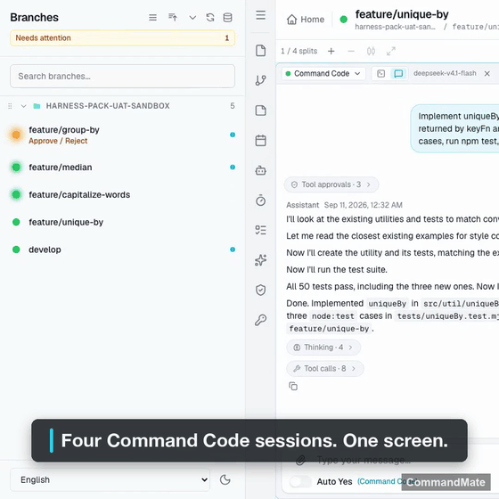
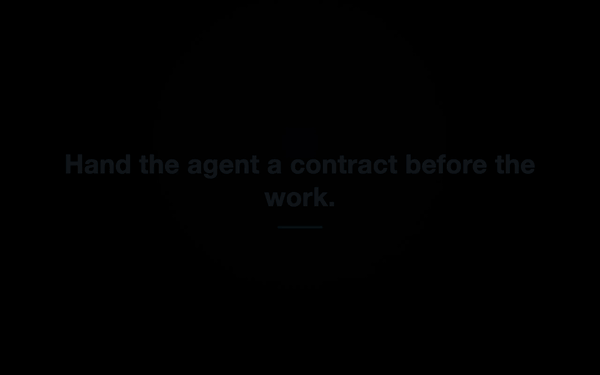
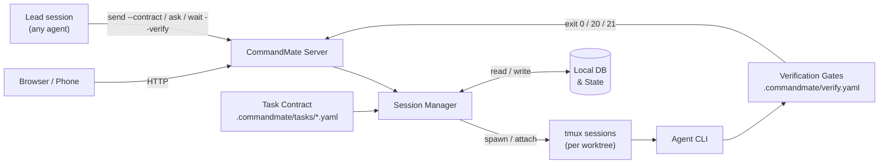
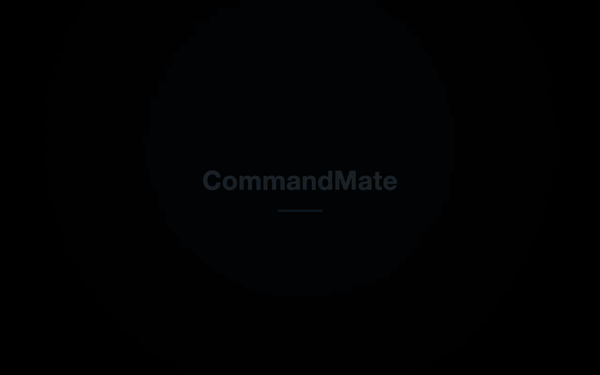

[日本語版](../../user-guide/how-it-works.md)

# How CommandMate works

The long form of the README, in the README's order: Level 1 — Parallel, Level 2 — Delegate,
Level 3 — Manage and Next — Learn, then Anywhere, the supported agents, security and what has been
measured. The README keeps the short version; the [website](https://kewton.github.io/CommandMate/)
keeps the pitch.

The levels are cut by how far you take part, not by how advanced the feature is. Most people need
only Level 2. Stop at the level that fits you; nothing here asks you to climb.

---

## Level 1 — Parallel

Your role: the operator. You read each agent's question and answer it.

Run Claude Code, Codex, Gemini CLI, Copilot, OpenCode (1.x and V2), Antigravity, Command Code or
local models side by side. Each task gets its own session in its own Git worktree, so two agents
never edit the same files.

From the outside, an idle agent and one waiting on you look the same. In CommandMate, waiting is a
state read from the agent's own hooks, not a guess from the screen. The waiting session shows up as
a badge, a toast and the tab title, and you answer it like a chat.

<p align="center">
  
</p>

| Feature | What it does | Why it matters |
|---------|-------------|----------------|
| **Git Worktree Sessions** | One session per worktree, parallel execution | Multiple issues progress simultaneously without interference |
| **Multi-Agent Support** | Choose the agent per worktree (see [Supported agents](#supported-agents)) | Pick the right agent for each task |
| **Status from hooks** | One list, one state per session, read from the agents' hooks; the waiting one floats up | You see which agent needs you without opening every terminal |
| **Conversation view** | Switch a session's output between the raw terminal and a chat transcript — replies render in full, tool runs and approvals fold into chips, and a TUI dialog is answerable from the chat surface | Follow the run and answer it without reading the TUI |
| **File Viewer & Markdown Editor** | Browse and edit worktree files in the browser | Review changes and update AI instructions without opening an IDE |
| **Screenshot Instructions** | Attach images to your prompts | Snap a bug → "Fix this" — the agent sees the screenshot |
| **Auto Yes Mode** | Agent runs without stopping for confirmations | Optional unattended mode for trusted workflows — review the [Security](#security) section before enabling |

---

## Level 2 — Delegate

Your role: the product or tech lead. You decide what to build and accept what passed.

<a id="issue-driven-development"></a>

Hand over an issue, not a chat message. Each issue goes out as a task contract: a short file in your
repository that says the goal, which files the agent may change, and which checks must pass.

```yaml
# .commandmate/tasks/issue-21.yaml
version: 1
title: "Issue #21: pick(obj, keys)"
goal: |
  Implement pick(obj, keys) in src/util/pick.js with node:test cases in tests/pick.test.mjs.
  Run npm test, then commit.
scope:
  allow:
    - "src/util/pick.js"
    - "tests/pick.test.mjs"
verify:
  gates: [unit]
```

```bash
commandmate send <worktree-id> --contract .commandmate/tasks/issue-21.yaml
commandmate wait <worktree-id> --verify
```

`--contract` supplies the message, so you do not pass one yourself. When the agent stops,
`wait --verify` runs the gates you declared in `.commandmate/verify.yaml`, and the exit code is the
verdict: **0** everything passed, **20** a gate failed, **21** the work-evidence gate found neither a
commit nor an uncommitted change. The agent's summary of what it did is not the evidence. The run is,
and `verify history` keeps it.

> The scope gate and the work-evidence gate are built in and run on every contract; you declare only
> the gates that need your project's commands.

<p align="center">
  
</p>

The contract format and the gate format are covered in the
[CLI Operations Guide](./cli-operations-guide.md) (`commandmate task` and `commandmate verify`).

If this is the kind of AI development workflow you want, [give the repo a star](https://github.com/Kewton/CommandMate).

### Review by another agent

A session can hand its work to another session for review — `commandmate ask`, or the
`cmate-delegate` Skill — and the answer comes back to the session that asked. This is a step you
add; the orchestrate runner does not run a cross-model review for you. The measured run is in
[Measured](#measured).

### The method comes as Skills

The contract says what done means before the work starts, the gates decide it afterwards, and the
method that produced both is installed as Skills rather than remembered by whoever happened to run
it. That is what this project calls Vibe Engineering; [Concept](../concept.md) is the canonical text.

> The term "vibe engineering" was coined by Simon Willison (2025) —
> <https://simonwillison.net/2025/Oct/7/vibe-engineering/>.

Skills come from the official Catalog
([Kewton/commandmate-skills](https://github.com/Kewton/commandmate-skills)) and install into the
worktree you choose — from the web UI (`/skills`, or the Skills pane of a worktree) or from the CLI.

```bash
commandmate skill list
commandmate skill install cmate-task-contract --worktree <worktree-id> --version <version> --yes
```

| Skill | What it covers |
|-------|----------------|
| `cmate-issue-authoring` | Turns a feature description into a set of implementable issues |
| `cmate-issue-refinement` | Refines a vague issue into an implementable specification, read-only |
| `cmate-task-contract` | Drafts `.commandmate/tasks/<name>.yaml` from an issue: goal, scope, gates |
| `cmate-verify` | Declares the gates in `.commandmate/verify.yaml` and runs them for a real exit code |
| `cmate-verify-advisor` | Proposes gate improvements from the verification history |
| `cmate-worker-development` | The six steps a worker follows: read, investigate, plan, implement, verify, evidence |
| `cmate-acceptance-test` | Checks the issue's acceptance criteria and returns Go / Conditional Go / No-Go |
| `cmate-orchestrate` | Plans several issues in parallel, dispatches them with contracts, judges by exit code (Level 3) |

The Catalog also publishes `cmate-repository-analysis`, `cmate-orchestrate-monitor`,
`cmate-worktree-setup` and `cmate-worktree-cleanup`. See the [Skills guide](./skills.md) for the
support matrix, the install roots, and the rollback story.

| Feature | What it does | Why it matters |
|---------|-------------|----------------|
| **Task Contract** | Declare the goal, the changeable scope and the gates before the work starts, then `send --contract` hands them to the agent | The agent works to a written definition of done instead of guessing at one |
| **Verification Gates** | Gates declared in `.commandmate/verify.yaml` run through `verify` / `wait --verify` and return exit `0` / `20` / `21` | "Done" is what a verification run returned, not what the agent said |
| **Evidence & Metrics** | The built-in work-evidence and scope gates, plus `verify history`, `task show` and `report metrics` | Commits, gate logs and numbers are left behind for the next decision |
| **Delegation between sessions** | `commandmate ask` puts a question to another session and brings the answer back; `ask --async` with `commandmate relays` when you would rather not wait, `commandmate peers` to see who is reachable, and the `cmate-delegate` Skill for the pattern | One session can hand work to another, and it works across agent CLIs |
| **Skills Catalog** | Install and update official Skills per worktree, from the web UI or `commandmate skill` | The method is installed for the agent to read, not kept in someone's head |

---

## Level 3 — Manage

Your role: the owner. You set the direction, answer the PM, and approve.

Talk to one PM agent instead of to every agent. The PM is a lead session like any other. Send it one
message: it plans the issues — dependencies, file conflicts, waves — and hands each one to a worker
in its own worktree under a contract, as in Level 2. Only what passed the gates becomes a PR, gets
merged, and goes through acceptance. Every step that changes something waits for your approval, and
a failed gate stops the run.

It is a run, not a resident agent: it starts on your message, or at the times you set, and ends with
a report.



Each Git worktree gets its own tmux session. The contract goes in before the session starts; the
gates run after it stops, and their exit code is the verdict.

| Feature | What it does | Why it matters |
|---------|-------------|----------------|
| **cmate-orchestrate Skill** | Plans several issues at once and hands each one out with its own contract: `plan` → `dispatch` → `merge` → `uat` | Nothing mutates without `--approve`, and a failed gate stops the run |
| **Scheduled Execution** | Cron-based start via CMATE.md | The PM, or any session, can start at the times you set |

---

## Next — Learn

Not built yet, and only a direction: use the record each piece of work leaves behind to improve how
the next one is done.

---

## Anywhere

At every level you can answer and approve from your phone's browser, so the work does not stop when
you leave the desk. There is no app to install.

<p align="center">
  
</p>

| Feature | What it does | Why it matters |
|---------|-------------|----------------|
| **Web UI (Desktop & Mobile)** | Full session control from any browser | Monitor and steer from your desk or your phone |
| **Never miss a waiting agent** | A waiting agent also shows up as the PWA app badge and a push notification | You find out the moment an agent needs you, even away from the desk |
| **`commandmate remote`** | Publishes the server over Tailscale or Cloudflare Tunnel and pairs your phone with a QR code | Reach your own machine from your phone; see the [CLI Operations Guide](./cli-operations-guide.md#commandmate-remote) |

Installing CommandMate as an app (PWA), phone notifications (Web Push) and the minimum browser
versions are in the [Web App Guide](./webapp-guide.md#installing-as-an-app-pwa).

---

## Supported agents

All eight are first-class. Each one gets the same treatment inside CommandMate — its own launch path, its own hook source and its own status detection — so the worktree session, the task contract, the verification gates and the evidence trail behave the same way whichever agent you pick.

- **Claude Code**, **Codex**, **Gemini CLI**, **Copilot**, **Antigravity** — choose per worktree, per task.
- **OpenCode (1.x and V2)** — the open-source terminal agent, driven through the same contract-and-gate path as the rest. OpenCode V2 (`opencode2`) is counted with 1.x as one agent and can run next to it; see the [OpenCode V2 guide](./opencode-v2.md).
- **Command Code** — driven the same way, its hooks and its transcript included.
- **Local models** (`vibe-local`) — the same worktree session, contract and gates, against a model you host yourself.

---

## Security

CommandMate runs on your machine. It sends no telemetry, needs no account, and needs no external server to run. What goes over the network depends on what you use: your agent CLI's own API calls; a check for a newer release on GitHub, from the web UI; the official Skills Catalog on GitHub, when you list or install Skills; your browser's push service, once you turn on Web Push; and Tailscale or cloudflared, while `commandmate remote` is running.

- Fully open-source ([MIT License](../../../LICENSE))
- Local database, local sessions
- Token authentication: SHA-256 hashed token + HTTPS + rate limiting
- For remote access, use a tunneling service ([Cloudflare Tunnel](https://developers.cloudflare.com/cloudflare-one/connections/connect-networks/), [ngrok](https://ngrok.com/), [Pinggy](https://pinggy.io/)), a VPN, or an authenticated reverse proxy

See the [Security Guide](../security-guide.md) and [Trust & Safety](../TRUST_AND_SAFETY.md) for details.

---

## Measured

| Run | Lead | Workers | Result |
|---|---|---|---|
| 4 issues, one message | Claude Code | 4 × Claude Code | 4/4 gates passed, 2 waves, PRs merged, UAT go, 8 min 39 s |
| 4 issues, one message | Command Code | 4 × Command Code | 4/4 gates passed, 7 min 46 s; then a human pulled develop: 47/47 tests |
| 1 issue, with a review step | Command Code | Codex builds, Claude Code tests, Antigravity reviews | Review REJECT → fix → APPROVE, RESULT passed |

as observed

As the lead (the PM in Level 3), CommandMate has been measured with Claude Code and Command Code so
far. Any of the eight agents can take the work. In the review run, Antigravity rejected
the first version before approving the fix.

---

## Read next

| Document | What it gives you |
|----------|-------------------|
| [Concept](../concept.md) | The Vision, the Mission, and how each implementation item maps to a feature |
| [Tutorial](./tutorial.md) | Fork a sample repository and run one task through contract and verification in about fifteen minutes |
| [Product Highlights](../features/product-highlights.md) | A feature-by-feature tour of the product |
| [CLI Operations Guide](./cli-operations-guide.md) | Every agent-facing command, in depth |

> **Developing CommandMate itself?** The `/work-plan`, `/pm-auto-dev` and other slash commands under
> `.claude/commands` belong to **this repository only** — they are not installed into yours, and the
> portable equivalents are the Catalog Skills above. See the
> [Commands guide](./commands-guide.md).
