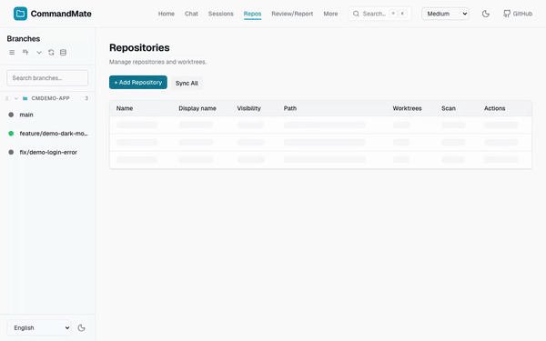
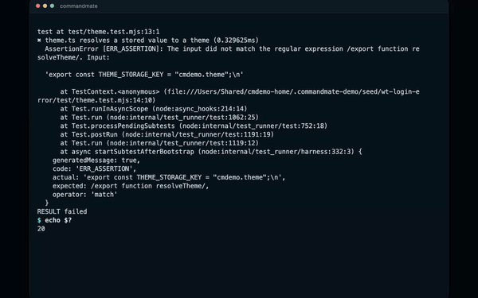
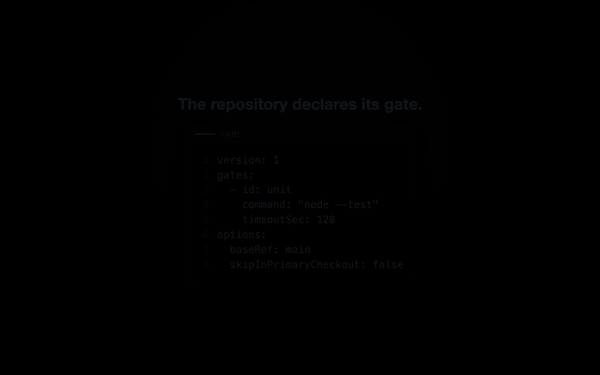
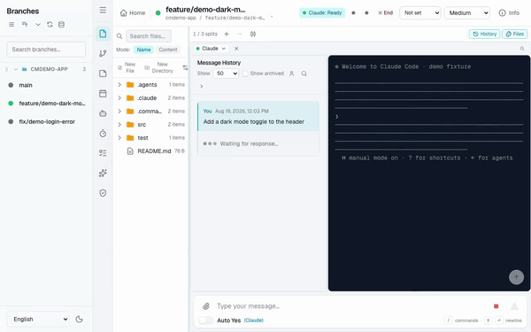
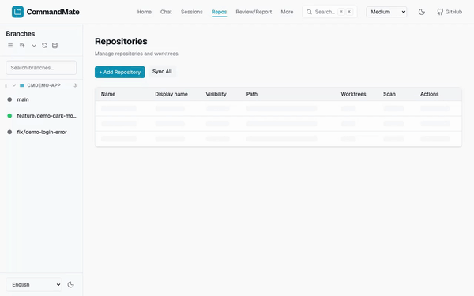
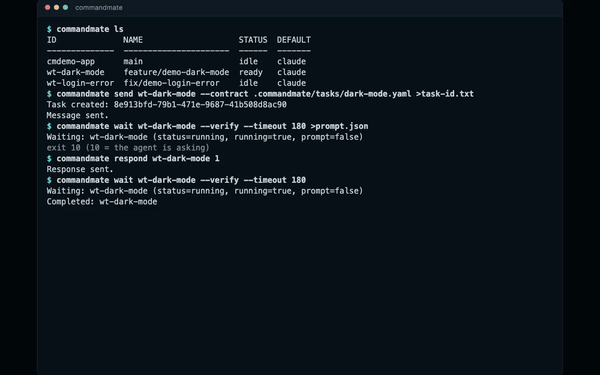

[日本語版](../../user-guide/tutorial.md)

# Tutorial

Use a sample repository with two bugs left in on purpose to work through the core of CommandMate in about fifteen minutes. You fork the sample repository before you start, so nothing you do can touch the original repository (upstream). You hand the agent a contract before the work and let the verification gates judge it afterwards, and you read the verdict off the real exit code.

> **Vibe Engineering** — the AI does the building; the system, not your expertise, guarantees the engineering.

- Sample repository: [Kewton/commandmate-tutorial](https://github.com/Kewton/commandmate-tutorial)
- It has no dependencies. There is no `npm install`; `npm test` and `npm start` work on their own
- How you invoke the CLI (a global install, or `npx`) is covered in the [CLI Setup Guide](./cli-setup-guide.md); this page writes every command as `commandmate …`

Each step carries a GIF of that operation being run for real.

Every block of output on this page is **measured from one real pass through this tutorial** (CommandMate 0.24.0, Claude Code, Node 22). **Run numbers such as `run 3` belong to that pass**, so yours will differ.

> **How the GIFs were recorded**
> Everything was recorded in an isolated environment — a throwaway seed repository, a dedicated port,
> a dedicated database and a substituted `$HOME` — so no private repository name, personal path or
> source code appears in them.
> No real LLM is involved: a "fake agent" replays a captured terminal transcript inside a tmux
> session. **The LLM is the only thing replaced.** The screens, the status detection, the response
> polling and **the verification gates** are all the product's own code, so the `GATE` lines in the
> footage are real exit codes.
> The sample repository inside that isolated environment is not this tutorial's one, so the worktree
> names and contract file names on screen will not match yours.
> Each caption describes **only what is on screen**.

---

## What you will have done by the end

| Step | The CommandMate feature | What an engineer would care about here |
|---|---|---|
| 0 | Fork & Add — fork, then register into the managed root | Do not dirty upstream |
| 1 | Registering a repository and getting a session | — |
| 2 | Installing Skills from the Catalog into a worktree | Put the method somewhere a team can share |
| 3 | `commandmate verify` — see the declared gate go red | Make "done" machine-readable before you start |
| 4 | `send --contract` / `wait --verify` — contract in, verdict out | Decide the allowed scope and the judge up front |
| 5 | One session per worktree, one gate per contract | Parallel is safe only with isolation and separate gates |
| 6 | `verify history` / `task show` / the Review screen / `report metrics` | The record outlives the chat |
| 7 | (Optional) Open a pull request | — |
| Appendix | The same loop with OpenCode or Command Code | That the verdict does not depend on which agent did the work |

---

## Prerequisites

- **CommandMate 0.24.0 or newer**, running. If not: `npx commandmate@latest`
  The contracts in the sample repository carry their own gate definitions (`gateDefinitions`), which needs 0.24.0 or newer
- **Node.js 22+**
- **One agent CLI**: Claude Code, Codex, Antigravity, OpenCode, or Command Code
  Every measurement on this page was taken with Claude Code; the [appendix](#appendix-run-the-same-loop-with-opencode-or-command-code) runs the same round with OpenCode and Command Code
- **A GitHub account** — you will fork the sample repository
- **An authenticated `gh` (GitHub CLI)** — only if you use **Fork & Add** in Step 0

---

## Step 0: Fork the sample repository

Fork it on GitHub first. The point of the fork is that `origin` becomes **your own copy**: you are about to let an agent commit to this repository, and it should be committing to your copy.

There are two ways.

**A. Fork & Add (needs an authenticated `gh`)**

In CommandMate, open **Repositories → Add Repository → Clone URL** and paste:

```
https://github.com/Kewton/commandmate-tutorial.git
```

Turn on **Fork before adding (gh repo fork)** and the button becomes **Fork & Add**. CommandMate forks it to your account with `gh`, clones your fork, and registers it (`origin` = your fork, `upstream` = the original).

**B. Fork it by hand**

```bash
gh repo fork Kewton/commandmate-tutorial --clone=false
```

Or use the **Fork** button on GitHub. Then open the **Clone URL** tab and paste **your fork's** clone URL.

```
https://github.com/<your-username>/commandmate-tutorial.git
```

---

## Step 1: Register your fork with CommandMate

Either way, the clone lands inside CommandMate's managed root directory (`CM_ROOT_DIR`) and one session, on `main`, appears in the list.



**What you see**: the **Repositories** screen, **Add Repository** pressed, a path typed in and recognised as a git repository, **Scan & Add** run, and a row appearing in the repository list.

> **Where the footage differs from these steps**: the steps above import from the **Clone URL** tab, but the recording uses the **Local Path** tab to add a repository from disk, because the recording environment has no network access (only `https://` / `git@` / `ssh://` are accepted as clone URLs — a local path is not; `src/lib/url-normalizer.ts`). It is the other tab of the same dialog, and the outcome — registered, and in the list — is the same.

Every command below takes a **worktree ID**. The ID comes from the **directory name**, so a straightforward clone of your fork gives you `commandmate-tutorial`. Check it:

```bash
commandmate ls
```

```
ID                    NAME  STATUS  DEFAULT
--------------------  ----  ------  -------
commandmate-tutorial  main  idle    claude
```

> **Note**: CommandMate cannot register a path outside its managed root. The worktree you create in Step 5 has to live under that root too.

---

## Step 2: Install the method as Skills

> **What an engineer would care about here**: put the method somewhere a team can share.

CommandMate installs **Agent Skills** from the official Catalog, per worktree. Install two of them:

| Skill | What it teaches the agent |
|---|---|
| `cmate-verify` | To run the gates and read the verdict off the **real exit code** |
| `cmate-task-contract` | To work inside an execution contract — stay in scope, leave evidence |

### 2-1. Open the Skills pane

Open the session that appeared in Step 1 (the worktree detail screen).

- **Desktop**: open **Skills** (the ✨ icon) in the activity bar
- **Phone**: **Tools** tab → **Skills**

**Installed in this worktree** is on top, **Install from the Catalog** below it.

### 2-2. Install both from the Catalog

1. Pick `cmate-verify` under **Install from the Catalog**
2. Press **Build install plan**. Nothing is written at this point — you get a preview of **what would be written, and where**
3. Read it, then press **Install into this worktree**
4. Do the same for `cmate-task-contract`


**What you see**: a Catalog entry opened in the Skills pane, **Build install plan** listing the files that would be written, **Install into this worktree** pressed, and the completion panel appearing. Then `/` typed in the composer, the commands this worktree offers listed, and Escape closing the list.

**It installs into two directories.** CommandMate writes the same payload into **both** `.agents/skills/<skill-id>/` and `.claude/skills/<skill-id>/` (`SKILL_INSTALL_ROOT_PREFIXES`, `src/lib/skills/constants.ts`). Agents read different directories, so installing into only one of them leaves the Skill invisible to some of them.

### 2-3. Restart the session

An agent reads its discovery directory **at startup**. Installing alone does not make a Skill usable, so **restart this worktree's session**. The UI says so too: "Restart the agent sessions listed below to start using it."

### 2-4. Updating and removing

**Skills can be updated.** When a newer version is published the entry carries an **Update available** badge; **Review update** → **Build update plan** shows the diff (files added, updated, removed, and any change in declared permissions) before anything is applied. From the CLI that is `commandmate skill update <skill-id> --worktree <worktree-id>`.

- If you edited an installed file by hand, CommandMate **stops instead of overwriting it**. Restore the file, or uninstall and install again
- An update that raises the Skill's effective risk demands a **separate, additional** confirmation on top of the normal one
- To remove one: `commandmate skill uninstall <skill-id> --worktree <worktree-id>`
- Leave **high-risk Skills** such as `cmate-worktree-cleanup` and `cmate-orchestrate` out of a first run
- For the constraints and the rollback procedure see [Agent Skills Distribution](./skills.md)

---

## Step 3: Run the gate before you touch anything

> **What an engineer would care about here**: make "done" machine-readable before you start.

The sample repository ships its verification config. Read it first:

```yaml
# .commandmate/verify.yaml
version: 1
gates:
  - id: unit
    command: npm test
    timeoutSec: 120
```

That is the declaration of what "done" means in this repository. Run it:

```bash
commandmate verify commandmate-tutorial --gates unit
```

```
Verifying: commandmate-tutorial (run 3)
GATE unit FAIL (exit=1, 0.2s)
  ✖ greet ends with an exclamation mark
      + actual   - expected
      + 'Hello, World'
      - 'Hello, World!'
  ✖ shout uppercases the greeting
      Error: shout() is not implemented yet
RESULT failed
```

```bash
echo $?   # 20
```

**Exit 20 means a declared gate failed**, and that is the correct starting point. Everything after this is about turning that number into 0.

> **Why `--gates unit` is spelled out (measured)**: `commandmate verify <id>` with no gate named runs the built-in **work-evidence** gate as well as the ones in `verify.yaml`. On a checkout where you have not written a line yet, work-evidence fails first, the declared gates are recorded as `SKIP`, and the run comes back `RESULT not_started` — **exit 21**.
> "Nothing has been done yet" (21) and "there is work, and it does not meet the bar" (20) are different states, and CommandMate returns different exit codes for them. Name the gate when you want to see the **declared** criterion alone, before any work exists.



**What you see**: a terminal holding the failing test output above `RESULT failed`, with `$ echo $?` below it returning `20`. Then `$ commandmate verify history --worktree wt-login-error` and that run listed on one line as `manual  failed  failed: unit`.

---

## Step 4: Hand over a contract and let the gates answer

> **What an engineer would care about here**: decide the allowed scope and the judge up front.

### 4-1. Read the contract

Instead of describing the bug in a chat message, you send a **contract**. Here is the first one, shipped with the sample repository:

```yaml
# .commandmate/tasks/fix-greet.yaml
version: 1
title: "greet() ends with an exclamation mark"
goal: |
  `npm run test:greet` fails. Fix only that failure in src/greet.js, then run the tests again.
  Do not touch shout().
scope:
  allow: ["src/greet.js"]
  deny: ["test/**", ".commandmate/**"]
verify:
  gates: [issue-greet]
  gateDefinitions:
    - id: issue-greet
      command: npm run test:greet
      timeoutSec: 120
autoYes:
  mode: off
success:
  requireWorkEvidence: true
  requireScopeClean: true
```

Three things are worth reading closely:

- **`scope`** — only `src/greet.js` may be touched, and `test/**` is denied outright, so the agent cannot "fix" the test instead of the code
- **`verify.gates` and `gateDefinitions`** — this work is judged by `issue-greet` (`npm run test:greet`), a gate **the contract defines itself**, not by the repository-wide `unit`
- **`success`** — no work evidence means a fail, and a scope violation means a fail

### 4-2. Send it with the contract

```bash
commandmate send commandmate-tutorial --contract .commandmate/tasks/fix-greet.yaml
```

```
Task created: 79c50846-55c9-4fc1-8bb3-e10b0fb698c2
Message sent.
```

CommandMate records a task and hands the agent the contract's goal along with its scope.

> **Using something other than Claude Code?** Name the target with `--instance` and everything
> after that is the same — neither the contract nor the gates branch on the agent. See
> [Appendix: run the same loop with OpenCode or Command Code](#appendix-run-the-same-loop-with-opencode-or-command-code).



**What you see**: the verification config (`verify.yaml`) and the contract file shown one card at a time, then a terminal running `commandmate ls`, `commandmate send <id> --contract <path>`, and a `commandmate wait <id> --verify` that returns `exit 10` because the agent is asking; after `commandmate respond <id> 1` the second `wait` prints `GATE work-evidence PASS` / `GATE scope PASS` / `GATE unit PASS` / `RESULT passed` and `echo $?` returns `0`.

> **Where the footage differs from these steps**: it was filmed against the isolated environment's own sample repository, so the worktree name (`wt-dark-mode`), the contract file (`dark-mode.yaml`) and the gate (`unit`) are not the ones you have (`commandmate-tutorial` / `fix-greet.yaml` / `issue-greet`). The sequence of commands, and the fact that the verdict comes back as `GATE` lines, a `RESULT` and an exit code, are the same.

### 4-3. When it stops for approval

An agent may **stop and ask** before it edits a file or runs a command. Not noticing that looks exactly like "it is broken", so find out where you answer before it happens.

- In the list, that session's status becomes **Waiting for response** (the **Overview** screen counts it under **Waiting**)
- **Desktop**: answer in the session screen
- **Phone width**: a **sheet** opens from the bottom of the screen and you answer there
- **Terminal**: `commandmate wait` **returns exit 10 when it detects a prompt** and prints it as JSON. Answer with `commandmate respond <worktree-id> 1`, then `wait` again



**What you see**: a task sent from the desktop and the agent starting to generate, then a phone-width screen where the approval sheet opens, an option is answered, and the session carries on.

There is an **Auto Yes** mode that answers every confirmation for you, but it means passing things through without reading what they run, so this tutorial leaves it off — and the contract declares `autoYes: mode: off` too.

### 4-4. Read the verdict

```bash
commandmate wait commandmate-tutorial --verify
```

```
Completed: commandmate-tutorial
Verifying: commandmate-tutorial (run 4)
GATE work-evidence PASS (commits=1, uncommitted=0)
GATE scope PASS (exit=0, 0.1s)
GATE issue-greet PASS (exit=0, 0.2s) [contract]
RESULT passed
```

```bash
echo $?   # 0
```

**Exit 0.** Note what was judged: `issue-greet`, marked `[contract]` — the gate the contract defined — and not the repository-wide `unit`. `npm test` is still red because `shout()` is still unimplemented, and that is fine. **One contract, one gate, one verdict.**

---

## Step 5: Go parallel with a second worktree

> **What an engineer would care about here**: parallel is safe only with isolation and separate gates.

CommandMate runs **one session per git worktree**, side by side. It does not *create* worktrees, though — it *discovers* and registers them. So have the agent create one.

### 5-1. Create the worktree

**Claude Code / Codex** — a `worktree-new` skill ships with the sample repository:

```
/worktree-new fix/shout
```

**Antigravity / OpenCode / Command Code** — `worktree-new` is verified with Claude Code (`.claude/skills/`) and Codex (`.agents/skills/`) but **not with these three**. Paste this instead — it goes through no Skill, so any agent reads it the same way:

> Create a git worktree for a new branch `fix/shout`.
> Put it next to this repository, as a sibling directory named
> `commandmate-tutorial-fix-shout`, using
> `git worktree add -b fix/shout ../commandmate-tutorial-fix-shout`.
> Stop if that directory already exists. Print the path you created.
> Do not use `--force`.

### 5-2. Let CommandMate pick it up

Press **Sync All** on the **Repositories** screen, or run:

```bash
commandmate sync
```

```
Successfully synced 2 worktree(s) from 1 repository/repositories
```

The new worktree appears as a second session.



**What you see**: **Sync All** run on the **Repositories** screen so CommandMate picks up a worktree made outside it, and the list carrying one session per branch.

### 5-3. Send the second contract

```bash
commandmate send commandmate-tutorial-fix-shout --contract .commandmate/tasks/fix-shout.yaml
commandmate wait commandmate-tutorial-fix-shout --verify
```

```
GATE work-evidence PASS (commits=1, uncommitted=0)
GATE scope PASS (exit=0, 0.0s)
GATE issue-shout PASS (exit=0, 0.2s) [contract]
RESULT passed
```

Two branches, two agents, two gates. Each may only touch `src/greet.js` and each is judged by its own test, so **neither one could have passed by breaking the other**.

You can also run **both at once from the start**: create the worktree (5-1 and 5-2) before Step 4, send the two contracts back to back, and wait for both with one command. The output below is measured from that ordering.

```bash
commandmate send commandmate-tutorial --contract .commandmate/tasks/fix-greet.yaml
commandmate send commandmate-tutorial-fix-shout --contract .commandmate/tasks/fix-shout.yaml
commandmate wait commandmate-tutorial commandmate-tutorial-fix-shout --verify
```

```
Completed: commandmate-tutorial
Completed: commandmate-tutorial-fix-shout
Verifying: commandmate-tutorial (run 4)
GATE issue-greet PASS (exit=0, 0.2s) [contract]
RESULT passed
Verifying: commandmate-tutorial-fix-shout (run 5)
GATE issue-shout PASS (exit=0, 0.2s) [contract]
RESULT passed
```

```bash
echo $?   # 0
```

> **`wait --verify` judges against an open contract (measured)**: the single wait above returns 0 for both because **both contracts were still open** when it was called. Once a task has been judged and is `succeeded`, a further `wait --verify` on that worktree is no longer attached to it and falls back to the repository's default gates (`unit` = `npm test`). In the worktree where you fixed `greet`, `shout()` is still unimplemented, so that re-verification comes back **exit 20**. Nothing is wrong: `npm test` really is red there.

---

## Step 6: Read the record

> **What an engineer would care about here**: the record outlives the chat.

None of the verdicts above depended on you watching them happen. They are **stored**.

```bash
commandmate verify history --worktree commandmate-tutorial
```

```
#4  2026-08-19T02:45:21.839Z  commandmate-tutorial  wait    passed
#3  2026-08-19T02:43:07.471Z  commandmate-tutorial  manual  failed       failed: unit
#2  2026-08-19T02:42:52.059Z  commandmate-tutorial  manual  failed       failed: unit
#1  2026-08-19T02:42:51.231Z  commandmate-tutorial  manual  not_started  failed: work-evidence
```

Step 3's red runs (`#2` / `#3`), the `not_started` from running it without naming a gate (`#1`) and Step 4's pass (`#4`) are all there. Read one run in full with `commandmate verify show <run-id>`.

```bash
commandmate task list commandmate-tutorial-fix-shout
commandmate task show d1e3a7f4-5fa0-4f69-b72b-b06d0ba7a068
```

```
ID:        d1e3a7f4-5fa0-4f69-b72b-b06d0ba7a068
STATUS:    succeeded
WORKTREE:  commandmate-tutorial-fix-shout
AGENT:     claude
TITLE:     shout() uppercases the greeting
CONTRACT:  .commandmate/tasks/fix-shout.yaml
SCOPE:     src/greet.js
DENY:      test/**, .commandmate/**
GATES:     issue-shout
GATE-DEF:  issue-shout  npm run test:shout  (timeoutSec=120)
AUTO-YES:  off
VERIFY:    run 5 passed
  GATE work-evidence passed (exit=0)
  GATE scope passed (exit=0)
  GATE issue-shout passed (exit=0)
```

The contract, the run that judged it and every gate result, on one screen. **That is the artifact you review** — not a chat transcript.


**What you see**: a session's status returning to ready in the list once it has finished generating, and the session screen's **Git** pane opened to show the diff of the uncommitted changes.



**What you see**: a terminal running `commandmate verify history --worktree <id>` and listing the run on one line, then `commandmate task show <task-id>` printing the task's status, the contract file path, `SCOPE`, `GATES`, `AUTO-YES`, and each gate result of the run that judged it (`GATE work-evidence passed` / `GATE scope passed` / `GATE unit passed`).

To collect everything that needs an answer across worktrees on one screen, open the **Review** screen (`/review?filter=approval`). For the same thing as numbers:

```bash
commandmate report metrics --days 1
```

```
Vibe Metrics (last 1 days)
Tasks:        2 total / 2 succeeded / 0 failed / 0 not-started  (success 100.0%)
Verification: 5 runs, pass 40.0%  (top fails: unit x2, work-evidence x1)
Intervention: 0 human responds / 0 auto answered
Retry loops:  n/a per failed task
```

---

## Step 7: (Optional) Open a pull request

Each worktree can raise its own pull request.

```bash
gh pr create --fill
```

If you want the acceptance criteria themselves installed as a Skill, add `cmate-acceptance-test` from the official Catalog exactly as in Step 2.

---

## Appendix: run the same loop with OpenCode or Command Code

> **What an engineer would care about here**: if the verdict depends on which agent produced the work, it is not a verdict — it is a compatibility accident.

Every measurement in this page was taken with Claude Code, but the loop itself — **contract in,
send, verification gate out** — does not depend on the agent. The only thing that changes is **how
you name the target**. This appendix runs the same Step 3 → Step 4 → Step 6 round with OpenCode and
with Command Code.

### A-1. Why it does not depend on the agent

- **The contract is YAML, and what reaches the agent is plain text.** CommandMate composes the
  preamble (`## 実行契約` / `## タスク`) from the contract and sends it to the session. Nothing in
  that composition branches on the agent (`composeContractMessage()`,
  `src/lib/tasks/contract-message.ts`)
- **A gate is a shell command run in the worktree's working directory.** Pass or fail comes from
  that process's exit code, and the agent takes no part in the judgement. `command: npm test` in
  `.commandmate/verify.yaml` runs the same way over anyone's code

So Step 3 (`commandmate verify`) and Step 6 (`verify history` / `task show` / `report metrics`)
work with **exactly the commands in the body of this page**. The only commands that need a target
are the two that touch an agent session: `send` and `wait`.

### A-2. Name the target

Pass **a CLI tool id itself** to `--instance` and it resolves to that tool's **primary instance**.
No roster entry is needed up front, and `send` starts the session if it is not running.

```bash
# one round with OpenCode
commandmate send commandmate-tutorial --contract .commandmate/tasks/fix-greet.yaml --instance opencode
commandmate wait commandmate-tutorial --instance opencode --verify
echo $?
```

```bash
# one round with Command Code
commandmate send commandmate-tutorial --contract .commandmate/tasks/fix-greet.yaml --instance command-code
commandmate wait commandmate-tutorial --instance command-code --verify
echo $?
```

What comes back has the same shape as Step 4-4 (`GATE` lines → `RESULT` → an exit code), and the
gate that judges it is still `issue-greet`. The contract did not change, so there is nothing for it
to change into.

> **Write `--instance` on `wait` too.** `wait` has no `--agent`. Name the target only on `send` and
> call a bare `wait`, and what you are waiting on is the worktree's **default agent** — so you can
> "detect completion" of Claude Code while the OpenCode session you actually sent to is still
> running, and nothing errors out
> ([CLI Operations Guide](./cli-operations-guide.md#commandmate-wait)).

### A-3. Check that the target took

You can read back where the target actually resolved:

```bash
commandmate capture commandmate-tutorial --instance opencode --json | jq -r '.cliTool, .instanceId, .resolvedBy'
```

Expect `opencode` / `opencode` / `primary`. If `resolvedBy` comes back `worktree-default`, that
`--instance` matched neither a roster entry nor a CLI tool id, and it fell through to the
worktree's **default agent**.

To put it on the roster so the same instance is also managed from the Agent pane in the browser UI
(optional; `--agent` declares the CLI tool of the new roster row and is required by `add`):

```bash
commandmate instances commandmate-tutorial add --agent opencode
commandmate instances commandmate-tutorial
```

See the [CLI Operations Guide](./cli-operations-guide.md#commandmate-instances) for the details.

### A-4. What does change per agent

The loop is shared; these three are not. They are listed separately so that nothing shared gets
claimed for something that is not.

| What changes | What happens |
|---|---|
| Skill discovery in Step 2 | Which agent reads which root, and how it can then be invoked, is tracked as measured evidence. The install procedure itself is the same for every agent. For the current state see [Agent Skills Distribution](./skills.md) and [skill-agent-compatibility.md](../../reference/skill-agent-compatibility.md), which are updated as measurements land |
| `/worktree-new` in Step 5-1 | Verified with Claude Code and Codex. Not verified with OpenCode or Command Code, so use the **paste-in instruction** in Step 5-1 instead. It goes through no Skill, so nothing on the judging side changes |
| Completion detection | The part where `wait` decides "the agent has stopped" rests on a per-agent detection layer. The contract and the verdict are shared; this is not. When it does not look like it stopped, read the screen with `commandmate capture <worktree-id> --instance <instance-id>` |

> **A run that names OpenCode gets a second source of work evidence (Issue #2043)**. Only on the
> branch where git found neither a commit nor an uncommitted change does the gate consult OpenCode's
> own diff ledger. It is a narrow path, and it applies only when you named `--instance opencode`
> ([CLI Operations Guide](./cli-operations-guide.md#commandmate-wait)).

---

## Optional detour: watch it in the browser

The first bug is one you can **see**. Start the app before Step 4:

```bash
npm start
```

It listens on **port 4173**. Register it so CommandMate can proxy it:

1. Open External Apps on the **More** screen
2. Add an app with these values

| Field | Value |
|------|-----|
| Display name | `Tutorial` |
| Identifier | `tutorial` |
| Path prefix | `tutorial` |
| Port | `4173` |
| App type | `Other` |

3. Turn on **Enable app** and save

It is then reachable at `/proxy/tutorial/` — no separate tab, and the same URL works from your phone. The heading is missing its exclamation mark:

> # Hello, CommandMate

Run Step 4, then **restart the app** (`Ctrl+C`, then `npm start` again) and reload:

> # Hello, CommandMate!

> **Why the restart?**: `src/server.js` imports `greet` once, when the process starts, so a running server keeps serving the code it loaded no matter what is on disk. This is not a quirk of the tutorial — it is the same reason a real dev server needs restarting when you change code it loaded at boot.

> **Security**: a proxied app runs on the same origin as CommandMate and can reach CommandMate's API. Only register apps you trust.

---

## Cleaning up

```bash
git worktree remove ../commandmate-tutorial-fix-shout
```

Then remove the repository from the **Repositories** screen, and — if you registered one — remove `tutorial` from External Apps on the **More** screen.

---

## Notes

- The worktree must live **inside CommandMate's managed root**. A sibling of this repository is inside it
- `.commandmate/verify.yaml` and `.commandmate/tasks/*.yaml` are tracked in git; everything else under `.commandmate/` is local runtime data and is ignored
- Antigravity's non-interactive mode (`agy --print`) **times out silently** on the trust dialog the first time it runs in a new project. Answer it once in interactive mode, or pass `--dangerously-skip-permissions` if you understand what it skips

---

## Next steps

- [CLI Operations Guide](./cli-operations-guide.md) - `verify` / `task` / `instances` / `skill` in detail
- [Quick Start Guide](./quick-start.md) - the development flow built on the slash commands that ship with the CommandMate repository
- [CLI Setup Guide](./cli-setup-guide.md) - installation and configuration
- [Workflow Examples](./workflow-examples.md) - practical usage
