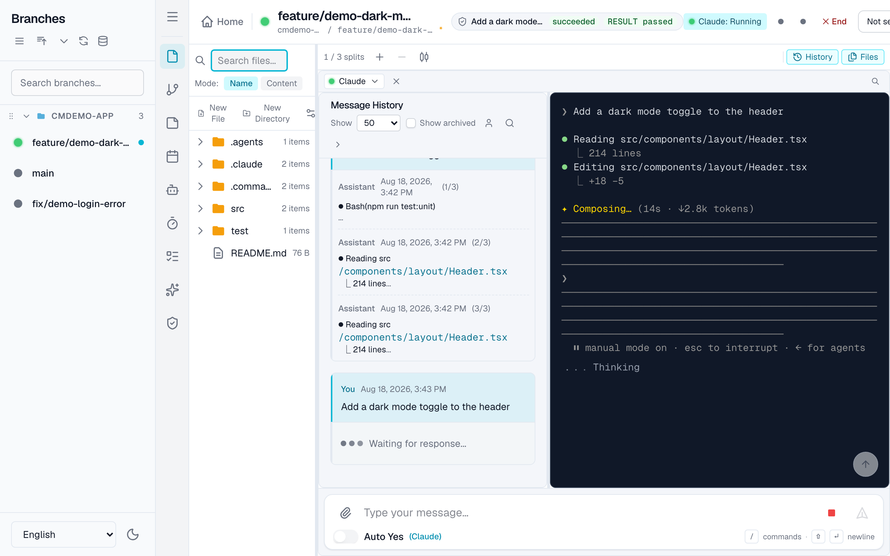
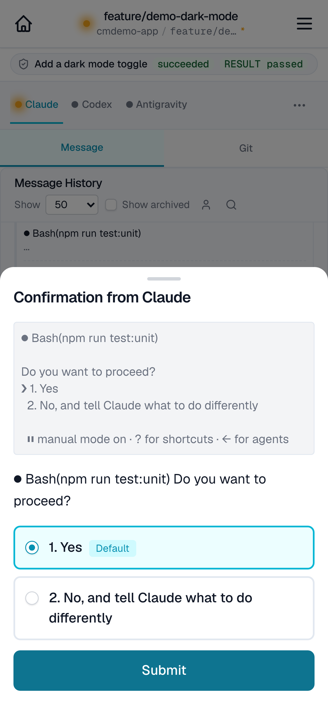
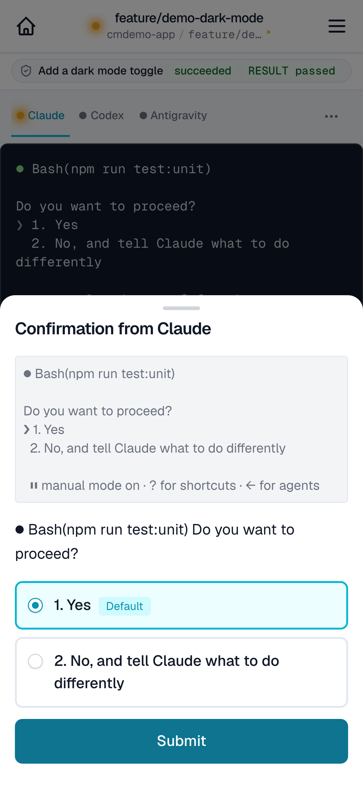
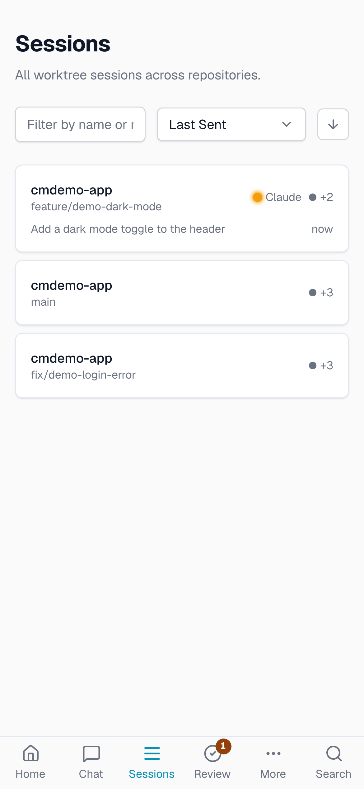

[日本語版](../../user-guide/webapp-guide.md)

# Web App Guide

This guide explains the basic operations of the CommandMate web app.
It's a step-by-step guide for first-time users.

> **For developers**: See the [UI/UX Guide](../../UI_UX_GUIDE.md) for UI implementation details.

---

## Table of Contents

1. [Launching and Accessing the App](#launching-and-accessing-the-app)
2. [Registering Repositories](#registering-repositories)
3. [Removing Repositories](#removing-repositories)
4. [Selecting a Worktree](#selecting-a-worktree)
5. [Sending Messages](#sending-messages)
6. [Auto Yes Mode](#auto-yes-mode)
7. [Viewing Chat History](#viewing-chat-history)
8. [Status Indicators](#status-indicators)
9. [Markdown Log Viewer](#markdown-log-viewer)
10. [Notes Feature](#notes-feature)
11. [Agent Settings](#agent-settings)
12. [Switching the Output Surface (Terminal / Chat)](#switching-the-output-surface-terminal--chat)
13. [The Default Output Surface (Terminal / Chat)](#the-default-output-surface-terminal--chat)
14. [Temporarily Maximizing One Split (Desktop)](#temporarily-maximizing-one-split-desktop)
15. [Execution Contract and Verification](#execution-contract-and-verification)
16. [Mobile Access](#mobile-access)
17. [Phone Notifications (Web Push)](#phone-notifications-web-push)

---

## Launching and Accessing the App

### 1. Starting the Server

#### npm Global Install (recommended)

```bash
# Start in background
commandmate start --daemon

# Check status
commandmate status

# Stop
commandmate stop
```

#### Development Environment (git clone)

```bash
cd CommandMate

# Development server
npm run dev

# Production build
npm run build
npm start
```

> **Note**: If this is your first time, run `commandmate init` for initial setup. See the [CLI Setup Guide](./cli-setup-guide.md) for details.

### 2. Accessing via Browser

Open your browser and navigate to:

```
http://127.0.0.1:3000
```

> **Port change**: Change the port with `commandmate start --port 3001` or set `CM_PORT=3001` in the `.env` file.

> **`127.0.0.1`, not `localhost`**: CommandMate binds `127.0.0.1` by default (`CM_BIND`).
> `localhost` can resolve to `::1` (IPv6) first, which CommandMate does not listen on — if
> another process holds that address, your browser silently talks to it instead.

---

## Registering Repositories

To manage worktrees with CommandMate, you first need to register a repository.
There are two registration methods.

### Method 1: Scan from Local Path

Scan and register an existing repository on your PC.

1. Click the **"Add Repository"** button at the top right of the homepage
2. Select the **"Local Path"** tab
3. Enter the repository path (e.g., `/Users/yourname/projects/my-repo`)
4. Click **"Scan"**
5. Review the detected worktree list and click **"Register"**

### Method 2: Clone from URL

Clone and register from a remote repository like GitHub.

1. Click the **"Add Repository"** button at the top right of the homepage
2. Select the **"URL Clone"** tab
3. Enter the repository URL
   - HTTPS: `https://github.com/username/repo.git`
   - SSH: `git@github.com:username/repo.git`
4. Click **"Clone"**
5. After cloning completes, the worktree is automatically registered

> **Note**: When using SSH URLs, SSH keys must be set up.

---

## Removing Repositories

You can remove repositories that are no longer needed.

1. In the repository list on the homepage, click the **"..."** menu for the repository you want to remove
2. Select **"Delete"**
3. Type `delete` in the confirmation dialog
4. Click the **"Delete"** button

> **Warning**: Removing a repository deletes all related worktree information, notes, and history. The repository's actual files are not deleted.

---

## Selecting a Worktree

Select a worktree (branch) from registered repositories to operate on.

### Desktop

1. A list of worktrees is displayed in the left sidebar
2. Click the worktree you want to operate on
3. The detail view appears on the right

### Mobile

1. A list of worktrees is displayed on the homepage
2. Tap the worktree you want to operate on
3. Navigate to the worktree detail view


*Desktop: Two-column layout*


*Mobile: Tab-based layout*

---

## Sending Messages

Send messages to Claude Code to give instructions.

### How to Send

1. Select a worktree
2. Type your message in the input field at the bottom
3. Click the **"Send"** button (or press Enter)

### Responding to Claude's Confirmations

When Claude asks for yes/no or multiple-choice confirmations:

1. A confirmation dialog appears automatically
2. Click **"Yes"** or **"No"**
3. For multiple choices, click the options to respond


*Mobile: Sending messages in the Terminal tab*

---

## Auto Yes Mode

A mode that automatically approves Claude's confirmations.
Useful when you want to run continuous processes without interruption.

### How to Use

1. Open the worktree detail view
2. Turn on the **"Auto Yes"** toggle at the top of the screen
3. A confirmation dialog appears
4. **Select the active duration** (1 hour / 3 hours / 8 hours)
   - Default is **1 hour**
   - Select the minimum time needed for your work
5. The description text changes dynamically based on your selection (e.g., "Will automatically turn OFF after 3 hours.")
6. Click **"Agree and Enable"**

### Active Duration

| Option | Milliseconds | Intended Use Case |
|--------|-------------|-------------------|
| **1 hour** (default) | 3,600,000 | Normal development work, short tasks |
| **3 hours** | 10,800,000 | Medium-scale implementation work |
| **8 hours** | 28,800,000 | Long batch-processing tasks (regular progress checks recommended) |

A countdown timer always shows the remaining time.
- **Under 1 hour**: `MM:SS` format (e.g., `45:30`)
- **1 hour or more**: `H:MM:SS` format (e.g., `2:15:30`)

### API Specification (for developers)

The Auto-Yes activation API accepts the following parameters:

```typescript
POST /api/worktrees/:id/auto-yes

{
  "enabled": true,
  "duration": 3600000 | 10800000 | 28800000  // Optional (default: 3600000)
}
```

- **When duration is omitted**: Defaults to 1 hour (3,600,000 ms) for backward compatibility
- **Invalid duration value**: Returns 400 error
- **Security**: 5-layer defense with worktreeId format validation -> JSON parse validation -> type validation -> whitelist validation

### Important Notes

- While Auto Yes is active, all confirmations are automatically answered with "Yes"
- Important changes (file deletions, etc.) are also auto-approved, so use with caution
- You can disable it by turning off the toggle
- Auto Yes automatically turns OFF after the selected duration
- **Security best practices**:
  - Select the **minimum time** needed for your work (1 hour recommended when in doubt)
  - Limit `CM_ROOT_DIR` to the target worktree directory
  - Manually turn OFF when stepping away for extended periods, regardless of remaining time
  - See [Trust & Safety](../../TRUST_AND_SAFETY.md#auto-yes-有効時間に関するリスクと推奨事項) for details

---

## Viewing Chat History

View past message history.

### Desktop

History is displayed in the **History column** on the left of each split.
- User messages and Claude's responses are shown chronologically
- Scroll to view past history

### Showing and hiding it (desktop)

The **[History]** and **[Open Files]** buttons on the right of the action bar
above the splits are the ONLY switches for their column / panel (Issue #2259).
Hiding the column used to leave a 36px vertical strip carrying a second copy of
the same button; that strip is **gone**, and the terminal takes the width back
(108px at three splits).

| Button | What it shows/hides | When it is disabled |
|--------|--------------------|---------------------|
| **[History]** | Each split's History column. **Applies to every split at once** | While every split shows the Chat surface (chat has no History column) |
| **[Open Files]** | The file panel on the right; the badge is the open tab count | With no tab open and no diff showing |

The arrow in the History column's header points the way it **folds** (left).
Bring it back with [History] in the action bar.

Note that the Activity Bar's **"File Tree"** (the icon column on the far left)
is for browsing the worktree, and is a different thing from the action bar's
**"Open Files"** (the panel showing files you opened).

### Mobile

Tap the **"History"** tab in the tab bar at the bottom.
- View a list of past interactions
- Tap for details

---

## Status Indicators

Indicators displayed on each worktree in the sidebar show the current state.

| Display | Status | Meaning |
|---------|--------|---------|
| Grey dot | idle | No active session |
| Green dot | ready | Waiting for input (ready to send a new message) |
| Blue spinner | running | Claude is processing |
| Yellow dot | waiting | Waiting for user input (yes/no confirmations, etc.) |
| Blue spinner | generating | Generating response |

> **Details**: See [Status Indicator Details](../../features/sidebar-status-indicator.md) for how status detection works.

---

## Markdown Log Viewer

View Claude's detailed output in Markdown format.

### Mobile

1. Tap the **"Logs"** tab in the tab bar at the bottom
2. Tap a log file from the list
3. View the content rendered in Markdown format

### Desktop

1. Click the **"Info"** button to open the modal
2. Select a log file from the list to view

---

## Notes Feature

Save notes for each worktree.
Useful for recording work details and TODOs.

### Editing Notes

#### Desktop

1. Click the **"Info"** button at the top right
2. Edit in the **"Notes"** section in the modal
3. Content is auto-saved

#### Mobile

1. Tap the **"Info"** tab in the tab bar at the bottom
2. Edit in the **"Notes"** section
3. Content is auto-saved

---

## Agent Settings

Select which CLI agents to use for each worktree.

### How to Configure

1. Select a worktree
2. Click the **"CMATE"** tab
3. Click the **"Agent"** sub-tab
4. Select **2** agents using the checkboxes
5. Settings are saved automatically

### Available Agents

| Agent | Description |
|-------|-------------|
| **Claude** | Claude Code CLI |
| **Codex** | OpenAI Codex CLI |
| **Gemini** | Google Gemini CLI |
| **Vibe-Local** | Ollama local LLM |

- You must always select exactly **2** agents
- The selected agents appear as tabs in the terminal header

### Ollama Model Selection (Vibe-Local)

When Vibe-Local is selected, you can specify which Ollama model to use.

1. Choose a model from the **"Ollama Model"** selector in the Agent settings
2. If Ollama is not running, "Ollama is not running" is displayed

> **Note**: The selected model is also used for scheduled executions (CMATE.md).

---

## Switching the Output Surface (Terminal / Chat)

A session's screen is split into an **output surface** (where you watch what the agent is
doing) and an **input surface** (the composer and the answer buttons). Only the **output
surface** switches — the input surface stays exactly the same in either mode
(Issue #2193 / #2194).

| Mode | What you see | When it helps |
|------|--------------|---------------|
| **Terminal** | The tmux screen as it is drawn (TUI borders, cursor and pagers included) | Working a dialog, TUI-specific screens, reading output in detail |
| **Chat** | The conversation transcript (your messages paired with the agent's replies) | Following what was exchanged, watching progress from a phone |

### How to switch

| Screen | Action |
|--------|--------|
| **Desktop** | Click the **Terminal / Chat toggle** in each split's header |
| **Mobile** | Tap the **round toggle** floating over the top-right corner of the output area |
| **Keyboard** | **`Cmd/Ctrl + Shift + M`** (press `?` for the shortcut list) |

`Cmd/Ctrl + Shift + M` acts on the **split that holds focus**. With focus outside every
split, the first split switches — except while you are typing in a field elsewhere on the
page, where the chord is left alone.

A switch is remembered **per split on desktop, and per tab on the phone**. Which surface a
session *opens* in is set in
[The Default Output Surface](#the-default-output-surface-terminal--chat).

You can also deep-link a surface with **`?view=terminal`** / **`?view=chat`** (for example
`/worktrees/<id>?pane=terminal&view=chat`). It is independent of `?pane=`, and the value is
written back to that surface's stored preference, so a shared `?view=chat` link does not
quietly revert on the next visit.

### What the chat surface shows

- **A generating indicator** — "Responding…" / "Thinking…" while the agent is working
- **The reply as it is written** — on agents that support it, the in-progress answer streams
  in place (Issue #2199). When it is too long and the head had to be dropped, it says
  "Showing the latest part only"
- **"Jump to latest"** — appears when a new line arrives while you are reading back through
  the history. Pressing it returns you to the newest one
- **"Show archived"** — a toggle for reading rows from past sessions as well
- **The dialog card** — when a dialog or a selection list is up on the TUI side, a card that
  shows the **tail of the terminal screen** as-is with the controls for it underneath
  (Issue #2254). See the next section

### The dialog card — answering a TUI without leaving chat

When something the chat surface **cannot drive** is on screen on the terminal side, this
surface used to raise an "Open terminal" banner and send you to the terminal. **That
behaviour was withdrawn by Issue #2254.** Below the banner there is now a card showing the
**tail of the terminal screen as it is** (12-20 rows; 12 on a phone), with the controls for
that kind of screen directly under it. You answer it without leaving chat.

| Kind of screen | What appears under the card |
|------|--------------------|
| A pager is open | Arrow keys plus PgUp / PgDn / Home / End / q |
| A selection list is open | Arrow keys plus Enter / Esc |
| A screen nothing could classify | Arrows and Esc (Navigate) plus the digits 1-9, y / n and Enter |
| Waiting, with options nobody could read | The digits 1-9, y / n and Enter |

**Press the number or y/n while reading the card.** Enter confirms whatever the CLI has
currently highlighted, so on a numbered dialog an Enter meant as "no" can land as an
approval (Issue #1681).

The "Open terminal" button **remains, as a secondary way out**. The card shows only the last
few rows, so switch to the terminal surface from here when you need scrollback or search.

While the card is up, **no control is duplicated**. The navigation buttons / Navigate pad
above the composer on desktop, and the navigation buttons docked above the composer on a
phone, defer to the card's copies while the chat surface is showing (on the terminal surface
they behave exactly as before).

**An ordinary yes/no or numbered prompt raises neither a card nor a banner.** The answer
panel on the input surface works as it is — the answer UI lives on the input surface rather
than the output one, so you can reply without leaving chat. Drawing a card there would put
two answer UIs on one dialog, so that one case is deliberately left alone.

---

## The Default Output Surface (Terminal / Chat)

A session's **output** half switches between the terminal (the tmux screen as it is drawn)
and chat (the conversation transcript) from the header toggle (Issue #2193). A switch is
remembered per split and per phone tab, but that is "how you last left it", not "what it
opens as". If you want to **always start in chat**, pick `Terminal` or `Chat` under
**More screen → Settings → "Default output surface"** (Issue #2201). The setting is stored
server-wide, and it applies **only to surfaces you have not switched yet**: a split or phone
tab you already toggled by hand keeps the mode you left it in, and saving the setting never
pulls it back.

Each browser picks the value up in the background the first time it opens any session
surface, and what that request buys is the **next** surface opened — including, after a
reload, the first one. Opening the More screen seeds it immediately on that device. A
browser that has never reached the server starts on `Terminal`.

---

## Temporarily Maximizing One Split (Desktop)

Two or three splits side by side means each one is narrow. When you only need the room
while reading a long dialog or a diff, you can **blow one split up to the full width and
put it back with the same gesture** (Issue #2261).

| Action | Where |
|--------|-------|
| **Maximize / restore** | The button at the right end of each split's title bar (⤢ / ⤡) |
| **Maximize / restore** | The button in the action bar above the splits (acts on the focused split) |
| **Maximize / restore** | `Cmd/Ctrl + Shift + Enter` |

`Cmd/Ctrl + Shift + Enter` follows the same rule as `Cmd/Ctrl + Shift + M` (the output
surface switch): it acts on the **split that holds focus**. With focus outside every split,
the first split answers — except while you are typing in a field outside the splits.

The hidden splits **keep their sessions and keep polling** while they are off screen, so
restoring shows the output that arrived in the meantime. The action bar's `2 / 3 splits`
label reads "Split 2 maximized" while one is maximized.

Because it is **temporary**, the layout comes back on its own when you:

- add or remove a split,
- press the equalize-widths button in the action bar,
- switch to another worktree, or
- reload the page (the maximized state is not persisted; the width ratios you dragged are,
  so restoring returns the exact proportions you had).

The file panel on the right is not part of this. Hide it with **[Open Files]** in the
action bar instead.

---

## Execution Contract and Verification

The **execution contract** handed to an agent with `commandmate send --contract`, and the
**gate verdicts** `commandmate verify` produced from it, are readable on screen — no CLI
stdout required (Issue #1816).

### The header status chip

A worktree that was delegated with a contract shows a status chip in its header, carrying
the task title, its `TaskStatus`, and the `RESULT` of the most recent verification run.

- A worktree with no task row shows **no chip at all**
- Hovering the chip (or reading it with a screen reader) gives the **reason** behind the
  verdict, down to the ids of the gates that did not pass
- Clicking the chip opens the **Verification** pane

### The Verification pane

| Screen  | How to open |
|---------|-------------|
| Desktop | The shield icon (Verification) in the left Activity Bar |
| Mobile  | **Tools** tab in the bottom bar → **Verification** sub-tab |

The pane has three sections, top to bottom.

1. **Execution contract** — title, the start of `goal`, `scope.allow`, `verify.gates`,
   `autoYes.mode`, and the contract file path. With no contract, it says how to create one
   (`commandmate send --contract`, or the `cmate-task-contract` Skill)
2. **Verification runs** — newest first (start time, `RESULT`, run id, trigger), plus the
   **Re-verify** button. Selecting a run switches the third section to it
3. **Gates** — the selected run's gate table: gate id, `PASS` / `FAIL` / `TIMEOUT` / `SKIP`,
   exit code, duration, and the last 40 log lines. Gates that did not pass open with their
   log already expanded

### The Re-verify button

It calls `POST /api/worktrees/:id/verify` and re-reads the list as soon as the route answers
202 with a run id. Gates are whole suites and builds, so the request returns **before** any
verdict exists; progress then arrives on the worktree detail screen's existing poll. When a
run is already going, the pane says so and names it.

> **This surface is read-only.** There is no contract editor. Edit
> `.commandmate/tasks/<name>.yaml` directly and re-send with `commandmate send --contract` —
> scope is judged against the **snapshot taken at send time**, so editing the YAML alone
> changes no verdict.

---

## Mobile Access

How to access CommandMate from your smartphone.

There are two routes. **Try `commandmate remote` first.** Use
[Method 2: connect directly on the same LAN](#method-2-connect-directly-on-the-same-lan-without-cloudflared)
only if you would rather not install a provider tool, or you want to stay inside the LAN.

| | Method 1: `commandmate remote` | Method 2: direct on the same LAN |
|---|---|---|
| **Authentication** | Yes (only the paired phone) | **None** |
| **Encryption** | Yes (HTTPS on the outside) | **None** (plain HTTP) |
| **Reach** | Also from away (over the internet or your tailnet) | Only inside the same Wi-Fi |
| **Requires** | `tailscale` or `cloudflared` | Nothing |
| **Server bind** | Stays `127.0.0.1` | `0.0.0.0` (every interface) |

### Method 1 (recommended): `commandmate remote` with QR pairing

`commandmate remote` **starts the server, publishes it, and pairs your phone** in one
command. A QR code is printed in the terminal; point your phone's camera at it.

```bash
commandmate remote
```

It does four things:

1. Detects the providers (the ways out) and picks one
2. **Asks you before creating a public tunnel** (see "Approval before publishing" below)
3. Starts a CommandMate server with authentication enabled
4. Prints a QR code for `https://<published URL>/login#code=<code>`, carrying a one-time
   pairing code

Scanning that QR code on the phone completes the sign-in. **The pairing code is single-use
and expires after 10 minutes by default.** That is the only time the code is shown —
`commandmate remote status` shows the URL but never shows the code again.

#### Approval before publishing

`commandmate remote` can publish through either of two providers:

| Provider | `--provider` | What it publishes to |
|---|---|---|
| Tailscale Serve | `tailscale` | Your own tailnet — not the public internet. Tried first |
| Cloudflare Quick Tunnel | `cloudflare` | A temporary **public internet** address, `https://<random>.trycloudflare.com` |

Because the Cloudflare route puts this machine on the public internet, `commandmate remote`
prints a warning and asks y/n before creating that tunnel. In a non-interactive environment
(a script, CI) **there is no way to ask, so it refuses by default** and stops with
`CONFIG_ERROR` (exit 2). Pass `--yes` only when you mean to publish.

```bash
commandmate remote --yes    # skip the confirmation and create the public tunnel
```

> **If no provider is ready, `remote` stops with `DEPENDENCY_ERROR` (exit 1).**
> It never switches to a public tunnel on its own because Tailscale was unavailable.

> **Fixed — the Cloudflare route used to die together with the command
> ([#2146](https://github.com/Kewton/CommandMate/issues/2146), now closed).** As measured on
> 2026-08-29, `cloudflared` exited the moment `commandmate remote` returned and the URL it
> had just printed started answering HTTP 530 within seconds, leaving no time to scan the QR
> code (defect **D-1**). The cause was the shape of the spawn: the child's stderr stayed on a
> pipe that closed with the parent.
> [**#2148**](https://github.com/Kewton/CommandMate/pull/2148) **points fd 2 at a file
> (`~/.commandmate/cloudflared.log`) instead of a pipe, together with `detached: true` and
> `unref()`**, and [#2149](https://github.com/Kewton/CommandMate/pull/2149) re-ran the check
> against the real `cloudflared` 2025.4.0: the published URL answered **non-530 at t+22.6 /
> +56.7 / +60.3 seconds after `up` returned**, and went **530 within 2.3 seconds of
> `remote stop`** — alive while published, revoked on teardown. Both measurements are in
> [`docs/qa/1937-remote-uat-record.md`](../../qa/1937-remote-uat-record.md) (D-1 in §3.6, its
> resolution in §6).

#### Checking the state, and packing up

```bash
commandmate remote status   # provider, URL, expiry, pairing state
commandmate remote stop     # close the outward door
```

`remote stop` reverts **only the settings CommandMate itself created**. When the state file
cannot be read it does not guess which provider to tear down — it says it does not know
what to clean up and exits successfully.

**When the session expires, only the outward door closes; the server is not stopped.**
Stopping it would take your local use of the machine down with it.

> **With Tailscale, always pack up with `commandmate remote stop`.** After a successful
> `tailscale serve`, Tailscale itself suggests disabling the proxy by re-running `serve`
> with only the port and the word "off" and no path. That form removes **every** handler on
> that port, including mappings you set up yourself, silently and with exit status 0.

#### Main options

| Option | Default | Description |
|--------|---------|-------------|
| `--provider <tailscale\|cloudflare>` | Auto | Force a provider |
| `--expires <duration>` | `8h` | Remote session TTL (`1h`-`30d`) |
| `--pairing-expires <duration>` | `10m` | Pairing code TTL (`1m`-`24h`) |
| `-p, --port <number>` | Auto | Port of the server to expose |
| `--yes` | — | Approve a public tunnel (required when non-interactive) |
| `--json` | — | JSON output |

Exit codes: `0` success / `1` DEPENDENCY_ERROR / `2` CONFIG_ERROR / `3` START_FAILED /
`4` STOP_FAILED / `99` UNEXPECTED_ERROR.
For the CLI in full, see the [CLI Operations Guide](./cli-operations-guide.md#commandmate-remote).

#### Worth knowing

- **`CM_BIND` does not change.** `remote` neither reads nor writes it; the server stays
  bound to `127.0.0.1`. All it adds is one door out.
- **Auto-Yes stays off by default.** `remote` has no flag that enables Auto-Yes.
- **No plaintext long-lived token is stored anywhere.** The server is handed only
  `CM_AUTH_TOKEN_HASH`, `CM_AUTH_EXPIRE` and `CM_REMOTE_PAIRING_FILE`, and the third is a
  file path rather than a secret. The pairing handoff file
  `~/.commandmate/remote-pairing.json` is mode 0600 and is **deleted the instant pairing
  succeeds**.
- **The login cookie carries no `Secure` attribute over a tunnel, and that is correct.**
  Setting `Secure` would make the browser refuse the cookie during local use over
  `http://127.0.0.1:3000`, breaking access from the PC. The outside of the tunnel is HTTPS,
  so the eavesdropping risk on the wire is already addressed. See the
  [Security Guide](../security-guide.md) for details.

#### OS support status

Measured as of 2026-08-29. **Read "measured" and "unverified" as the different things they
are.** The procedure and raw logs are under `dev-reports/issue/1937/u8-os-matrix.md`, and
the live acceptance run is in
[`docs/qa/1937-remote-uat-record.md`](../../qa/1937-remote-uat-record.md).

| OS | Provider detection | Approval flow | Reaching the published tunnel | Notes |
|----|--------------------|---------------|-------------------------------|-------|
| **macOS** (Darwin arm64) | ✅ Measured<br>`ready` once the provider tool is installed | ✅ Measured<br>non-interactive stops with exit 2 | ✅ Measured<br>Tailscale Serve passed; Cloudflare Quick Tunnel failed at first (**D-1**) and has passed since [#2148](https://github.com/Kewton/CommandMate/pull/2148), re-confirmed against the real `cloudflared` in [#2149](https://github.com/Kewton/CommandMate/pull/2149) | cloudflared 2025.4.0, Tailscale 1.102.3 |
| **Linux** (Debian 12 / aarch64) | ✅ Measured<br>`DEPENDENCY_ERROR` (exit 1) before install, `ready` after | ✅ Measured<br>identical to macOS | ⏭️ Not attempted | ⚠️ **Measured in a docker container, whose network setup can differ from bare-metal Linux** |
| **WSL2** | ❌ **Unverified** | ❌ **Unverified** | ❌ **Unverified** | **No test environment was available.** WSL2 varies widely in how `localhost` is forwarded, so **whether the tunnel's `127.0.0.1` upstream points inside WSL2 or at the Windows side is configuration-dependent** |

- ✅ **Measured** / ⏭️ **Not attempted** (deliberately skipped, to avoid creating a new
  public tunnel) / ❌ **Unverified** (no environment to test in)
- The "measured" entries in the detection and approval columns are the part that can be
  checked **without creating a public tunnel** (provider detection, the approval gate,
  `status` and `stop`).
- **End-to-end use from a real phone (scanning the QR code, pairing, the PWA, push
  notifications) is still outstanding on every OS.** The acceptance run covered the server
  side only, and the phone pass is tracked in
  [#2152](https://github.com/Kewton/CommandMate/issues/2152).

### Method 2: Connect directly on the same LAN (without `cloudflared`)

Use this if you would rather not install a provider tool, or you want nothing to leave the
LAN at all.

> ⚠️ **This method opens the server to the LAN with no authentication.**
> `CM_BIND=0.0.0.0` makes CommandMate listen on every network interface of your PC.
> **Anyone** on the same Wi-Fi who opens `http://<your PC's IP address>:3000` in a browser
> can operate your repositories, terminals and agents **without being asked to authenticate**.
> Do not use it on shared Wi-Fi (a cafe, a coworking space, a corporate guest network).
> If you need authentication and encryption, use
> [Method 1](#method-1-recommended-commandmate-remote-with-qr-pairing).

1. Connect your PC and smartphone to the same Wi-Fi
2. Edit the `.env` file:
   ```
   CM_BIND=0.0.0.0
   ```
3. Restart the server
4. Open `http://<your PC's IP address>:3000` in your smartphone's browser

When you are done, set `CM_BIND` back to `127.0.0.1` (the default) and restart the server.

#### Finding Your PC's IP Address

```bash
# macOS
ifconfig | grep "inet " | grep -v 127.0.0.1

# Linux
ip addr | grep "inet " | grep -v 127.0.0.1
```

#### Exposing to an external network

If you publish the server yourself rather than through `commandmate remote`, always pair it
with authentication at a reverse proxy. See the [Security Guide](../security-guide.md) and
the [Deployment Guide](../../DEPLOYMENT.md) for details.

### Mobile UI

On mobile, a tab bar is displayed at the bottom:

| Tab | Content |
|-----|---------|
| **Terminal** | Real-time output + message input |
| **History** | Chat history |
| **Files** | File tree view |
| **CMATE** | Notes + execution logs |
| **Info** | Worktree information |


*Mobile: Homepage*

---

## Phone Notifications (Web Push)

CommandMate can push a notification to your phone **while the app is closed** — when an
agent is waiting for you, when a verification gate fails, or when a session could not
start.

**No notification is sent until you finish every step in this section.** A fresh install
has no VAPID keys, and without them the whole push feature is off.

### 0. Prerequisites (check these first)

| Prerequisite | Why | How to check |
|---|---|---|
| **You reach the app over HTTPS** | Service Worker and PushManager require a secure context. `127.0.0.1` is exempt, but **your phone is not** — it is a different host. The subscribe button does not work over `http://<your PC's IP>:3000` on the same LAN | The address bar on the phone says `https://` |
| **iOS / iPadOS: add to Home Screen** | Web Push is unavailable in a Safari tab. You can only subscribe from an **installed** app, launched from the Home Screen icon | If you see "add this app to your Home Screen" instead of the subscribe button, this is why |
| **Android Chrome works in a normal tab** | No Home Screen install needed | — |

Three ways to get HTTPS:

- **`commandmate remote`** (simplest; recommended): the provider terminates TLS, so the
  phone reaches the app over HTTPS and the secure-context requirement is met as-is. See
  [Mobile Access](#method-1-recommended-commandmate-remote-with-qr-pairing)
- **A tunnel you set up yourself** (also works away from home): Cloudflare Tunnel and
  friends — see the [Deployment Guide](../../DEPLOYMENT.md)
- **A self-signed certificate** (same LAN only):
  ```bash
  brew install mkcert && mkcert -install && mkcert <your PC's IP address>
  commandmate start --cert ./<cert>.pem --key ./<key>.pem
  ```

### 1. Generate the VAPID keys

`commandmate init` generates the key pair and writes it into `.env`.
**You never have to type a `node -e "require('web-push')..."` one-liner.**

```bash
commandmate init
```

If `.env` already exists, `--force` rewrites it — and **an existing key pair is carried
across**. The public key is baked into the `PushSubscription` every subscribed browser
holds, so replacing the pair would silently cut off every device that had subscribed.

```bash
commandmate init --force
```

### 2. Check the three variables in `.env`

```bash
CM_VAPID_PUBLIC_KEY=<base64url, 65 bytes>
CM_VAPID_PRIVATE_KEY=<base64url, 32 bytes>
CM_VAPID_SUBJECT=https://github.com/Kewton/CommandMate
```

`CM_VAPID_SUBJECT` is the VAPID `sub` claim: who to contact about pushes from this server.
RFC 8292 allows both a `mailto:` address and an `https:` URL.

> **Important (only Apple checks this)**: **APNs validates `sub`.** A host that cannot
> resolve — `localhost`, a bare hostname with no dot, a reserved TLD such as `.local` — is
> answered with **403, and iPhone/iPad receive nothing.** Google (FCM) is permissive here,
> so **testing on Android alone cannot see the problem.** If you want your own address,
> use a **real domain**: `mailto:you@your-domain.example.org`.

**`CM_VAPID_PRIVATE_KEY` is a secret.** `.env` is git-ignored via
[`.gitignore`](../../../.gitignore), but **a copy of it is not.** Never paste it into a
commit or a chat.

### 3. Restart the server

```bash
commandmate stop && commandmate start
```

### 4. Verify the server side

```bash
curl -s http://127.0.0.1:3000/api/push/vapid
```

```json
{"configured":true,"publicKey":"BN..."}
```

If it says `"configured": false`, the keys were not read. The startup log and
`commandmate status` both name the reason in one line:

```bash
commandmate status
```

```
Push notifications are disabled: no VAPID keys are configured.
  Set CM_VAPID_PUBLIC_KEY and CM_VAPID_PRIVATE_KEY to enable them.
```

**A correctly configured server prints nothing here** — silence is the healthy state. A
`CM_VAPID_SUBJECT` that APNs will reject produces a line in the same two places.

### 5. Subscribe on the device

1. Open the **HTTPS URL** in the phone's browser
2. **iOS / iPadOS only**: Share menu -> "Add to Home Screen" -> **launch from that icon**
3. **More screen** (tab bar on mobile, sidebar on desktop) -> **Notifications**
4. Press **"Enable notifications"**
5. Answer "Allow" in the browser's permission dialog

> **The site does not appear in the OS notification list until you press that button.**
> Looking at iOS Settings -> Notifications, or Android's Apps & notifications, **before
> subscribing shows nothing** — it is easy to conclude "I already allowed it" from that.

> **Android note**: once you choose "Block", the permission dialog never appears again.
> Re-allow it from the browser's site settings.

After subscribing, the **Notifications** section of the More screen shows two switches:

| Switch | Covers | Default |
|---|---|---|
| When you need to act | Prompt waiting, failed verification gate, upstream API fault, session that could not start | On |
| Also tell me about completions | Ordinary completions that need nothing from you | **Off** |

### 6. When nothing arrives

The **Notifications** section shows a card saying this device is not receiving.

| Card | Meaning | What to do |
|---|---|---|
| **This device is not receiving notifications** | The push service is rejecting sends (HTTP 403 and similar). **Your subscription was not deleted** | On a 403, suspect `CM_VAPID_SUBJECT` first (see the Important note above) |
| **This device was dropped by the push service** | 404 / 410. The browser's subscription expired, so the server stopped sending to it | Press "Enable notifications" again to re-subscribe |

Server-side, with `CM_LOG_LEVEL=info`:

```
[WARN] [push/sender] push-send-failed {"statusCode":403,"consecutiveFailures":4}
[INFO] [push/sender] push-fanout-complete {"kind":"prompt","worktreeId":"my-feature","instanceId":"claude-2","delivered":1,"failed":1}
```

If `delivered` stays at 0, either no device is subscribed or every device is failing.

`worktreeId` and `instanceId` say **which worktree and which instance the fan-out was for**
(`instanceId` is omitted when the producer named no instance). With several worktrees running at
once their notifications interleave in the same second, so **filter by `worktreeId` whenever you
count one worktree's pushes**:

```bash
grep -a push-fanout-complete logs/server.log | grep -c '"worktreeId":"my-feature"'
```

---

## Related Documentation

- [CLI Setup Guide](./cli-setup-guide.md) - Installation and initial setup
- [UI/UX Guide](../../UI_UX_GUIDE.md) - UI implementation technical details
- [Status Indicator Details](../../features/sidebar-status-indicator.md) - How status detection works
- [Deployment Guide](../../DEPLOYMENT.md) - Production environment setup
- [Concept](../../concept.md) - CommandMate's vision
