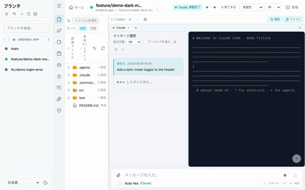
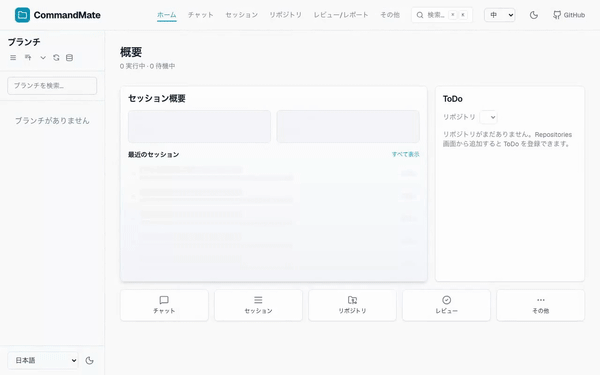
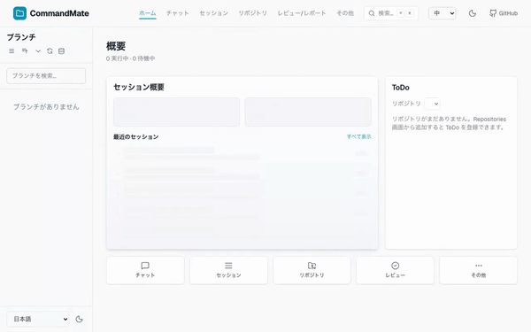
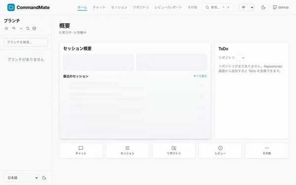
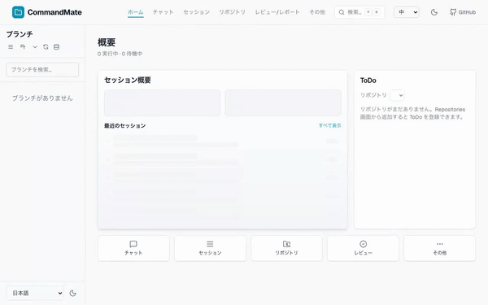
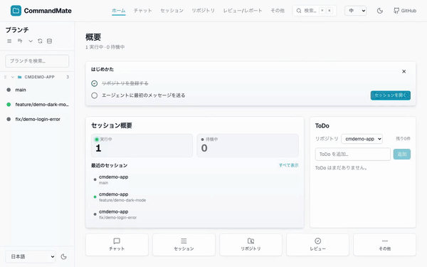
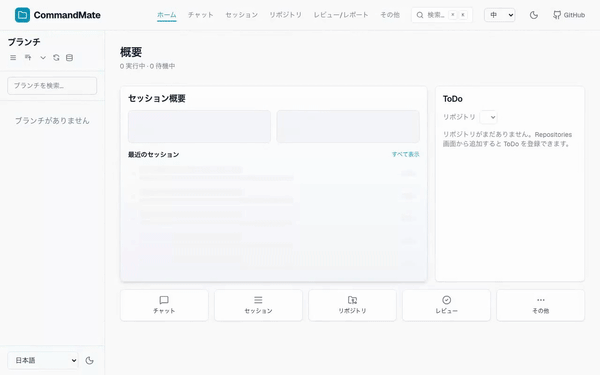

[English](../en/features/product-highlights.md)

# プロダクトの特徴

CommandMate は、既存のエージェント CLI の上にオーケストレーションと可視性を足す
**ローカルのコントロールプレーン**です。tmux も Git worktree もターミナルも置き換えず、
それらを数が増えても扱える状態にします。

以下は主要な特徴を 20 秒ずつのデモで示したものです。各デモは日本語 UI で録画しています。

> **デモの録画方法**
> すべて隔離環境（使い捨ての seed リポジトリ・専用ポート・専用データベース）で録画しており、
> private リポジトリ名・個人のパス・ソースコードは含まれません。
> 実 LLM は使わず、キャプチャ済みの端末出力を再生する「偽エージェント」を tmux セッションで
> 動かしています。**置き換えているのは LLM だけ**で、状態検出・応答ポーリング・サイドバーの
> 状態ドットはすべて製品コードのまま動いています。

---

## 1. Git Worktree セッション

worktree ごとに 1 セッションを割り当て、複数ブランチの作業を同時に走らせます。
セッションは互いに干渉しません。


[mp4](../images/features/cm-01-parallel-worktrees.ja.mp4)

## 2. セッション状態の可視化

実行中 / 待機中 / 完了をサイドバーの色と一覧のカウントで表示します。
どのエージェントが止まっているかを、セッションを開かずに判断できます。



[mp4](../images/features/cm-02-status-at-a-glance.ja.mp4)

## 3. 承認待ちの検知

エージェントが確認を求めて停止した状態を検出し、待機中として一覧に出します。
気づかないまま何時間も止まっている、という状態を避けられます。



[mp4](../images/features/cm-03-never-miss-waiting.ja.mp4)

## 4. マルチエージェント

Claude Code / Codex / Gemini などをタブで切り替え、タスクごとに使い分けます。
1 つの worktree に複数のエージェントセッションを並べられます。


[mp4](../images/features/cm-04-multi-agent.ja.mp4)

## 5. 非同期実行

メッセージを送ったら画面を離れて構いません。進行はサーバ側で追跡され、
戻ってきたときに結果と状態が残っています。



[mp4](../images/features/cm-05-send-and-walk-away.ja.mp4)

## 6. モバイルからの承認

スマートフォン幅では確認プロンプトがシートとして開き、その場で応答できます。
承認のためだけに席へ戻る必要がありません。



[mp4](../images/features/cm-06-approve-from-phone.ja.mp4)

## 7. 完了の自動検知

端末出力を解析して応答の完了を判定し、一覧の状態を戻します。
「終わったか」を見に行く必要がありません。



[mp4](../images/features/cm-07-completion-detected.ja.mp4)

## 8. ブラウザ内ターミナル

各 worktree の tmux セッションをそのままブラウザに表示します。
既存の tmux 環境を捨てず、その上に載る形で動きます。



[mp4](../images/features/cm-08-tmux-in-browser.ja.mp4)

## 9. ファイルビューア

セッションの隣に worktree のファイルツリーを置き、IDE を開かずに中身を確認できます。
Markdown はブラウザ上で編集もできます。



[mp4](../images/features/cm-09-files-beside-session.ja.mp4)

## 10. 100% ローカル動作

サーバもデータベースもセッションも手元のマシンで動きます。外部サーバもクラウドリレーも
アカウントも不要で、外へ出る通信はエージェント CLI 自身の API 呼び出しだけです。MIT ライセンス。


[mp4](../images/features/cm-10-local-and-npx.ja.mp4)

---

## デモが映している範囲

デモの信頼性のため、**映像に出ていないことをテロップで主張していない**。読むときの前提として:

- 10 本は**同じ 4 シーン**（一覧 / 送信→生成 / スマホ承認 / 完了）を、特徴ごとにテロップと
  尺配分を変えて構成している。撮影スクリプトが撮れるシーンがこの 4 本に固定されているため。
- **9. ファイルビューア** は「ファイルツリーがセッションの隣にある」ところまでが実映像で、
  Markdown エディタでの編集操作はデモに含まれない（機能自体は存在する）。
- **4. マルチエージェント** はエージェントタブが画面上部に映っているが、タブを切り替える操作
  そのものは撮っていない。
- 映像に出ない製品主張（100% ローカル・MIT・`npx` で 60 秒）は、**10** の文字カードに置いている。

## GIF と mp4 の使い分け

GitHub の markdown ビューアは `<video>` を描画しない（HTML 許可リストに含まれず、動画添付が
効くのは issue / PR / discussion のコメントのみ）。そのためページ内で再生されるのは GIF で、
mp4 は元の画質の配布用に併置している。

- GIF: 600px / 10fps / 約 1.2〜1.5MB
- mp4: 1280x800 / 30fps / h264 / 約 0.6MB

## 再生成

文言は絵コンテが唯一の編集箇所。

```bash
# 文言を変える
$EDITOR docs/images/features/storyboards/01-parallel-worktrees.yaml

# 1 本だけ撮り直す
.claude/skills/demo-video/scripts/demo-video.sh \
  --storyboard docs/images/features/storyboards/01-parallel-worktrees.yaml \
  --out docs/images/features
```

絵コンテの尺は素材の実尺が上限で、超えた分は最終フレームの静止で埋まる。
実測値: 一覧 4.1–5.2s / 送信→生成 15.4–18.5s / スマホ承認 5.9–6.0s / 完了 3.6s。

動画は圧縮済みで git の delta 圧縮が効かないため、**作り直すたびに全 10 本を再コミットしない**
こと（`docs/images/demo-mobile.gif` は既に履歴へ 4 版残っている）。差し替えは実際に変えた本数だけ。

`docs/images/` の `demo-desktop.mp4` / `demo-mobile.mp4` は個人環境で撮られた旧素材で、
README の GIF が参照しているために残っているだけ。**再利用しないこと**
（[website/assets/media/README.md](../../website/assets/media/README.md) 参照）。

## 関連ドキュメント

- [README](../../README.md) — Key Features 一覧
- [アーキテクチャ](../architecture.md)
- [クイックスタートガイド](../user-guide/quick-start.md)
- [サイドバー ステータスインジケーター](./sidebar-status-indicator.md)
