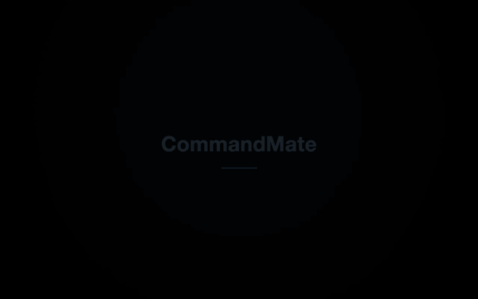
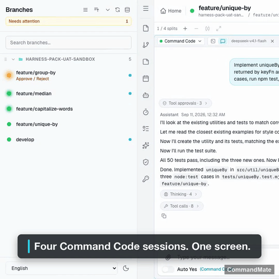
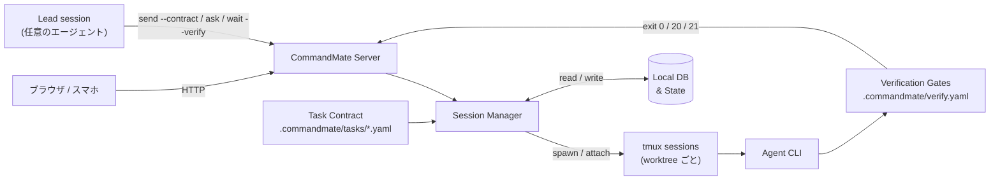

# CommandMate

[](https://github.com/Kewton/CommandMate)


**Status: Beta**

[English](../../README.md) | [日本語](./README.md)

**[CommandMate 公式サイト（英語）→](https://kewton.github.io/CommandMate/)**

<p align="center">
  
</p>

> **指揮するのは、いつもの Agent。判定するのは、ゲート。**

CommandMate は、あなたの lead エージェントに、ほかのエージェントを走らせる仕組みを渡します。タスクごとに Git worktree 1 つと契約 1 つ、完了を決めるゲート、そして毎回のランの記録。Claude Code ・ Codex ・ Antigravity ・ Command Code ・ OpenCode ・ Gemini CLI ・ Copilot、そしてローカルモデル。あなたがやるのは承認であって、伝言ではありません。

オープンソース（MIT） · あなたのマシンで動く · macOS / Linux / Windows（WSL2） · アプリのインストールは不要

```bash
npx commandmate@latest
```

**インストールから最初のセッションまで 60 秒。** macOS / Linux / Windows (WSL2) · Node.js v22+ · npm · git · tmux

---

## エージェントは増えた。あなたは 1 人

- エージェントは並列になった。あなたはいまもシングルスレッドのままだ。
- 外から見ると、遊んでいるエージェントと、あなたの入力を待っているエージェントは同じに見える。
- エージェントが書いた「やったこと」の要約は、やったことの証拠ではない。
- 誰も理解していない PR は、誰も安全にマージできない。

CommandMate は、あなたがすでに動かしている CLI のまわりに仕組みを置く。契約を配る lead、エージェント自身の hooks から読んだセッション状態、作業のあとのゲート、そしてその間の記録。

---

## 指揮するのは 1 体のエージェント

lead セッションへ 1 通。lead は Issue を計画し — 依存関係、ファイルの衝突、wave — それぞれを、自分の worktree にいる worker へ契約つきで渡します。どの作業が返ってくるかを決めるのはゲートです。通ったものだけが PR になり、マージされ、受入まで進みます。明示的な承認なしに何かが書き換わることはなく、ゲートが落ちればランはそこで止まります。

```yaml
# .commandmate/tasks/issue-21.yaml
version: 1
title: "Issue #21: pick(obj, keys)"
goal: |
  Implement pick(obj, keys) in src/util/pick.js with node:test cases in tests/pick.test.mjs.
  Run npm test, then commit.
scope:
  allow:
    - "src/util/pick.js"
    - "tests/pick.test.mjs"
verify:
  gates: [unit]
```

> scope ゲートと work-evidence ゲートは組み込みで、どの契約でも必ず走ります。あなたが宣言するのは、プロジェクト固有のコマンドが要るゲートだけです。

### 実測

| ラン | lead | worker | 結果 |
|---|---|---|---|
| 4 Issue、1 通 | Claude Code | Claude Code × 4 | ゲート 4/4 合格、2 wave、PR マージ、UAT go、8 分 39 秒 |
| 4 Issue、1 通 | Command Code | Command Code × 4 | ゲート 4/4 合格、7 分 46 秒。そのあと人が develop を pull して 47/47 テスト |
| 1 Issue、レビュー 1 段つき | Command Code | Codex が実装、Claude Code がテスト、Antigravity がレビュー | レビュー REJECT → 修正 → APPROVE、RESULT passed |

as observed（実測した範囲）

lead は他と同じ 1 つのセッションです。lead としての実測は、今日のところ Claude Code と Command Code。作業は 8 種のどのエージェントでも引き受けられます。これは常駐エージェントではなく 1 回のランで、あなたのメッセージで始まり、レポートで終わります。

---

## 「たぶん動く」ではなく検証済み

完了を決めるのはあなたが宣言したゲートで、判定は実 exit code である — `0` 合格、`20` 不合格、`21` 作業の証跡なし。証拠はエージェントの要約ではなく、ランそのものである。`verify history` がそれを残す。

<p align="center">
  
</p>

このワークフローに共感したら、ぜひ[リポジトリに Star](https://github.com/Kewton/CommandMate) をお願いします。

---

## 別のエージェントにレビューさせる

セッションは自分の作業を、別のセッションへレビューに出せます（`commandmate ask`、または `cmate-delegate` Skill）。答えは lead に返ります。実測したランでは Command Code が指揮し、Codex が実装し、Claude Code がテストを書き、Antigravity が最初の版を REJECT してから修正版を APPROVE しました。これはあなたが足す 1 ステップであって、orchestrate のランナーが別モデルのレビューを代わりに走らせるわけではありません。

---

## どれがあなたを待っているか分かる

入力待ちは画面からの推測ではなく、エージェント自身の hooks から読んだ状態です。待っているセッションはバッジ・トースト・タブタイトル・PWA の App Badge・push 通知として表に出て、スマホから応答できます。アプリのインストールは要りません。

<p align="center">
  
</p>

デスクトップでもモバイルでも使えます。あらゆるブラウザからセッションを監視・操作できます。

<p align="center">
  
</p>

---

## 得られるもの

### 指揮するのは 1 体のエージェント

| 機能 | できること | なぜ重要か |
|------|-----------|-----------|
| **cmate-orchestrate Skill** | 複数の Issue をまとめて計画し、それぞれに契約を付けて配る（`plan` → `dispatch` → `merge` → `uat`） | `--approve` なしには何も書き換わらず、ゲートが落ちればランが止まる |
| **セッション間の委任** | `commandmate ask` が別セッションへ質問を渡して答えを持ち帰る。待ちたくないときは `ask --async` と `commandmate relays`、届く相手は `commandmate peers`、型は `cmate-delegate` Skill | セッションが別のセッションへ仕事を渡せる。エージェント CLI をまたいでも動く |
| **Git Worktree セッション** | worktree ごとに独立したセッション、並列実行 | 複数の Issue が干渉なく同時に進む |
| **マルチエージェント対応** | worktree ごとに Claude Code / Codex / Gemini CLI / Copilot / OpenCode / Antigravity / Command Code / ローカルモデルを選択 | タスクに最適なエージェントを使い分け |
| **Auto Yes モード** | 確認なしでエージェントが動き続ける | 信頼できるワークフロー向けのオプショナル自動実行モード |

### 「たぶん動く」ではなく検証済み

| 機能 | できること | なぜ重要か |
|------|-----------|-----------|
| **実行契約（Task Contract）** | 作業を始める前に goal・変更してよい scope・検証ゲートを宣言し、`send --contract` でエージェントへ渡す | エージェントは推測ではなく、書かれた完了定義に向かって働く |
| **検証ゲート** | `.commandmate/verify.yaml` に宣言したゲートを `verify` / `wait --verify` で実行し、exit `0` / `20` / `21` を返す | 「完了」はエージェントの申告ではなく、検証ランが返した裁定になる |
| **証跡とメトリクス** | 組み込みの work-evidence / scope ゲートに加え、`verify history`・`task show`・`report metrics` | commit・ゲートログ・数値が残り、次の判断の材料になる |

### どれがあなたを待っているか分かる

| 機能 | できること | なぜ重要か |
|------|-----------|-----------|
| **入力待ちを見逃さない** | 入力待ちがバッジ・トースト・タブタイトル・PWA の App Badge・push 通知で届く | エージェントがあなたを必要とした瞬間に、席を外していても気づける |
| **Web UI（デスクトップ & モバイル）** | あらゆるブラウザからセッションを操作 | デスクからでもスマホからでも監視・指示が可能 |
| **会話ビュー** | セッションの出力面を生のターミナルとチャットで切り替え。返答は全文で表示され、ツール実行と承認はチップに畳まれ、TUI のダイアログにもチャット面から答えられる | TUI を読まずに、デスクからでもスマホからでも実行を追い、その場で応答できる |

### 方法論を仕組みに

| 機能 | できること | なぜ重要か |
|------|-----------|-----------|
| **Skills カタログ** | 公式 Catalog の Skill を worktree ごとに導入・更新（Web UI / `commandmate skill`） | 方法論は誰かの頭の中ではなく、エージェントが読む形で導入される |
| **スケジュール実行** | CMATE.md に cron 式を定義して自動実行 | 毎朝レビュー、毎晩テスト — エージェントが定期的に働く |

### そのほか

| 機能 | できること | なぜ重要か |
|------|-----------|-----------|
| **ファイルビューワ & Markdown エディタ** | ブラウザからファイルの閲覧・編集 | IDE を開かずにコード確認や AI への指示更新 |
| **スクリーンショット指示** | プロンプトに画像を添付 | バグ画面を撮影 →「これ直して」— エージェントが画像を認識 |
| **トークン認証** | SHA-256 ハッシュ + HTTPS + レート制限 | 安全なリモートアクセス — 認証情報の漏洩なし、総当たり攻撃を防止 |

---

## 対応エージェント

8 種すべてが第一級。CommandMate の内部ではどれも同じ扱い（専用の起動経路・hook ソース・ステータス検出）を受けるため、worktree セッション・実行契約・検証ゲート・証跡の挙動は、どのエージェントを選んでも変わらない。

- **Claude Code** ・ **Codex** ・ **Gemini CLI** ・ **Copilot** ・ **Antigravity** — worktree ごと、タスクごとに選ぶ。
- **OpenCode** — オープンソースのターミナルエージェント。他と同じ契約とゲートの経路で動かせる。
- **Command Code** — 同じ経路で動かせる。hooks と transcript の取り込みにも対応。
- **ローカルモデル**（`vibe-local`） — 自分でホストするモデルを、同じ worktree セッション・契約・ゲートで動かす。

---

## やらないこと

- これは常駐エージェントではなく、1 回のランである。永久に回り続けるものは無く、明示的な承認なしに何かが書き換わることも無い。
- コードを代わりに読んではくれない。ゲートが捕まえるのは、あなたのテストとチェックが捕まえる範囲だけである。
- 別のエージェントによるレビューは、あなたが足す 1 ステップであって、ランナーが代わりにやってくれるものではない。
- 承認はいまも人のところに来る。Auto Yes は opt-in で、時間の上限つきで、あなたが指定したパターンで止まる。
- tmux ・ Git worktree ・ ターミナル ・ エージェント CLI を置き換えるものではない。OS を再起動すればプロセスは終わる。残るのは記録である。

---

## ユースケース

| シナリオ | CommandMate でできること |
|----------|------------------------|
| **複数 Issue を 1 通で** | lead が wave を計画し、契約を配り、ゲートを通ったものだけをマージする。あなたが読むのはレポート 1 本。 |
| **見ていられないほどのセッション** | 一覧は 1 つ、セッションごとの状態も 1 つ、hooks から読む。待っているものが上に浮く。 |
| **席を外しているとき** | 待っているエージェントがスマホに届く。承認も却下もその場で。 |
| **別のエージェントにレビューさせる** | diff を別のセッションへ渡し、裁定を lead のチャットで受け取る。 |
| **夜間実行** | 契約とゲートつきのスケジュール実行。朝に記録を読む。 |

---

## vibe coding から、Vibe Engineering へ。

Vibe Engineering — 作るのは AI。エンジニアリングを保証するのは、あなたの専門知識ではなく仕組み。

AI を賢くするのではなく、AI を使う側に必要だったソフトウェアエンジニアリング能力を仕組み化する。
契約が作業の前に「完了」の意味を決め、ゲートが作業の後にそれを裁定し、その両方を生んだ方法論は、
誰かの記憶ではなく Skill として導入される。

正本は[コンセプト](../concept.md)です。Vision・Mission と、各実装項目がどの機能に対応するかを扱っています。

> "vibe engineering" は Simon Willison 氏が 2025 年に提唱した語です —
> <https://simonwillison.net/2025/Oct/7/vibe-engineering/>

---

## セキュリティ

**100% ローカル実行**。外部サーバーなし、クラウド中継なし、アカウント登録不要。ネットワーク通信はエージェント CLI 自体の API 呼び出しのみ。

- フルオープンソース（[MIT License](../../LICENSE)）
- ローカルデータベース、ローカルセッション
- リモートアクセスはトンネリングサービス（[Cloudflare Tunnel](https://developers.cloudflare.com/cloudflare-one/connections/connect-networks/)、[ngrok](https://ngrok.com/)、[Pinggy](https://pinggy.io/)）、VPN、または認証付きリバースプロキシを推奨

詳細は[セキュリティガイド](../security-guide.md)と [Trust & Safety](../TRUST_AND_SAFETY.md) を参照してください。

---

## アプリとしてインストール（PWA）

CommandMate は Progressive Web App です。モバイルブラウザの**ホーム画面に追加**から全画面（standalone）で起動でき、外出先でエージェントを監視するのに向いています。Service Worker が静的アセットを事前キャッシュし、オフライン時はフォールバック画面を表示します。API レスポンス・ログイン画面・WebSocket 通信はキャッシュしません。

> **インストールには HTTPS が必要です。** ブラウザが Service Worker を登録する（＝インストールを提示する）のは `https://` か `http://localhost` の場合だけです。LAN 上の平文 HTTP（例: `http://192.168.x.x:3000`）でアクセスしている間は、ブラウザ側の制約でインストールとオフライン対応が無効になります。有効にするにはトンネルか HTTPS のリバースプロキシを使ってください（上のセキュリティ節を参照）。PWA レイヤーなしでもアプリ本体は完全に利用できます。

### スマホ通知（プッシュ通知）

インストール後は、**アプリを閉じていてもスマホに通知**を出せます（応答待ち・検証ゲートの不合格・セッションの起動失敗など）。

**VAPID 鍵を作るまで通知は出ません。** `commandmate init` が鍵ペアを生成し、`CM_VAPID_PUBLIC_KEY` / `CM_VAPID_PRIVATE_KEY` / `CM_VAPID_SUBJECT` を `.env` に書き込みます。未設定のときは起動ログと `commandmate status` に 1 行出ます。iOS / iPadOS は上記のホーム画面追加も必須です（Safari のタブでは購読できません）。HTTPS 要件や「届かないとき」を含む手順は [Webアプリ基本操作ガイド → スマホ通知](user-guide/webapp-guide.md#スマホ通知プッシュ通知) を参照してください。

---

## ブラウザ対応

Web UI は Tailwind CSS 4 で構築しており、配色・テーマの層で `@property` と `color-mix()` を使うため、
モダンブラウザを対象としています。最低対応バージョンは次のとおりです。

| ブラウザ | 最低バージョン |
|---------|--------------|
| Safari (macOS / iOS) | 16.4+ |
| Chrome / Edge | 111+ |
| Firefox | 128+ |

これより古いブラウザでも読み込めますが、配色と余白が劣化した状態で表示されます。
CommandMate はローカルの開発者向けツールなので、現行の開発マシンやスマートフォンに
入っているブラウザとこの範囲は一致します。

---

## 仕組み



Git worktree ごとに専用の tmux セッションが割り当てられるため、複数タスクを干渉なく並列実行できます。
契約はセッションを起動する前に入り、ゲートはセッションが止まった後に走ります。その exit code が裁定です。

---

<details>
<summary><strong>Quick Start（詳細）</strong></summary>

```bash
# まず試すならワンコマンドで（ガイド付きセットアップ）
npx commandmate@latest

# または、継続的に使うならグローバルインストール（推奨）
npm install -g commandmate
commandmate init
commandmate start --daemon
```

`npx` を使うときは必ず `npx commandmate@latest` と書いてください。CommandMate をグローバル
インストール済みの環境では、`@latest` なしの `npx commandmate` はレジストリを一切参照せず、
既存のバイナリをそのまま実行します。そのため古いバージョンで動き続けていることに気づけません。
`@latest` を付けると npx が最新リリースを解決します。これは `npx` だけの話で、
`npm install -g commandmate` は `@latest` なしでも常にレジストリから解決します。

お試し以外の用途ではグローバルインストールを推奨します。`npx` は CommandMate を npm キャッシュ
に展開するため、`commandmate start --daemon` のバックグラウンドサーバーもそのキャッシュ
ディレクトリ上で動きます。後から `npx` を再実行したりキャッシュを削除すると、稼働中のサーバーの
足元のファイルが消える可能性があります。

引数なしで `commandmate` を実行すると、初回セットアップから起動までを一気に案内します。
依存関係をチェックし、初回のみ設定を対話で質問し、サーバーをバックグラウンドで起動して
起動完了を待ってから、ブラウザで UI を開きます。

2 回目以降は質問されず、UI を開くだけ（またはサーバー稼働中である旨の案内）になります。
Node.js 22 以上が必要です。

- `.env` が既にある場合、設定の質問はスキップされます
- ブラウザを開きたくない場合は `commandmate --no-open`（CI・ヘッドレス環境では自動的にスキップ）
- 手動でアクセスする場合は http://127.0.0.1:3000 を開いてください。CommandMate は既定で
  `127.0.0.1` に bind します。`localhost` は環境によって `::1`（IPv6）を先に解決しますが、
  そこは CommandMate が listen していないアドレスで、別プロセスが掴んでいることがあります

詳しくは [CLI セットアップガイド](../user-guide/cli-setup-guide.md) を参照してください。
Windows の場合は [WSL2 セットアップガイド](../user-guide/wsl2-setup.md) を参照してください。CommandMate は tmux に依存するため、Windows では WSL2 上で動作します（ネイティブ Windows は非対応）。

</details>

<details>
<summary><strong>CLI コマンド</strong></summary>

### 基本

| コマンド | 説明 |
|---------|------|
| `commandmate init` | 初期設定（対話形式） |
| `commandmate init --defaults` | 初期設定（デフォルト値） |
| `commandmate init --force` | 既存設定を上書き |
| `commandmate start` | サーバー起動（フォアグラウンド） |
| `commandmate start --daemon` | バックグラウンド起動 |
| `commandmate start --dev` | 開発モードで起動 |
| `commandmate start -p 3001` | ポート指定で起動 |
| `commandmate stop` | サーバー停止 |
| `commandmate stop --force` | 強制停止（SIGKILL） |
| `commandmate status` | 状態確認 |
| `commandmate update` | 最新版に更新 |

### Worktree 並列開発

Issue/worktree ごとにサーバーを分離起動し、自動ポート割当で並列開発が可能です。

| コマンド | 説明 |
|---------|------|
| `commandmate start --issue 123` | Issue #123 用サーバー起動 |
| `commandmate start --issue 123 --auto-port` | 自動ポート割当で起動 |
| `commandmate start --issue 123 -p 3123` | 特定ポートで起動 |
| `commandmate stop --issue 123` | Issue #123 用サーバー停止 |
| `commandmate status --issue 123` | Issue #123 用サーバー状態確認 |
| `commandmate status --all` | 全サーバー状態確認 |

### GitHub Issue 管理

[gh CLI](https://cli.github.com/) のインストールが必要です。

| コマンド | 説明 |
|---------|------|
| `commandmate issue create` | Issue を作成 |
| `commandmate issue create --bug` | バグ報告テンプレートで作成 |
| `commandmate issue create --feature` | 機能リクエストテンプレートで作成 |
| `commandmate issue create --question` | 質問テンプレートで作成 |
| `commandmate issue create --title <title>` | タイトルを指定 |
| `commandmate issue create --body <body>` | 本文を指定 |
| `commandmate issue create --labels <labels>` | ラベルを追加（カンマ区切り） |
| `commandmate issue search <query>` | Issue を検索 |
| `commandmate issue list` | Issue 一覧 |

### ドキュメント参照

| コマンド | 説明 |
|---------|------|
| `commandmate docs` | ドキュメント表示 |
| `commandmate docs -s <section>` | 特定セクションを表示 |
| `commandmate docs -q <query>` | ドキュメント検索 |
| `commandmate docs --all` | 全セクション一覧 |

全オプションは `commandmate --help` で確認できます。

</details>

<details>
<summary><strong>アップデート</strong></summary>

グローバルインストール（`npm install -g commandmate`）の場合、1 コマンドで完結します。
サーバーを停止し、最新版をインストールし、再起動して、応答することまで確認します。

```bash
# 更新の有無を確認（何も変更しない）
commandmate update --check

# 更新（確認プロンプトあり）
commandmate update

# 非対話環境（CI・スクリプト等）では --yes が必須
commandmate update --yes
```

**データは保持されます。** サーバー起動時にデータベースのマイグレーションが自動実行されるため、
worktree・セッション・設定はそのまま引き継がれます。手動でのマイグレーション作業は不要です。

**手動アップデート（fallback）** — `commandmate update` が使えない場合:

```bash
commandmate stop
npm install -g commandmate@latest
commandmate start --daemon
```

注意事項:

- 再起動後は `.env` の設定のみで起動します。`--auth` / `--cert` / `--key` / `--allowed-ips` /
  `--trust-proxy` / `--port` などを付けて起動していた場合は、update 後に手動で起動し直してください
  （`--auth` は起動のたびに新しいトークンが生成されます）。
- worktree 用サーバー（`--issue`）は自動停止されません。update **前**に
  `commandmate stop --issue <number>` で停止してください。
- 権限エラー（EACCES）時は `sudo` で再実行せず、[CLI セットアップガイド](../user-guide/cli-setup-guide.md)
  の手順で npm のグローバルディレクトリ権限を修正してください。

終了コードなどの詳細は [デプロイガイド](../DEPLOYMENT.md) を参照してください。

</details>

<details>
<summary><strong>トラブルシューティング & FAQ</strong></summary>

### Claude CLI が見つからない / パスが変わった？

Claude CLI の npm 版とスタンドアロン版を切り替えるとパスが変わることがあります。CommandMate は次のセッション起動時に自動検出します。カスタムパスを設定するには `.env` に `CLAUDE_PATH=/path/to/claude` を追加してください。

### ポート競合？

```bash
commandmate start -p 3001
```

### セッションが固まっている / 応答がない？

CommandMate 自身のコマンドで確認できます（tmux セッション名は自動で解決されます）：

```bash
# 各 worktree のエージェントの状態と、動いている tmux セッション名
commandmate ls
commandmate ls --json | jq -r '.[] | "\(.id)\t\(.tmuxSession)"'

# attach せずに transcript を読む
commandmate capture <worktree-id> --pane --tail 60
commandmate capture <worktree-id> --pane --follow    # 生成中の応答を追う

# この端末を attach（detach は Ctrl+b → d）
commandmate attach <worktree-id>
commandmate attach <worktree-id> --live              # 端末サイズへ再レイアウト（claude のみ）
```

**素の `tmux attach` が空白に見える理由。** CommandMate のセッションは、状態検出が十分な履歴を
`capture-pane` で取れるように 200 桁 × 1000 行のキャンバスに固定されています。alt-screen の
エージェント（claude / opencode / copilot）は transcript をその上端に、入力欄を下端に描き、
tmux はカーソルを追従表示します。したがって普通のサイズの端末では**入力欄と空白しか見えず、
会話は一行も見えません**。壊れているわけではありません。読むには上記の `capture --pane`、
attach 中なら `prefix + g`、あるいは `attach --live` で窓を端末に合わせてください。

attach せずに tmux 側から見る：

```bash
tmux ls -F '#{session_name} #{@cm_status} #{@cm_tool}/#{@cm_instance}'

# 壊れたセッションを手動で削除（`=name:` は完全一致。zsh は素の `=` を食うのでクォート必須）
tmux kill-session -t '=mcbd-claude-feature-123:'
```

> **注意：** アタッチ中にセッション内で直接入力すると、CommandMate のセッション管理と干渉する可能性があります。`Ctrl+b` → `d` で detach し、CommandMate UI から操作してください。

### Claude Code 内から起動するとセッション開始に失敗する？

Claude Code は `CLAUDECODE=1` を設定してネストを防止しています。CommandMate は自動で除去しますが、問題が続く場合は `tmux set-environment -g -u CLAUDECODE` を実行してください。

### FAQ

**Q: スマホからどうやってアクセスする？**
A: CommandMate は PC 上で Web サーバーを起動します。スマホと PC が同じネットワーク（Wi-Fi）にいる状態で、`commandmate init` で外部アクセスを有効にすると `CM_BIND=0.0.0.0` が設定されます。スマホのブラウザで `http://<PCのIPアドレス>:3000` を開いてください。

**Q: 外出先からアクセスできる？**
A: はい。トンネリングサービスを使えば、ルーターのポート開放なしにローカルサーバーを安全に公開できます：

- [Cloudflare Tunnel](https://developers.cloudflare.com/cloudflare-one/connections/connect-networks/) — 無料、Cloudflare アカウントが必要
- [ngrok](https://ngrok.com/) — 無料枠あり、セットアップが簡単
- [Pinggy](https://pinggy.io/) — サインアップ不要、SSH ベースのシンプルなトンネル

VPN や認証付きリバースプロキシ（Basic 認証、OIDC 等）も利用可能です。**認証なしでインターネットに直接公開しないでください。**

**Q: iPhone / Android で使える？**
A: はい。CommandMate の Web UI はレスポンシブ対応で、Safari・Chrome などのモバイルブラウザで動作します。アプリのインストールは不要です。

**Q: tmux は必須？**
A: CommandMate は内部で tmux を使用して CLI セッションを管理しています。ユーザーが tmux を直接操作する必要はありません。

**Q: Claude Code の権限はどうなる？**
A: Claude Code 自体の権限設定がそのまま適用されます。本ツールが権限を拡張することはありません。詳しくは [Trust & Safety](../TRUST_AND_SAFETY.md) を参照してください。

**Q: 複数人で使える？**
A: 現時点では個人利用を想定しています。複数人での同時利用は未対応です。

</details>

<details>
<summary><strong>開発者向けセットアップ</strong></summary>

コントリビューターや開発環境を構築する場合：

```bash
git clone https://github.com/Kewton/CommandMate.git
cd CommandMate
./scripts/setup.sh  # 依存チェック、環境設定、ビルド、起動まで自動実行
```

### 手動セットアップ（カスタマイズしたい場合）

```bash
git clone https://github.com/Kewton/CommandMate.git
cd CommandMate
./scripts/preflight-check.sh          # 依存チェック
npm install
./scripts/setup-env.sh                # 対話式で .env を生成
npm run db:init
npm run build
npm start
```

> **Note**: `./scripts/*` スクリプトは開発環境でのみ使用可能です。グローバルインストール（`npm install -g`）では `commandmate` CLI を使用してください。

</details>

---

<details>
<summary><strong>With / Without CommandMate</strong></summary>

比べるべき相手は他の製品ではなく、**やり方**です。

| 観点 | vibe coding（丸投げ） | Vibe Engineering with CommandMate |
|---|---|---|
| 「完了」の意味 | エージェントが「できた」と言ったとき | 検証ランがそう言ったとき — exit 0 / 20 / 21 |
| 変更範囲 | エージェントが触った範囲すべて | 契約で宣言し、scope ゲートで強制する |
| 方法論 | 誰かの頭の中 | Catalog から Skill として導入する（`cmate-task-contract` / `cmate-verify` ほか） |
| 証跡 | チャットの履歴 | commit ・ ゲートログ ・ `verify history` ・ `report metrics` |
| 並列作業 | ターミナルのタブ | タスクごとに worktree 1 つと契約 1 つ |
| 止まったとき | そのうち気づく | 入力待ちが届く: バッジ ・ トースト ・ タブタイトル ・ 通知 |
| 使えるエージェント | 1 つに固定 | Claude Code ・ Codex ・ Gemini CLI ・ Copilot ・ OpenCode ・ Antigravity ・ Command Code ・ ローカルモデル |

</details>

---

## Vibe Engineering ワークフロー

<a id="issue-driven-development"></a>

この仕組みは、どのエージェントにも渡せる 3 つで構成されます。**方法論**は導入された Skill として、
**契約**は作業の前に宣言するものとして、**ゲート**は作業の後に完了を裁定するものとして。

```
要求 → 契約 → エージェントが実行（任意の CLI・worktree ごと） → 検証済みの成果物
```

### 1. 方法論を Skill として導入する

Skill は公式 Catalog（[Kewton/commandmate-skills](https://github.com/Kewton/commandmate-skills)）から
取得し、選んだ worktree に導入します。Web UI（`/skills`、または worktree 詳細の Skills pane）からでも、
CLI からでも実行できます。

```bash
commandmate skill list
commandmate skill install cmate-task-contract --worktree <worktree-id> --version <version> --yes
```

| Skill | 扱う範囲 |
|-------|---------|
| `cmate-issue-authoring` | Feature 記述から実装可能な Issue 群を起案する |
| `cmate-issue-refinement` | 曖昧な Issue を read-only で実装可能な仕様へ精緻化する |
| `cmate-task-contract` | Issue から `.commandmate/tasks/<name>.yaml`（goal・scope・ゲート）を起案する |
| `cmate-verify` | `.commandmate/verify.yaml` にゲートを宣言し、実 exit code で判定する |
| `cmate-verify-advisor` | 検証の実行履歴から verify.yaml の改善案を出す |
| `cmate-worker-development` | ワーカーが進める 6 段（読取・調査・計画・実装・検証・証拠） |
| `cmate-acceptance-test` | Issue の受入条件を証跡付きで検証し Go / Conditional Go / No-Go を返す |
| `cmate-orchestrate` | 複数 Issue を並列に計画し、契約付きで dispatch して exit code で裁定する |

Catalog にはこのほか `cmate-repository-analysis` / `cmate-orchestrate-monitor` /
`cmate-worktree-setup` / `cmate-worktree-cleanup` も公開されています。support matrix・install root・
rollback の扱いは [Skills 配布ガイド](../user-guide/skills.md) を参照してください。

### 2. 契約を宣言し、ゲートに裁定させる

```bash
# .commandmate/tasks/issue-123.yaml に goal・scope.allow / scope.deny・実行するゲートを宣言する
commandmate send <worktree-id> --contract .commandmate/tasks/issue-123.yaml
commandmate wait <worktree-id> --verify
```

`--contract` がメッセージを供給するため、メッセージ引数は渡しません。`wait --verify` は
エージェントが停止した後にゲートを実行し、裁定を exit code で返します。**0** は全ゲート合格、
**20** はいずれかのゲートが不合格、**21** は work-evidence ゲートが commit も未 commit の変更も
見つけられなかった場合です。

契約の書式は [実行契約 仕様](../design/task-contract.md)、ゲートの書式は
[検証ゲート設定 仕様](../design/verification-config.md) が正準です。

### 次に読むもの

| ドキュメント | 得られるもの |
|-------------|------------|
| [コンセプト](../concept.md) | Vision・Mission と、各実装項目がどの機能に対応するか |
| [チュートリアル](../user-guide/tutorial.md) | サンプルリポジトリを fork し、契約から検証までを 15 分ほどで一通り体験する |
| [プロダクトの特徴](../features/product-highlights.md) | 機能ごとの紹介 |
| [CLI 操作ガイド](../user-guide/cli-operations-guide.md) | エージェント操作系コマンドの詳細 |

> **CommandMate 自体を開発する場合。** `.claude/commands` 配下の `/work-plan` `/pm-auto-dev` などの
> スラッシュコマンドは**このリポジトリ専用**です。あなたのリポジトリには導入されません。可搬な
> 代替は上の Catalog Skill です。詳細は [コマンド利用ガイド](../user-guide/commands-guide.md) を
> 参照してください。

---

## ドキュメント

| ドキュメント | 説明 |
|-------------|------|
| [CLI セットアップガイド](../user-guide/cli-setup-guide.md) | インストールと初期設定 |
| [チュートリアル](../user-guide/tutorial.md) | サンプルリポジトリを fork し、契約から検証済みの成果物までを 15 分ほどで体験する |
| [Webアプリ操作ガイド](../user-guide/webapp-guide.md) | Webアプリの基本操作 |
| [クイックスタート](../user-guide/quick-start.md) | Claude Code コマンドの使い方 |
| [コンセプト](../concept.md) | Vision・Mission・中核原則の正本と、各実装項目と機能の対応 |
| [プロダクトの特徴](../features/product-highlights.md) | 機能ごとの紹介 |
| [Skills 配布ガイド](../user-guide/skills.md) | 公式 Catalog の Skill を worktree へ導入する |
| [アーキテクチャ](../architecture.md) | システム設計 |
| [デプロイガイド](../DEPLOYMENT.md) | 本番環境構築手順 |
| [UI/UXガイド](../UI_UX_GUIDE.md) | UI 実装の詳細 |
| [Trust & Safety](../TRUST_AND_SAFETY.md) | セキュリティと権限の考え方 |

## Contributing

バグ報告・機能提案・ドキュメント改善を歓迎します。詳しくは [CONTRIBUTING.md](../../CONTRIBUTING.md) を参照してください。

## License

[MIT License](../../LICENSE) - Copyright (c) 2026 Kewton
