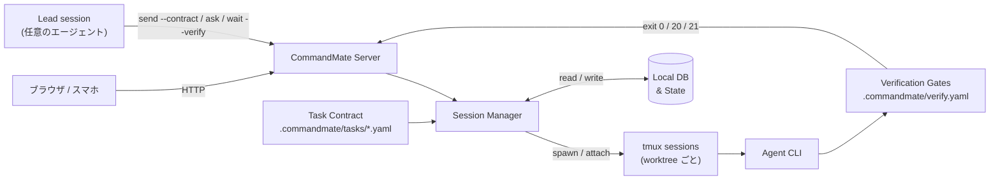

[English](../en/user-guide/how-it-works.md)

# CommandMate のしくみ

README の長い版です（Issue #3061 で移しました）。lead が何をするか、ゲートが何を決めるか、入力待ちがどう届くか、
機能一覧、対応エージェント、Vibe Engineering ワークフローを扱います。短い版は README に、
売り文句は [公式サイト](https://kewton.github.io/CommandMate/) にあります。

---

## エージェントは増えた。あなたは 1 人

- エージェントは並列になった。あなたはいまもシングルスレッドのままだ。
- 外から見ると、遊んでいるエージェントと、あなたの入力を待っているエージェントは同じに見える。
- エージェントが書いた「やったこと」の要約は、やったことの証拠ではない。
- 誰も理解していない PR は、誰も安全にマージできない。

CommandMate は、あなたがすでに動かしている CLI のまわりに仕組みを置く。契約を配る lead、エージェント自身の hooks から読んだセッション状態、作業のあとのゲート、そしてその間の記録。

---

## 指揮するのは 1 体のエージェント

lead セッションへ 1 通。lead は Issue を計画し — 依存関係、ファイルの衝突、wave — それぞれを、自分の worktree にいる worker へ契約つきで渡します。どの作業が返ってくるかを決めるのはゲートです。通ったものだけが PR になり、マージされ、受入まで進みます。明示的な承認なしに何かが書き換わることはなく、ゲートが落ちればランはそこで止まります。

```yaml
# .commandmate/tasks/issue-21.yaml
version: 1
title: "Issue #21: pick(obj, keys)"
goal: |
  Implement pick(obj, keys) in src/util/pick.js with node:test cases in tests/pick.test.mjs.
  Run npm test, then commit.
scope:
  allow:
    - "src/util/pick.js"
    - "tests/pick.test.mjs"
verify:
  gates: [unit]
```

> scope ゲートと work-evidence ゲートは組み込みで、どの契約でも必ず走ります。あなたが宣言するのは、プロジェクト固有のコマンドが要るゲートだけです。

### 実測

| ラン | lead | worker | 結果 |
|---|---|---|---|
| 4 Issue、1 通 | Claude Code | Claude Code × 4 | ゲート 4/4 合格、2 wave、PR マージ、UAT go、8 分 39 秒 |
| 4 Issue、1 通 | Command Code | Command Code × 4 | ゲート 4/4 合格、7 分 46 秒。そのあと人が develop を pull して 47/47 テスト |
| 1 Issue、レビュー 1 段つき | Command Code | Codex が実装、Claude Code がテスト、Antigravity がレビュー | レビュー REJECT → 修正 → APPROVE、RESULT passed |

as observed（実測した範囲）

lead は他と同じ 1 つのセッションです。lead としての実測は、今日のところ Claude Code と Command Code。作業は 8 種のどのエージェントでも引き受けられます。これは常駐エージェントではなく 1 回のランで、あなたのメッセージで始まり、レポートで終わります。

---

## 「たぶん動く」ではなく検証済み

完了を決めるのはあなたが宣言したゲートで、判定は実 exit code である — `0` 合格、`20` 不合格、`21` 作業の証跡なし。証拠はエージェントの要約ではなく、ランそのものである。`verify history` がそれを残す。

<p align="center">
  
</p>

このワークフローに共感したら、ぜひ[リポジトリに Star](https://github.com/Kewton/CommandMate) をお願いします。

---

## 別のエージェントにレビューさせる

セッションは自分の作業を、別のセッションへレビューに出せます（`commandmate ask`、または `cmate-delegate` Skill）。答えは lead に返ります。実測したランでは Command Code が指揮し、Codex が実装し、Claude Code がテストを書き、Antigravity が最初の版を REJECT してから修正版を APPROVE しました。これはあなたが足す 1 ステップであって、orchestrate のランナーが別モデルのレビューを代わりに走らせるわけではありません。

---

## どれがあなたを待っているか分かる

入力待ちは画面からの推測ではなく、エージェント自身の hooks から読んだ状態です。待っているセッションはバッジ・トースト・タブタイトル・PWA の App Badge・push 通知として表に出て、スマホから応答できます。アプリのインストールは要りません。

<p align="center">
  
</p>

デスクトップでもモバイルでも使えます。あらゆるブラウザからセッションを監視・操作できます。

<p align="center">
  
</p>

---

## 得られるもの

### 指揮するのは 1 体のエージェント

| 機能 | できること | なぜ重要か |
|------|-----------|-----------|
| **cmate-orchestrate Skill** | 複数の Issue をまとめて計画し、それぞれに契約を付けて配る（`plan` → `dispatch` → `merge` → `uat`） | `--approve` なしには何も書き換わらず、ゲートが落ちればランが止まる |
| **セッション間の委任** | `commandmate ask` が別セッションへ質問を渡して答えを持ち帰る。待ちたくないときは `ask --async` と `commandmate relays`、届く相手は `commandmate peers`、型は `cmate-delegate` Skill | セッションが別のセッションへ仕事を渡せる。エージェント CLI をまたいでも動く |
| **Git Worktree セッション** | worktree ごとに独立したセッション、並列実行 | 複数の Issue が干渉なく同時に進む |
| **マルチエージェント対応** | worktree ごとに Claude Code / Codex / Gemini CLI / Copilot / OpenCode（1.x と V2） / Antigravity / Command Code / ローカルモデルを選択 | タスクに最適なエージェントを使い分け |
| **Auto Yes モード** | 確認なしでエージェントが動き続ける | 信頼できるワークフロー向けのオプショナル自動実行モード |

### 「たぶん動く」ではなく検証済み

| 機能 | できること | なぜ重要か |
|------|-----------|-----------|
| **実行契約（Task Contract）** | 作業を始める前に goal・変更してよい scope・検証ゲートを宣言し、`send --contract` でエージェントへ渡す | エージェントは推測ではなく、書かれた完了定義に向かって働く |
| **検証ゲート** | `.commandmate/verify.yaml` に宣言したゲートを `verify` / `wait --verify` で実行し、exit `0` / `20` / `21` を返す | 「完了」はエージェントの申告ではなく、検証ランが返した裁定になる |
| **証跡とメトリクス** | 組み込みの work-evidence / scope ゲートに加え、`verify history`・`task show`・`report metrics` | commit・ゲートログ・数値が残り、次の判断の材料になる |

### どれがあなたを待っているか分かる

| 機能 | できること | なぜ重要か |
|------|-----------|-----------|
| **入力待ちを見逃さない** | 入力待ちがバッジ・トースト・タブタイトル・PWA の App Badge・push 通知で届く | エージェントがあなたを必要とした瞬間に、席を外していても気づける |
| **Web UI（デスクトップ & モバイル）** | あらゆるブラウザからセッションを操作 | デスクからでもスマホからでも監視・指示が可能 |
| **会話ビュー** | セッションの出力面を生のターミナルとチャットで切り替え。返答は全文で表示され、ツール実行と承認はチップに畳まれ、TUI のダイアログにもチャット面から答えられる | TUI を読まずに、デスクからでもスマホからでも実行を追い、その場で応答できる |

### 方法論を仕組みに

| 機能 | できること | なぜ重要か |
|------|-----------|-----------|
| **Skills カタログ** | 公式 Catalog の Skill を worktree ごとに導入・更新（Web UI / `commandmate skill`） | 方法論は誰かの頭の中ではなく、エージェントが読む形で導入される |
| **スケジュール実行** | CMATE.md に cron 式を定義して自動実行 | 毎朝レビュー、毎晩テスト — エージェントが定期的に働く |

### そのほか

| 機能 | できること | なぜ重要か |
|------|-----------|-----------|
| **ファイルビューワ & Markdown エディタ** | ブラウザからファイルの閲覧・編集 | IDE を開かずにコード確認や AI への指示更新 |
| **スクリーンショット指示** | プロンプトに画像を添付 | バグ画面を撮影 →「これ直して」— エージェントが画像を認識 |
| **トークン認証** | SHA-256 ハッシュ + HTTPS + レート制限 | トークンはハッシュで保存し、ログイン試行はレート制限する。[セキュリティガイド](../security-guide.md) を参照 |

---

## 対応エージェント

8 種すべてが第一級。CommandMate の内部ではどれも同じ扱い（専用の起動経路・hook ソース・ステータス検出）を受けるため、worktree セッション・実行契約・検証ゲート・証跡の挙動は、どのエージェントを選んでも変わらない。

- **Claude Code** ・ **Codex** ・ **Gemini CLI** ・ **Copilot** ・ **Antigravity** — worktree ごと、タスクごとに選ぶ。
- **OpenCode（1.x と V2）** — オープンソースのターミナルエージェント。他と同じ契約とゲートの経路で動かせる。OpenCode V2（`opencode2`）は 1.x と合わせて 1 種と数え、1.x と並べて使える。[OpenCode V2 ガイド](./opencode-v2.md) を参照。
- **Command Code** — 同じ経路で動かせる。hooks と transcript の取り込みにも対応。
- **ローカルモデル**（`vibe-local`） — 自分でホストするモデルを、同じ worktree セッション・契約・ゲートで動かす。

---

## ユースケース

| シナリオ | CommandMate でできること |
|----------|------------------------|
| **複数 Issue を 1 通で** | lead が wave を計画し、契約を配り、ゲートを通ったものだけをマージする。あなたが読むのはレポート 1 本。 |
| **見ていられないほどのセッション** | 一覧は 1 つ、セッションごとの状態も 1 つ、hooks から読む。待っているものが上に浮く。 |
| **席を外しているとき** | 待っているエージェントがスマホに届く。承認も却下もその場で。 |
| **別のエージェントにレビューさせる** | diff を別のセッションへ渡し、裁定を lead のチャットで受け取る。 |
| **夜間実行** | 契約とゲートつきのスケジュール実行。朝に記録を読む。 |

---

## vibe coding から、Vibe Engineering へ。

Vibe Engineering — 作るのは AI。エンジニアリングを保証するのは、あなたの専門知識ではなく仕組み。

AI を賢くするのではなく、AI を使う側に必要だったソフトウェアエンジニアリング能力を仕組み化する。
契約が作業の前に「完了」の意味を決め、ゲートが作業の後にそれを裁定し、その両方を生んだ方法論は、
誰かの記憶ではなく Skill として導入される。

正本は[コンセプト](../concept.md)です。Vision・Mission と、各実装項目がどの機能に対応するかを扱っています。

> "vibe engineering" は Simon Willison 氏が 2025 年に提唱した語です —
> <https://simonwillison.net/2025/Oct/7/vibe-engineering/>

---

## セキュリティ

CommandMate はあなたのマシンで動く。テレメトリを送らず、アカウントも要らず、動かすのに外部サーバも要らない。ネットワークに出るのは、使う機能に応じて次のものである: エージェント CLI 自身の API 呼び出し、Web UI からの GitHub への新しいリリースの確認、Skill を一覧 ・ 導入するときの GitHub 上の公式 Catalog、Web Push を有効にしたときのブラウザの push サービス、`commandmate remote` を動かしている間の Tailscale または cloudflared。

- フルオープンソース（[MIT License](../../LICENSE)）
- ローカルデータベース、ローカルセッション
- リモートアクセスはトンネリングサービス（[Cloudflare Tunnel](https://developers.cloudflare.com/cloudflare-one/connections/connect-networks/)、[ngrok](https://ngrok.com/)、[Pinggy](https://pinggy.io/)）、VPN、または認証付きリバースプロキシを推奨

詳細は[セキュリティガイド](../security-guide.md)と [Trust & Safety](../TRUST_AND_SAFETY.md) を参照してください。

---

## アプリのインストール・通知・ブラウザ

アプリとしてのインストール（PWA）、スマホ通知（プッシュ通知）、最低対応ブラウザは
[Webアプリ操作ガイド](./webapp-guide.md#アプリとしてインストールpwa) にあります。

---

## 仕組み



Git worktree ごとに専用の tmux セッションが割り当てられるため、複数タスクを干渉なく並列実行できます。
契約はセッションを起動する前に入り、ゲートはセッションが止まった後に走ります。その exit code が裁定です。

---

<details>
<summary><strong>With / Without CommandMate</strong></summary>

比べるべき相手は他の製品ではなく、**やり方**です。

| 観点 | vibe coding（丸投げ） | Vibe Engineering with CommandMate |
|---|---|---|
| 「完了」の意味 | エージェントが「できた」と言ったとき | 検証ランがそう言ったとき — exit 0 / 20 / 21 |
| 変更範囲 | エージェントが触った範囲すべて | 契約で宣言し、scope ゲートで強制する |
| 方法論 | 誰かの頭の中 | Catalog から Skill として導入する（`cmate-task-contract` / `cmate-verify` ほか） |
| 証跡 | チャットの履歴 | commit ・ ゲートログ ・ `verify history` ・ `report metrics` |
| 並列作業 | ターミナルのタブ | タスクごとに worktree 1 つと契約 1 つ |
| 止まったとき | そのうち気づく | 入力待ちが届く: バッジ ・ トースト ・ タブタイトル ・ 通知 |
| 使えるエージェント | 1 つに固定 | Claude Code ・ Codex ・ Gemini CLI ・ Copilot ・ OpenCode（1.x と V2） ・ Antigravity ・ Command Code ・ ローカルモデル |

</details>

---

## Vibe Engineering ワークフロー

<a id="issue-driven-development"></a>

この仕組みは、どのエージェントにも渡せる 3 つで構成されます。**方法論**は導入された Skill として、
**契約**は作業の前に宣言するものとして、**ゲート**は作業の後に完了を裁定するものとして。

```
要求 → 契約 → エージェントが実行（任意の CLI・worktree ごと） → 検証済みの成果物
```

### 1. 方法論を Skill として導入する

Skill は公式 Catalog（[Kewton/commandmate-skills](https://github.com/Kewton/commandmate-skills)）から
取得し、選んだ worktree に導入します。Web UI（`/skills`、または worktree 詳細の Skills pane）からでも、
CLI からでも実行できます。

```bash
commandmate skill list
commandmate skill install cmate-task-contract --worktree <worktree-id> --version <version> --yes
```

| Skill | 扱う範囲 |
|-------|---------|
| `cmate-issue-authoring` | Feature 記述から実装可能な Issue 群を起案する |
| `cmate-issue-refinement` | 曖昧な Issue を read-only で実装可能な仕様へ精緻化する |
| `cmate-task-contract` | Issue から `.commandmate/tasks/<name>.yaml`（goal・scope・ゲート）を起案する |
| `cmate-verify` | `.commandmate/verify.yaml` にゲートを宣言し、実 exit code で判定する |
| `cmate-verify-advisor` | 検証の実行履歴から verify.yaml の改善案を出す |
| `cmate-worker-development` | ワーカーが進める 6 段（読取・調査・計画・実装・検証・証拠） |
| `cmate-acceptance-test` | Issue の受入条件を証跡付きで検証し Go / Conditional Go / No-Go を返す |
| `cmate-orchestrate` | 複数 Issue を並列に計画し、契約付きで dispatch して exit code で裁定する |

Catalog にはこのほか `cmate-repository-analysis` / `cmate-orchestrate-monitor` /
`cmate-worktree-setup` / `cmate-worktree-cleanup` も公開されています。support matrix・install root・
rollback の扱いは [Skills 配布ガイド](./skills.md) を参照してください。

### 2. 契約を宣言し、ゲートに裁定させる

```bash
# .commandmate/tasks/issue-123.yaml に goal・scope.allow / scope.deny・実行するゲートを宣言する
commandmate send <worktree-id> --contract .commandmate/tasks/issue-123.yaml
commandmate wait <worktree-id> --verify
```

`--contract` がメッセージを供給するため、メッセージ引数は渡しません。`wait --verify` は
エージェントが停止した後にゲートを実行し、裁定を exit code で返します。**0** は全ゲート合格、
**20** はいずれかのゲートが不合格、**21** は work-evidence ゲートが commit も未 commit の変更も
見つけられなかった場合です。

契約の書式は [実行契約 仕様](../design/task-contract.md)、ゲートの書式は
[検証ゲート設定 仕様](../design/verification-config.md) が正準です。

### 次に読むもの

| ドキュメント | 得られるもの |
|-------------|------------|
| [コンセプト](../concept.md) | Vision・Mission と、各実装項目がどの機能に対応するか |
| [チュートリアル](./tutorial.md) | サンプルリポジトリを fork し、契約から検証までを 15 分ほどで一通り体験する |
| [プロダクトの特徴](../features/product-highlights.md) | 機能ごとの紹介 |
| [CLI 操作ガイド](./cli-operations-guide.md) | エージェント操作系コマンドの詳細 |

> **CommandMate 自体を開発する場合。** `.claude/commands` 配下の `/work-plan` `/pm-auto-dev` などの
> スラッシュコマンドは**このリポジトリ専用**です。あなたのリポジトリには導入されません。可搬な
> 代替は上の Catalog Skill です。詳細は [コマンド利用ガイド](./commands-guide.md) を
> 参照してください。
