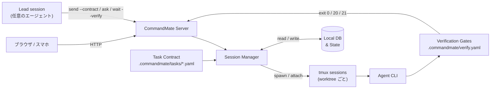
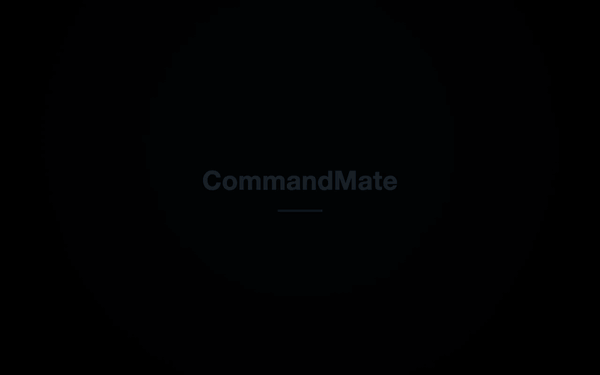

[English](../en/user-guide/how-it-works.md)

# CommandMate のしくみ

README の長い版です。README と同じ順に、Level 1 — Parallel、Level 2 — Delegate、Level 3 — Manage、
Next — Learn、続いて Anywhere・対応エージェント・セキュリティ・実測を扱います。短い版は README に、
売り文句は [公式サイト](https://kewton.github.io/CommandMate/) にあります。

Level は機能の高度さではなく、あなたがどこまで関与するかで切っています。多くの人は Level 2 で十分です。
自分に合う Level で止めてかまいません。上を目指す必要はありません。

---

## Level 1 — Parallel

あなたの役割: Operator。各エージェントの質問を読み、応える。

Claude Code ・ Codex ・ Gemini CLI ・ Copilot ・ OpenCode（1.x と V2） ・ Antigravity ・ Command Code ・
ローカルモデルを並べて動かす。タスクごとに Git worktree とセッションを 1 つずつ割り当てるので、
2 つのエージェントが同じファイルを同時に書き換えることはない。

外から見ると、手が空いたエージェントと、あなたを待っているエージェントの区別がつかない。CommandMate
では、入力待ちは画面からの推測ではなく、エージェント自身の hooks から読んだ状態です。待っている
セッションはバッジ・トースト・タブタイトルとして表に出て、チャットのように応答できます。

<p align="center">
  
</p>

| 機能 | できること | なぜ重要か |
|------|-----------|-----------|
| **Git Worktree セッション** | worktree ごとに独立したセッション、並列実行 | 複数の Issue が干渉なく同時に進む |
| **マルチエージェント対応** | worktree ごとにエージェントを選択（[対応エージェント](#対応エージェント) を参照） | タスクに最適なエージェントを使い分け |
| **hooks から読む状態** | 一覧は 1 つ、セッションごとの状態も 1 つ、エージェントの hooks から読む。待っているものが上に浮く | すべてのターミナルを開かずに、どれがあなたを待っているか分かる |
| **会話ビュー** | セッションの出力面を生のターミナルとチャットで切り替え。返答は全文で表示され、ツール実行と承認はチップに畳まれ、TUI のダイアログにもチャット面から答えられる | TUI を読まずに実行を追い、その場で応答できる |
| **ファイルビューワ & Markdown エディタ** | ブラウザからファイルの閲覧・編集 | IDE を開かずにコード確認や AI への指示更新 |
| **スクリーンショット指示** | プロンプトに画像を添付 | バグ画面を撮影 →「これ直して」— エージェントが画像を認識 |
| **Auto Yes モード** | 確認なしでエージェントが動き続ける | 信頼できるワークフロー向けのオプショナル自動実行モード。有効にする前に [セキュリティ](#セキュリティ) を確認 |

---

## Level 2 — Delegate

あなたの役割: Product / Tech lead。何を作るかを決め、合格したものを受け取る。

<a id="issue-driven-development"></a>

チャットの 1 通ではなく、Issue を渡す。Issue は実行契約（タスク定義）つきで渡る。実行契約はリポジトリに
置く短いファイルで、目的・エージェントが変更してよいファイル・通るべきチェックを書く。

```yaml
# .commandmate/tasks/issue-21.yaml
version: 1
title: "Issue #21: pick(obj, keys)"
goal: |
  Implement pick(obj, keys) in src/util/pick.js with node:test cases in tests/pick.test.mjs.
  Run npm test, then commit.
scope:
  allow:
    - "src/util/pick.js"
    - "tests/pick.test.mjs"
verify:
  gates: [unit]
```

```bash
commandmate send <worktree-id> --contract .commandmate/tasks/issue-21.yaml
commandmate wait <worktree-id> --verify
```

`--contract` がメッセージを供給するため、メッセージ引数は渡しません。エージェントが止まると、
`wait --verify` が `.commandmate/verify.yaml` に宣言したゲートを実行し、裁定を exit code で返します。
**0** は全ゲート合格、**20** はいずれかのゲートが不合格、**21** は work-evidence ゲートが commit も
未 commit の変更も見つけられなかった場合です。証拠はエージェントの要約ではなく、ランそのものです。
`verify history` がそれを残します。

> scope ゲートと work-evidence ゲートは組み込みで、どの契約でも必ず走ります。あなたが宣言するのは、
> プロジェクト固有のコマンドが要るゲートだけです。

<p align="center">
  
</p>

契約の書式は [実行契約 仕様](../design/task-contract.md)、ゲートの書式は
[検証ゲート設定 仕様](../design/verification-config.md) が正準です。

このワークフローに共感したら、ぜひ[リポジトリに Star](https://github.com/Kewton/CommandMate) をお願いします。

### 別のエージェントにレビューさせる

セッションは自分の作業を、別のセッションへレビューに出せます（`commandmate ask`、または
`cmate-delegate` Skill）。答えは依頼したセッションに返ります。これはあなたが足す 1 ステップであって、
orchestrate のランナーが別モデルのレビューを代わりに走らせるわけではありません。実測したランは
[実測](#実測) にあります。

### 方法論は Skill として入る

契約が作業の前に「完了」の意味を決め、ゲートが作業の後にそれを裁定し、その両方を生んだ方法論は、
誰かの記憶ではなく Skill として導入される。このプロジェクトはこれを Vibe Engineering と呼んでいます。
正本は[コンセプト](../concept.md)です。

> "vibe engineering" は Simon Willison 氏が 2025 年に提唱した語です —
> <https://simonwillison.net/2025/Oct/7/vibe-engineering/>

Skill は公式 Catalog（[Kewton/commandmate-skills](https://github.com/Kewton/commandmate-skills)）から
取得し、選んだ worktree に導入します。Web UI（`/skills`、または worktree 詳細の Skills pane）からでも、
CLI からでも実行できます。

```bash
commandmate skill list
commandmate skill install cmate-task-contract --worktree <worktree-id> --version <version> --yes
```

| Skill | 扱う範囲 |
|-------|---------|
| `cmate-issue-authoring` | Feature 記述から実装可能な Issue 群を起案する |
| `cmate-issue-refinement` | 曖昧な Issue を read-only で実装可能な仕様へ精緻化する |
| `cmate-task-contract` | Issue から `.commandmate/tasks/<name>.yaml`（goal・scope・ゲート）を起案する |
| `cmate-verify` | `.commandmate/verify.yaml` にゲートを宣言し、実 exit code で判定する |
| `cmate-verify-advisor` | 検証の実行履歴から verify.yaml の改善案を出す |
| `cmate-worker-development` | ワーカーが進める 6 段（読取・調査・計画・実装・検証・証拠） |
| `cmate-acceptance-test` | Issue の受入条件を証跡付きで検証し Go / Conditional Go / No-Go を返す |
| `cmate-orchestrate` | 複数 Issue を並列に計画し、契約付きで dispatch して exit code で裁定する（Level 3） |

Catalog にはこのほか `cmate-repository-analysis` / `cmate-orchestrate-monitor` /
`cmate-worktree-setup` / `cmate-worktree-cleanup` も公開されています。support matrix・install root・
rollback の扱いは [Skills 配布ガイド](./skills.md) を参照してください。

| 機能 | できること | なぜ重要か |
|------|-----------|-----------|
| **実行契約（Task Contract）** | 作業を始める前に goal・変更してよい scope・検証ゲートを宣言し、`send --contract` でエージェントへ渡す | エージェントは推測ではなく、書かれた完了定義に向かって働く |
| **検証ゲート** | `.commandmate/verify.yaml` に宣言したゲートを `verify` / `wait --verify` で実行し、exit `0` / `20` / `21` を返す | 「完了」はエージェントの申告ではなく、検証ランが返した裁定になる |
| **証跡とメトリクス** | 組み込みの work-evidence / scope ゲートに加え、`verify history`・`task show`・`report metrics` | commit・ゲートログ・数値が残り、次の判断の材料になる |
| **セッション間の委任** | `commandmate ask` が別セッションへ質問を渡して答えを持ち帰る。待ちたくないときは `ask --async` と `commandmate relays`、届く相手は `commandmate peers`、型は `cmate-delegate` Skill | セッションが別のセッションへ仕事を渡せる。エージェント CLI をまたいでも動く |
| **Skills カタログ** | 公式 Catalog の Skill を worktree ごとに導入・更新（Web UI / `commandmate skill`） | 方法論は誰かの頭の中ではなく、エージェントが読む形で導入される |

---

## Level 3 — Manage

あなたの役割: Owner。方向を決め、PM に応え、承認する。

エージェント 1 体ずつではなく、PM 役のエージェント 1 体と話す。PM は他と同じ 1 つの lead セッションです。
PM に 1 通送ると、Issue を計画し — 依存関係、ファイルの衝突、wave — Level 2 と同じように、それぞれを
自分の worktree にいる worker へ契約つきで渡します。ゲートを通ったものだけが PR になり、マージされ、
受入まで進みます。何かを書き換える手順はどれもあなたの承認を待ち、ゲートが落ちればランはそこで止まります。

これは常駐エージェントではなく 1 回のランです。あなたのメッセージか、決めた時刻で始まり、レポートで終わります。



Git worktree ごとに専用の tmux セッションが割り当てられます。契約はセッションを起動する前に入り、
ゲートはセッションが止まった後に走ります。その exit code が裁定です。

| 機能 | できること | なぜ重要か |
|------|-----------|-----------|
| **cmate-orchestrate Skill** | 複数の Issue をまとめて計画し、それぞれに契約を付けて配る（`plan` → `dispatch` → `merge` → `uat`） | `--approve` なしには何も書き換わらず、ゲートが落ちればランが止まる |
| **スケジュール実行** | CMATE.md に cron 式を定義して起動 | PM でも他のセッションでも、決めた時刻に始められる |

---

## Next — Learn

まだ作っていない。方向だけを示す: 1 つひとつの作業が残す記録を使って、次の作業の進め方を良くしていく。

---

## Anywhere

どの Level でも、スマホのブラウザから応答・承認できる。机を離れても仕事が止まらない。アプリのインストールは
要りません。

<p align="center">
  
</p>

| 機能 | できること | なぜ重要か |
|------|-----------|-----------|
| **Web UI（デスクトップ & モバイル）** | あらゆるブラウザからセッションを操作 | デスクからでもスマホからでも監視・指示が可能 |
| **入力待ちを見逃さない** | 入力待ちは PWA の App Badge・push 通知でも届く | エージェントがあなたを必要とした瞬間に、席を外していても気づける |
| **`commandmate remote`** | Tailscale または Cloudflare Tunnel でサーバを公開し、QR コードでスマホとペアリングする | 自分のマシンにスマホから届く。[CLI 操作ガイド](./cli-operations-guide.md#commandmate-remote) を参照 |

アプリとしてのインストール（PWA）、スマホ通知（プッシュ通知）、最低対応ブラウザは
[Webアプリ操作ガイド](./webapp-guide.md#アプリとしてインストールpwa) にあります。

---

## 対応エージェント

8 種すべてが第一級。CommandMate の内部ではどれも同じ扱い（専用の起動経路・hook ソース・ステータス検出）を受けるため、worktree セッション・実行契約・検証ゲート・証跡の挙動は、どのエージェントを選んでも変わらない。

- **Claude Code** ・ **Codex** ・ **Gemini CLI** ・ **Copilot** ・ **Antigravity** — worktree ごと、タスクごとに選ぶ。
- **OpenCode（1.x と V2）** — オープンソースのターミナルエージェント。他と同じ契約とゲートの経路で動かせる。OpenCode V2（`opencode2`）は 1.x と合わせて 1 種と数え、1.x と並べて使える。[OpenCode V2 ガイド](./opencode-v2.md) を参照。
- **Command Code** — 同じ経路で動かせる。hooks と transcript の取り込みにも対応。
- **ローカルモデル**（`vibe-local`） — 自分でホストするモデルを、同じ worktree セッション・契約・ゲートで動かす。

---

## セキュリティ

CommandMate はあなたのマシンで動く。テレメトリを送らず、アカウントも要らず、動かすのに外部サーバも要らない。ネットワークに出るのは、使う機能に応じて次のものである: エージェント CLI 自身の API 呼び出し、Web UI からの GitHub への新しいリリースの確認、Skill を一覧 ・ 導入するときの GitHub 上の公式 Catalog、Web Push を有効にしたときのブラウザの push サービス、`commandmate remote` を動かしている間の Tailscale または cloudflared。

- フルオープンソース（[MIT License](../../LICENSE)）
- ローカルデータベース、ローカルセッション
- トークン認証: SHA-256 ハッシュ + HTTPS + レート制限
- リモートアクセスはトンネリングサービス（[Cloudflare Tunnel](https://developers.cloudflare.com/cloudflare-one/connections/connect-networks/)、[ngrok](https://ngrok.com/)、[Pinggy](https://pinggy.io/)）、VPN、または認証付きリバースプロキシを推奨

詳細は[セキュリティガイド](../security-guide.md)と [Trust & Safety](../TRUST_AND_SAFETY.md) を参照してください。

---

## 実測

| ラン | lead | worker | 結果 |
|---|---|---|---|
| 4 Issue、1 通 | Claude Code | Claude Code × 4 | ゲート 4/4 合格、2 wave、PR マージ、UAT go、8 分 39 秒 |
| 4 Issue、1 通 | Command Code | Command Code × 4 | ゲート 4/4 合格、7 分 46 秒。そのあと人が develop を pull して 47/47 テスト |
| 1 Issue、レビュー 1 段つき | Command Code | Codex が実装、Claude Code がテスト、Antigravity がレビュー | レビュー REJECT → 修正 → APPROVE、RESULT passed |

as observed（実測した範囲）

lead（Level 3 の PM）としての実測は、今日のところ Claude Code と Command Code。作業は 8 種のどの
エージェントでも引き受けられます。レビューつきのランでは、Antigravity が最初の版を REJECT してから
修正版を APPROVE しました。

---

## 次に読むもの

| ドキュメント | 得られるもの |
|-------------|------------|
| [コンセプト](../concept.md) | Vision・Mission と、各実装項目がどの機能に対応するか |
| [チュートリアル](./tutorial.md) | サンプルリポジトリを fork し、契約から検証までを 15 分ほどで一通り体験する |
| [プロダクトの特徴](../features/product-highlights.md) | 機能ごとの紹介 |
| [CLI 操作ガイド](./cli-operations-guide.md) | エージェント操作系コマンドの詳細 |

> **CommandMate 自体を開発する場合。** `.claude/commands` 配下の `/work-plan` `/pm-auto-dev` などの
> スラッシュコマンドは**このリポジトリ専用**です。あなたのリポジトリには導入されません。可搬な
> 代替は上の Catalog Skill です。詳細は [コマンド利用ガイド](./commands-guide.md) を
> 参照してください。
