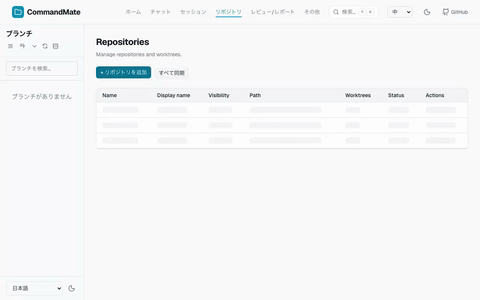
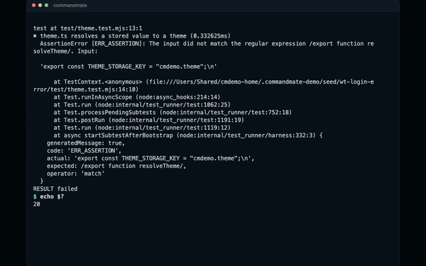
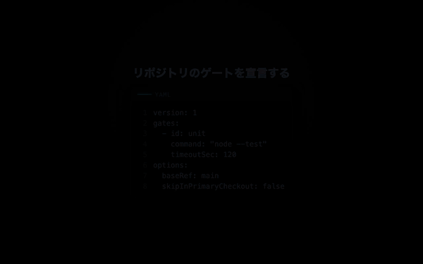
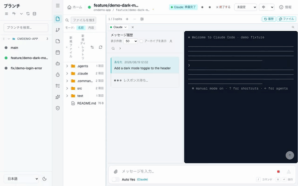
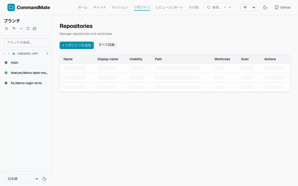
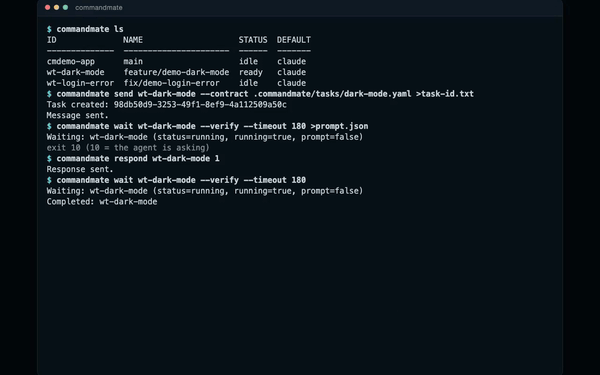

[English](../en/user-guide/tutorial.md)

# チュートリアル

わざとバグを 2 つ残したサンプルリポジトリを使って、CommandMate の中核を 15 分ほどで一通り体験します。サンプルリポジトリを fork してから始めるので、あなたの操作が元のリポジトリ（upstream）に影響することはありません。作業の前に契約を渡し、作業の後に検証ゲートで判定するところまでを、実際の exit code で確かめます。

> **Vibe Engineering** — 作るのは AI。エンジニアリングを保証するのは、あなたの専門知識ではなく仕組み。

- サンプルリポジトリ: [Kewton/commandmate-tutorial](https://github.com/Kewton/commandmate-tutorial)
- 依存パッケージはゼロです。`npm install` は不要で、`npm test` と `npm start` がそのまま動きます
- CLI の呼び方（グローバルインストール / `npx` 運用）は [CLI セットアップガイド](./cli-setup-guide.md) に委ね、本文は `commandmate …` で統一します

各ステップには、その操作を実際に流した GIF を添えています。

本文に貼ってある出力は、**このチュートリアルどおりに 1 回通した実機の実測値**です（CommandMate 0.24.0 / Claude Code / Node 22）。`run 3` のような**ラン番号はその実行のもの**なので、あなたの手元では違う番号になります。

> **GIF の録画方法**
> すべて隔離環境（使い捨ての seed リポジトリ・専用ポート・専用データベース・差し替えた `$HOME`）で録画しており、
> private リポジトリ名・個人のパス・ソースコードは含まれません。
> 実 LLM は使わず、キャプチャ済みの端末出力を再生する「偽エージェント」を tmux セッションで
> 動かしています。**置き換えているのは LLM だけ**で、画面・状態検出・応答ポーリング・
> **検証ゲート**はすべて製品コードのまま動いています（映像の `GATE` 行は実 exit code です）。
> 隔離環境のサンプルリポジトリはこのチュートリアルのものとは別物なので、
> 映像に出る worktree 名・契約ファイル名はあなたの手元と一致しません。
> 各 GIF には **映像に出ていることだけ** を書き添えています。

---

## このチュートリアルで体験すること

| Step | 体験する CommandMate の機能 | エンジニアならここで何を気にするか |
|---|---|---|
| 0 | Fork & Add（fork してから管理ルートへ登録する） | upstream を汚さない |
| 1 | Repositories 画面からの登録とセッション化 | — |
| 2 | Catalog から Skill を worktree へ導入する | 方法論はチームで共有できる形で置く |
| 3 | `commandmate verify` — 宣言したゲートを赤で確認する | 着手前に "done" の定義を機械が読める形にする |
| 4 | `send --contract` / `wait --verify` — 契約を渡して判定を受け取る | 触ってよい範囲と、合格の判定者を先に決める |
| 5 | worktree ごとのセッション並列と、契約ごとのゲート | 並列は隔離と各自のゲートがあって初めて安全 |
| 6 | `verify history` / `task show` / Review 画面 / `report metrics` | 証跡はチャットより長生きする |
| 7 | （任意）PR にする | — |
| 別紙 | opencode / Command Code で同じ 1 周を回す | 判定の仕組みがエージェントに依存していないこと |

---

## 前提条件

- **CommandMate 0.24.0 以上**が起動していること（まだなら `npx commandmate@latest`）
  サンプルリポジトリの契約は自前のゲート定義（`gateDefinitions`）を持っており、これは 0.24.0 以降の機能です
- **Node.js 22 以上**
- **エージェント CLI がいずれか 1 つ**使えること（Claude Code / Codex / Antigravity / OpenCode / Command Code）
  本文の実測は Claude Code で取っていますが、opencode / Command Code で同じ 1 周を回す手順は [別紙](#別紙-opencode--command-code-で同じ-1-周を回す) にあります
- **GitHub アカウント**（サンプルリポジトリを fork するために使います）
- **`gh`（GitHub CLI）が認証済み**であること — Step 0 の **Fork & Add** を使う場合のみ

---

## Step 0: サンプルリポジトリを fork する

まず GitHub 上で **fork** します。fork を経由するのは、クローン元（`origin`）を**あなた自身の fork** に向けるためです。この先エージェントにコミットさせるので、コミット先は自分のコピーであるべきです。

方法は 2 つあります。

**A. Fork & Add（`gh` が認証済みの場合）**

CommandMate の **リポジトリ** 画面 → **リポジトリを追加** → **クローン URL** タブを開き、次を貼り付けます。

```
https://github.com/Kewton/commandmate-tutorial.git
```

**追加前に fork する（gh repo fork）** をオンにすると、ボタンが **Fork して追加** に変わります。CommandMate が `gh` であなたのアカウントに fork を作り、その fork をクローンして登録します（`origin` = あなたの fork、`upstream` = 元リポジトリ）。

**B. 手で fork する**

```bash
gh repo fork Kewton/commandmate-tutorial --clone=false
```

または GitHub の **Fork** ボタンを押します。そのあと **クローン URL** タブに**自分の fork の**クローン URL を貼り付けます。

```
https://github.com/<あなたのユーザー名>/commandmate-tutorial.git
```

---

## Step 1: fork を CommandMate に登録する

どちらの方法でも、クローン先は CommandMate の管理ルート（`CM_ROOT_DIR`）配下になり、完了すると `main` のセッションが 1 つ一覧に現れます。



**映っているもの**: **リポジトリ** 画面で **リポジトリを追加** を押し、パスを入力して git リポジトリだと認識されたのを確認してから **スキャンして追加** を実行し、リポジトリ一覧に行が現れるまで。

> **映像と手順が違う点**: 上の手順は **クローン URL** タブから取り込みますが、この映像は **ローカルパス** タブで手元のリポジトリを追加しています。録画環境がネットワークに出られないためです（クローン URL として受け付けられるのは `https://` / `git@` / `ssh://` のみで、ローカルパスは通りません。`src/lib/url-normalizer.ts`）。同じダイアログの別タブを使うだけの違いで、登録されて一覧に現れるという結果は同じです。

この先のコマンドはすべて **worktree ID** を引数に取ります。ID は**ディレクトリ名由来**なので、素直に fork をクローンしたなら `commandmate-tutorial` になります。確認しておきましょう。

```bash
commandmate ls
```

```
ID                    NAME  STATUS  DEFAULT
--------------------  ----  ------  -------
commandmate-tutorial  main  idle    claude
```

> **補足**: CommandMate は管理ルート外のパスを登録できません。Step 5 で作る worktree も、必ずルート配下に置く必要があります。

---

## Step 2: 方法論を Skill として入れる

> **エンジニアならここで何を気にするか**: 方法論はチームで共有できる形で置く。

CommandMate は公式 Catalog から **Agent Skill** を worktree ごとに導入できます。ここでは 2 つ入れます。

| Skill | 何を教えるか |
|---|---|
| `cmate-verify` | ゲートを実行し、**実 exit code** で合否を読むこと |
| `cmate-task-contract` | 実行契約の中で作業すること（範囲を守り、証跡を残すこと） |

### 2-1. Skills ペインを開く

Step 1 で現れたセッション（worktree 詳細画面）を開きます。

- **PC**: アクティビティバーの **スキル**（✨ アイコン）を開く
- **スマホ**: **Tools** タブ → **Skills** を開く

上段に **このワークツリーに導入済み**、下段に **Catalogから導入** が並びます。

### 2-2. Catalog から 2 つ導入する

1. **Catalogから導入** から `cmate-verify` を選ぶ
2. 詳細画面で **install planを作成** を押す。この時点では何も書き込まれず、**何がどこに書かれるか**がプレビューされるだけです
3. 内容を確認して **このworktreeへ導入する** を押す
4. 同じ手順で `cmate-task-contract` も導入する


**映っているもの**: Skills ペインで Catalog のエントリを開き、**install planを作成** で書き込み予定のファイル一覧を表示してから **このworktreeへ導入する** を押し、導入完了の表示が出るところ。続いてコンポーザーで `/` を打ち、その worktree が提供するコマンドが一覧に並んで Esc で閉じるところ。

**導入先は 2 ディレクトリです。** CommandMate は同じ内容を `.agents/skills/<skill-id>/` と `.claude/skills/<skill-id>/` の**両方**に書きます（`SKILL_INSTALL_ROOT_PREFIXES`、`src/lib/skills/constants.ts`）。エージェントごとに読むディレクトリが違うため、片方だけに入れると一部のエージェントから見えなくなります。

### 2-3. セッションを再起動する

エージェントは**起動時に**自分の探索ディレクトリを読みます。導入しただけでは使えないので、**この worktree のセッションを再起動**してください。UI にも「以下のagentセッションを再起動すると利用を開始できます」と出ます。

### 2-4. 更新する / 外す

**Skill は更新できます。** 新しいバージョンが公開されると一覧に **更新あり** バッジが出るので、**更新内容を確認** → **更新プランを作成** で差分（追加・更新・削除・権限の増減）を読んでから適用します。CLI なら `commandmate skill update <skill-id> --worktree <worktree-id>` です。

- 導入後に手で編集したファイルがあると、CommandMate は**上書きせず止まります**。編集を戻すか、一度アンインストールしてから入れ直してください
- 実効リスクが上がる更新は、通常の確認とは**別に**もう一段の確認を要求します
- 外すときは `commandmate skill uninstall <skill-id> --worktree <worktree-id>`
- `cmate-worktree-cleanup` / `cmate-orchestrate` などの **high-risk な Skill は初回チュートリアルでは使わない**でください
- 詳細・制約は [Agent Skills 配布](./skills.md) を参照してください

---

## Step 3: 着手前にゲートを赤で確認する

> **エンジニアならここで何を気にするか**: 着手前に "done" の定義を機械が読める形にする。

サンプルリポジトリには検証設定が同梱されています。まず読んでください。

```yaml
# .commandmate/verify.yaml
version: 1
gates:
  - id: unit
    command: npm test
    timeoutSec: 120
```

これが「このリポジトリで完了とは何か」の宣言です。実行します。

> **自分のリポジトリには何と書けばいいのか（Issue #2061）**: `commandmate verify init` が、
> そのリポジトリの `.github/workflows/*.yml` と `package.json` の `scripts` を読んで草案を
> 起案します（`--dry-run` で中身だけ見られます。**既存ファイルは上書きしません**）。
> Web UI では Verification ペインの「CI から起案する」ボタンが同じことをします。
> 判断基準は [コマンド利用ガイド](./cli-operations-guide.md#commandmate-verify-init--ci-定義から起案するissue-2061) を参照してください。

```bash
commandmate verify commandmate-tutorial --gates unit
```

```
Verifying: commandmate-tutorial (run 3)
GATE unit FAIL (exit=1, 0.2s)
  ✖ greet ends with an exclamation mark
      + actual   - expected
      + 'Hello, World'
      - 'Hello, World!'
  ✖ shout uppercases the greeting
      Error: shout() is not implemented yet
RESULT failed
```

```bash
echo $?   # 20
```

**exit 20 は「宣言したゲートが落ちた」**という意味で、ここでの正しい出発点です。この先はこの数字を 0 にしていく話になります。

> **`--gates unit` を付けている理由（実測）**: ゲートを指定しない `commandmate verify <id>` は、`verify.yaml` のゲートに加えて組み込みの **work-evidence** ゲートを走らせます。まだ 1 行も書いていない checkout では work-evidence が最初に落ち、宣言ゲートは `SKIP` として記録され、結果は `RESULT not_started` の **exit 21** になります。
> 「まだ何も作業していない（21）」と「作業はあるが基準を満たさない（20）」は別の状態で、CommandMate はそれを別の exit code で返します。着手前に**宣言ゲートだけ**を見たいときは、このようにゲートを名指しします。



**映っているもの**: ターミナルに落ちたテストの出力と `RESULT failed` が並び、その下の `$ echo $?` が `20` を返しているところ。続いて `$ commandmate verify history --worktree wt-login-error` と、その run が `manual  failed  failed: unit` の 1 行で残っているところ。

---

## Step 4: 契約を渡して、ゲートに判定させる

> **エンジニアならここで何を気にするか**: 触ってよい範囲と、合格の判定者を先に決める。

### 4-1. 契約を読む

バグの説明をチャットで書く代わりに、**契約**を渡します。サンプルリポジトリに同梱の 1 本目です。

```yaml
# .commandmate/tasks/fix-greet.yaml
version: 1
title: "greet() ends with an exclamation mark"
goal: |
  `npm run test:greet` fails. Fix only that failure in src/greet.js, then run the tests again.
  Do not touch shout().
scope:
  allow: ["src/greet.js"]
  deny: ["test/**", ".commandmate/**"]
verify:
  gates: [issue-greet]
  gateDefinitions:
    - id: issue-greet
      command: npm run test:greet
      timeoutSec: 120
autoYes:
  mode: off
success:
  requireWorkEvidence: true
  requireScopeClean: true
```

読みどころは 3 つです。

- **`scope`** — 触ってよいのは `src/greet.js` だけ。`test/**` は明示的に禁止なので、コードではなくテストを「直して」通すことはできません
- **`verify.gates` と `gateDefinitions`** — この作業を判定するのはリポジトリ全体の `unit` ではなく、**この契約が自分で定義した** `issue-greet`（`npm run test:greet`）です
- **`success`** — 作業証跡が無ければ不合格、scope 違反があれば不合格

### 4-2. 契約つきで送る

```bash
commandmate send commandmate-tutorial --contract .commandmate/tasks/fix-greet.yaml
```

```
Task created: 79c50846-55c9-4fc1-8bb3-e10b0fb698c2
Message sent.
```

CommandMate はタスクを記録し、契約の goal と scope をエージェントへ渡します。

> **Claude Code 以外を使っている場合**: 送り先を `--instance` で名指しするだけで、以降は同じです。
> 契約もゲートもエージェント別の分岐を持ちません。手順は [別紙: opencode / Command Code で同じ 1 周を回す](#別紙-opencode--command-code-で同じ-1-周を回す) を参照してください。



**映っているもの**: 検証設定（`verify.yaml`）と契約ファイルの中身を 1 枚ずつ表示したあと、ターミナルで `commandmate ls` → `commandmate send <id> --contract <path>` → `commandmate wait <id> --verify` が `exit 10`（エージェントが確認を求めている）で返り、`commandmate respond <id> 1` のあとの 2 回目の `wait` が `GATE work-evidence PASS` / `GATE scope PASS` / `GATE unit PASS` / `RESULT passed` を出して `echo $?` が `0` を返すところ。

> **映像と手順が違う点**: 映像は隔離環境のサンプルリポジトリで撮っているので、worktree 名（`wt-dark-mode`）・契約ファイル名（`dark-mode.yaml`）・ゲート名（`unit`）はあなたの手元（`commandmate-tutorial` / `fix-greet.yaml` / `issue-greet`）と違います。コマンドの並びと、判定が `GATE` 行と `RESULT` と exit code で返るという点は同じです。

### 4-3. 承認待ちで止まったら応答する

エージェントは、ファイルの編集やコマンドの実行の前に**確認を求めて停止する**ことがあります。止まっていることに気づかないと「動かない」ように見えるので、応答の場所を先に確認しておきます。

- 一覧では、そのセッションの状態表示が **応答待ち** に変わります（**概要** 画面では **待機中** として数えられます）
- **PC**: セッション画面でそのまま応答できます
- **スマホ幅**: 画面下から**シート**が開き、その場で応答できます
- **ターミナル**: `commandmate wait` は**プロンプトを検出すると exit 10** で返り、内容を JSON で出します。`commandmate respond <worktree-id> 1` で答えてから、もう一度 `wait` します



**映っているもの**: PC で作業を依頼してエージェントが生成を始めたあと、スマホ幅の画面で承認待ちのシートが開き、選択肢に応答してセッションが先へ進むまで。

確認のたびに自動で応答する **Auto Yes** もありますが、何が実行されるかを読まずに通すことになるので、このチュートリアルでは有効にしません（契約側も `autoYes: mode: off` を宣言しています）。

### 4-4. 判定を読む

```bash
commandmate wait commandmate-tutorial --verify
```

```
Completed: commandmate-tutorial
Verifying: commandmate-tutorial (run 4)
GATE work-evidence PASS (commits=1, uncommitted=0)
GATE scope PASS (exit=0, 0.1s)
GATE issue-greet PASS (exit=0, 0.2s) [contract]
RESULT passed
```

```bash
echo $?   # 0
```

**exit 0。** 何が判定されたかを見てください。`[contract]` が付いた `issue-greet` — 契約が自分で定義したゲート — であって、リポジトリ全体の `unit` ではありません。`npm test` は `shout()` が未実装なのでまだ赤ですが、それでいいのです。**1 つの契約、1 つのゲート、1 つの判定**です。

---

## Step 5: 2 本目の worktree で並列にする

> **エンジニアならここで何を気にするか**: 並列は隔離と各自のゲートがあって初めて安全。

CommandMate は **worktree 1 つにつきセッション 1 つ**を割り当て、並べて動かします。ただし worktree を**作る**のは CommandMate ではありません。CommandMate は既存の worktree を**見つけて登録する**だけなので、作成はエージェントに任せます。

### 5-1. worktree を作る

**Claude Code / Codex の場合** — サンプルリポジトリに `worktree-new` スキルが同梱されています。

```
/worktree-new fix/shout
```

**Antigravity / opencode / Command Code の場合** — `worktree-new` は Claude Code（`.claude/skills/`）と Codex（`.agents/skills/`）で動作確認済みですが、**この 3 つでは未確認**です。代わりに次の指示文を貼り付けてください（Skill を経由しないので、どのエージェントでも同じように読めます）。

> `fix/shout` という新しいブランチ用の git worktree を作成してください。
> このリポジトリの隣に `commandmate-tutorial-fix-shout` という名前の兄弟ディレクトリとして、
> `git worktree add -b fix/shout ../commandmate-tutorial-fix-shout` で作成します。
> そのディレクトリが既に存在する場合は中断してください。作成したパスを表示してください。
> `--force` は使わないでください。

### 5-2. CommandMate に認識させる

**リポジトリ** 画面で **すべて同期** を押すか、ターミナルで次を実行します。

```bash
commandmate sync
```

```
Successfully synced 2 worktree(s) from 1 repository/repositories
```

新しい worktree が 2 つ目のセッションとして現れます。



**映っているもの**: **リポジトリ** 画面で **すべて同期** を実行して、CommandMate の外で作られた worktree を取り込むところと、一覧にブランチごとのセッションが並んでいるところ。

### 5-3. 2 本目の契約を投げる

```bash
commandmate send commandmate-tutorial-fix-shout --contract .commandmate/tasks/fix-shout.yaml
commandmate wait commandmate-tutorial-fix-shout --verify
```

```
GATE work-evidence PASS (commits=1, uncommitted=0)
GATE scope PASS (exit=0, 0.0s)
GATE issue-shout PASS (exit=0, 0.2s) [contract]
RESULT passed
```

2 ブランチ、2 エージェント、2 つのゲート。どちらも `src/greet.js` しか触れず、自分のテストだけで判定されるので、**片方が他方を壊して通ることはできません**。

**最初から 2 本同時に走らせる**こともできます。その場合は Step 4 の前に 5-1 / 5-2 で worktree を作っておき、2 つの契約を続けて送ってから 1 コマンドで待ちます。下の出力はその並べ方で取った実測です。

```bash
commandmate send commandmate-tutorial --contract .commandmate/tasks/fix-greet.yaml
commandmate send commandmate-tutorial-fix-shout --contract .commandmate/tasks/fix-shout.yaml
commandmate wait commandmate-tutorial commandmate-tutorial-fix-shout --verify
```

```
Completed: commandmate-tutorial
Completed: commandmate-tutorial-fix-shout
Verifying: commandmate-tutorial (run 4)
GATE issue-greet PASS (exit=0, 0.2s) [contract]
RESULT passed
Verifying: commandmate-tutorial-fix-shout (run 5)
GATE issue-shout PASS (exit=0, 0.2s) [contract]
RESULT passed
```

```bash
echo $?   # 0
```

> **`wait --verify` は「開いている契約」で判定します（実測）**: 上の 1 コマンド待ちが両方 exit 0 になるのは、**2 つの契約がどちらもまだ開いている**間に呼んだからです。判定が済んでタスクが `succeeded` になった worktree をもう一度 `wait --verify` すると、契約のゲートには紐づかず、リポジトリ全体の既定ゲート（`unit` = `npm test`）に戻ります。`greet` を直した worktree では `shout()` がまだ未実装なので、その再検証は **exit 20** になります。異常ではなく、`npm test` が本当に赤いという事実です。

---

## Step 6: 証跡を読む

> **エンジニアならここで何を気にするか**: 証跡はチャットより長生きする。

ここまでの判定は、あなたが画面を見ていたかどうかとは無関係に**保存されています**。

```bash
commandmate verify history --worktree commandmate-tutorial
```

```
#4  2026-08-19T02:45:21.839Z  commandmate-tutorial  wait    passed
#3  2026-08-19T02:43:07.471Z  commandmate-tutorial  manual  failed       failed: unit
#2  2026-08-19T02:42:52.059Z  commandmate-tutorial  manual  failed       failed: unit
#1  2026-08-19T02:42:51.231Z  commandmate-tutorial  manual  not_started  failed: work-evidence
```

Step 3 の赤（`#2` / `#3`）も、ゲートを指定しなかったときの `not_started`（`#1`）も、Step 4 の合格（`#4`）も、すべて残っています。個々の run の中身は `commandmate verify show <run-id>` で読めます。

```bash
commandmate task list commandmate-tutorial-fix-shout
commandmate task show d1e3a7f4-5fa0-4f69-b72b-b06d0ba7a068
```

```
ID:        d1e3a7f4-5fa0-4f69-b72b-b06d0ba7a068
STATUS:    succeeded
WORKTREE:  commandmate-tutorial-fix-shout
AGENT:     claude
TITLE:     shout() uppercases the greeting
CONTRACT:  .commandmate/tasks/fix-shout.yaml
SCOPE:     src/greet.js
DENY:      test/**, .commandmate/**
GATES:     issue-shout
GATE-DEF:  issue-shout  npm run test:shout  (timeoutSec=120)
AUTO-YES:  off
VERIFY:    run 5 passed
  GATE work-evidence passed (exit=0)
  GATE scope passed (exit=0)
  GATE issue-shout passed (exit=0)
```

契約・判定した run・各ゲートの結果が 1 画面に揃います。**これがレビュー対象**であって、チャットの履歴ではありません。


**映っているもの**: 生成を終えたセッションの状態が一覧上で戻るところと、セッション画面の **Git** ペインを開いて、未コミットの変更の差分を表示するところ。



**映っているもの**: ターミナルで `commandmate verify history --worktree <id>` を実行して run が 1 行で一覧されるところと、`commandmate task show <task-id>` がタスクの状態・契約ファイルのパス・`SCOPE`・`GATES`・`AUTO-YES`・そのタスクを判定した run の各ゲート結果（`GATE work-evidence passed` / `GATE scope passed` / `GATE unit passed`）を表示するところ。

応答が要るものを worktree 横断で 1 画面に集めたいときは、**Review** 画面（`/review?filter=approval`）を開きます。数字でまとめて見たいときは次です。

```bash
commandmate report metrics --days 1
```

```
Vibe Metrics (last 1 days)
Tasks:        2 total / 2 succeeded / 0 failed / 0 not-started  (success 100.0%)
Verification: 5 runs, pass 40.0%  (top fails: unit x2, work-evidence x1)
Intervention: 0 human responds / 0 auto answered
Retry loops:  n/a per failed task
```

---

## Step 7: （任意）PR にする

各 worktree からそのまま PR を出せます。

```bash
gh pr create --fill
```

受入条件そのものを Skill 化したい場合は、公式 Catalog の `cmate-acceptance-test` を Step 2 と同じ手順で導入してください。

---

## 別紙: opencode / Command Code で同じ 1 周を回す

> **エンジニアならここで何を気にするか**: 判定の仕組みがエージェントに依存しているなら、それは判定ではなく相性。

本文の実測は Claude Code で取っていますが、**契約 → 送信 → 検証ゲート**のループそのものは
エージェントに依存しません。変わるのは**送り先の名指し方**だけです。ここでは opencode と
Command Code で、Step 3 → Step 4 → Step 6 と同じ 1 周を回します。

### A-1. なぜエージェントに依存しないのか

- **契約は YAML で、エージェントに届くのはただのテキストです。** CommandMate が契約から
  前文（`## 実行契約` / `## タスク`）を組み立ててセッションへ送ります。この組み立てに
  エージェント別の分岐はありません（`composeContractMessage()`、`src/lib/tasks/contract-message.ts`）
- **ゲートは worktree の作業ディレクトリで走るシェルコマンドです。** 合否はそのプロセスの
  exit code で決まり、エージェントは判定に関与しません。`.commandmate/verify.yaml` の
  `command: npm test` は、誰が書いたコードに対しても同じように走ります

だから Step 3（`commandmate verify`）と Step 6（`verify history` / `task show` /
`report metrics`）は、**本文のコマンドをそのまま**使えます。名指しが要るのは、エージェントの
セッションに触る `send` と `wait` だけです。

### A-2. 送り先を名指しする

`--instance` に **CLI ツール名そのもの**を渡すと、そのツールの**プライマリインスタンス**として
解決されます。roster へ事前登録する必要はなく、セッションが起動していなければ `send` が
起動します。

```bash
# opencode で 1 周する
commandmate send commandmate-tutorial --contract .commandmate/tasks/fix-greet.yaml --instance opencode
commandmate wait commandmate-tutorial --instance opencode --verify
echo $?
```

```bash
# Command Code で 1 周する
commandmate send commandmate-tutorial --contract .commandmate/tasks/fix-greet.yaml --instance command-code
commandmate wait commandmate-tutorial --instance command-code --verify
echo $?
```

返ってくるものは Step 4-4 と同じ形です（`GATE` 行 → `RESULT` → exit code）。判定するゲートも
同じ `issue-greet` のままです。契約が変わっていない以上、変わりようがありません。

> **`wait` にも `--instance` を書いてください。** `wait` に `--agent` はありません。`send` だけで
> 名指しして `wait` を素で呼ぶと、待つ相手はその worktree の**既定エージェント**になります。
> まだ動いている opencode を横目に Claude Code の完了を「検知」してしまう取り違えが、
> エラーを出さずに起きます（[CLI 運用ガイド](./cli-operations-guide.md#commandmate-wait)）。

### A-3. 名指しが効いたかを確かめる

送り先が思ったところに解決されたかは、その場で読めます。

```bash
commandmate capture commandmate-tutorial --instance opencode --json | jq -r '.cliTool, .instanceId, .resolvedBy'
```

期待する値は `opencode` / `opencode` / `primary` です。`resolvedBy` が `worktree-default` で
返ってきたら、その `--instance` は roster にも無くツール名とも一致していないので、
**worktree の既定エージェント**に落ちています。

roster に載せて、ブラウザ UI の Agent パネルからも同じインスタンスを扱えるようにするなら
次です（任意。`--agent` は roster 行の CLI ツールを宣言するもので、`add` では必須です）。

```bash
commandmate instances commandmate-tutorial add --agent opencode
commandmate instances commandmate-tutorial
```

詳細は [CLI 運用ガイド](./cli-operations-guide.md#commandmate-instances) を参照してください。

### A-4. エージェントによって変わるところ

ループは共通でも、次の 3 つは共通ではありません。**共通でないものを共通だと書かない**ために
分けてあります。

| 変わるもの | 何が起きるか |
|---|---|
| Step 2 の Skill 発見 | どのエージェントがどの root を読み、どう呼び出せるかは実測記録として管理されています。導入手順そのものは共通です。対応状況は [Agent Skills 配布](./skills.md) と [skill-agent-compatibility.md](../reference/skill-agent-compatibility.md) を参照してください（実測が入るたびに更新されます） |
| Step 5-1 の `/worktree-new` | Claude Code と Codex で確認済みです。opencode / Command Code では未確認なので、Step 5-1 の**貼り付け用の指示文**をそのまま使ってください。Skill を経由しない素の指示なので、判定の側は何も変わりません |
| 完了検知 | `wait` が「エージェントが止まった」と判断する部分は、エージェントごとの検出層に依ります。契約と判定は共通でも、ここは共通ではありません。止まったように見えないときは `commandmate capture <worktree-id> --instance <instance-id>` で画面を読んでください |

> **opencode を名指しした run だけ、work-evidence に第 2 の証跡が加わります（Issue #2043）**。
> git が「コミットも未コミット変更も無い」と判定した**その分岐でのみ**、opencode 自身の diff 台帳を
> 参照します。`--instance opencode` と名指ししたときだけ効く、限定された経路です
> （[CLI 運用ガイド](./cli-operations-guide.md#commandmate-wait)）。

---

## 寄り道（任意）: ブラウザで動かして見る

1 つ目のバグは**目で見えます**。Step 4 の前にアプリを起動してください。

```bash
npm start
```

**ポート 4173** で待ち受けます。CommandMate 経由で開けるように登録します。

1. **その他** 画面の External Apps を開く
2. アプリを追加し、次のように入力する

| 項目 | 値 |
|------|-----|
| 表示名 | `Tutorial` |
| 識別名 | `tutorial` |
| パスプレフィックス | `tutorial` |
| ポート番号 | `4173` |
| アプリ種別 | `Other` |

3. **アプリを有効にする** をオンにして保存

`/proxy/tutorial/` で開けるようになります。別タブでポートを直接開く必要はなく、スマホからも同じ URL で見られます。見出しには感嘆符がありません。

> # Hello, CommandMate

Step 4 を実行したあと、アプリを**再起動**して（`Ctrl+C` してから `npm start`）リロードすると、見出しが変わります。

> # Hello, CommandMate!

> **なぜ再起動が要るのか**: `src/server.js` は `greet` をプロセス起動時に一度だけ import します。そのため稼働中のサーバーは、ディスク上のコードが変わっても起動時に読み込んだコードを返し続けます。このチュートリアル特有の癖ではなく、起動時に読み込んだコードを変更したときに実際の開発サーバーで再起動が必要になるのと同じ理由です。

> **セキュリティ**: プロキシしたアプリは CommandMate と同一オリジンで動作し、CommandMate の API にアクセスできます。信頼できるアプリだけを登録してください。

---

## 後片付け

```bash
git worktree remove ../commandmate-tutorial-fix-shout
```

そのあと **リポジトリ** 画面からリポジトリを削除し、External Apps を登録したなら **その他** 画面から `tutorial` を削除してください。

---

## 注意点

- worktree は **CommandMate の管理ルート配下**に置く必要があります。このリポジトリの兄弟ディレクトリはルート配下に収まります
- `.commandmate/verify.yaml` と `.commandmate/tasks/*.yaml` は git で管理されます。`.commandmate/` 配下のそれ以外は実行時データで、ignore されています
- Antigravity の非対話モード（`agy --print`）は、新しいプロジェクトの初回実行時にトラストダイアログで**無言のままタイムアウト**します。一度対話モードで承認するか、内容を理解した上で `--dangerously-skip-permissions` を渡してください

---

## 次のステップ

- [CLI 運用ガイド](./cli-operations-guide.md) - `verify` / `task` / `instances` / `skill` の詳細
- [クイックスタートガイド](./quick-start.md) - CommandMate リポジトリ同梱のスラッシュコマンドを使った開発フロー
- [CLI セットアップガイド](./cli-setup-guide.md) - インストールと設定の詳細
- [ワークフロー例](./workflow-examples.md) - 実践的な使用例
